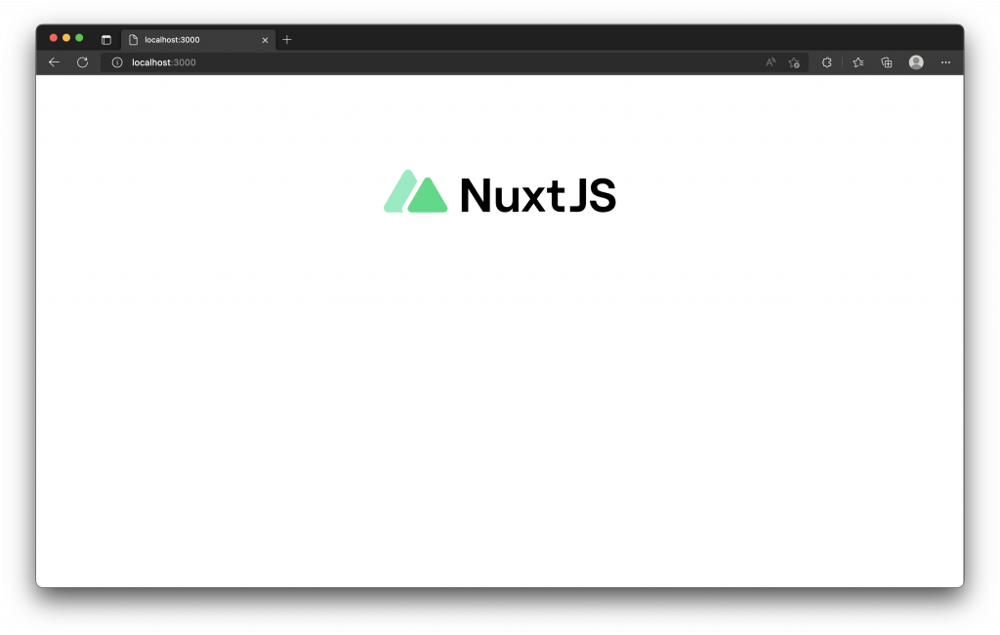

# 12. 模組 (Modules)
  在使用 `Nuxt` 開發過程中，我們可以透過配置 `模組 (Modules)` 或 `插件 (Plugin)` 來進行擴充，在 [插件 (Plugins)](./nuxt3-11.html) 一文中，也提到插件可以用來擴充功能；那麼插件與模組又有什麼樣子的差異呢，在這一篇文章中我將與大家分享。

## 模組 (Modules)
  `Nuxt` 提供了一個模組系統來擴展自身框架的核心，也簡化了整合過程中需要的繁瑣配置。當你想擴展 `Nuxt` 或 `Vue` 的功能，雖然 `Nuxt` 可以通過安裝與配置插件進行功能擴展，但是在多個專案或使用上可能繁瑣耗時或重複性很高的，但如果套件已經有針對 `Nuxt` 模組做整合，我們就不必從頭開始開發或像安裝插件一樣需要建立與維護這些配置。

  - ### Nuxt 3 中插件與模組的差異
    `Nuxt 模組` 與 `Nuxt 插件` 的差異在於，`模組載入執行的時間點更早`，意思是 `Nuxt` 在啟動伺服器後，首先會依序的載入模組並執行，接續建立 `Nuxt` 的環境 (Context) 與 `Vue` 的實例 (Instance)，最後才開始執行 `Nuxt` 的插件。

    因此，`Nuxt 模組` 可以做更多的事情，包含在使用 `nuxi dev`、`nuxi build` 啟動或建構 `Nuxt` 時，可以透過模組來覆蓋模板、配置 `webpack` 及配置插件等許多任務。

    - #### Nuxt 3 安裝使用模組
      `Nuxt` 模組是一個導出異步函數的 `JavaScript` 檔案，當安裝使用模組時，通常會配置在 `nuxt.config.ts` 檔案的 `modules` 中，例如 [配置 Nuxt Tailwind 模組](https://ithelp.ithome.com.tw/articles/10294705) 會添加上` '@nuxtjs/tailwindcss'`。

      通常模組的開發人員會提供這些模組應該如何在 `modules` 屬性來做配置，甚至一些可選用的參數來配置這些模組。

      ```js
      export default defineNuxtConfig({
        modules: [
          // 使用套件名稱 (推薦使用)
          '@nuxtjs/example',

          // 載入本地目錄的模組
          './modules/example',

          // 添加模組的選項參數
          ['./modules/example', { token: '123' }]

          // 在行內定義模組
          async (inlineOptions, nuxt) => { }
        ]
      })
      ```

## Nuxt 3 模組列表
  你可以在 [Explore Nuxt Modules](https://modules.nuxtjs.org/) 上尋找由 `Nuxt` 官方或社群生態所發展建置的模組，`Nuxt` 的模組通常遵循著官方指南所製，使用時只需要安裝與添加至 `nuxt.config` 中，基本上就能完成配置。

  - ### 使用 Nuxt Icon 模組
    `Nuxt Icon` 模組整合了 `Iconify` 提供多達 100,000 個以上的 Icon 圖示，只要在 `Nuxt` 中安裝後，我們就可以直接做使用。

    - #### Step 1. 安裝套件
      安裝 `Nuxt Icon` 模組套件。
      ```sh
      npm install -D nuxt-icon
      ```

    - #### Step 2. 配置使用模組
      在 `nuxt.config.ts` 中的 `modules` 屬性，添加 `Nuxt Icon` 模組的名稱 `nuxt-icon`。
      ```ts
      export default defineNuxtConfig({
        modules: ['nuxt-icon']
      })
      ```

    - #### Step 3. 開始使用
      依照說明，我們就可以使用 `Nuxt Icon` 模組，為我們所添加的元件 `<Icon>`，這個 Icon 元件可以傳入 `name` 屬性，以此來顯示不同的 Icon 圖示，`size` 則可以控制圖示的大小。
      ```xml
      <template>
        <div class="flex justify-center">
          <Icon name="logos:nuxt" size="360" />
        </div>
      </template>
      ```
      

## 如何建立 Nuxt 模組
  `Nuxt Kit` 是 `Nuxt` 官方提供的一個標準和方便的 `API` 來定義 `Nuxt` 模組。

  通常如下程式碼使用 `defineNuxtModule` 方法來建立一個模組：
  ```js
  import { defineNuxtModule } from '@nuxt/kit'

  export default defineNuxtModule({
    meta: {
      // 模組的名稱，通常也會對應 NPM 發布的套件名稱
      name: '@nuxtjs/example',
      // 如果有配置這個模組的一些選項，會將其保存在這個設定鍵值下
      configKey: 'sample',
      // 相容性限制 `nuxt.config`
      compatibility: {
        // 為了控制模組的版本相容性，通常會在這裡配置 Nuxt 版本的需求
        nuxt: '^3.0.0'
      }
    },
    // 模組預設的選項
    defaults: {},
    hooks: {},
    async setup(moduleOptions, nuxt) {
      // Nuxt 啟動載入模組後，模組所執行的邏輯會在這裡實作
    }
  })
  ```

  更多 `Nuxt` 模組的建立指南可以參考 [Nuxt 3 - Module Author Guide](https://v3.nuxtjs.org/guide/going-further/modules)，這邊就不再贅述，畢竟我們比較常為模組的使用者。

## 模組的載入
  前面我們使用了 `Nuxt Icon` 模組，我們也可以閱讀一下 [Nuxt Icon v0.1.6](https://github.com/nuxt-modules/icon/tree/v0.1.6) 模組套件的原始碼。

  以下是 `Nuxt Icon` 模組的 [module.ts](https://github.com/nuxt-modules/icon/blob/v0.1.6/src/module.ts) 檔案。

  ```js
  export default defineNuxtModule<ModuleOptions>({
    meta: {
      name: 'nuxt-icon',
      configKey: 'icon',
      compatibility: {
        nuxt: '^3.0.0-rc.9'
      }
    },
    defaults: {},
    setup (_options, nuxt) {
      const { resolve } = createResolver(import.meta.url)

      addComponent({
        name: 'Icon',
        global: true,
        filePath: resolve('./runtime/Icon.vue')
      })
    }
  })
  ```

  `Nuxt` 的模組使用了一個 `defineNuxtModule` 方法來定義模組，也可以視為模組的入口點，`meta.name` 對應的就是模組的名稱，也是我們添加至 `modules` 屬性所需要的模組名稱。

  `setup` 就是模組載入後執行的函數，可以看到模組使用 `addComponent` 為我們 `Nuxt` 添加了一個元件名稱為 `Icon`，使用的元件檔案來自 `./runtime/Icon.vue`。

  模組中的 [runtime/Icon.vue](https://github.com/nuxt-modules/icon/blob/v0.1.6/src/runtime/Icon.vue) 為我們封裝了 `Iconify` 圖示的使用邏輯以及取得 `Nuxt` 配置的參數等。

  透過模組我們可以省去這些繁瑣的封裝與配置，只需要專注在配置模組與開發上面。

## 小結
  模組與插件其實還是存在著載入執行順序與使用情境上的差異性，以 `Nuxt` 來說，通常 `Nuxt 的插件` 會是用來封裝及使用 `Vue` 中會使用到的插件與或套件；而 `Nuxt 的模組`，會將需要繁瑣配置的套件或插件來與 `Nuxt` 進行整合與封裝，不論是透過第三方插件或模組，這都將使 `Nuxt` 在開發與擴充上擁有更多的可能性。