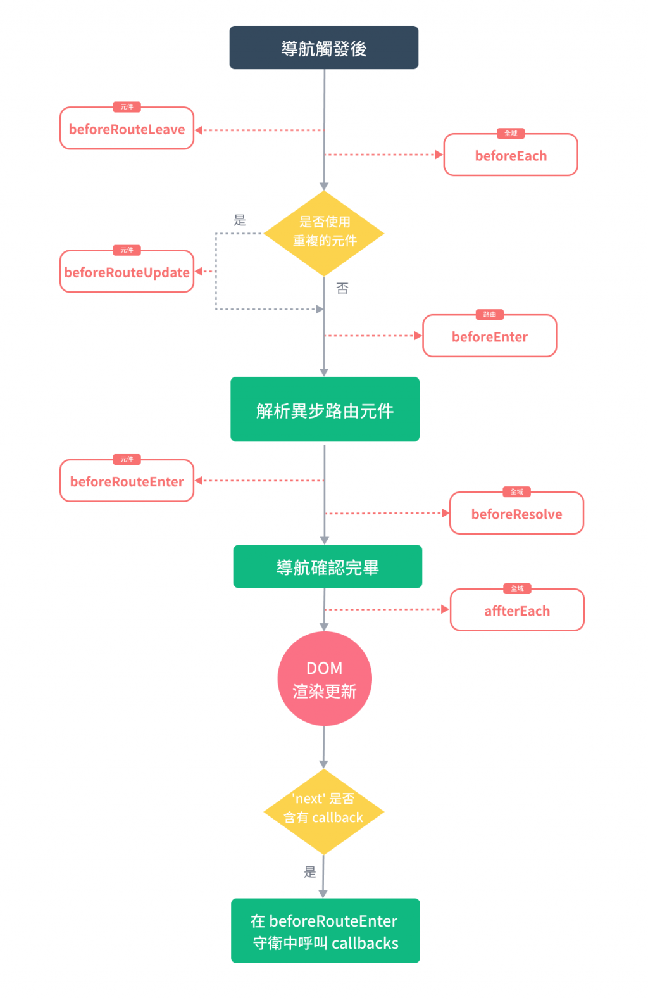
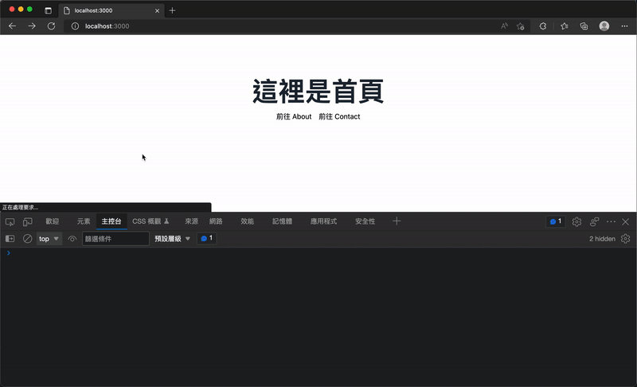

# 13. 中間件目錄 (Middleware Directory)
  在 `Vue` 的專案內我們的頁面通常由 `Vue Router` 來控制路由及導航，`Vue Router` 提供了 `導航守衛 (Navigation Guards)` 的 `Hook API`，讓我們可以在全域、路由甚至是元件中，來控制路由跳轉或取消的方式來守護我們的路由，不讓其隨意導航至特定頁面。`Nuxt 3` 提供了一個中間件的目錄，讓我們可以製作路由的中間件，來實作出類似導航守衛的效果。

## Vue Router 的導航守衛 (Navigation Guards)
  導航守衛就是在訪問頁面之前，會攔截你的路由請求並執行自訂的驗證邏輯，依據驗證的成功與否，准予放行跳轉至路由頁面，抑或是取消訪問該路由，再依照不同處理方式進行中斷或重導向至特定路由頁面。

  導航守衛在實務上常見的使用情境，就是拿來做頁面訪問的權限驗證，例如，只有管理員才能訪問 `/admin` 路由下的頁面，我們可能就會添加攔截的 `hook` 來驗證使用者是否登入及夾帶的 `Token` 或 `Role` 是否有權限可以瀏覽，如果驗證成功就准予瀏覽管理員相關頁面，否則，將路由頁面導回至首頁、登入頁或錯誤頁面，如同一個守衛在路由之間進行把關驗證權限。

  我們以 `Vue Route v4` 來舉例，`Vue Route` 提供了以下三種情況下可以使用的 `hook`，分別是在 `全域`、`路由` 或是 `元件中`：

  - ### 全域
    - #### 全域前置守衛 (Global Before Guards)
      當全域守衛 `hook` 添加好之後，每次導航至不同路由時，都會攔截以異步的方式執行相對應的處理邏輯。

      全域守衛提供了 `router.beforeEach()` hook 可以在進入任何一個路由前進行攔截處理，當導航觸發時就會依照建立的順序做呼叫，因為是異步函數解析執行，所以在所有的守衛 `resolve` 之前，會一直處於 `pending` 的狀態。

    - #### 全域解析守衛 (Global Resolve Guards)
      而同樣是屬全域守衛的 `router.beforeResolve()` hook 會在所有元件內的導航守衛、路由都被解析及執行完畢後才執行，也就是說這個 `router.beforeResolve()` 呼叫的時間點晚於 `router.beforeEach()`。

    - #### 全域後置 Hooks (Global After Hooks)
      與 `router.beforeEach()` hook 相反，全域後置 hooks 提供的 `router.afterEach()` Hook 會是在路由跳轉結束後才觸發，在這裡路由已經完成跳轉，路由本身也不會再被更動，這個 hook 通常用於分析類或設置頁面相關的資訊等輔助型的功能很有幫助。

  - ### 路由獨有守衛 (Per-Route Guard)
    與 `router.beforeEach()` 不同，我們可以為每一個路由添加 `beforeEnter()` hook，來達到每一個路由頁面有不同的執行方法，同時也只會在不同的路由導航中切換才會觸發。

  - ### 元件內的守衛 (In-Component Guards)
    在元件的內部中，也提供三種 `hooks` 分別為：
    - #### `beforeRouteEnter()`
      在路由進入並渲染這個元件之前呼叫，所以還沒有元件的實體可以操作使用。

    - #### `beforeRouteUpdate()`
      目前的路由改變，而且還處於同一個元件中時呼叫。

    - #### `beforeRouteLeave()`
      當導航準備離開時且沒有使用到這個元件時呼叫。

    `導航守衛 (Navigation Guards)` 在導航出發後的 hook 觸發順序如下圖：

    

## Nuxt 3 路由中間件
  `Nuxt 3` 中提供了一個路由中間件的框架，我們可以在專案下建立名為 `middleware` 目錄，在這個目錄下我們可以建立中間件，並讓整個 `Nuxt` 頁面或特定的路由做使用，也可以在頁面中添加，這個中間件可以理解為 `Vue Router` 中的 `導航守衛 (Navigation Guards)`，同樣有 `to` 與 `from` 參數用以在導航至特定路由之前驗證權限或執行商業邏輯等。

  - ### 路由中間件格式
    當我們想要建立路由中間件時，可以在 `Nuxt` 專案的 `middleware` 目錄下建立檔案，並預設匯出一個由 `defineNuxtRouteMiddleware()` 定義的函數，例如：

    ```js
    export default defineNuxtRouteMiddleware((to, from) => {
      if (to.params.id === '1') {
        return abortNavigation()
      }
      return navigateTo('/')
    })
    ```

    路由中間件能接收目前的路由 `to` 與下一個路由 `from` 做為參數，如同 `Vue Router` 的導航守衛，以此我們就可以來做一些判斷與驗證操作。

  - ### 路由中間件的回傳
    `Nuxt` 提供了兩個全域的 `helpers`，可以直接從中間件回傳：

    - #### navigateTo(to, options)
      在插件或中間件中重新定向到給定的路由。也可以直接呼叫它進行頁面導航。

      `navigateTo` 參數依序為：
      - `to`: `RouteLocationRaw | undefined | null`
      - `options`: `{ replace: boolean, redirectCode: number, external: boolean }`

    - #### abortNavigation(err)
      可以在中間件中回傳 `abortNavigation()` 來中止導航，並可以選擇是否傳入錯誤訊息。

      `abortNavigation` 參數為：
      - `err?`: `string | Error`

      與 `Vue Router` 中的導航守衛稍有不同，在 `Nuxt` 的中間件中可以使用 `navigateTo` 與 `abortNavigation` 來決定導航至新的路由或終止導航，如果中間件沒有回傳任何東西，則表示不阻塞導航，如果有下一個中間件，則而移往下一個功能做執行，或者完成路由導航。

      `nothing` - 不阻塞導航並且會移動到下一個中間件功能，如果有的話，或者完成路由導航 `return navigateTo('/')` 或 `return navigateTo({ path: '/' })` - 重定向到給定路徑，

      如果使用 `navigateTo()` 重定向是發生在伺服器端，則將 `HTTP Status Code` 設置為 `暫時` 重定向狀態碼 `302 Found`。

      如果使用 `navigateTo()` 並夾入 `options.redirectCode` 屬性，例如 `return navigateTo('/', { redirectCode: 301 })`，發生的重定向在伺服器端，將 `HTTP Status Code` 設置為 `永久` 重定向狀態碼 `301 Moved Permanently`。

  - ### 路由中間件的種類
    在 `Nuxt` 中路由中間件分為以下三種：

    - #### 匿名或者是行內的路由中間件
      不需要建立檔案，通常在路由頁面中使用 `definePageMeta()` 來定義的中間件，就屬於這種類型。

      例如，直接定義一個匿名的中間件在頁面元件中使用：
      ```xml
      <script setup>
      definePageMeta({
        middleware: defineNuxtRouteMiddleware(() => {
          console.log(`[匿名中間件] 我是直接定義在頁面內的匿名中間件`)
        })
      })
      </script>
      ```

    - #### 具名的路由中間件
      在 `middleware` 目錄下所建立的中間件，當在頁面使用 `definePageMeta()` 來指定使用具名的中間件時，將透過異步來自動載入。具名的路由的名稱被規範為是 `烤肉串式 (Kebab case)` 命名。

      例如，建立一個 `./middleware/random-redirect.js` 中間件檔案：
      ```js
      export default defineNuxtRouteMiddleware(() => {
        if (Math.random() > 0.5) {
          console.log(`[來自 random-redirect 中間件] 重新導向至 /haha`)
          return navigateTo('/haha')
        }

        console.log(`[來自 random-redirect 中間件] 沒發生什麼特別的事情～`)
      })
      ```

      當我們要使用這個中間件時，可以在頁面中使用 `definePageMeta()` 並傳入 `middleware` 屬性，來添加路由中間件。
      ```xml
      <script setup>
      definePageMeta({
        middleware: 'random-redirect'
      })
      </script>
      ```

      如果中間件有多個，你也可以使用陣列來傳入多個中間件，並且會依序執行這些路由中間件。
      ```xml
      <script setup>
      definePageMeta({
        middleware: ['random-redirect', 'other']
      })
      </script>
      ```

      當我們在頁面中添加這個中間件後，在切換到這個路由頁面時，約有一半的機會，會被導航至 `/haha` 頁面。
      

    - #### 全域的路由中間件
      在具名的中間件的檔名添加後綴 `.global`，如 `auth.global.js`，這個路由中間件將會被自動載入，並在每次導航變更時自動執行。

      例如，我們建立一個 `./middleware/always-run.global.js` 中間件檔案，內容如下：
      ```js
      export default defineNuxtRouteMiddleware((to, from) => {
        console.log(`[全域中間件] to: ${to.path}, from: ${from.path}`)
      })
      ```

      這個全域的路由中間件，將會在每一次導航切換頁面時執行。
      

  - ### 動態添加路由中間件
    你可以使用 `addRouteMiddleware()` 輔助函數來手動添加全域或命名路由中間件，例如在插件中。
    ```js
    export default defineNuxtPlugin(() => {
      addRouteMiddleware('global-test', () => {
        console.log('這個是由插件添加的全域中間件，並將在每次路由變更時執行')
      }, { global: true })

      addRouteMiddleware('named-test', () => {
        console.log('這個是由插件添加的具名中間件，並將會覆蓋任何現有的同名中間件')
      })
    })
    ```

## 小結
  在 `Nuxt` 中我們可以使用所提供的中間件框架，來建立路由頁面中的中間件，而路由中間件會在到特定路由之前執行想要運行的邏輯，對於驗證權限等非常方便，也正是實現 `導航守衛 (Navigation Guards)` 的方式。這篇我們主要講述的路由中間件，也將會與我們之後會提到的伺服器端的中間件有所不同，雖然名稱相似但與 `Nitro` 啟動時執行的伺服器中間件完全不同。