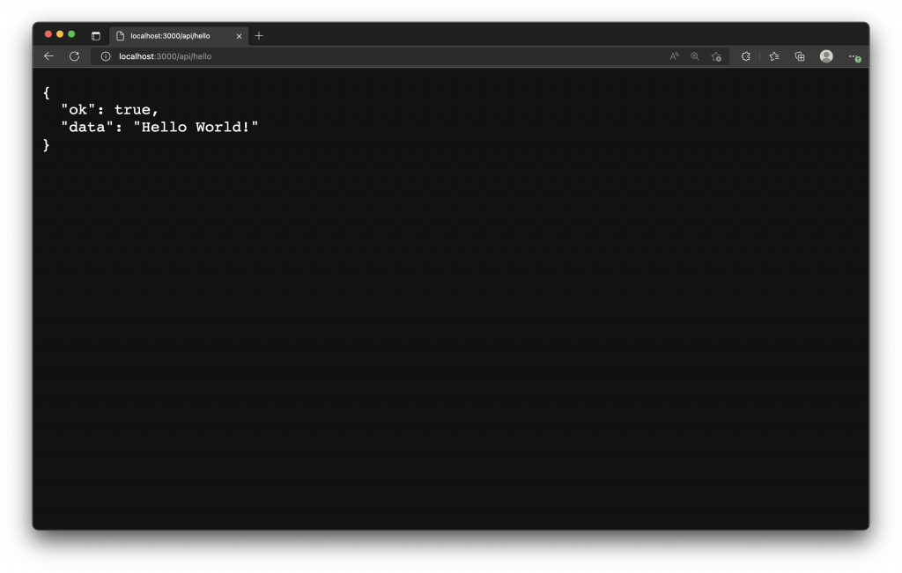
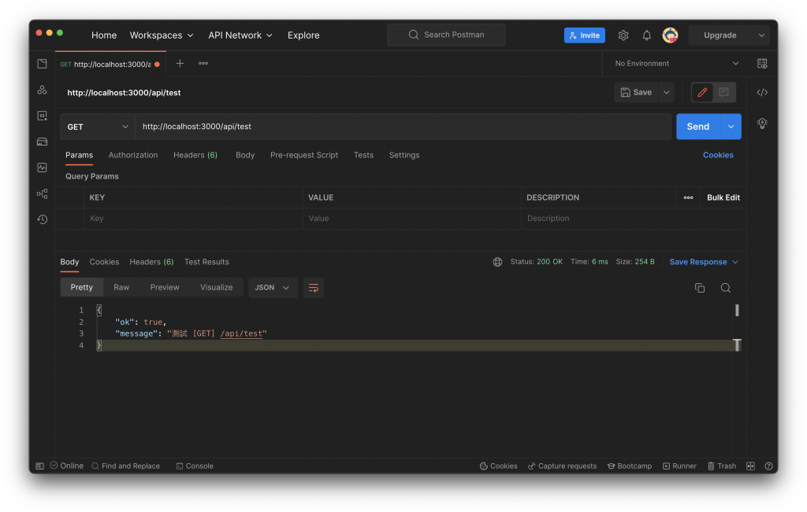
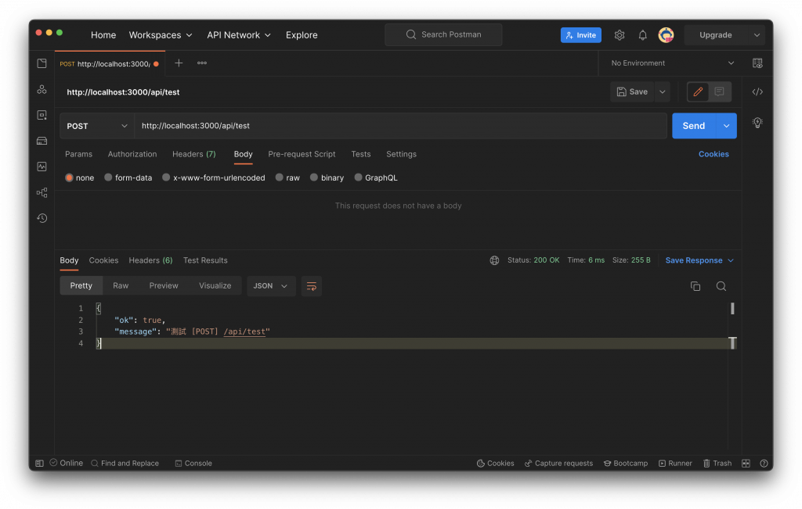
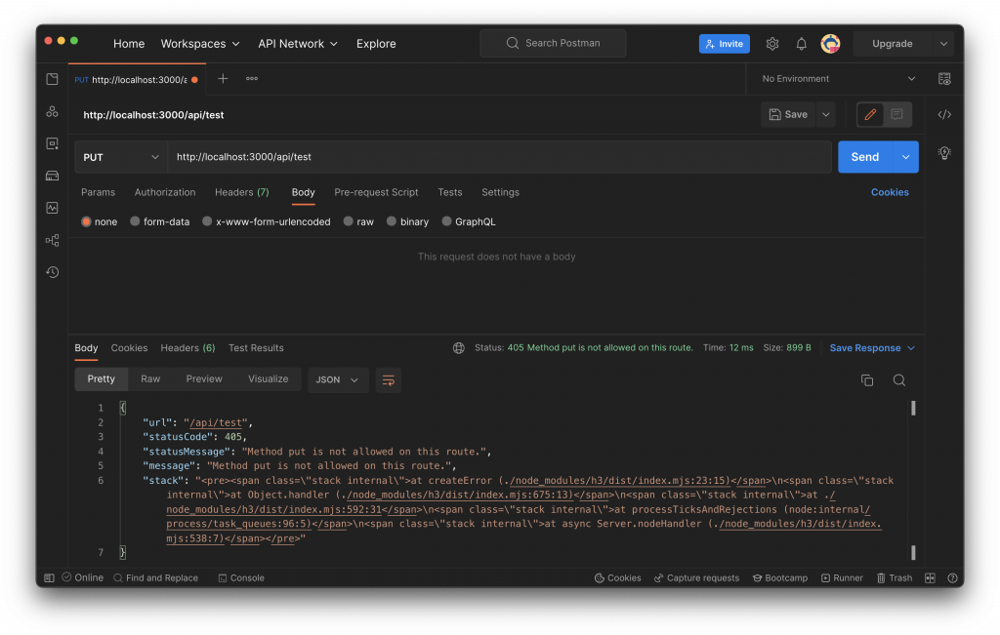
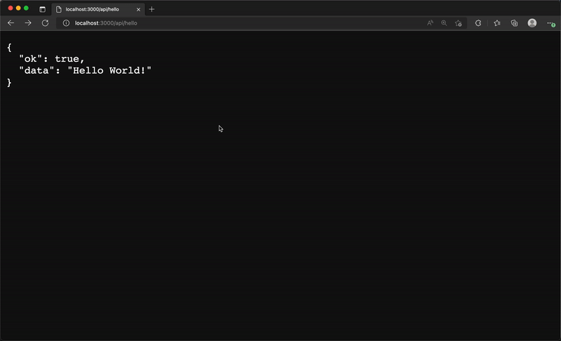
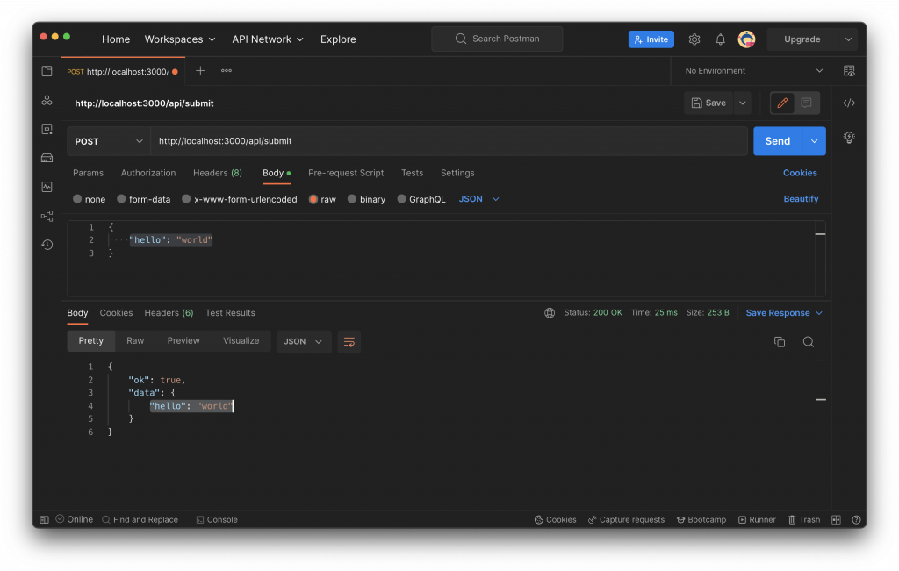
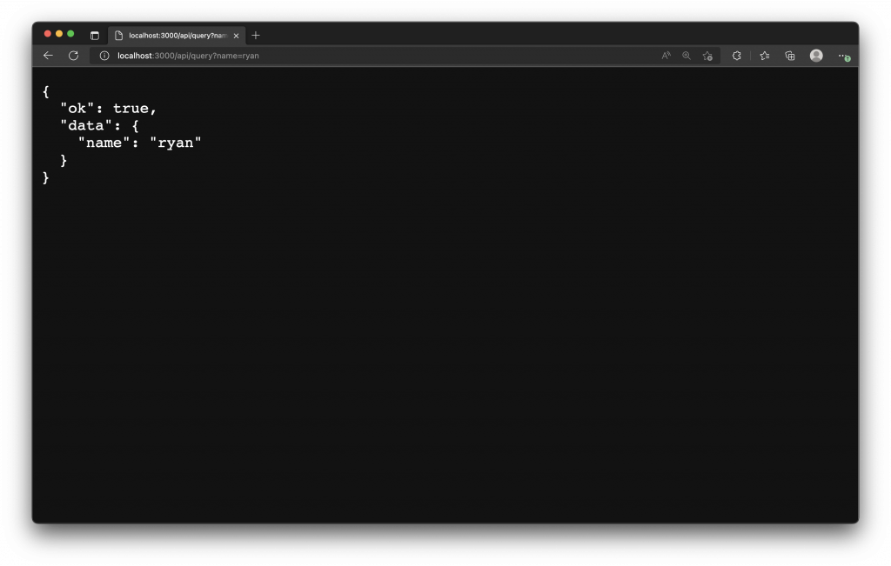
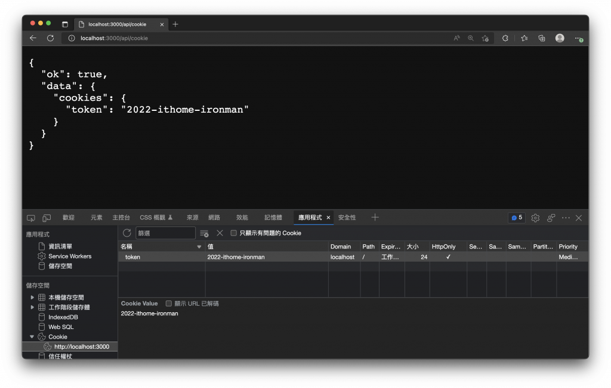

# 14. Server API 與 Nitro Engine
  本篇將介紹如何在 `Nuxt 3` 中建置 `Server API`，在這之前會先介紹一下 `Nitro Engine` 是什麼東西，[Nitro](https://github.com/unjs/nitro) 可能不多人聽過但與 `Nuxt 3` 息息相關，`Nitro` 伺服器引擎除了有跨平台支援與多種強大的功能外，更包含了 API 路由的支援，意思就是我們可以直接在基於 `Nitro` 的 `Nuxt 3` 上直接開發由後端處理的邏輯或與資料庫互動，再將結果回傳至前端，實作出 `Server API`。

## Nitro Engine
  在開始建置 `Sever API` 之前，先來介紹一下 `Nitro` 伺服器引擎，`Nuxt 3` 的一大特點就是採用了一個名為 [Nitro](https://github.com/unjs/nitro) 的 `伺服器引擎 (Server Engine)`，`Nitro` 基於 `rollup` 與 [h3](https://github.com/unjs/h3)，為達高效能與可移植性目標而建構的最小` HTTP 框架`。

  `Nitro` 提供了以下多種功能特色，使得 `Nuxt` 更佳完善與強大，如同官網所說 `Nitro` 讓 `Nuxt` 直接解鎖了新的全端能力。

  - ### 快速的開發體驗
    開箱即用的特性，無需任何配置，就可以啟動具有 `hot module reloading` 的開發伺服器，寫完程式碼存檔後，就能讓伺服器載入新的程式邏輯。

  - ### 基於檔案的路由
    我們只需要專注在建立伺服器的目錄與頁面，就能擁有自動載入與路由的效果。

  - ### 可移植且便攜
    基本上 `Nuxt 3` 使用的依賴套件都在 `package.json` 檔案的 `devDependencies` 中，建構正式環境的網站時，`Nitro` 自動拆分的程式碼與打包出來的 `.output` 目錄不再需要安裝依賴套件，意味著不再有 `node_modules`，因此部署時更輕便好攜。

  - ### 混合模式
    透過 `混合模式 (Hybrid mode)` 可以將一部分頁面預渲染產生出靜態頁面，部分頁面是動態的在伺服器或客戶端渲染，讓每個路由頁面有不同的靜態或動態甚至擁有快取規則，這將讓 `Nuxt 3` 的通用渲染 ([Universal Rendering](https://v3.nuxtjs.org/guide/concepts/rendering#universal-rendering)) 方式更進一步成混合渲染 ([Hybrid Rendering](https://v3.nuxtjs.org/guide/concepts/rendering#hybrid-rendering)) 也能結合無伺服器 (Serverless) 來配置混合模式。

  看到這裡，可以發現 `Nuxt 3` 與 `Nitro` 都下了非常大的功夫，雖然還有些功能尚未穩定與需要改進的地方，但是已經為開發上提供了強大支援與良好的體驗，更多特性與細節可以參考 [Nuxt 3 - Server Engine](https://v3.nuxtjs.org/guide/concepts/server-engine) 或 [Nitro](https://nitro.unjs.io/) 官方。

## Nuxt 3 的 Server 目錄
  我們可以透過 `Nuxt 3` 專案下的 `server` 目錄來建立具有 `hot module reloading` 支援的 `Server API` 與後端處理邏輯。

  `server` 目錄常用的有下面三個子目錄：

  - `api`

    在這個目錄的檔案，將會由 `Nuxt` 自動載入並產生 `/api` 開頭的路由並對應檔案名稱，例如建立 `./server/api/hello.js`，就會擁有 `/api/hello` 的路由對應這個 API，可以使用 `http://localhost:3000/api/hello` 訪問該路由。

  - `routes`

    在這個目錄的檔案，將會由 `Nuxt` 自動載入並產生對應檔案名稱的路由，例如建立 `./server/routes/world.js`，就會擁有 `/world` 的路由對應這個 API，可以使用 `http://localhost:3000/world` 訪問該路由。

  - `middleware`
  
    在這個目錄的檔案，會被 `Nuxt` 自動載入，並添加至伺服器中間件，並在每個 `Request` 進入伺服器 API 的路由前執行。

  - ### 建立第一個伺服器 API
    `Nuxt` 會自動掃描 `server` 目錄中的檔案結構，建立 `Server API` 時通常以 `.js` 或 `.ts` 作為副檔名，並依照官方建議，每個檔案都應該預設匯出 `defineEventHandler()` 函數，並在其 `handler` 內實作處理邏輯。

    `handler` 接收了一個 `event` 參數，用來解析請求的資料，並可以直接回傳一個 `字串`、`JSON`、`Promise` 或者使用 `event.res.end()` 送出請求回應。

    舉例來說，我們建立一個檔案 `./server/api/hello.js`，內容如下：
    ```js
    export default defineEventHandler(() => {
      return {
        ok: true,
        data: 'Hello World!'
      }
    })
    ```

    如同 `pages` 頁面路由一樣，在 `./server/api` 目錄下會基於檔案系統結構來產生出相對應的路由，並且會添加一個路由前綴 `/api`，現在，可以使用 `http://localhost:3000/api/hello` 訪問該路由，看見回傳的 JSON 資料。
    

  - ### 伺服器路由
    - #### 基於檔案的路由
      前面的例子有提到，`Server API` 的路由是基於檔案結構來自動產生，如果你不想要有 `/api` 的前綴，可以將 API 處理邏輯檔案，放置在 `./server/routes` 目錄中。

      舉例來說，以下的檔案結構會產生兩個可以訪問的伺服器 API 路由，分別為 `/api/hello` 及 `/world`。

      ```sh
      nuxt-app/
      └── server/
          ├── api/
          │   └── hello.js
          └── routes/
              └── world.js
      ```

    - #### 匹配路由參數
      將檔案名稱添加中括號 `[]`，其中放入欲設定的參數名稱，以此來處理動態路由匹配。

      舉例來說，建立 `./server/api/hello/[name].js` 檔案，內容如下：

      ```js
      export default defineEventHandler((event) => {
        const { name } = event.context.params
        return `Hello, ${name}!`
      })
      ```

      在 `handler` 內就能使用 `event.context.params` 來訪問 `name` 路由參數。
      

    - #### 匹配 HTTP 請求方法 (HTTP Request Method)
      我們可以添加 `.get`、`.post`、`.put` 或 `.delete` 等檔案名稱後綴，來匹配對應的 `HTTP request methods`。

      新增 `server/api/test.get.js`，內容如下：
      ```js
      export default defineEventHandler(() => {
        return {
          ok: true,
          message: '測試 [GET] /api/test'
        }
      })
      ```

      新增 `server/api/test.post.js`，內容如下：
      ```js
      export default defineEventHandler((event) => {
        return {
          ok: true,
          message: '測試 [POST] /api/test'
        }
      })
      ```

      我們使用 [Postman](https://www.postman.com/) 來打這兩隻 API，可以看到使用不同的 `HTTP Request Method`，就會匹配至對應後綴檔案中的 `handler` 進行處理。

      - `[GET] /api/test`
        

      - `[POST] /api/test`
        

      從上面的例子，我們建立了 `test.get.js` 與 `test.post.js` 檔案，分別對應了 `GET` 與 `POST` 方法，如果同一個路由使用了其他方法而無法匹配處理的檔案時，則會回傳 `HTTP` 狀態碼 `405 Method Not Allowed` 表示錯誤。
      

    - #### 匹配包羅萬象的路由 (Catch-all Route)
      你可以建立 `[…].js` 的檔案，來將所有 `不匹配` 的路由交由這個 `header` 作處理。

      例如，建立 `./server/api/catch-all/[…].js`，將可以匹配 `/api/catch-all/x`、`/api/catch-all/x/y` 等 `/catch-all` 下所有層級的路由。

      ```js
      export default defineEventHandler((event) => {
        return {
          ok: true,
          data: {
            url: event.path
          },
          message: '/api/catch-all 下不匹配的路由都會進入這裡'
        }
      })
      ```

      建立 `./server/api/[…].js` 檔案如下，將可以接手所有 `/api` 下無法匹配的路由。
      ```js
      export default defineEventHandler(() => {
        return {
          ok: true,
          data: {
            url: event.path
          },
          message: '/api 下不匹配的路由都會進入這裡'
        }
      })
      ```

      下圖示範中，當我們輸入的路由如果沒有辦法處理，將會被 `[...].js` 所匹配，以此我們可以來實作返回、重新導向或錯誤頁面。
      

  - ### 伺服器中間件
    `Nuxt` 會自動載入 `./server/middleware` 中的檔案，並添加至伺服器中間件，伺服器的中間件與路由中間件不同的是， `pages` 路由頁面的請求是不會執行伺服器中間件。

    伺服器的中間件會在每個 `Request` 進入伺服器 API 的路由前執行，通常用來添加或檢查請求的 `標頭 (headers)`、`記錄請求` 或 `擴展調整請求`的物件。

    > 伺服器中間件的處理邏輯，不應該回傳任何內容，也不應中斷或直接回應請求，伺服器中間件應該僅檢查、擴展請求上下文或直接拋出錯誤。

    舉理來說，你可以新增 `./server/middleware/log.js` 用來記錄每個請求的 `URL`。
    ```js
    export default defineEventHandler((event) => {
      console.log('New request: ' + event.path)
    })
    ```

    或者，新增 `./server/middleware/auth.js` 用來解析請求或擴展請由物件。
    ```js
    export default defineEventHandler((event) => {
      event.context.auth = { username: 'ryan' }
    })
    ```

  - ### 伺服器插件
    `Nuxt` 會自動掃描並載入 `./server/plugins` 目錄下的檔案，並將他們註冊為 `Nitro` 的插件，在 `Nitro` 啟動時，這些插件將會在伺服器載入並執行，插件允許擴展 `Nitro` 執行時的行為及連接到生命週期的事件。

    更多細節可以參考 [Nitro Plugins](https://nitro.unjs.io/guide/advanced/plugins)。

    - #### 伺服器通用功能
      `Nuxt` 中伺服器的路由，是由 [unjs/h3](https://github.com/unjs/h3) 所提供，`h3` 內建一些方便實用的 `helpers`，可以參考 [Available H3 Request Helpers](https://www.jsdocs.io/package/h3#package-index-functions)。

  - ### 伺服器路由常用的 HTTP 請求處理
    - #### 處理 HTTP 請求中的 Body
      ```js
      export default defineEventHandler(async (event) => {
        const body = await readBody(event)
        return {
          ok: true,
          data: body
        }
      })
      ```

      可以使用 `readBody(event)` 來解析請求中的 `Body`，注意 `readBody()` 是一個異步函數，記得 `await` 等待解析完成。

      

    - #### 處理 URL 中的查詢參數 (Query Parameters)
      可以使用 `getQuery(evnet)` 來解析查詢參數。
      ```js
      export default defineEventHandler((event) => {
        const query = getQuery(event)
        return {
          ok: true,
          data: {
            name: query.name
          }
        }
      })
      ```

      當請求 URL 為 `/api/query?name=ryan`，可以解析出查詢參數 `query.name`。

      

    - #### 解析 HTTP 請求所夾帶的 Cookie
      可以使用 `parseCookies(event)` 來解析請求所夾帶的 `Cookie`。
      ```js
      export default defineEventHandler((event) => {
        const cookies = parseCookies(event)
        return {
          ok: true,
          data: {
            cookies
          }
        }
      })
      ```

      我透過瀏覽器的開發工具，手動添加了一組 `cookie` 名為 `token`，`Server API` 可以透過 `parseCookies()` 來解析出瀏覽器自動夾帶的 `cookie`。

      

  - ### 進階使用範例
    - #### Nitro 配置
      你可以在 `nuxt.config.ts` 中使用 `nitro` 屬性來配置 [Nitro 設定](https://nitro.unjs.io/config)。

      ```js
      export default defineNuxtConfig({
        // https://nitro.unjs.io/config
        nitro: {}
      })
      ```

    - #### 使用巢狀路由
      你可以直接使用 `h3` 的 `createRouter()` 方法來建立巢狀路由。
      ```js
      import { createRouter } from 'h3'
      const router = createRouter()
      router.get('/', () => 'Hello World')
      export default router
      ```

  - ### 伺服器儲存
    `Nitro` 提供了一個跨平台的[儲存層](https://nitro.unjs.io/guide/introduction/storage)，你可以 `Nitro` 的配置中設定 `storage` 屬性，來配置額外的儲存掛載位置，官網提供了一個使用 [Redis](https://v3.nuxtjs.org/guide/directory-structure/server/#example-using-redis) 的範例。

    更多 `Nitro` 伺服器的設定與使用可以參考官網。

## 小結
  `Nitro` 伺服器引擎將 `Nuxt 3` 提升至另一個境界，不僅功能強大且讓開發中擁有不錯的體驗，伺服器路由更是能在後端直接處理邏輯實作 `Server API`，而下一篇我們將介紹如何在 `Nuxt` 打 `API` 取得資料。
