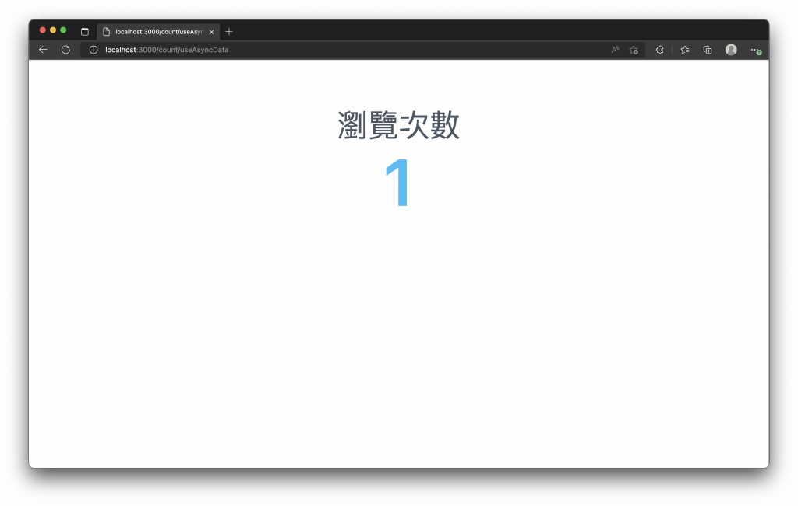
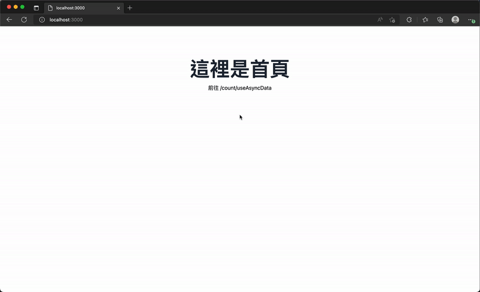
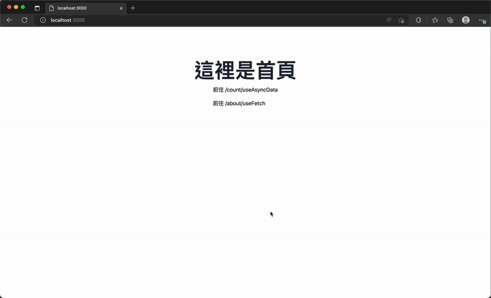
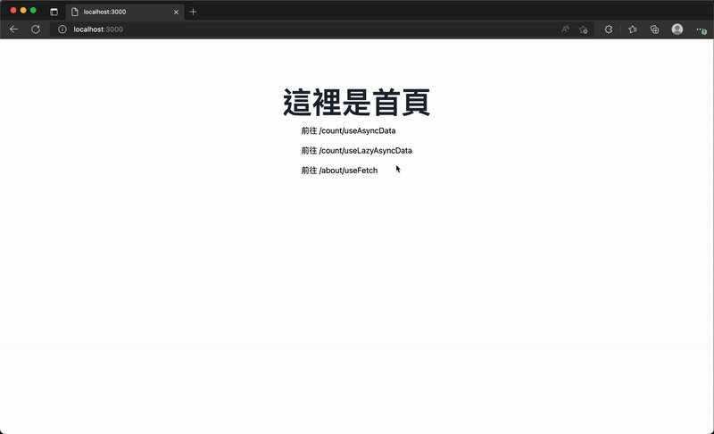
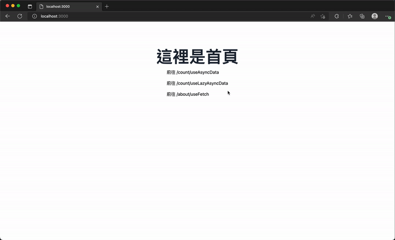

# 15. 資料獲取 (Data Fetching)
  現在的網站技術與前端框架的推進，使用 `AJAX (Asynchronous JavaScript and XML)` 技術發送 `API` 至後端進行資料獲取已經是常態，這個過程工程師們也稱 `敲 API` 或 `打 API`，`打 API` 還衍生了幾個問題，就是我們用什麼 `打 API`，打去哪裡，打的時候要夾東西嗎？這篇我們主要講述的就是用什麼打 API；
  
  在 `Vue` 的開發中，你可能會使用 `axios` 來串接 `後端 (Server)` 的 API 來獲取資料，再將這些資料於網頁渲染呈現，而在 `Nuxt` 你也可以額外安裝類似的 `HTTP Client` 套件來發送 HTTP 請求，不過呢，`Nuxt` 已經內建了幾個好用的組合式函數，讓我們可以方便的打 API 獲取資料。

## 資料獲取 (Data Fetching)
  `Nuxt` 提供了 `$fetch` 及四種 `組合式函數 (Composables)`，來進行資料獲取，也就是說，我們不需要在額外安裝任何 `HTTP Client` ，如 `axios` 來發送 HTTP 請求，因為 `Nuxt` 本身就自帶了打 API 的方法，而且在頁面、元件或插件中都能直接呼叫做使用，非常方便。

  首先，我們先介紹一下 `$fetch` 這個由 `Nuxt` 提供使用 `ohmyfetch` 套件所封裝的 `helper`，`$fetch` 可以在 `Nuxt` 中用於發送 HTTP 請求。

  如果在伺服器端渲染的期間，呼叫 `$fetch` 打內部 API 路由，也就是打我們自己在 `./server` 下實作的後端 API，那麼因為使用 `$fetch` 的關係，`Nuxt` 會模擬請求，改由直接呼叫內部 API 的處理函數，這樣就能節省額外的 API 呼叫。

  使用的方法，如下：
  ```js
  $fetch(url, options)
  ```

  我們可以使用 `$fetch('/api/count')` 建立一個 GET 請求，發送至 `/api/count` 後會返回一個 `Promise`，完成後我們就可以接收回傳的資料。

  `$fetch` 的 `options` 的參數及建立攔截器等功能可以參考 [ohmyfetch](https://github.com/unjs/ohmyfetch)，不過呢，我們還會使用 `Nuxt` 提供的組合函數結合 `$fetch` 來打 API。

  接下來我們就來依序介紹，如何使用 `Nuxt` 提供的四種組合函數來從 API 獲取資料。

  - ### useAsyncData
    這個 `useAsyncData()` 組合函數，其實不是傳入 URL 直接呼叫就會發出 API 請求，而是 `Nuxt` 可以透過這個函數來添加異步請求資料的邏輯。

    `useAsyncData` 組合函數能接收 `key`、 `handler` 與 `options`，其中 `handler` 會來添加請求異步資料的邏輯。當我們在頁面、元件和插件中呼叫 `useAsyncData`，並等待回傳的 `Promise`，我們的頁面或元件的渲染將會阻塞路由載入至 `handler` 異步邏輯處理完畢後才會繼續執行，也就是說，整個頁面元件將會等待所有使用 `useAsyncData` 呼叫的 API 回傳完成後才會開始進行渲染。

    舉個例子

    我們新增一個 `Server API`，並稍微添加一下延遲，模擬 API 約需要處理 2 秒才回傳資料，`./server/api/count.js` 內容如下：
    ```js
    let counter = 0

    export default defineEventHandler(async () => {
      await new Promise((resolve) => setTimeout(resolve, 2000)) // 等待 2 秒

      counter += 1

      return JSON.stringify(counter)
    })
    ```

    新增一個路由頁面，`./server/pages/count/useAsyncData.vue` 內容如下：
    ```xml
    <template>
      <div class="my-24 flex flex-col items-center">
        <p class="text-4xl text-gray-600">瀏覽次數</p>
        <span class="mt-4 text-6xl font-semibold text-sky-400">{{ data }}</span>
      </div>
    </template>

    <script setup>
    const { data } = await useAsyncData('count', () => $fetch('/api/count'))
    </script>
    ```

    當我們瀏覽 `/count/useAsyncData` 時，會打 `/api/count` 這隻 API，並等待返回後才開始渲染元件。
    

    因為瀏覽 `http://localho:3000/count/useAsyncData` 時，第一次都是由後端渲染處理，看不太出導航有被阻塞的效果，建議可以添加一下路由連結來進行導航，就可以發現差異。

    當我們從首頁，由客戶端導航至 `/count/useAsyncData` 頁面時，會發現網址的路由已經變化，但是頁面約等了一會兒才渲染出現，這就是因為頁面中使用了 `useAsyncData()` 來獲取資料 `await` 將阻塞整個頁面元件的載入與渲染，直至 API 處理完畢回傳後才開始載入路由渲染元件。
    

    `useAsyncData()` 共有兩種呼叫時使用參數差異，可以選擇是否傳入第一個參數 `key`，所傳入參數的類型如下
    ```js
    function useAsyncData(
      handler: (nuxtApp?: NuxtApp) => Promise<DataT>,
      options?: AsyncDataOptions<DataT>
    ): AsyncData<DataT>

    function useAsyncData(
      key: string,
      handler: (nuxtApp?: NuxtApp) => Promise<DataT>,
      options?: AsyncDataOptions<DataT>
    ): Promise<AsyncData<DataT>>


    type AsyncDataOptions<DataT> = {
      server?: boolean
      lazy?: boolean
      default?: () => DataT | Ref<DataT> | null
      transform?: (input: DataT) => DataT
      pick?: string[]
      watch?: WatchSource[]
      initialCache?: boolean
      immediate?: boolean
    }

    interface RefreshOptions {
      _initial?: boolean
    }

    type AsyncData<DataT, ErrorT> = {
      data: Ref<DataT | null>
      pending: Ref<boolean>
      execute: () => Promise<void>
      refresh: (opts?: RefreshOptions) => Promise<void>
      error: Ref<ErrorT | null>
    }
    ```

    - #### useAsyncData() 傳入的參數
      - `key`: 唯一鍵，可以確保資料不會重複的獲取，也就是如果 `Key` 相同便不會再發送相同的請求，除非重新整理頁面由後端再次渲染獲取，或呼叫 `useAsyncData` 回傳的 `refresh()` 函數重新取得資料。
      - `handler`: 回傳異步請求資料的處理函數，打 API 或加工的異步邏輯都可以在這裡處理。
      - `options`:
        - `server`: 是否在伺服器端獲取資料，預設為 `true` 。
        - `lazy`: 是否於載入路由後才開始執行異步請求函數，預設為 `false`，所以會阻止路由載入直到請求完成後才開始渲染頁面元件。
        - `default`: 當傳入這個 `factory function`，可以將異步請求發送與回傳解析前，設定資料的預設值，對於設定 `lazy: true` 選項特別有用處，至少有個預設值可以使用及渲染顯示。
        - `transform`: 修改加工 `handler` 回傳結果的函數。
        - `pick`: `handler` 若回傳一個物件，只從中依照需要的 `key` 取出資料，例如只從 `JSON` 物件中取得某幾個 `key` 組成新的物件。
        - `watch`: 監聽 `ref` 或 `reactive` 響應式資料發生變化時，觸發重新請求資料，適用於資料分頁、過濾結果或搜尋等情境。
        - `initialCache`: 預設為 `true`，當第一次請求資料時，將會把有效的 `payload` 快取，之後的請求只要是相同的 `key`，都會直接回傳快取的結果。
        - `immediate`: 預設為 `true`，請求將會立即觸發。

    - #### useAsyncData() 的回傳值
      - `data`: 傳入異步函數的回傳結果。
      - `pending`: 以 `true` 或 `false` 表示是否正在獲取資料。
      - `refresh` / `execute`: 一個函數，可以用來重新執行 `handler` 函數，回傳新的資料，類似重新整理、重打一次 API 的概念。預設情況下 `refresh()` 執行完並回傳後才能再次執行。
      - `error`: 資料獲取失敗時回傳的物件。

    看到這裡，我們再重新閱讀與解釋 `useAsyncData()` 的範例
    ```xml
    <script setup>
    const { data, pending, error, refresh } = await useAsyncData(
      'count',
      () => $fetch('/api/count')
    )
    </script>
    ```

    呼叫 `useAsyncData()` 並不是直接幫我們送出 `HTTP` 請求，而是在 `handler` 內使用 `$fetch` 來打 API，只是 `useAsyncData()` 組合式函數，封裝了更多打 API 時可以使用的方法與參數，來因應不同的使用情境。當然如果想要，你也可以使用其他套件來替換 `$fetch` 但可能就沒辦法享受它所帶來的好處。

  - ### useFetch
    這個組合式函數將 `useAsyncData` 和 `$fetch` 進行包裝，當使用這個函數時它會根據 `URL` 和 `fetch` 的選項來自動產生 `useAsyncData` 需要的參數 `key`，如果呼叫的 API 是伺服器端所提供的，也會自動根據伺服器 API 路由來為請求提供類型提示，並推斷 API 的回傳類型。

    - #### useFetch() 所傳入參數的類型如下
      ```js
      function useFetch(
        url: string | Request | Ref<string | Request> | () => string | Request,
        options?: UseFetchOptions<DataT>
      ): Promise<AsyncData<DataT>>

      type UseFetchOptions = {
        key?: string
        method?: string
        params?: SearchParams
        body?: RequestInit['body'] | Record<string, any>
        headers?: { key: string, value: string }[]
        baseURL?: string
        server?: boolean
        lazy?: boolean
        immediate?: boolean
        default?: () => DataT
        transform?: (input: DataT) => DataT
        pick?: string[]
        watch?: WatchSource[]
        initialCache?: boolean
      }

      type AsyncData<DataT> = {
        data: Ref<DataT>
        pending: Ref<boolean>
        refresh: () => Promise<void>
        execute: () => Promise<void>
        error: Ref<Error | boolean>
      }
      ```

    - #### useFetch() 傳入的參數
      - `url`: 要獲取資料的 URL 或 API Endpoint。
      - `options`: (繼承自 [unjs/ohmyfetch](https://github.com/unjs/ohmyfetch) 選項與 [AsyncDataOptions](https://v3.nuxtjs.org/api/composables/use-async-data#params))
        - `method`: 發送 HTTP 請求的方法，例如 GET、POST 或 DELETE 等。
        - `params`: 查詢參數 (Query params)。
        - `body`: 請求的 body，可以傳入一個物件，它將自動被轉化為字串。
        - `headers`: 請求的標頭 (headers)。
        - `baseURL`: 請求的 API 路徑，基於的 URL。
      - `options`: (繼承自 `useAsyncData` 的選項)
        - `key`: 唯一鍵，可以確保資料不會重複的獲取，也就是如果 Key 相同便不會再發送相同的請求，除非重新整理頁面由後端再次渲染獲取，或呼叫 `useAsyncData` 回傳的 `refresh()` 函數重新取得資料。
        - `server`: 是否在伺服器端獲取資料，預設為 true 。
        - `lazy`: 是否於載入路由後才開始執行異步請求函數，預設為 false，所以會阻止路由載入直到請求完成後才開始渲染頁面元件。
        - `immediate`: 預設為 true，請求將會立即觸發。
        - `default`: 當傳入這個 factory function，可以將異步請求發送與回傳解析前，設定資料的預設值，對於設定 lazy: true 選項特別有用處，至少有個預設值可以使用及渲染顯示。
        - `transform`: 修改加工 handler 回傳結果的函數。
        - `pick`: handler 若回傳一個物件，只從中依照需要的 key 取出資料，例如只從 JSON 物件中取的某幾個 key 組成新的物件。
        - `watch`: 監聽 ref 或 reactive 響應式資料發生變化時，觸發重新請求資料，適用於資料分頁、過濾結果或搜尋等情境。
        - `initialCache`: 預設為 true，當第一次請求資料時，將會把有效的 payload 快取，之後的請求只要是相同的 key，都會直接回傳快取的結果。

    - #### useFetch() 的回傳值
      - `data`: 傳入異步函數的回傳結果。
      - `pending`: 以 true 或 false 表示是否正在獲取資料。
      - `refresh` / execute: 一個函數，可以用來重新執行 handler 函數，回傳新的資料，類似重新整理、重打一次 API 的概念。預設情況下 refresh() 執行完並回傳後才能再次執行。
      - `error`: 資料獲取失敗時回傳的物件。

      舉個例子

      我們新增一個 Server API，`./server/api/about.js` 內容如下：
      ```js
      let counter = 0

      export default defineEventHandler(() => {
        counter += 1

        return {
          name: 'Ryan',
          gender: '男',
          email: 'ryanchien8125@gmail.com',
          counter
        }
      })
      ```

      新增一個路由頁面，`./pages/about/useFetch.vue` 內容如下：
      ```xml
      <template>
        <div class="my-24 flex flex-col items-center">
          <p class="text-2xl text-gray-600">
            請求狀態:
            {{ pending ? '請求中' : '完成' }}
          </p>
          <span v-if="error" class="mt-4 text-6xl text-gray-600">是否錯誤: {{ error }}</span>
          <span class="mt-4 text-2xl text-gray-600">回傳資料:</span>
          <p class="mt-4 text-3xl font-semibold text-blue-500">{{ data }}</p>
          <button
            class="mt-6 rounded-sm bg-blue-500 py-3 px-8 text-xl font-medium text-white hover:bg-blue-600 focus:outline-none focus:ring-2 focus:ring-blue-400 focus:ring-offset-2"
            @click="refresh"
          >
            重新獲取資料
          </button>
        </div>
      </template>

      <script setup>
      const { data, pending, error, refresh } = await useFetch('/api/about', {
        pick: ['name', 'counter']
      })
      </script>
      ```

      透過 `useFetch()` 我們能更簡單的發送 API 請求，並能得到狀態與重新獲取資料的函數，甚至在第一次進入頁面時，利用 `$fetch` 可以直接呼叫伺服器 API 函數的特性來降低 API 的請求次數。

      

    - #### 攔截器
      我們也可以透過 `$fetch` 提供的選項來設置攔截器。
      ```js
      const { data, pending, error, refresh } = await useFetch('/api/auth/login', {
        onRequest({ request, options }) {
          // 設定請求時夾帶的標頭
          options.headers = options.headers || {}
          options.headers.authorization = '...'
        },
        onRequestError({ request, options, error }) {
          // 處理請求時發生的錯誤
        },
        onResponse({ request, response, options }) {
          // 處理請求回應的資料
          return response._data
        },
        onResponseError({ request, response, options }) {
          // 處理請求回應發生的錯誤
        }
      })
      ```

    - #### useLazyAsyncData
      預設的情況下，`useAsyncData()` 的 `options.lazy` 為 `false`，意思是，預設得情況下，當進入路由後，會開始執行異步請求函數，並會阻止路由載入元件等，直到請求完成後才開始渲染頁面元件。

      `useLazyAsyncData()` 則是 `options.lazy` 預設為 `true` 的封裝，也就是請求資料時它將不會阻塞，並讓頁面繼續渲染元件。

      舉個例子

      我們新增一個 Server API，並稍微添加一下延遲，模擬 API 約需要處理 2 秒才回傳資料，`./server/api/count.js` 內容如下：
      ```js
      let counter = 0

      export default defineEventHandler(async () => {
        await new Promise((resolve) => setTimeout(resolve, 2000)) // 等待 2 秒

        counter += 1

        return JSON.stringify(counter)
      })
      ```

      新增一個路由頁面，`./server/pages/count/useLazyAsyncData.vue` 內容如下：
      ```xml
      <template>
        <div class="my-24 flex flex-col items-center">
          <p class="text-6xl text-gray-600">瀏覽次數</p>
          <span class="mt-4 text-9xl font-semibold text-sky-400">{{ data }}</span>
          <div class="mt-8">
            <NuxtLink to="/count">回首頁</NuxtLink>
          </div>
        </div>
      </template>

      <script setup>
      const { data } = useLazyAsyncData('count', () => $fetch('/api/count'))
      </script>
      ```

      可以發現，我們使用 `useLazyAsyncData()` 後，會與前面使用 `useAsyncData()` 的效果不一樣，會先渲染出元件，即看到的文字「瀏覽次數」，並再 API 回傳後才響應資料重新渲染數值。

      

      透過 `default` 選項可以來建立 API 回傳前的預設值，在 `options.lazy` 為 `true` 的情況下，都建議設定一下預設值，可以讓使用者體驗更好一些。

      添加 `default` 選項，`./server/pages/count/useLazyAsyncData.vue` 內容如下：
      ```xml
      <template>
        <div class="my-24 flex flex-col items-center">
          <p class="text-6xl text-gray-600">瀏覽次數</p>
          <span class="mt-4 text-9xl font-semibold text-sky-400">{{ data }}</span>
          <div class="mt-8">
            <NuxtLink to="/">回首頁</NuxtLink>
          </div>
        </div>
      </template>

      <script setup>
      const { data } = useLazyAsyncData('count', () => $fetch('/api/count'), {
        default: () => '-'
      })
      </script>
      ```

      在 API 請求回來前，預設值會是 `-`。
      

    - #### useLazyFetch
      如同 `useLazyAsyncData` 所描述，`useLazyFetch` 則是 `useFetch` 的 `options.lazy` 選項預設為 `true` 的封裝。

  - ### 重新獲取資料
    前面有提到我們可以使用 `refresh()` 來重新獲取具有不同查詢參數的資料。

    - #### refreshNuxtData
      你也可以透過 `refreshNuxtData` 來使 `useAsyncData`、`useLazyAsyncData`、`useFetch` 與 `useLazyFetch` 的快取失效，再觸發刷新資料。

      ```xml
      <template>
        <div>
          {{ pending ? 'Loading' : count }}
        </div>
        <button @click="refresh">Refresh</button>
      </template>

      <script setup>
      const { pending, data: count } = useLazyAsyncData('count', () => $fetch('/api/count'))

      const refresh = () => refreshNuxtData('count')
      </script>
      ```

## 小結
  `Nuxt` 已經為我們封裝好可以打 API 的組合函數，用起來也相當簡單方便，照著官網範例及 `ohmyfetch` 套件的說明，相信很快就能上手。
