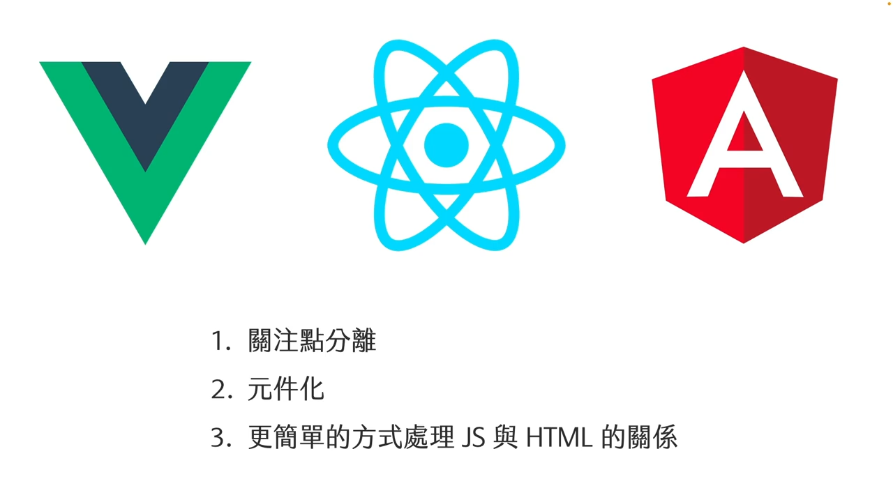
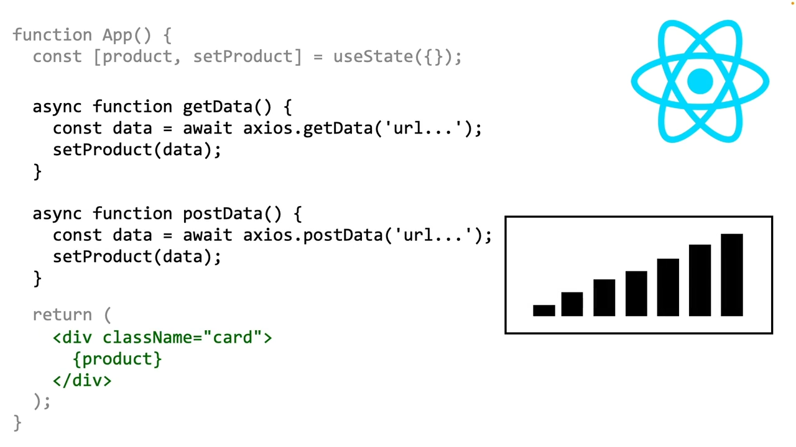
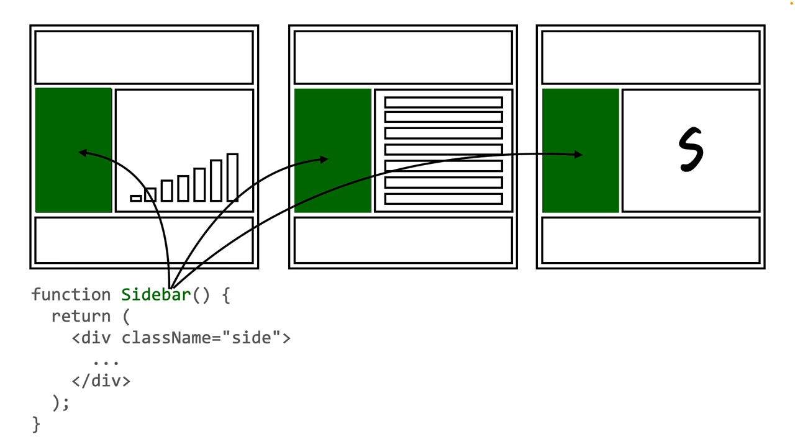
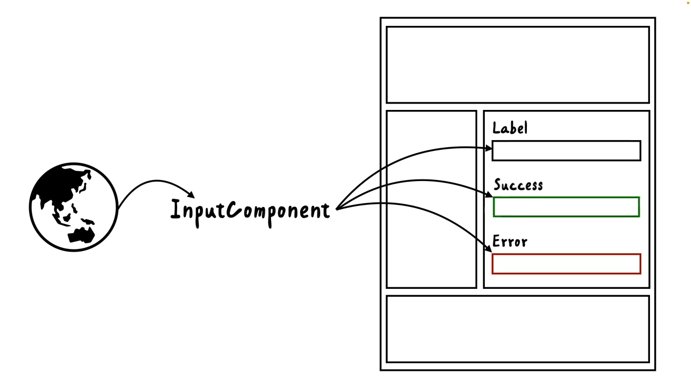
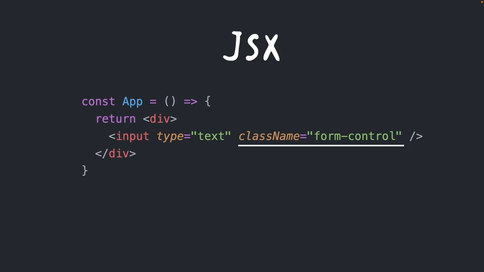
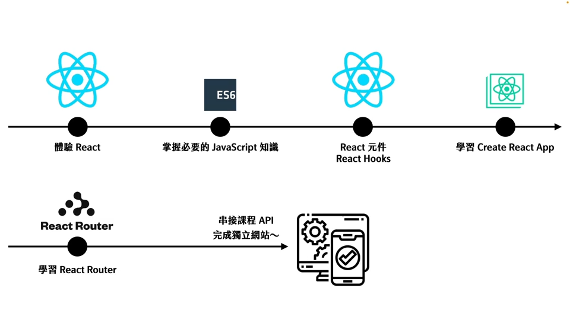

# 1. 課程介紹

## 單元資源
  - [React 課程講義](https://github.com/hexschool/react-starter-files)
  - [VSCode 延伸套件 - Live Server](https://marketplace.visualstudio.com/items?itemName=ritwickdey.LiveServer)

## React 框架做什麼？
  近幾年有三大框架分別是 `Vue`、`React` 以及 `Angular`，他們都致力於解決幾項問題
  

## 關注點分離
  以 `React` 來說，資料就會統一交由 `JavaScript` 來進行管理，而畫面就會交由 `JSX` 來進行處理，讓多人開發也可以確保彼此開發的行為是一致的，
  

  除此之外 隨著應用程式越來越大，畫面上許多區塊的複用性會越來越高，如果沒有適當的元件化，專案中將會有大量重複的程式碼，在 `React` 中都會是以元件的方式來進行開發，因此畫面上有許多區塊都是可以重複的利用。
  

  除此之外 `React` 在網路上還有許多資源可以使用，這些資源大多都是以元件的方式提供，讓開發者不需要重複的造輪子，而是透過這些資源做到更好的效果
  

  而前面也有提到，我們會使用更簡單的方式來處理 `JS` 跟 `HTML` 的關係，在 `React` 中 我們會使用 `JSX` 的語法來進行處理，它的寫法大多都是與 `HTML` 是相近的 只有少部分的不同，課程也將會從 `JSX` 作為開始 讓大家更快上手 `React` 的觀念。
  

  
