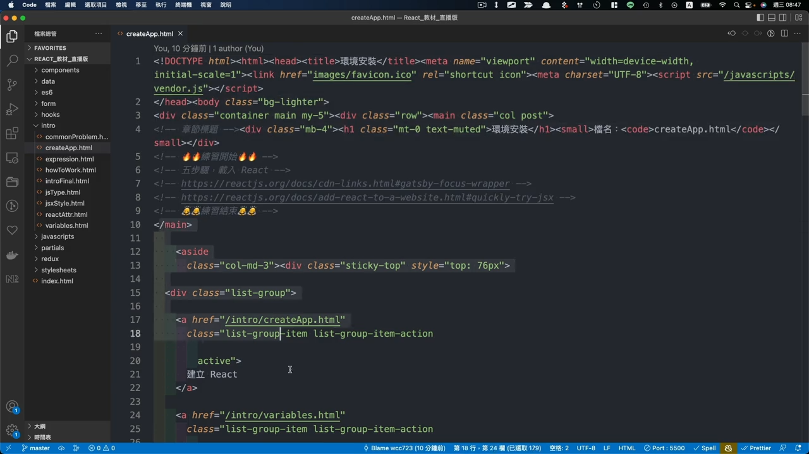
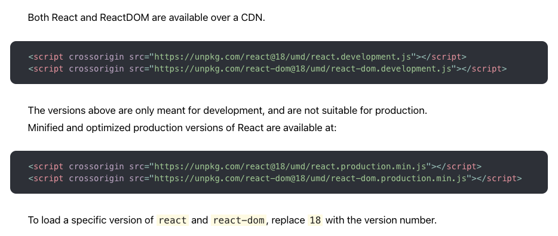
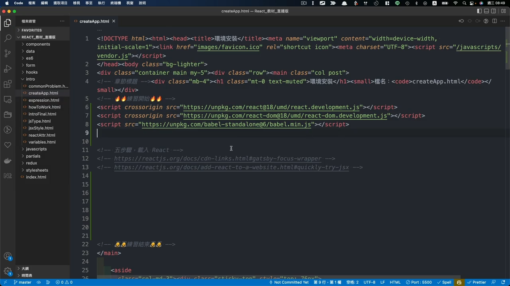
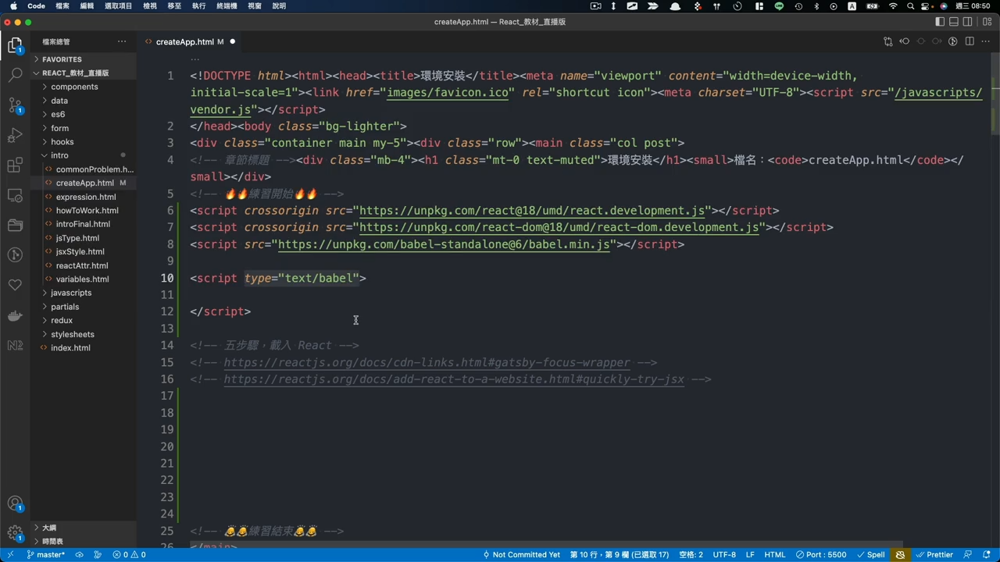

# 3. 建立 React 環境
## 打開檔案 `/intro/createApp.html`
  

## 如何在環境中加入 `React`
### 步驟一：載入 React、Babel
  - [CDN網址](https://reactjs.org/docs/cdn-links.html#gatsby-focus-wrapper)

  上方為開發模式，下方為正式模式，
  

  這兩行分別代表，
  - 一個是 `React` 本身的函式庫，
  - 一個是 `React DOM`，是指 `JS` 在操作 `HTML` 的一個物件結構。
  ```html
  <script crossorigin src="https://unpkg.com/react@18/umd/react.development.js"></script>
  <script crossorigin src="https://unpkg.com/react-dom@18/umd/react-dom.development.js"></script>
  ```

  - 必須要有這兩行，才能在專案中運行 `React`，將這兩行加入程式碼中。
  - 接著將 `babel` 貼到專案中，`babel` 可以讓 `JS` 撰寫不同風格。
  ```html
  <script src="https://unpkg.com/babel-standalone@6/babel.min.js"></script>
  ```
  

  接著，為了讓 `babel` 能夠運行，必須在 `<script>` 中加入 `type="text/babel"`
  

### 步驟二：檢查資源是否有正確載入
  加入 `console` 查看 `React` 及 `ReactDOM` 是否有正確印出資訊
  ```html
  <script type="text/babel">
    console.log(React, ReactDOM);
  </script>
  ```

### 步驟三：加入 `root` 元素
  ```html
  <div id="root"></div>
  ```
  接下來所生成的 `React` 元素都會加載在這個地方，在 `root` 元素裡面。

### 步驟四：建立 `React` 元件
  可以使用 `function` 來建立，首字必須大寫。
  ```js
  function App() {
    return <h1>React我來了</h1>
  }
  ```

### 步驟五：渲染元件至根元件上
  ```ts
  const el = document.getElementById('root');
  const root = ReactDOM.createRoot(el);

  root.render(<App />)
  ```

