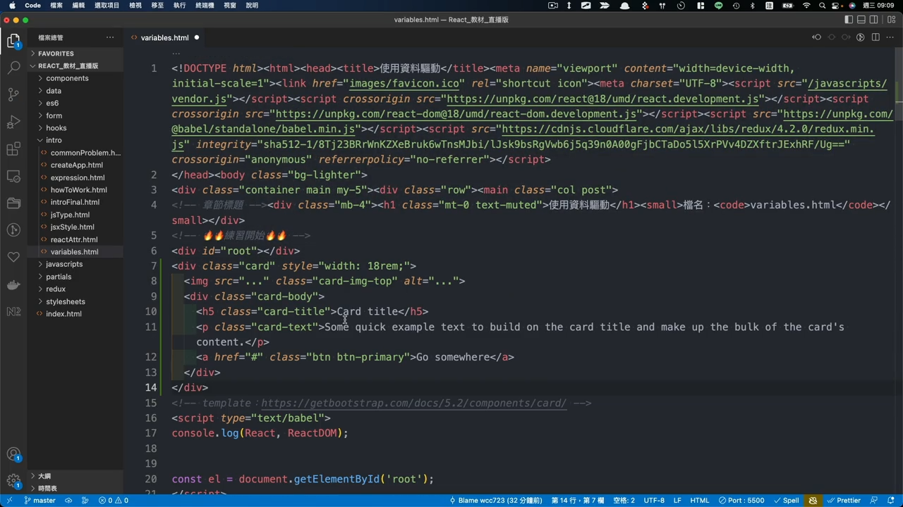

# 4. 資料驅動 React - 建立版型
## 打開檔案 `/intro/variables.html`
  - 上方 `head` 裡面已經有加載額外資源，`React`、`ReactDOM`，所以不需要另外載入。

## 開啟 template 連結
  - [Bootstrap Card](https://getbootstrap.com/docs/5.2/components/card/)
  - 複製範例程式：
    ```html
    <div class="card" style="width: 18rem;">
      
      <div class="card-body">
        <h5 class="card-title">Card title</h5>
        <p class="card-text">Some quick example text to build on the card title and make up the bulk of the card's content.</p>
        <a href="#" class="btn btn-primary">Go somewhere</a>
      </div>
    </div>
    ```
  - 貼到程式碼中
    
  - 更改圖片網址
    - 先開啟免費圖片素材 [unsplash.com](https://unsplash.com/)
    - 選一張圖片，右鍵『複製圖片網址』
    - 貼到程式碼中的 `src`。

## 將卡片轉到 React 裡面
  - 首先建立一個元件，並將 `Card` 結構當成 `return` 資料。
    ```js
    function App() {
      return <div class="card" style="width: 18rem;">
        
        <div class="card-body">
          <h5 class="card-title">Card title</h5>
          <p class="card-text">Some quick example text to build on the card title and make up the bulk of the card's content.</p>
          <a href="#" class="btn btn-primary">Go somewhere</a>
        </div>
      </div>
    }
    ```

  - 使用 `ReactDOM` 來選取 `root`，並將 `App` 元素渲染到畫面上
    ```js
    const el = document.getElementById('root');
    const root = ReactDOM.createRoot(el);
    root.render(<App />)
    ```
      
  - 調整錯誤，將 `class` 改成 `className`
  - 將 `style` 移除

