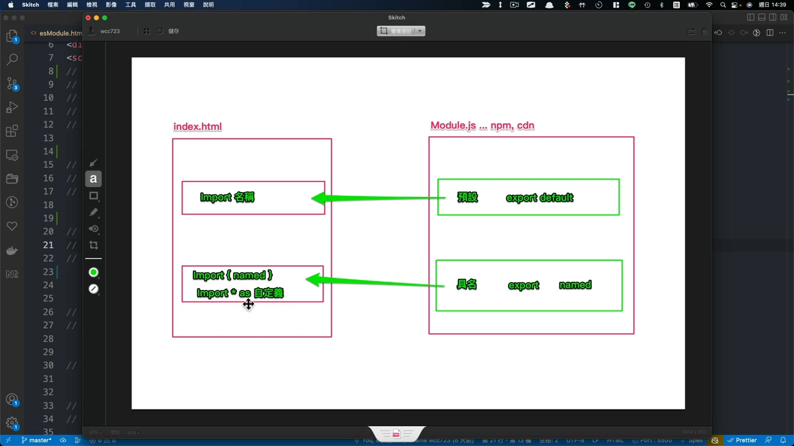

# 11. 模組化 JavaScript：ESModule
## 打開檔案 `/es6/esModule.html`
  因為 `type="text/babel"` 與 `type="module"` 相衝，所以課程前期不會用到 `ESModule` 定義元件
  - ### 1. 匯出匯入本一體，先掌握匯出更容易理解匯入

    - #### 1-1 將標籤定義 `<script type="module">`
      - ##### 匯出
        ```ts
        // fnModule.js
        export default function fn() {
          console.log(1);
        }
        ```

      - ##### 匯入
        ```xml
        <script type="module">
          import fn from './fnModule.js';
          fn();
        </script>
        ```

    - #### 1-2 預設匯出：defaultExport.js
      常見的匯出方式，通常用於匯出物件，在 React 開發中可用來匯出元件
      > 每個檔案只能有一個預設匯出
      - 匯出
        ```ts
        // defaultExport.js
        export default {
          myName = '卡斯柏',
          fn() {
            console.log('我的名字是卡斯柏');
          }
        }
        ```

    - #### 1-3 具名匯出：namedExport.js
      > 每個檔案能有多個具名匯出
      - 匯出
        ```ts
        // namedExport.js
        export const myName = '卡斯柏'
        export function fn() {
          console.log('我的名字是卡斯柏');
        }
        ```

      > 可用於匯出已定義的變數、物件、函式，專案開發中通常用於 `方法匯出`
      > 第三方的框架、函式、套件很常使用具名定義 `方法`

      

  - ### 2. 匯入方法
    - #### 2-1 預設匯入
      因為預設匯出沒有名字，所以可以為它命名
      ```ts
      import obj from './defaultExport.js';
      console.log(obj);
      obj.fn();
      ```


    - #### 2-2 具名匯入
      - 單一匯入（建議寫法）
        ```ts
        import { fn } from './namedExport.js';
        fn();
        ```


      - 全部匯入（不建議，錯誤較難發現）
        ```ts
        import * as allFn from './namedExport.js';
        console.log(allFn);
        allFn.fn();
        ```


  - ### 3 SideEffect
    相關路徑：`/es6/sideEffect.ㄋㄨ`
    - `sideEffect.js`（沒有包含匯出的檔案）
      ```ts
      import './sideEffect.js'
      console.log($);
      ```