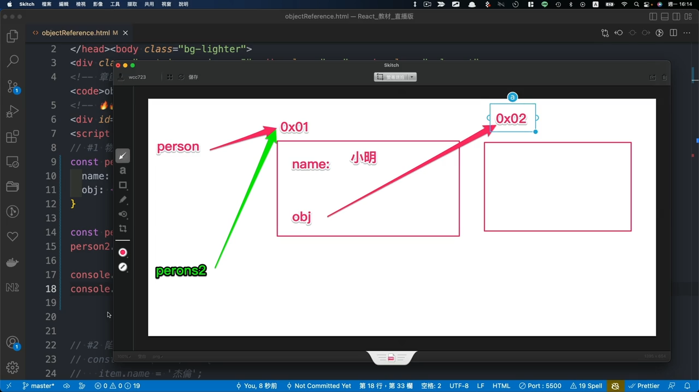

# 6. 物件傳參考特性
## 打開檔案 `/es6/objectReference.html`
  - ### 1. 物件是以傳參考的形式賦值
    ```ts
    const person = {
      name: '小明',
      obj: {}
    }

    const person2 = person;
    person2.name = '杰倫';

    console.log(person.name);
    console.log(person === person2);    // true
    ```
    > 只要是物件的話，它都是用參考位置的概念來做傳送

    

  - ### 2 陷阱
    ```ts
    const fn = (item) => {
      item.name = '杰倫';
      // ...
    }

    const person = {
      name: '小明',
      obj: {}
    }

    fn(person);   // name 會變為 杰倫
    ```

  - ### 3. 解決方案
    - #### 3-1 淺層拷貝
      ```ts
      const person = {
        name: '小明',
        obj: {}
      }

      const person2 = { ...person };
      person2.name = '杰倫';
      person.2.obj.name = 'person2'
      console.log(person, person2)
      ```
      在淺層 `name` 已跳脫連動，但 `obj` 屬於深層的資料，仍然為傳址資料 會受連動。

      或使用：
      ```ts
      const person2 = Object.assign({}, person)
      ```

    - #### 3-2 深層拷貝
        ```ts
        const person = {
          name: '小明',
          obj: {}
        }

        const person2 = JSON.parse( JSON.stringify(person) );
        console.log(person)
        ```


