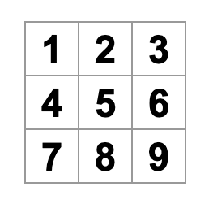
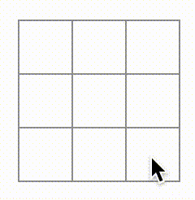

# 教程：井字棋遊戲
  本教程將引導你逐步實現一個簡單的「九宮格井字棋」遊戲，並且不需要你對 `React` 有任何了解。理解本教程所學到的技術，能讓你對 `React` 擁有比較深入的理解。

  - #### 教程劃分：
    - #### [配置](#配置)：一些準備工作。
    - #### [概覽](#概覽)：介紹 React 的基礎知識：組件、props 和 state。
    - #### 完成遊戲：介紹 React 開發中最常用的技術。
    - #### 添加"时间旅行"：讓你深入了解 React 的獨特優勢。

  - #### 實現的是什麼程序？
    - #### 功能預覽
      你將使用 `React` 建立一個交互式的井字棋遊戲。

    - #### 主要特點
      除了能夠兩位玩家輪流下棋、自動判定獲勝者之外，棋盤右側還會有一個編號列表，用來記錄遊戲中所有落子的歷史，並隨著遊戲進行實時更新，允許玩家「跳回」過去的某一步。

## 配置
  - #### 線上開發環境
    文檔提供 [CodeSandbox](https://codesandbox.io/p/sandbox/jvdjyr) 鏈接，讓玩家在瀏覽器中直接編寫和預覽代碼。

  - #### 本地開發環境（可選）：
    若想在本地運行，流程為：
    - 安裝 `Node.js`。
    - 下載 [CodeSandbox](https://codesandbox.io/p/sandbox/jvdjyr) 的壓縮包（右上角選擇`Download Sandbox`）並解壓。
    - 打開終端機使用 `cd` 切換到該目錄。
    - 使用 `npm install` 安裝依賴。
    - 運行 `npm start` 啟動本地伺服器並在瀏覽器查看。

## 概覽
  當你打開 `CodeSandbox` 時，會看到三個主要部分：
  - `Files（文件）`：列出 src 文件夾中的 App.js、index.js、styles.css 和 public 文件夾。
  - `Code Editor（代碼編輯器）`：展示和修改選中文件的源碼。
  - `Browser（瀏覽器）`：預覽代碼的實時運行結果。

  網頁進一步解構了初始的代碼文件：
  - `index.js` 是將 App.js 裡創建的組件與 Web 瀏覽器（React DOM）進行連接與橋接的主入口。
    ```jsx
    import { StrictMode } from "react";
    import { createRoot } from "react-dom/client";
    import "./styles.css";

    import App from "./App";

    const root = createRoot(document.getElementById("root"));
    root.render(
      <StrictMode>
        <App />
      </StrictMode>
    );
    ```
  - `styles.css` 定義了遊戲的樣式。
  - `App.js` 包含你的第一個 React 組件（初始為一個單獨的 `<button>`）。
    ```jsx
    export default function Square() {
      return <button className="square">X</button>;
    }
    ```

  - ### 構建棋盤
    - #### 問題
      初始代碼只有一個格子，但井字棋需要九個。若直接複製九個 `<button>` 標籤會引發 `JSX` 語法錯誤（不能返回多個相鄰的頂級標籤）。

    - #### 修復
      使用 `Fragments（<> 和 </>）` 將多個相鄰的 `JSX` 元素包裹起來。

    - #### 結構重構
      利用 `styles.css` 中定義的 `board-row` 樣式，將 9 個按鈕分成 3 個 `div` 行。同時，將組件名稱從 `Square` 修改為 `Board`，使其更符合棋盤的語意。

      ```jsx
      // App.js
      export default function Board() {
        return (
          <>
            <div className="board-row">
              <button className="square">1</button>
              <button className="square">2</button>
              <button className="square">3</button>
            </div>
            <div className="board-row">
              <button className="square">4</button>
              <button className="square">5</button>
              <button className="square">6</button>
            </div>
            <div className="board-row">
              <button className="square">7</button>
              <button className="square">8</button>
              <button className="square">9</button>
            </div>
          </>
        )
      }
      ```

      

  - ### 通過 Props 傳遞數據
    - #### 目標
      讓棋盤能把資料傳遞給格子組件。

    - #### 做法
      重新定義一個獨立的 `Square({ value })` 組件，接受一個名為 `value` 的 `prop`。

      ```jsx
      // App.vue
      function Square({ value }) {
        return <button className="square">{value}</button>;
      }
      ```

    - #### JSX 轉義
      在 `JSX` 中使用大括號 `{value}` 來從標籤轉義回 `JavaScript`，以便渲染變量而不是字串。

    - #### 父傳子
      更新 `Board` 組件，在內部多次渲染 `<Square value="..."/>`，並將不同的數字或字串作為 `prop` 傳遞給各個方塊。

      ```jsx {6-8,11-13,16-18}
      // App.vue
      export default function Board() {
        return (
          <>
            <div className="board-row">
              <Square value="1" />
              <Square value="2" />
              <Square value="3" />
            </div>
            <div className="board-row">
              <Square value="4" />
              <Square value="5" />
              <Square value="6" />
            </div>
            <div className="board-row">
              <Square value="7" />
              <Square value="8" />
              <Square value="9" />
            </div>
          </>
        );
      }
      ```

  - ### 創建一個具有交互性的組件
    - #### 目標
      當點擊方塊時，方塊應顯示 `"X"`。

    - #### State 的引入
      在 `Square` 組件內部聲明一個名為 `handleClick` 的函數，並在 `<button>` 的 `onClick` 屬性上綁定它。
      
      ```jsx {2-4,9}
      function Square({ value }) {
        function handleClick() {
          console.log('clicked!');
        }

        return (
          <button
            className="square"
            onClick={handleClick}
          >
            {value}
          </button>
        );
      }
      ```

    - #### 組件的記憶
      使用 `React` 的 `useState` 來讓方塊記住自己的值。宣告 `const [value, setValue] = useState(null);`。當點擊事件觸發時，調用 `setValue('X')`。

      ```jsx {1,3,4,7,21-23,26-28,31-33}
      import { useState } from 'react';

      function Square() {
        const [value, setValue] = useState(null);

        function handleClick() {
          setValue('X');
        }

        return (
          <button className="square" onClick={handleClick}>
            {value}
          </button>
        );
      }

      export default function Board() {
        return (
          <>
            <div className="board-row">
              <Square />
              <Square />
              <Square />
            </div>
            <div className="board-row">
              <Square />
              <Square />
              <Square />
            </div>
            <div className="board-row">
              <Square />
              <Square />
              <Square />
            </div>
          </>
        )
      }
      ```

    - #### 獨立性
      每個 `Square` 組件都擁有自己獨立的 `state`。點擊其中一個方塊時，只有被點擊的方塊會重新渲染並顯示 `"X"`，其他方塊不受影響。

      

    - #### React 開發者工具
      本地端開發，擴充工具可安裝 `React Developer Tools`
      > id: `fmkadmapgofadopljbjfkapdkoienihi`

## 完成遊戲
  在此章節中，遊戲邏輯將被進一步完善，從而處理多方塊聯動、輪流落子以及判定勝負。

  - ### 狀態提升
    - #### 核心概念
      在目前的設計中，每個 `Square` 的狀態是完全獨立的。但要判斷井字棋的輸贏，`Board` 需要知道所有 `9` 個方塊的具體狀態。

    - #### 解決方案
      將 `state` 從各個 `Square` 子組件「提升」到父組件 `Board` 中。

    - #### 具體實現
      - 在 `Board` 內部宣告一個包含 `9` 個 `null` 的陣列狀態：`const [squares, setSquares] = useState(Arrary(9).fill(null))`。
        ```jsx {3}
        // ...
        export default function Board() {
          const [squares, setSquares] = useState(Array(9).fill(null));
          return (
            // ...
          );
        }
        ```

      - 將陣列對應的值（如 `squares[0]`）和點擊回調函數（`onSquareClick`）一起作為 `props` 傳遞給每一個 `<Square/>`。
        ```jsx {6-8,11-13,16-18}
        export default function Board() {
          const [squares, setSquares] = useState(Array(9).fill(null));
          return (
            <>
              <div className="board-row">
                <Square value={squares[0]} />
                <Square value={squares[1]} />
                <Square value={squares[2]} />
              </div>
              <div className="board-row">
                <Square value={squares[3]} />
                <Square value={squares[4]} />
                <Square value={squares[5]} />
              </div>
              <div className="board-row">
                <Square value={squares[6]} />
                <Square value={squares[7]} />
                <Square value={squares[8]} />
              </div>
            </>
          );
        }
        ```

      - 修改 `Square` 組件，移除它自身的 `state`，改為直接讀取傳進來的 `value`，並在點擊時調用父組件傳下來的 `onSquareClick`。
        ```jsx {3,5,14-18,23-25,28-30,33-35}
        import { useState } from 'react';

        function Square({value, onSquareClick}) {
          return (
            <button className="square" onClick={onSquareClick}>
              {value}
            </button>
          );
        }

        export default function Board() {
          const [squares, setSquares] = useState(Array(9).fill(null));

          function handleClick(i) {
            const nextSquares = squares.slice();
            nextSquares[i] = "X";
            setSquares(nextSquares);
          }

          return (
            <>
              <div className="board-row">
                <Square value={squares[0]} onSquareClick={() => handleClick(0)} />
                <Square value={squares[1]} onSquareClick={() => handleClick(1)} />
                <Square value={squares[2]} onSquareClick={() => handleClick(2)} />
              </div>
              <div className="board-row">
                <Square value={squares[3]} onSquareClick={() => handleClick(3)} />
                <Square value={squares[4]} onSquareClick={() => handleClick(4)} />
                <Square value={squares[5]} onSquareClick={() => handleClick(5)} />
              </div>
              <div className="board-row">
                <Square value={squares[6]} onSquareClick={() => handleClick(6)} />
                <Square value={squares[7]} onSquareClick={() => handleClick(7)} />
                <Square value={squares[8]} onSquareClick={() => handleClick(8)} />
              </div>
            </>
          )
        }
        ```

  - ### 為什麼不可變性（Immutability）非常重要
    - #### 定義
      在更新狀態時，不要直接修改原有的 `squares` 陣列（例如不使用 `squares[i] = 'X'`），而是使用 `.slice()` 創建陣列的一個新副本（`nextSquares`），在副本上修改後再通過 `setSquares(nextSquares)` 更新。

      ```jsx
      const squares = [null, null, null, null, null, null, null, null, null];
      squares[0] = 'X';
      // Now `squares` is ["X", null, null, null, null, null, null, null, null];
      ```

      使用副本更新
      ```jsx
      const squares = [null, null, null, null, null, null, null, null, null];
      const nextSquares = squares.slice();
      nextSquares[i] = "X";
      setSquares(nextSquares);
      ```

    - #### 優勢
      - ##### 簡化複雜功能
        保留了歷史數據的完整性，使得後續實現「時間旅行（撤銷/重做）」功能變得非常容易。
      - ##### 跟蹤數據變化與優化渲染
        當檢測不可變對象是否改變時，`React` 只需要對比對象的引用（指針）是否發生變化，而不需要遍歷整棵樹。這能讓 `React` 輕鬆決定組件是否需要重新渲染，從而提升性能。

  - ### 輪流落子
    - #### 做法
      在 `Board` 組件中添加一個布林值狀態：`const [xIsNext, setXIsNext] = useState(true);`。

    - #### 邏輯
      當玩家點擊方塊時，根據 `xIsNext` 的值來決定填入 `'X'` 還是 `'O'`，並在落子後透過 `setXIsNext(!xIsNext)` 切換下一位玩家。

    ```jsx {2,6-9,12-16,18}
    export default function Board() {
      const [xIsNext, setXIsNext] = useState(true);
      const [squares, setSquares] = useState(Array(9).fill(null));

      function handleClick(i) {
        // 避免重複塞值
        if (squares[i]) {
          return;
        }

        const nextSquares = squares.slice();
        if (xIsNext) {
          nextSquares[i] = "X";
        } else {
          nextSquares[i] = "O";
        }
        setSquares(nextSquares);
        setXIsNext(!xIsNext);
      }

      return (
        //...
      );
    }
    ```

  - ### 宣佈獲勝者
    - #### 輔助函數
      引入一個名為 `calculateWinner(squares)` 的 JavaScript 函數。該函數預先定義了 8 種獲勝的連線組合（橫、豎、斜），並遍歷檢查陣列中是否有相同的 `'X'` 或 `'O'` 連成一線。

      ```jsx {5-23}
      export default function Board() {
        //...
      }

      function calculateWinner(squares) {
        const lines = [
          [0, 1, 2],
          [3, 4, 5],
          [6, 7, 8],
          [0, 3, 6],
          [1, 4, 7],
          [2, 5, 8],
          [0, 4, 8],
          [2, 4, 6]
        ];
        for (let i = 0; i < lines.length; i++) {
          const [a, b, c] = lines[i];
          if (squares[a] && squares[a] === squares[b] && squares[a] === squares[c]) {
            return squares[a];
          }
        }
        return null;
      }
      ```

    - #### 棋盤狀態展示
      在 `Board` 的 `handleClick` 函數中加入防禦性代碼：若已經有人獲勝，或者該方塊已經有值，則直接 `return` 拒絕後續點擊。同時，在頂部渲染一個 `status` 文本，用於顯示 `"Next player: X/O"` 或 `"Winner: X/O"`。

      ```jsx {5,11-17,21}
      export default function Board() {
        // ...
        function handleClick(i) {
          // 避免重複塞值 || 獲勝者出爐
          if (squares[i] || calculateWinner(squares)) {
            return;
          }
          // ...
        }

        const winner = calculateWinner(squares);
        let status;
        if (winner) {
          status = "Winner: " + winner;
        } else {
          status = "Next player: " + (xIsNext ? "X" : "O");
        }

        return (
          <>
            <div className="status">{status}</div>
            <div className="board-row">
              // ...
        )
      }
      ```
## 添加"时间旅行"
  作為本教程的最後一個核心挑戰，你將利用 `React` 的優勢來記錄遊戲歷史，實現悔棋和重溯歷史的功能。

  - ### 存儲移動歷史
    - #### 數據結構
      為了記錄每一步的棋盤狀態，你需要存儲一個由陣列組成的陣列。

    - #### 狀態再次提升
      將 `squares` 狀態從 `Board` 組件再次向上提升。我們創建一個全新的頂層組件 `Game`。

      ```jsx  {1,5-16}
      function Board() {
        // ...
      }

      export default function Game() {
        return (
          <div className="game">
            <div className="game-board">
              <Board />
            </div>
            <div className="game-info">
              <ol>{/*TODO*/}</ol>
            </div>
          </div>
        );
      }
      ```

    - #### Game 組件的 State：
      - `history`：一個陣列，記錄了從初始到當前每一步的棋盤快照（例如 `[[null,...], ['X',null,...], ...]`）。

      - `xIsNext` 狀態也同步提升至 Game 組件中管理。
        ```jsx
              export default function Game() {
          const [xIsNext, setXIsNext] = useState(true);
          const [history, setHistory] = useState([Array(9).fill(null)]);
          const currentSquares = history[history.length - 1];
          // ...
        ```

  - ### 再次討論狀態提升
    - #### 組件職責重構
      - `Game` 組件現在成了最頂層。它負責持有整個遊戲的 `history` 和回合狀態。

      - `Board` 組件轉變為完全由 `props` 驅動的「`受控組件（Controlled Component）`」。它從 `Game` 接收當前的棋盤數據（`squares`）以及點擊觸發的回調函數（`onPlay`），自身不再保留任何 `state`。

      ```jsx {2,13}
      //...
      function Board({ xIsNext, squares, onPlay }) {
        function handleClick(i) {
          if (squares[i] || calculateWinner(squares)) {
            return;
          }
          const nextSquares = squares.slice();
          if (xIsNext) {
            nextSquares[i] = 'X';
          } else {
            nextSquares[i] = 'O';
          }
          onPlay(nextSquares);
        }
        //...
      }

      export default function Game() {
        const [xIsNext, setXIsNext] = useState(true);
        const [history, setHistory] = useState([Array(9).fill(null)]);
        const currentSquares = history[history.length - 1];

        function handlePlay(nextSquares) {
          setHistory([...history, nextSquares]);
          setXIsNext(!xIsNext);
        }

        return (
          <div className="game">
            <div className="game-board">
              <Board xIsNext={xIsNext} squares={currentSquares} onPlay={handlePlay} />
            </div>
            <div className="game-info">
              <ol>{/*TODO*/}</ol>
            </div>
          </div>
        );
      }

      //...
      ```

  - ### 顯示過去的移動
    - #### 渲染歷史列表
      在 `Game` 組件中，利用 JavaScript 的 `map()` 函數遍歷 `history` 陣列。

    - #### 將數據轉為 UI
      每次遍歷都會將該步驟轉化為一個包含按鈕的 `<li>` 標籤。按鈕文本根據索引顯示為 `"Go to move #1"` 或 `"Go to game start"`。

    - #### Key 的選擇
      在 `React` 中渲染動態列表必須指定唯一 `key`。因為遊戲歷史步驟是順序固定且不會被重新排序、刪除或插入的，所以在這個特定場景下，可以直接安全地使用迴圈的索引值（`move index`）作為 `key`。

      ```jsx {11-13,15-27,35}
      export default function Game() {
        const [xIsNext, setXIsNext] = useState(true);
        const [history, setHistory] = useState([Array(9).fill(null)]);
        const currentSquares = history[history.length - 1];

        function handlePlay(nextSquares) {
          setHistory([...history, nextSquares]);
          setXIsNext(!xIsNext);
        }

        function jumpTo(nextMove) {
          // TODO
        }

        const moves = history.map((squares, move) => {
          let description;
          if (move > 0) {
            description = 'Go to move #' + move;
          } else {
            description = 'Go to game start';
          }
          return (
            <li key={move}>
              <button onClick={() => jumpTo(move)}>{description}</button>
            </li>
          );
        });

        return (
          <div className="game">
            <div className="game-board">
              <Board xIsNext={xIsNext} squares={currentSquares} onPlay={handlePlay} />
            </div>
            <div className="game-info">
              <ol>{moves}</ol>
            </div>
          </div>
        );
      }
      ```

  - ### 實現時間旅行
    - #### 添加當前步數狀態
      在 `Game` 中引入一個新的狀態 `currentMove`，默認值為 `0`，用來記錄玩家當前正處於哪一步。

      ```jsx {5}
      //...
      export default function Game() {
        const [xIsNext, setXIsNext] = useState(true);
        const [history, setHistory] = useState([Array(9).fill(null)]);
        const [currentMove, setCurrentMove] = useState(0);
        const currentSquares = history[currentMove];
        //...
      }
      //...
      ```

    - #### 歷史跳轉函
      編寫 `jumpTo(nextMove)` 函數。當玩家點擊歷史紀錄按鈕時，將 `currentMove` 設為點擊的步數。同時，如果 `nextMove` 是偶數，則 `xIsNext` 應自動設為 `true`。

      ```jsx {4-7}
      //...
      export default function Game() {
        //...
        function jumpTo(nextMove) {
          setCurrentMove(nextMove);
          setXIsNext(nextMove % 2 === 0);
        }

        const moves = history.map((squares, move) => {
          let description;
          if (move > 0) {
            description = 'Go to move #' + move;
          } else {
            description = 'Go to game start';
          }
          return (
            <li key={move}>
              <button onClick={() => jumpTo(move)}>{description}</button>
            </li>
          );
        });
        //...
      }
      //...
      ```

    - #### 截斷歷史
      修改 `Game` 的 `handlePlay` 函數。當玩家回溯到過去的某一步並從那裡落下一顆新子時，不能直接把新狀態追加到末尾，而應該先使用 `history.slice(0, currentMove + 1)` 把「未來」發生的歷史全部切除，再將新棋盤狀態追加上去。

      ```jsx {6,9,11}
      //...
      export default function Game() {
        const [xIsNext, setXIsNext] = useState(true);
        const [history, setHistory] = useState([Array(9).fill(null)]);
        const [currentMove, setCurrentMove] = useState(0);
        const currentSquares = history[currentMove];

        function handlePlay(nextSquares) {
          const nextHistory = [...history.slice(0, currentMove + 1), nextSquares];
          setHistory(nextHistory);
          setCurrentMove(nextHistory.length - 1);
          setXIsNext(!xIsNext);
        }
        //...
      }
      //...
      ```

  - ### 總結
    至此，你已經成功建立了一個功能完備的井字棋遊戲：
    - 它由多個可組合、受控的組件（`Square`, `Board`, `Game`）構成。
    - 完美展示了 `React` 中最核心的「`狀態提升`」、「`Props 數據流`」、「`事件傳遞`」、「`不可變性（Immutability）`」以及「`動態列表渲染`」等開發技術。