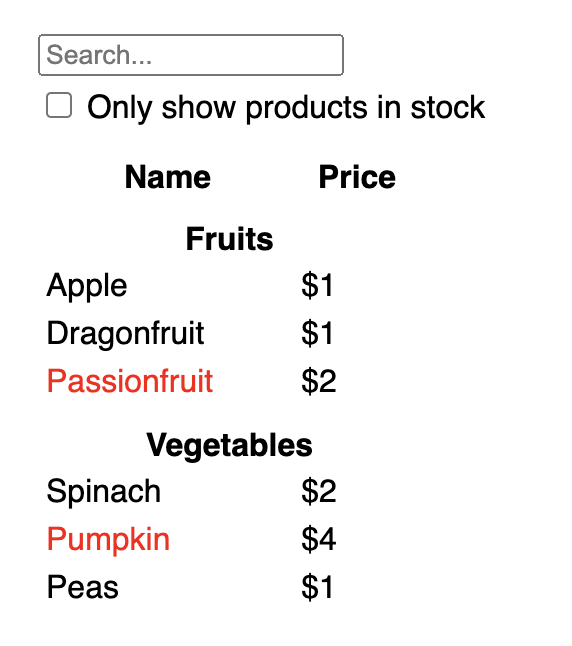
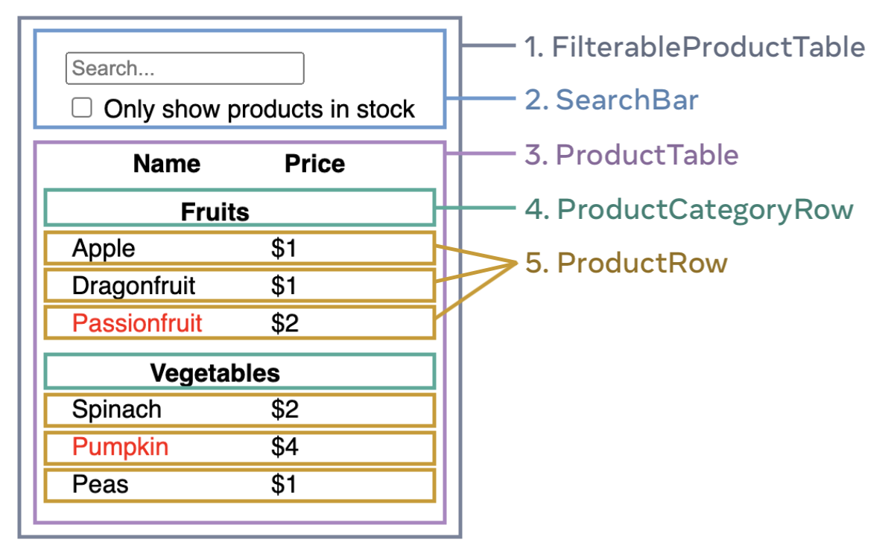

# React 哲學
  `React` 可以改變你對可見設計和應用構建的思考。當你使用 `React` 構建用戶界面時，首先會把它分解成一個個組件，然後把這些組件連接在一起，使數據流經它們。
  本章將引導你使用 `React` 構建一個可搜索的產品數據表。

## 從原型開始
  - ### 準備工作
    開發前會先從設計者那裡得到一個 `JSON API` 數據模型和 `UI` 原型圖。

    ```json
    [
      { category: "Fruits", price: "$1", stocked: true, name: "Apple" },
      { category: "Fruits", price: "$1", stocked: true, name: "Dragonfruit" },
      { category: "Fruits", price: "$2", stocked: false, name: "Passionfruit" },
      { category: "Vegetables", price: "$2", stocked: true, name: "Spinach" },
      { category: "Vegetables", price: "$4", stocked: false, name: "Pumpkin" },
      { category: "Vegetables", price: "$1", stocked: true, name: "Peas" }
    ]
    ```

    

  - ### 開發流程
    只需跟隨以下五個步驟，即可使用 `React` 來實現 UI。

## 步驟一：將 UI 拆解為元件層級結構
  - ### 核心做法
    在原型中的每個組件和子組件周圍繪製盒子並命名。
    
  - ### 拆分依據
    - #### 程序設計（關注點分離）
      一個組件理想情況下應僅關注一件事情。

    - #### CSS
      思考類選擇器（class selector）用於何處。

    - #### 設計
      思考如何組織布局的層級。
      
  - ### 層級映射
    `UI` 和原型常擁有與 `JSON` 相同的數據形狀，因此映射到組件結構非常自然。
    
  - ### 範例結構
    
    - `FilterableProductTable`（包含完整應用）
      - `SearchBar`（獲取用戶輸入）
      - `ProductTable`（展示和過濾清單）
        - `ProductCategoryRow`（展示每個類別的表頭）
        - `ProductRow`（展示每個產品的行）
      
## 步驟二：使用React 建構一個靜態版本
  - ### 核心做法
    先根據數據模型構建一個不帶任何交互的 `UI` 渲染代碼版本。
    構建靜態版本需要寫大量代碼但不需要太多思考，而添加交互需要大量思考但不需要寫太多代碼。

  - ### 數據傳遞
    使用 `props` 從父組件向子組件傳遞數據。在這個階段不要使用 `state`，因為靜態應用不需要處理隨著時間變化的數據。

  - ### 構建順序
    可以自上而下（從高層組件開始）或自下而上（從低層組件開始）構建。簡單項目通常自上而下簡單，大型項目自下而上更簡單。

  - ### 數據流向
    最頂層組件接收數據模型作為 `prop` 向下傳遞，這被稱為單向數據流。

    ```jsx
    function ProductCategoryRow({ category }) {
      return (
        <tr>
          <th colSpan="2">
            {category}
          </th>
        </tr>
      );
    }

    function ProductRow({ product }) {
      const name = product.stocked ? product.name :
        <span style={{ color: 'red' }}>
          {product.name}
        </span>;

      return (
        <tr>
          <td>{name}</td>
          <td>{product.price}</td>
        </tr>
      );
    }

    function ProductTable({ products }) {
      const rows = [];
      let lastCategory = null;

      products.forEach((product) => {
        if (product.category !== lastCategory) {
          rows.push(
            <ProductCategoryRow
              category={product.category}
              key={product.category} />
          );
        }
        rows.push(
          <ProductRow
            product={product}
            key={product.name} />
        );
        lastCategory = product.category;
      });

      return (
        <table>
          <thead>
            <tr>
              <th>Name</th>
              <th>Price</th>
            </tr>
          </thead>
          <tbody>{rows}</tbody>
        </table>
      );
    }

    function SearchBar() {
      return (
        <form>
          <input type="text" placeholder="Search..." />
          <label>
            <input type="checkbox" />
            {' '}
            Only show products in stock
          </label>
        </form>
      );
    }

    function FilterableProductTable({ products }) {
      return (
        <div>
          <SearchBar />
          <ProductTable products={products} />
        </div>
      );
    }

    const PRODUCTS = [
      {category: "Fruits", price: "$1", stocked: true, name: "Apple"},
      {category: "Fruits", price: "$1", stocked: true, name: "Dragonfruit"},
      {category: "Fruits", price: "$2", stocked: false, name: "Passionfruit"},
      {category: "Vegetables", price: "$2", stocked: true, name: "Spinach"},
      {category: "Vegetables", price: "$4", stocked: false, name: "Pumpkin"},
      {category: "Vegetables", price: "$1", stocked: true, name: "Peas"}
    ];

    export default function App() {
      return <FilterableProductTable products={PRODUCTS} />;
    }

    ```

## 步驟三：找出UI 精簡完整的state 表示
  - ### 核心原則
    將 `state` 作為應用程序需要記住改變數據的最小集合。組織 `state` 最重要的原則是保持它 `DRY（不要自我重複）`。
    
  - ### 排除判定（滿足以下任一項就不是 state）
    - 隨著時間推移保持不變？
    - 通過 `props` 從父組件傳遞？
    - 是否可以基於組件中已存在的 `state` 或 `props` 進行計算？
    
  - ### 範例分析
    - 原始產品列表：作為 `props` 傳遞 -> 不是state。
    - 搜索框鍵入的文本：隨時間變化且無法計算 -> 是state。
    - 複選框的值：隨時間變化且無法計算 -> 是state。
    - 過濾後的產品列表：可由原始列表、搜索文本和復選框值計算得出 -> 不是state。
    
  - ### `props` vs `state`
    - `props` 像是傳遞給函數的參數。它們使父組件可以傳遞數據給子組件，定制展示效果。
    - `state` 像是組件的內存。它使組件可以對信息保持追蹤，並根據交互來改變。

## 步驟四：驗證state 應該放置在哪裡
  - ### 定位策略（為每個 state 執行的步驟）
    - 驗證每一個基於特定 `state` 渲染的組件。
    - 尋找它們最近並且共同的父組件。
    - 決定 `state` 放置位置：
      - 可以直接放於共同父組件
      - 共同父組件上層的組件
      - 或者單獨創建一個新組件來管理該 `state`。
    
  - ### 範例分析
    - `ProductTable` 和 `SearchBar` 都需要使用搜索文本和復選框值。
    - 它們的第一個共同父組件是 `FilterableProductTable`。
    - 因此，使用 `useState()` Hook 將這兩個 `state` 變量放置在 `FilterableProductTable` 中，並作為 `props` 傳遞給子組件。

    ```jsx {2-3,6,7}
    function FilterableProductTable({ products }) {
      const [filterText, setFilterText] = useState('');
      const [inStockOnly, setInStockOnly] = useState(false);
      return (
        <div>
          <SearchBar filterText={filterText} inStockOnly={inStockOnly} />
          <ProductTable  products={products} filterText={filterText} dinStockOnly={inStockOnly} />
        </div>
      );
    }
    ```
    
  - ### 此時遇到的問題
    由於此時還沒有編寫代碼響應用戶動作，且表單 `input` 的 `value` 恆等於傳遞過去的 `state`，所以此時編輯表單會無法工作，控制台會報錯提示缺少 `onChange` 處理器。
    ```jsx
    function SearchBar({filterText, inStockOnly}) {
      return (
        <form>
          <input type="text" value={filterText} placeholder="Search..." />
          <label>
            <input type="checkbox" value={inStockOnly}/>
            {' '}
            Only show products in stock
          </label>
        </form>
      );
    }
    ```
    
## 步驟五：新增反向資料流
  - ### 問題背景
    `React` 的數據流是明確的（單向的），比雙向數據綁定需要多寫一些代碼。為了支持用戶輸入改變狀態，需要讓數據反向傳輸。
    
  - ### 核心做法
    因為 `state` 屬於 `FilterableProductTable`，只有它能更新狀態。因此需要將狀態更新函數（如 `setFilterText` 和 `setInStockOnly`）作為 `props` 傳遞給 `SearchBar`。
    
  - ### 具體實現
    在 `SearchBar` 的內部表單元素上添加 `onChange` 事件處理器，在用戶輸入或勾選時，調用傳下來的函數（例如 `e.target.value` 或 `e.target.checked`）來設置父組件的 `state`，進而觸發整個應用的重新渲染。

    ```jsx {2-3,10-11}
    function FilterableProductTable({ products }) {
      const [filterText, setFilterText] = useState('');
      const [inStockOnly, setInStockOnly] = useState(false);

      return (
        <div>
          <SearchBar
            filterText={filterText}
            inStockOnly={inStockOnly}
            onFilterTextChange={setFilterText}
            onInStockOnlyChange={setInStockOnly} />

    // ...
    ```

    ```jsx {4-5,10-17,92-93,100,105}
    import { useState } from 'react';

    function FilterableProductTable({ products }) {
      const [filterText, setFilterText] = useState('');
      const [inStockOnly, setInStockOnly] = useState(false);

      return (
        <div>
          <SearchBar
            filterText={filterText}
            inStockOnly={inStockOnly}
            onFilterTextChange={setFilterText}
            onInStockOnlyChange={setInStockOnly} />
          <ProductTable
            products={products}
            filterText={filterText}
            inStockOnly={inStockOnly} />
        </div>
      );
    }

    function ProductCategoryRow({ category }) {
      return (
        <tr>
          <th colSpan="2">
            {category}
          </th>
        </tr>
      );
    }

    function ProductRow({ product }) {
      const name = product.stocked ? product.name :
        <span style={{ color: 'red' }}>
          {product.name}
        </span>;

      return (
        <tr>
          <td>{name}</td>
          <td>{product.price}</td>
        </tr>
      );
    }

    function ProductTable({ products, filterText, inStockOnly }) {
      const rows = [];
      let lastCategory = null;

      products.forEach((product) => {
        if (
          product.name.toLowerCase().indexOf(
            filterText.toLowerCase()
          ) === -1
        ) {
          return;
        }
        if (inStockOnly && !product.stocked) {
          return;
        }
        if (product.category !== lastCategory) {
          rows.push(
            <ProductCategoryRow
              category={product.category}
              key={product.category} />
          );
        }
        rows.push(
          <ProductRow
            product={product}
            key={product.name} />
        );
        lastCategory = product.category;
      });

      return (
        <table>
          <thead>
            <tr>
              <th>Name</th>
              <th>Price</th>
            </tr>
          </thead>
          <tbody>{rows}</tbody>
        </table>
      );
    }

    function SearchBar({
      filterText,
      inStockOnly,
      onFilterTextChange,
      onInStockOnlyChange
    }) {
      return (
        <form>
          <input
            type="text"
            value={filterText} placeholder="Search..."
            onChange={(e) => onFilterTextChange(e.target.value)} />
          <label>
            <input
              type="checkbox"
              checked={inStockOnly}
              onChange={(e) => onInStockOnlyChange(e.target.checked)} />
            {' '}
            Only show products in stock
          </label>
        </form>
      );
    }

    const PRODUCTS = [
      {category: "Fruits", price: "$1", stocked: true, name: "Apple"},
      {category: "Fruits", price: "$1", stocked: true, name: "Dragonfruit"},
      {category: "Fruits", price: "$2", stocked: false, name: "Passionfruit"},
      {category: "Vegetables", price: "$2", stocked: true, name: "Spinach"},
      {category: "Vegetables", price: "$4", stocked: false, name: "Pumpkin"},
      {category: "Vegetables", price: "$1", stocked: true, name: "Peas"}
    ];

    export default function App() {
      return <FilterableProductTable products={PRODUCTS} />;
    }
    ```