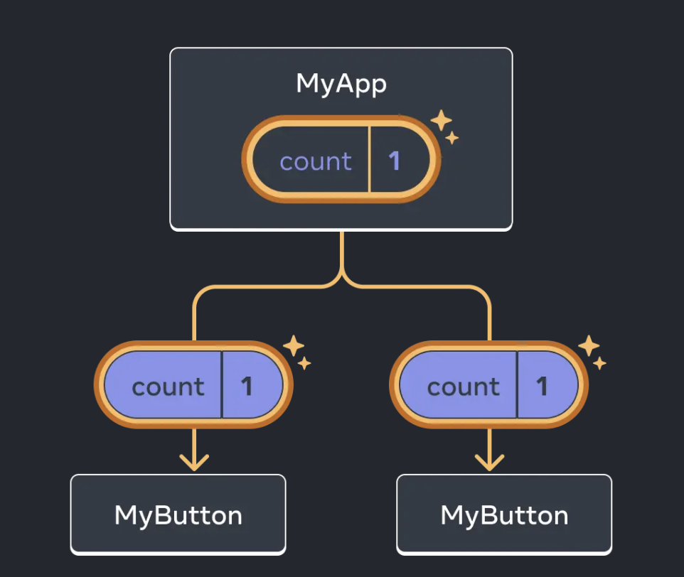

# 快速入門
  歡迎來到 `React` 文檔！本章節將介紹你每天都會使用的 80% 的 `React` 概念。

  :::info 你將會學習到：{open}
  - 如何創建和嵌套組件
  - 如何添加標籤和樣式
  - 如何顯示數據
  - 如何渲染條件和列表
  - 如何對事件做出響應並更新界面
  - 如何在組件間共享數據
  :::

## 創建和嵌套組件
  - ### 定義
    `React` 應用程式是由組件組成的。組件是 `UI`（用戶界面）的一部分，擁有自己的邏輯和外觀。組件可以小到一個按鈕，也可以大到整個頁面。

  - ### 語法
    `React` 組件是返回標籤（Markup）的 JavaScript 函數。
    ```jsx
    function MyButton() {
      return (
        <button>我是一個按鈕</button>
      );
    }
    ```

  - ### 命名規範
    `React` 組件必須以大寫字母開頭（例如 `<MyButton />`），而 HTML 標籤則必須是小寫字母。

  - ### 嵌套
    宣告一個組件後，可以將它像標籤一樣嵌套到另一個組件中。文件中使用 `export default` 關鍵字來指定檔案中的主要組件。
    ```jsx
    export default function MyApp() {
      return (
        <div>
          <h1>歡迎來到我的應用</h1>
          <MyButton />
        </div>
      );
    }
    ```

## 使用 JSX 編寫標籤
  - ### 定義
    大多數 `React` 項目會使用名為 `JSX` 的標籤語法。它是可選的，但非常方便，且多數本地開發工具都開箱即用支援。

  - ### 限制與嚴格性
    `JSX` 比 `HTML` 更加嚴格：
    - 必須閉合標籤，例如 `<br />`。

    - 組件不能返回多個相鄰的 `JSX` 標籤。必須將它們包裹到一個共享的父級中，例如 `<div>...</div>`，或者使用空的 `<>...</>（Fragment）`包裹。

      ```jsx
      function AboutPage() {
        return (
          <>
            <h1>關於</h1>
            <p>你好。<br />最近怎麼樣？</p>
          </>
        );
      }
      ```

      如果有大量的 `HTML` 需要移植到 `JSX` 中，可以使用 [在線轉換器](https://transform.tools/html-to-jsx)

## 添加樣式
  - ### 類名屬性
    在 `React` 中，你必須使用 `className` 來指定 CSS 的 class。它的工作方式與 HTML 的 class 屬性相同。
    ```jsx
    
    ```

  - ### 引用方式
    可以在單獨的 CSS 文件中為該 class 撰寫樣式規則。`React` 並沒有規定如何添加 CSS 文件，最簡單的方式是使用 HTML 的 `<link>` 標籤，或是使用構建工具與框架的整合方案。

## 顯示數據
  - ### 花括號語法
    `JSX` 可以讓你把標籤放到 JavaScript 中，而大括號 `{ }` 能讓你「回到」JavaScript 中，用來嵌入變量並展示給用戶。
    ```jsx
    return (
      <h1>
        {user.name}
      </h1>
    );
    ```

  - ### 屬性轉義
    除了內容之外，JSX 的屬性也可以透過大括號讀取變量。
    - `className="avatar"` 是將字串傳遞給屬性。
    - `src={user.imageUrl}` 則是讀取 `user.imageUrl` 變量的值。
    ```jsx
    return (
      
    );
    ```

  - ### 複雜表達式
    大括號內可以放入更複雜的表達式（如字串拼接）。當使用 `style={{ }}` 屬性時，外層的大括號是 JSX 通道，內層的大括號則是一個 JavaScript 對象，這常用於樣式依賴於 JavaScript 變量的情況。
    ```jsx
    const user = {
      name: 'Hedy Lamarr',
      imageUrl: 'https://react.dev/images/docs/scientists/yXOvdOSs.jpg',
      imageSize: 90,
    };

    export default function Profile() {
      return (
        <>
          <h1>{user.name}</h1>
          
        </>
      );
    }
    ```

## 條件渲染
  `React` 沒有特殊的語法來編寫條件語句，因此使用的就是普通的 JavaScript 代碼。
  - ### `if` 語句
    可用於在 `JSX` 外部根據條件引入不同的 `JSX` 區塊並賦值給變量。
    ```jsx
    let content;
    if (isLoggedIn) {
      content = <AdminPanel />;
    } else {
      content = <LoginForm />;
    }
    return (
      <div>
        {content}
      </div>
    );
    ```

  - ### 條件運算符 ? :（三元運算符）
    與 `if` 不同，它工作於 `JSX` 內部，適合精簡代碼。
    ```jsx
    <div>
      {isLoggedIn ? (
        <AdminPanel />
      ) : (
        <LoginForm />
      )}
    </div>
    ```

  - ### 邏輯與運算符 &&
    當你不需要 `else` 分支時，可以使用更簡短的 `&&` 語法。
    ```jsx
    <div>
      {isLoggedIn && <AdminPanel />}
    </div>
    ```

  - 這些方法同樣適用於有條件地指定屬性。

## 渲染列表
  你將依賴 `JavaScript` 的特性來渲染組件列表，主要使用 `for` 迴圈和陣列的 `map()` 函數。

  - ### 轉化列表
    使用 `map()` 函數將數據陣列轉換為例如 `<li>` 標籤構成的組件陣列。
    ```jsx
    const products = [
      { title: 'Cabbage', id: 1 },
      { title: 'Garlic', id: 2 },
      { title: 'Apple', id: 3 },
    ];

    const listItems = products.map(product =>
      <li key={product.id}>
        {product.title}
      </li>
    );

    return (
      <ul>{listItems}</ul>
    );
    ```

  - ### Key 屬性
    列表中的每一個元素都必須傳遞一個字串或數字給 `key` 屬性，用於在其兄弟節點中唯一標識該元素。`Key` 通常來自數據庫中的 `ID`。當後續發生插入、刪除或重新排序時，`React` 依靠 `key` 來識別哪些項目發生了變動。
    ```jsx
    const products = [
      { title: '卷心菜', isFruit: false, id: 1 },
      { title: '大蒜', isFruit: false, id: 2 },
      { title: '苹果', isFruit: true, id: 3 },
    ];

    export default function ShoppingList() {
      const listItems = products.map(product =>
        <li
          key={product.id}
          style={{
            color: product.isFruit ? 'magenta' : 'darkgreen'
          }}
        >
          {product.title}
        </li>
      );

      return (
        <ul>{listItems}</ul>
      );
    }
    ```

## 響應事件
  - ### 實現方式
    透過在組件內部宣告 `事件處理函數（Event handler function）` 來響應事件。
    ```jsx
    function MyButton() {
      function handleClick() {
        alert('You clicked me!');
      }

      return (
        <button onClick={handleClick}>
          點我
        </button>
      );
    }
    ```

  - ### 傳遞規則
    在綁定事件時（例如 `onClick={handleClick}`），結尾 `不能加小括號`。這意味著你只需把函數「傳遞」給事件，而不要去調用它。當用戶點擊時，`React` 才會調用該處理函數。

## 更新界面
  通常你會希望組件能「記住」一些信息並展示出來（例如按鈕被點擊的次數），這需要為組件添加 `State（狀態）`。

  - ### 引入
    從 `React` 中引入 `useState Hook`。
    ```jsx
    import { useState } from 'react';
    ```

  - ### 聲明
    在組件內調用 `const [count, setCount] = useState(0);`。它會返回兩樣東西：當前的 `state（count）`以及用於更新它的函數（`setCount）`。按照慣例命名為 `[something, setSomething]`。
    ```jsx
    function MyButton() {
      const [count, setCount] = useState(0);
      // ...
    ```

  - ### 運作機制
    當調用 `setCount(count + 1) `時，`React` 會再次調用組件函數。此時 `count` 的值會變更並重新渲染 UI。
    ```jsx {5}
    function MyButton() {
      const [count, setCount] = useState(0);

      function handleClick() {
        setCount(count + 1);
      }

      return (
        <button onClick={handleClick}>
          Clicked {count} times
        </button>
      );
    }
    ```

  - ### 獨立性
    如果多次渲染同一個組件，每個組件都會擁有自己獨立的 `state`，彼此點擊互不影響。
    ```jsx
    import { useState } from 'react';

    export default function MyApp() {
      return (
        <div>
          <h1>独立更新的计数器</h1>
          <MyButton />
          <MyButton />
        </div>
      );
    }

    function MyButton() {
      const [count, setCount] = useState(0);

      function handleClick() {
        setCount(count + 1);
      }

      return (
        <button onClick={handleClick}>
          点了 {count} 次
        </button>
      );
    }
    ```

## 使用 Hook
  - ### 定義
    以 `use` 開頭的函數被稱為 `Hook`。`useState` 是 `React` 提供的一個內置 `Hook`，[React API 參考](https://zh-hans.react.dev/reference/react/hooks)。你也可以通過組合現有的 `Hook` 來編寫自定義 `Hook`。

  - ### 限制（比普通函數更嚴格）
    你只能在組件（或其他 `Hook`）的頂層調用 `Hook`。如果想在條件語句或迴圈中使用 `useState`，必須提取出一個新的組件並在該新組件內部使用。

## 組件間共享數據
  - ### 問題背景
    預設情況下，各個組件的 `state` 是獨立的。但有時你需要多個組件共享數據並一起更新。

  - ### 狀態提升（Lifting State Up）
    - 為了讓多個子組件（如兩個 `MyButton`）顯示相同的數據並同步更新，需要將它們的 `state` 「向上」移動到最接近包含所有這些按鈕的父組件中（例如 `MyApp`）。
      

      ```jsx {2-6}
      export default function MyApp() {
        const [count, setCount] = useState(0);

        function handleClick() {
          setCount(count + 1);
        }

        return (
          <div>
            <h1>獨立更新的計數器</h1>
            <MyButton />
            <MyButton />
          </div>
        );
      }

      function MyButton() {
        // ... 我們正在從這裡移動程式...
      }
      ```

    - 父組件包含 `state` 以及事件處理函數後，再透過 `JSX` 大括號將它們作為 `prop` 傳遞給子組件。
      ```jsx {11-12}
      export default function MyApp() {
        const [count, setCount] = useState(0);

        function handleClick() {
          setCount(count + 1);
        }

        return (
          <div>
            <h1>共同更新的计数器</h1>
            <MyButton count={count} onClick={handleClick} />
            <MyButton count={count} onClick={handleClick} />
          </div>
        );
      }
      ```

    - 修改子組件以讀取從父組件傳下來的 prop：`function MyButton({ count, onClick })`。
      ```jsx  {1,3}
      function MyButton({ count, onClick }) {
        return (
          <button onClick={onClick}>
            點了 {count} 次
          </button>
        );
      }
      ```

  - ### 結果
    點擊子組件按鈕時會觸發傳下來的點擊處理函數，從而更新父組件的 `state`。當父組件的 `state` 遞增後，新的值又會作為 `prop` 傳遞給每個按鈕，使它們同步展示最新值。透過向上移動 `state`，實現了組件間的數據共享。
    ```jsx
    import { useState } from 'react';

    export default function MyApp() {
      const [count, setCount] = useState(0);

      function handleClick() {
        setCount(count + 1);
      }

      return (
        <div>
          <h1>共同更新的计数器</h1>
          <MyButton count={count} onClick={handleClick} />
          <MyButton count={count} onClick={handleClick} />
        </div>
      );
    }

    function MyButton({ count, onClick }) {
      return (
        <button onClick={onClick}>
          点了 {count} 次
        </button>
      );
    }
    ```