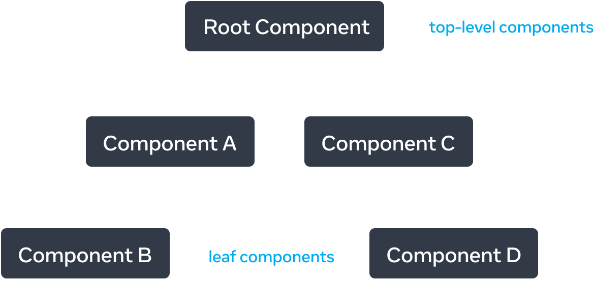
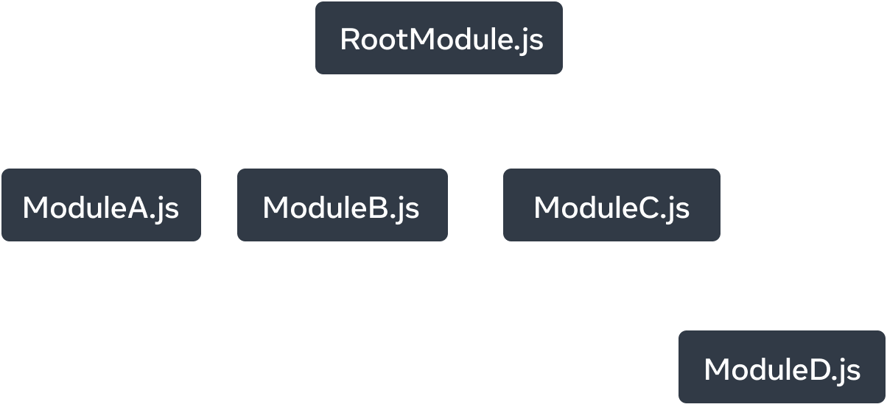

# 描述 UI
  `React` 是一個用於建構使用者介面（UI）的 `JavaScript` 函式庫，使用者介面由按鈕、文字和圖像等小單元內容建構而成。
  `React` 幫助你把它們組合成可重用、可嵌套的組件。從 Web 端網站到行動端應用，螢幕上的所有內容都可以被分解成組件。
  在本章節中，你將學習如何創建、客製化以及有條件地顯示 `React` 組件。

  :::info 你將學到
  - [如何創建你的第一個組件](/pages/f2e/docReact/reactDev/05/reactDev_05_01.html)
  - [在什麼時候以及如何創建多檔案組件](/pages/f2e/docReact/reactDev/05/reactDev_05_02.html)
  - [如何使用 JSX 為 JavaScript 添加標籤](/pages/f2e/docReact/reactDev/05/reactDev_05_03.html)
  - [如何在 JSX 中使用大括號來從組件中使用 JavaScript 功能](/pages/f2e/docReact/reactDev/05/reactDev_05_04.html)
  - [如何用 props 配置組件](/pages/f2e/docReact/reactDev/05/reactDev_05_05.html)
  - [如何有條件地渲染組件](/pages/f2e/docReact/reactDev/05/reactDev_05_06.html)
  - [如何在同一時間渲染多個組件](/pages/f2e/docReact/reactDev/05/reactDev_05_07.html)
  - [如何通過保持組件的純粹性來避免令人困惑的錯誤](/pages/f2e/docReact/reactDev/05/reactDev_05_08.html)
  - [為什麼將 UI 理解為樹是有用的](/pages/f2e/docReact/reactDev/05/reactDev_05_09.html)
  :::

## 你的第一個組件
  `React` 應用是由被稱為組件的獨立 UI 片段建構而成。`React` 組件本質上是可以任意添加標籤的 `JavaScript` 函數。組件可以小到一個按鈕，也可以大到是整個頁面。

  範例：一個 `Gallery` 組件，用於渲染三個 `Profile` 組件：
  ```tsx
  function Profile() {
    return (
      
    );
  }

  export default function Gallery() {
    return (
      <section>
        <h1>Amazing scientists</h1>
        <Profile />
        <Profile />
        <Profile />
      </section>
    );
  }
  ```

  

## 組件的導入與導出
  你可以在一個檔案中宣告許多組件，但檔案的體積過大會變得難以瀏覽。為了解決這個問題，你可以在一個檔案中只導出（`export`）一個組件，然後再從另一個檔案中導入（`import`）該組件。這有助於切分與管理你的代碼。
  ```jsx
  // Profile.js
  export default function Profile() {
    return (
      
    );
  }
  ```

  ```jsx
  // Gallery.js
  import Profile from './Profile.js';

  export default function Gallery() {
    return (
      <section>
        <h1>Amazing scientists</h1>
        <Profile />
        <Profile />
        <Profile />
      </section>
    );
  }
  ```

## 使用 JSX 書寫標籤語言
  每個 `React` 組件都是一個 `JavaScript` 函數，它可能包含一些標籤，`React` 會將其渲染到瀏覽器中。`React` 組件使用一種叫做 `JSX` 的語法擴充來表示該標籤。`JSX` 看起來很像 `HTML`，但它更為嚴格（例如所有標籤必須閉合），且可以顯示動態資訊。

  小工具提示：如果你有現成的 `HTML` 片段想轉換成 `React` 相容的 `JSX`，可以使用線上轉換工具（如 `transform.tools/html-to-jsx`）來將 `class` 轉換為 `className` 等。

## 在 JSX 中通過大括號使用 JavaScript
  `JSX` 可以讓你在 `JavaScript` 檔案中編寫類似 `HTML` 的標籤語法，使渲染邏輯和內容展示維護在同一個地方。有時你會想在標籤中添加一點 `JavaScript` 邏輯或引用一個動態屬性。在這種情況下，你可以在 `JSX` 中使用大括號 `{}` 來為 `JavaScript` 「開闢通道」：

  ```jsx
  <div style={person.theme}>
    <h1>{person.name}'s Todos</h1>
  </div>
  ```

## 將 Props 傳遞給組件
  `React` 組件使用 `props` 來進行組件之間的通訊。每個父組件都可以通過為子組件提供 `props` 的方式來傳遞資訊。`props` 可能會讓你想起 `HTML` 屬性，但你可以通過它們傳遞任何 `JavaScript` 的值，包括物件、陣列、函數、甚至是 `JSX` 元素（透過 `children` 屬性）！

## 條件渲染
  你的組件經常需要根據不同的條件來顯示不同的東西。在 `React` 中，你可以使用 `JavaScript` 語法，如 `if` 語句、`&&` 和 `? :`（三元運算子）來有條件地渲染 `JSX`。

  範例：`{isPacked && '✅'}` 可以在打包完成時才顯示打勾符號。

## 渲染列表
  通常，你需要根據資料集合來渲染多個較為類似的組件。你可以在 `React` 中使用 `JavaScript` 的 `filter()` 和 `map()` 來實現陣列的過濾和轉換，將資料陣列轉換為組件陣列。

  核心規則：對於陣列的每個元素項，你需要指定一個唯一的 `key`（通常使用資料庫中的 `ID`）。即使列表發生了變化，`React` 也可以通過 `key` 來精確跟踪每個元素在列表中的位置，從而優化更新效能。

## 保持組件純粹
  有些 `JavaScript` 函數是純粹（`Pure`）的。純函數的基本定義：
  - `只負責自己的任務`：它不會更改在該函數調用前就已存在的物件或變數。
  - `輸入相同，輸出也相同`：在輸入相同的情況下，應總是返回相同的結果。

  嚴格遵循純函數的定義編寫組件，可以讓代碼庫體量增長時，避免一些令人困惑的錯誤和不可預測的行為。不應該在組件內直接修改全域變數，而應該將變數透過 `props` 傳遞給組件。

## 將 UI 視為樹
  `React` 使用樹形關係建模以展示組件和模組之間的關係。

  1. `渲染樹（Render Tree）`
    `React` 渲染樹是組件之間父子關係的表示。位於樹頂部、靠近`根組件（Root Component）`的組件被視為頂層組件；
    沒有子組件的組件則被稱為葉子組件。這種分類對於理解資料流和渲染效能非常有用。

  

  2. `模組依賴樹（Module Dependency Tree）`
    對 `JavaScript` 模組（檔案）之間的匯入匯出關係進行建模是另一種理解應用程式的方式。建構工具（Bundler）經常使用依賴樹來捆綁（Bundle）客戶端下載和渲染所需的所有 `JavaScript` 代碼。了解模組依賴樹有助於調試與控制打包體積（Bundle Size）。

  