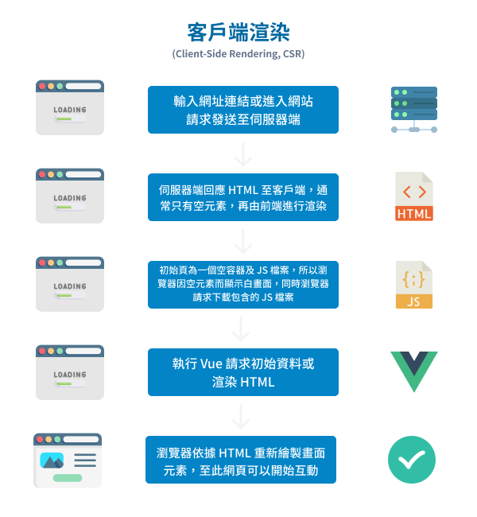
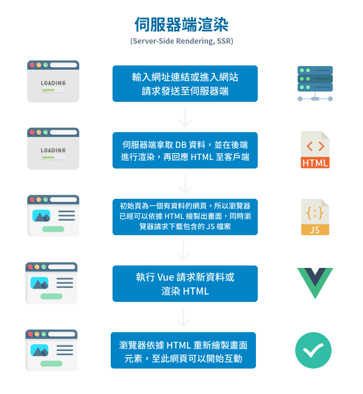

# 1. 淺談 CSR、SSR 與 SSG
## CSR 客戶端渲染/前端渲染 (Client-Side Rendering)
  - 由 `Vue`、`React` 等前端框架常用。
  - 瀏覽器接收到幾乎空白的 `HTML`，其中只包含一個「`容器`」。
  - 之後再藉由 `JavaScript` 在終端 `使用者端（client）` 渲染出完整內容。
  - 適合畫面互動性高的 `SPA`，但 `SEO` 效果差、初次載入時間較長。

  

  - ### 優點
    - 跳轉頁面時，不再需要由伺服器重新渲染整個頁面，前端框架會幫我們實現部分元素更新，使用者體驗較佳。
    - 實現前後端分離，讓前端能更專注 UI 開發，後端專注 API。
    - 因為渲染工作皆在客戶端完成，伺服器負擔也較小。

  - ### 缺點
    - 首次進入網站時，可能需要較長的下載 JS 與載入渲染時間會有白畫面問題。
    - 不利於 `SEO`，搜尋引擎爬蟲蒐集資料時多數不執行 JS 或頁面過於複雜，而導致無法獲得初始頁面資料；搜尋引擎對於 CSR 雖有解決方案，但是仍不夠友善。

## SSR 伺服器端渲染 (Server‑Side Rendering)
  - 每次請求時，伺服器回傳已經填滿資料的完整 HTML 給瀏覽器。
  - 適合頁面內容頻繁更新的網站（如新聞、動態資料）。
  - `SEO` 效果佳，但伺服器負載大，回應時間可能變長。

  

  - ### 優點
    - 有利於 `SEO`，首次進入網站時，網頁 `HTML` 就已經在伺服器端渲染生成完畢，搜尋引擎爬蟲便能準確抓取最終網頁資料。

  - ### 缺點
    - 跳轉頁面時，網頁都需要再重新載入，導致用戶體驗較差。
    - 因為渲染工作皆在伺服端完成，所以每次都需要重新取得整個頁面的 `API` 的資料與渲染，對於伺服器負擔也較大。
  
## SSG 靜態網頁生成 (Static Site Generation)
  - 在網站 `build` 階段預先生成好完整的 `HTML` 檔案。
  - 每次請求都直接回傳相同 `HTML`，速度快、伺服器負載低。
  - 適合資料不常變動的頁面，不適合高頻更新內容。

  - ### 優點
    - 打包編譯時產生出網頁原始碼 `HTML` 檔案，即靜態資源檔案，因此能很好的搭 `CDN` 緩存來減輕伺服器負擔。
    - 有利於 `SEO`，因為打包編譯時產生出網頁原始碼 `HTML` 檔案，正是可以讓搜尋引擎爬蟲解析的完整網頁資料。

  - ### 缺點
    - 如果頁面經常變動，就得再一次打包編譯，重新產生出新的一份網頁原始碼 `HTML` 檔案。

## 各渲染方式比較
  | 渲染方式  | HTML產出時機            | 特性                          | 適用場景                      |
  |----------|-----------------------|------------------------------|------------------------------|
  | `CSR`    | Client 端載入時動態生成 | SEO 差、初次載入慢、互動性強     | 單頁應用（SPA）                 |
  | `SSR`    | 每次請求時由伺服器生成    | SEO 好、動態性佳，但伺服器負載高 | 新聞類、動態資料頁面             |
  | `SSG`    | Build 時預先生成        | 快速、低負荷，但無動態能力       | Blog、產品展示、Landing Page 等 |

## SSR (後端渲染) + SPA (單頁式應用程式)
  若是採用 `SSR` 渲染首次進入的 `HTML`，再用 `CSR` 做後續動態的取資料更新畫面，不就能解決 `SPA` 常見的白畫面或 `SEO` 優化問題嗎？

  => `Nuxt` 框架 或 `Next.js`