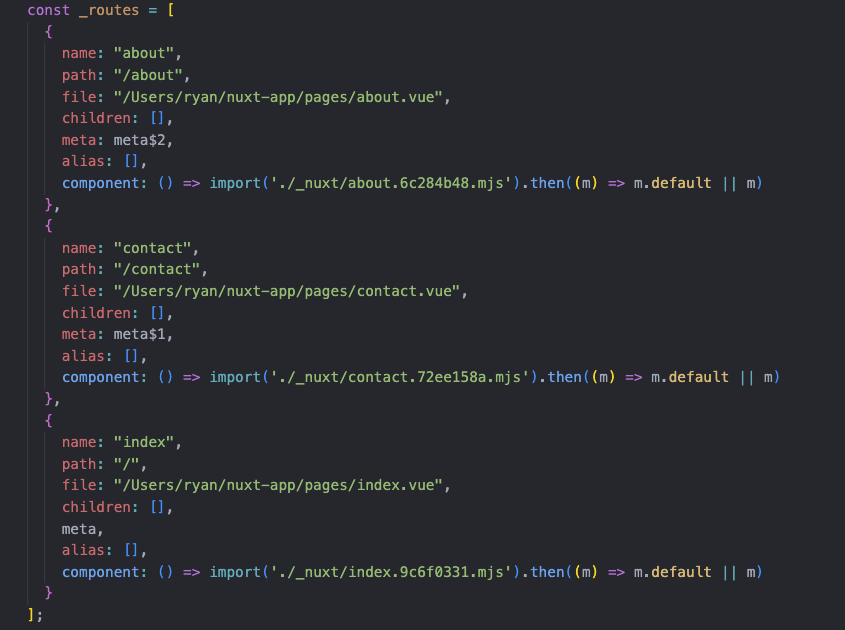

# 7. 頁面 (Pages) 與路由 (Routing)
  - `Vue` 中使用 [Vue Router](https://router.vuejs.org/) 管理路由
  - `Nuxt 3` 預設：
    - 沒有手動安裝 `router`
    - 只要有 `pages` 目錄 → 自動啟用 `Vue Router`
    - 路由由「`檔案結構`」決定

## 基於檔案的路由 (File-based Routing)
  - `pages/` 內的檔案會自動生成路由
  - 屬於「`約定式路由`」
  - 支援副檔名：
    - `.vue`
    - `.js`
    - `.ts`
    - `.jsx`
    - `.tsx`
  - 具備：
    - 自動 `code splitting`
    - 動態載入頁面

  - ### 建立第一個頁面
    - 建立 `pages/index.vue` → 對應 `/`
    - `Nuxt` 自動建立路由
    - 不需手動設定 `router`

    ```xml
    <template>
      <div class="bg-white py-24">
        <div class="flex flex-col items-center">
          <h1 class="text-6xl font-semibold text-gray-800">這裡是首頁</h1>
        </div>
      </div>
    </template>
    ```
    - #### 必要條件
      - `app.vue` 必須包含：`<NuxtPage />`
        - 用來顯示當前路由頁面
        - 類似 `Vue` 的 `<router-view />`
        - 若缺少 → 頁面無法顯示
    
      - 修改 `./app.vue`，檔案內容如下：
        ```xml
        <template>
          <div>
            <NuxtPage />
          </div>
        </template>
        ```

## 約定式路由中的 index.vue
  - `index.vue` 特殊規則：
    | 檔案位置               | 對應路由 |
    |------------------------|----------|
    | `pages/index.vue`      | `/`      |
    | `pages/docs/index.vue` | `/docs`  |

  - `index.vue` 代表該層目錄的入口頁

## 多個路由頁面
  - ### 建立多個路由頁面
    - `pages/about.vue` → `/about`
      ```xml
      <template>
        <div class="bg-white py-24">
          <div class="flex flex-col items-center">
            <h1 class="text-6xl font-semibold text-yellow-400">大家好！我是 Ryan</h1>
            <p class="my-8 text-3xl text-gray-600">這裡是 /about</p>
          </div>
        </div>
      </template>
      ```
    - `pages/contact.vue` → `/contact`
      ```xml
      <template>
        <div class="bg-white py-24">
          <div class="flex flex-col items-center">
            <h1 class="text-6xl font-semibold text-rose-400">如果沒事不要找我 xDDD</h1>
            <p class="my-8 text-3xl text-gray-600">這裡是 /contact</p>
          </div>
        </div>
      </template>
      ```

    - #### 重點
      - 檔案名稱 = 路由路徑
      - `Nuxt` 自動生成 `router config`

  - ### 自動產生的路由
    - `build` 後可在 `.output` 中看到 `router` 設定
    - 本質：
      - `Nuxt` 幫你生成 `Vue Router` 設定

    如果你有興趣想看看 `Nuxt` 自動產生出來的路由配置長什麼樣子，可以使用 `npm run build` 或 `npx nuxt build` 來建構出 `.output` 目錄，並打開 `.output/server/chunks/app/server.mjs`，搜尋 `const _routes =` 或剛剛建立的檔案名稱 `about.vue`，就可以找到下面這一段程式碼：

    

## 建立路由連結
  - 使用 `<NuxtLink>` (取代 `<router-link>`)
    調整 `./pages/index.vue`，內容如下：
    ```xml
    <template>
      <div class="bg-white py-24">
        <div class="flex flex-col items-center">
          <h1 class="text-6xl font-semibold text-gray-800">這裡是首頁</h1>
          <div class="my-4 flex space-x-4">
            <NuxtLink to="/about">前往 About</NuxtLink>
            <NuxtLink to="/contact">前往 Contact</NuxtLink>
          </div>
        </div>
      </div>
    </template>
    ```

  - ### 用法
    - `to` 指定路徑
    - 點擊後進行頁面切換

  - ### 補充
    - 程式導向跳轉：
      - 使用 `navigateTo`，可以參考[官方文件](https://v3.nuxtjs.org/api/utils/navigate-to#navigateto)
    - 類似 `Vue Router` 的 `router.push`

## 帶參數的動態路由匹配
  - 使用 `[param]` 建立動態路由

  - ### 對應關係
    | 檔案                   | 路由         |
    |------------------------|--------------|
    | `pages/users/[id].vue` | `/users/:id` |

  - ### 取得參數
    - 使用 `useRoute()`
    - 透過：
      - `route.params.xxx`

    - 建立 `./pages/users/[id].vue` 檔案，內容如下：
      ```xml
      <template>
        <div class="bg-white py-24">
          <div class="flex flex-col items-center">
            <h1 class="text-3xl text-gray-600">這裡是 Users 動態路由頁面</h1>
            <p class="my-8 text-3xl text-gray-600">
              匹配到的 Id: <span class="text-5xl font-semibold text-blue-600">{{ id }}</span>
            </p>
          </div>
        </div>
      </template>
      <script setup>
      const route = useRoute()
      const { id } = route.params;
      </script>
      ```

## 匹配所有層級的路由
  如果你需要匹配某個頁面下的所有層級的路由，你可以在參數前面加上 `...` ，例如，`[...slug].vue`，這將匹配該路徑下的所有路由。

  建立 `./pages/catch-all/[...slug].vue` 檔案：
  ```sh
  ./pages/
  └── catch-all/
      └── [...slug].vue
  ```

  `./pages/catch-all/[...slug].vue` 檔案內容如下：
  ```xml
  <template>
    <div class="bg-white py-24">
      <div class="flex flex-col items-center">
        <h1 class="text-4xl text-gray-800">這是 catch-all/... 下的頁面</h1>
        <p class="mt-8 text-3xl text-gray-600">匹配到的 Params:</p>
        <p class="my-4 text-5xl font-semibold text-violet-500">{{ $route.params.slug }}</p>
        <span class="text-xl text-gray-400">每個陣列元素對應一個層級</span>
      </div>
    </div>
  </template>
  ```

  我們可以輸入 `/catch-all/hello` 及 `/catch-all/hello/world`，路由的參數 `slug` 就會是一個陣列，陣列的每個元素對應每一個層級。

## 建立 404 Not Found 頁面
  `Nuxt 3` 提供一個配置來處理 `404 Not Found` 的頁面，當我們建立 `./pages/[...slug].vue` 頁面， `Nuxt 3` 所有未匹配的路由，將會交由這個頁面元件做處理，並同時使用 `setResponseStatus(404)` 函數設定 `404 HTTP Status Code`。

  `./pages/[...slug].vue`
  ```xml
  <template>
    <div class="bg-white py-24">
      <div class="flex flex-col items-center">
        <h1 class="text-8xl font-semibold text-red-500">404</h1>
        <p class="my-8 text-3xl text-gray-800">Not Found</p>
        <p class="my-8 text-xl text-gray-800">真的是找不到這個頁面啦 >///<</p>
      </div>
    </div>
  </template>

  <script setup>
    throw createError({
      statusCode: 404,
      statusMessage: 'Not Found'
    })
  </script>
  ```

  `/omg` 這個是不存在的頁面，未匹配的路由就會交由 `./pages/[...slug].vue` 頁面來處理。

## 建立多層的目錄結構
  - 支援巢狀 + 動態組合

  - ### 範例結構
    - `/posts`
    - `/posts/top-:number`
    - `/posts/:postId`
    - `/posts/:postId/comments/:commentId`

  - `./pages/posts/index.vue`
    | 匹配模式     | 匹配路徑    | 匹配參數 (Params) |
    |------------|------------|------------------|
    |` /posts`   | `/posts`   | 無               |

  - `./pages/posts/top-[number].vue`
    | 匹配模式              | 匹配路徑         | 匹配參數 (Params)    |
    |----------------------|----------------|---------------------|
    | `/posts/top-:number` | `/posts/top-3` | `{ number: 3 }`     |
    | `/posts/top-:number` | `/posts/top-5` | `{ number: 5 }`     |

  - `./pages/posts/[postId]/index.vue`
    | 匹配模式           | 匹配路徑    | 匹配參數 (Params)  |
    |------------------|------------|-------------------|
    | `/posts/:postId` | `/posts/8` | `{ postId:8 }`    |

  - `./pages/posts/[postId]/comment/[commentId].vue`
    | 匹配模式                              | 匹配路徑                | 匹配參數 (Params)              |
    |--------------------------------------|-----------------------|-------------------------------|
    | `/posts/:postId/comments/:commentId` | `/posts/8/comments/1` | `{ postId: 8, commentId: 1 }` |

  - ### 重點
    - 目錄結構 = 路由結構
    - `[param]` 對應動態參數
    - 可混合靜態 + 動態路由

## 巢狀路由 (Nested Routes)
  - 用於在頁面中嵌入子頁面

  - ### 實作方式
    - 建立同名檔案 + 資料夾

    - #### 範例：
      - `pages/docs.vue`
      - `pages/docs/doc-1.vue`
      - `pages/docs/doc-2.vue`

  - ### 路由結果
    - `/docs`
    - `/docs/doc-1`
    - `/docs/doc-2`

  - ### 必要條件
    - 父頁面需包含：`<NuxtPage />`
      - 作為子路由顯示容器

  - ### 概念
    - 類似 `Vue Router` 的 `children`
    - 但透過目錄自動完成
    
  ```sh
  /docs/doc-1                           /docs/doc-2
  +------------------+                  +-----------------+
  | docs             |                  | docs            |
  | +--------------+ |                  | +-------------+ |
  | | doc-1        | |  +------------>  | | doc-2       | |
  | |              | |                  | |             | |
  | +--------------+ |                  | +-------------+ |
  +------------------+                  +-----------------+
  ```


  而在 `Nuxt 3` 頁面的約定式路由機制下，我們即是透過目錄結構與頁面元件實做出嵌套路由的效果。

  舉例來說，當我們建立了下面的目錄頁面結構：
  > 這裡需要注意，一定要有 `docs.vue` 與 `docs` 同名的目錄

  ```sh
  ./pages/
  ├── docs/
  │   ├── doc-1.vue
  │   └── doc-2.vue
  └── docs.vue
  ```

  頁面元件的參考程式碼如下：
  - `./pages/docs.vue`
    ```xml
    <template>
      <div class="bg-white">
        <div class="my-6 flex flex-col items-center">
          <h1 class="text-3xl font-semibold text-gray-800">這裡是 Docs</h1>
          <div class="my-4 flex space-x-4">
            <NuxtLink to="/docs/doc-1">前往 Doc 1</NuxtLink>
            <NuxtLink to="/docs/doc-2">前往 Doc 2</NuxtLink>
          </div>
        </div>
        <div class="border-b-2 border-gray-100" />
        <div class="flex flex-col items-center">
          <NuxtPage />
        </div>
      </div>
    </template>
    ```

  - `./pages/docs/doc-1.vue`
    ```xml
    <template>
      <div class="flex flex-col items-center">
        <p class="my-8 text-3xl text-blue-500">這是我的第一份文件</p>
      </div>
    </template>
    ```

  - `./pages/docs/doc-2.vue`
    ```xml
    <template>
      <div class="flex flex-col items-center">
        <p class="my-8 text-3xl text-green-500">這是我的第二份文件</p>
      </div>
    </template>
    ```
