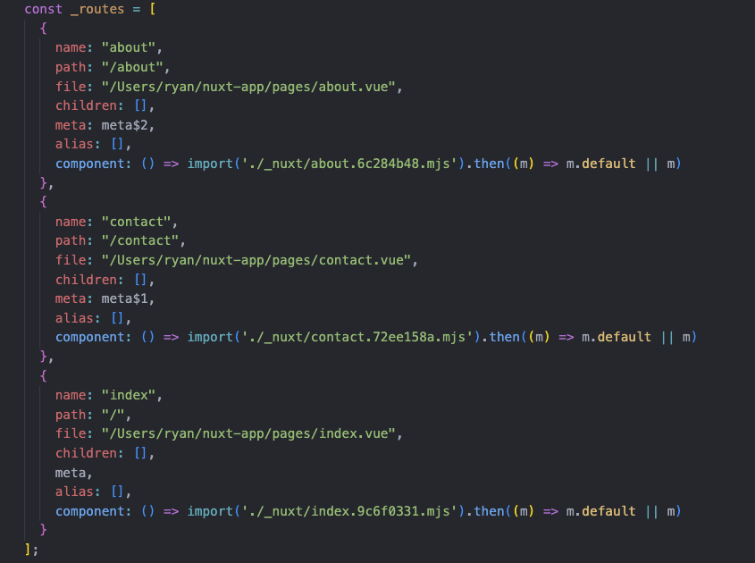

# 7. 頁面 (Pages) 與路由 (Routing)
  在 `Vue` 中，我們會使用到 `Vue Router` 來實現切換頁面或路由的需求，而在 `Nuxt 3` 中，預設是沒有使用路由相關套件，直至建立了 `pages` 目錄，`Nuxt` 將會自動載入 `Vue Router` 來管理路由，並且具有一定的規則需要遵循，以下將介紹頁面目錄與路由之間的關係。

## 基於檔案的路由 (File-based Routing)
  在 `Nuxt 3` 專案的 `pages` 目錄下，當我們建立了一個頁面檔案，就會以該檔案建立出相對應的路由，`Nuxt 3` 基於檔案的路由，也使用了程式碼拆分將每個頁面需要的程式碼梳理出來，並以動態載入的方式載入最小所需要的程式碼。因為是以目錄結構與檔案命名方式來約定，也稱之為 `約定式路由`。

  - ### 建立第一個頁面
    `Nuxt 3` 的 `pages` 目錄，是用來建立頁面並放置的目錄，當專案下有存在 `pages` 目錄，`Nuxt` 將會自動載入 `Vue Router` 來實現路由效果，目錄下的檔案通常是 `Vue` 的元件，也允許具有 `.vue`、`.js`、`.jsx`、`.ts` 或 `.tsx` 副檔名的檔案。

    當我們建立 `./pages/index.vue`，檔案內容如下，則表示路由 `/` 對應到這個頁面檔案，我們只需要建立檔案，路由的配置將會由 `Nuxt 3` 自動產生。

    ```xml
    <template>
      <div class="bg-white py-24">
        <div class="flex flex-col items-center">
          <h1 class="text-6xl font-semibold text-gray-800">這裡是首頁</h1>
        </div>
      </div>
    </template>
    ```

    若你還記得 `Vue Router` 中的 `<router-view />`，這是路由需要的進入點，同樣的在 `Nuxt 3` 我們需要使用 `<NuxtPage />` 來顯示我們建立的路由頁面，這裡非常重要，否則路由及頁面將無法正確運作。

    修改 `./app.vue`，檔案內容如下：

    ```xml
    <template>
      <div>
        <NuxtPage />
      </div>
    </template>
    ```

    接著我們在瀏覽器瀏覽 `/` 路由，如 `http://localhost:3000/`，就可以看到我們在 `./pages/index.vue` 頁面內寫的標題文字「這是首頁」囉！

## 約定式路由中的 index.vue
  在開頭有提到，`Nuxt 3` 提供了一個基於檔案的路由，從上的例子你或許能發現，基本上檔案名稱就是對應著路由名稱，但 `index.vue` 比較特別，它所對應的是路由 `/` 。

  > `index.[ext]` 這個效果和特性，其實是與 `Node.js` 底層核心有關，在此就不贅述。

  舉例來說，我可以在 `pages` 下建立一個 `docs.vue` 表示對應路由 `/docs`，也可以將檔案放置在 `docs` 目錄下並重新命名為 `index.vue` 即 `./pages/docs/index.vue`，這樣也可以透過 `/docs` 瀏覽到相同的頁面。

  所以當 `index.vue` 存在於 `pages` 目錄下，已經位於網站頁面的第一層，所以我們瀏覽 `http://localhost:3000/` 就可以做出首頁的效果。

## 多個路由頁面
  在實務上，通常一個網站會有多個頁面，並分別對應到不同的路由，接下來我們嘗試建立 `About` 與 `Contact` 兩個頁面。

  - ### 建立多個路由頁面
    建立 `./pages/about.vue`，內容如下：
    ```xml
    <template>
      <div class="bg-white py-24">
        <div class="flex flex-col items-center">
          <h1 class="text-6xl font-semibold text-yellow-400">大家好！我是 Ryan</h1>
          <p class="my-8 text-3xl text-gray-600">這裡是 /about</p>
        </div>
      </div>
    </template>
    ```

    建立 `./pages/contact.vue`，內容如下：
    ```xml
    <template>
      <div class="bg-white py-24">
        <div class="flex flex-col items-center">
          <h1 class="text-6xl font-semibold text-rose-400">如果沒事不要找我 xDDD</h1>
          <p class="my-8 text-3xl text-gray-600">這裡是 /contact</p>
        </div>
      </div>
    </template>
    ```
    
    接著我們在瀏覽器分別瀏覽 `/about` 或 `/contact`，就可以看到我們路由效果囉！

    可以發現所建立的檔案名稱，最終就會自動對應產生出 `/about` 及 `/contact` 路由。

  - ### 自動產生的路由
    如果你有興趣想看看 `Nuxt` 自動產生出來的路由配置長什麼樣子，可以使用 `npm run build` 或 `npx nuxt build` 來建構出 `.output` 目錄，並打開 `.output/server/chunks/app/server.mjs`，搜尋 `const _routes =` 或剛剛建立的檔案名稱 `about.vue`，就可以找到下面這一段程式碼：

    

    這段程式碼與 `Vue` 中的路由配置非常相像，其實這就是 `Nuxt 3` 檢測到 `pages` 目錄，自動幫我們載入 `Vue Router` 與依據 `pages` 目錄下的檔案結構，自動產生出所需的路由配置。

## 建立路由連結
  在 `Vue Router` 我們可以使用 `<router-link>` 來建立路由連結，以此來導航至其他頁面，而在 `Nuxt 3` 的路由中，則是使用 `<NuxtLink>` 來建立路由連結來進行頁面的跳轉，我們嘗試在首頁新增幾個路由連結來進行頁面導航。

  調整 `./pages/index.vue`，內容如下：
  ```xml
  <template>
    <div class="bg-white py-24">
      <div class="flex flex-col items-center">
        <h1 class="text-6xl font-semibold text-gray-800">這裡是首頁</h1>
        <div class="my-4 flex space-x-4">
          <NuxtLink to="/about">前往 About</NuxtLink>
          <NuxtLink to="/contact">前往 Contact</NuxtLink>
        </div>
      </div>
    </div>
  </template>
  ```
  接著我們在瀏覽器瀏覽首頁，點擊「`前往 About`」或「`前往 Contact`」就可以看見路由導航效果囉！

  使用 `<NuxtLink>` 時，可以就把它想像為 `<router-link>` 的替代品，像 `to` 這個 `Pros` 控制路由位置的用法基本上一樣，其他更多的 `Pros` 用法及說明可以參考官網的[文件](https://v3.nuxtjs.org/api/components/nuxt-link#props)。

  如果想要使用像 `Vue Router` 提供的 `router.push` 方法於 `Vue` 中直接呼叫來導航至其他頁面，在 `Nuxt` 中你可以使用 `navigateTo`，參數可以參考[官方文件](https://v3.nuxtjs.org/api/utils/navigate-to#navigateto)。

## 帶參數的動態路由匹配
  在實務上，我們可能需要將路徑作為參數傳遞給同一個元件，例如，我們有一個 `users` 頁面元件，在 `/users/ryan` 或 `/users/jennifer` 路徑，都能匹配到同一個 `users` 元件，並將 `ryan` 或 `jennifer` 當作參數傳遞給 `users` 頁面元件使用，那麼我們就需要動態路由來做到這件事。

  在 `Vue 3` 使用 `Vue Router` 我們可能會寫出如下路由配置：
  ```ts
  {
    name: "users",
    path: "/users/:id",
    component: "./pages/users.vue",
  }
  ```

  這樣我們就能達到進入 `/users/ryan` 路由將 `ryan` 當作 `id` 參數傳入 `users` 元件中，路徑參數用冒號 `:` 表示，這個被匹配的 `參數 (params)`，會在元件中可以使用 `useRoute()` 與 `route.params.id` 取得。

  在 `Nuxt 3` 中，我們要實現這個效果，需要將檔案名稱添加中括號 `[]`，其中放入欲設定的參數名稱，譬如下面的目錄結構與檔案名稱。

  ```sh
  ./pages/
  └── users/
      └── [id].vue
  ```

  建立 `./pages/users/[id].vue` 檔案，內容如下：
  ```xml
  <template>
    <div class="bg-white py-24">
      <div class="flex flex-col items-center">
        <h1 class="text-3xl text-gray-600">這裡是 Users 動態路由頁面</h1>
        <p class="my-8 text-3xl text-gray-600">
          匹配到的 Id: <span class="text-5xl font-semibold text-blue-600">{{ id }}</span>
        </p>
      </div>
    </div>
  </template>
  <script setup>
  const route = useRoute()
  const { id } = route.params;
  </script>
  ```

  我們在 `script` 就可以從 `route.params` 拿到我們所設定的參數名稱 `id`，並將其在 `template` 中渲染出來。瀏覽 `http://localhost:3000/users/ryan` ，看看效果，`Nuxt 3` 就能匹配到使用者的 `id` 參數 `ryan`，並傳入`users` 頁面元件。

  你也可以在 `template` 直接使用 <span v-pre>`{{$route.params.id}}`</span> 來渲染出 `id` 參數。

## 匹配所有層級的路由
  如果你需要匹配某個頁面下的所有層級的路由，你可以在參數前面加上 `...` ，例如，`[...slug].vue`，這將匹配該路徑下的所有路由。

  建立 `./catch-all/[...slug].vue` 檔案：
  ```sh
  ./pages/
  └── catch-all/
      └── [...slug].vue
  ```

  `./catch-all/[...slug].vue` 檔案內容如下：
  ```xml
  <template>
    <div class="bg-white py-24">
      <div class="flex flex-col items-center">
        <h1 class="text-4xl text-gray-800">這是 catch-all/... 下的頁面</h1>
        <p class="mt-8 text-3xl text-gray-600">匹配到的 Params:</p>
        <p class="my-4 text-5xl font-semibold text-violet-500">{{ $route.params.slug }}</p>
        <span class="text-xl text-gray-400">每個陣列元素對應一個層級</span>
      </div>
    </div>
  </template>
  ```

  我們可以輸入 `/catch-all/hello` 及 `/catch-all/hello/world`，路由的參數 `slug` 就會是一個陣列，陣列的每個元素對應每一個層級。

## 建立 404 Not Found 頁面
  `Nuxt 3` 提供一個配置來處理 `404 Not Found` 的頁面，當我們建立 `./pages/[...slug].vue` 頁面， `Nuxt 3` 所有未匹配的路由，將會交由這個頁面元件做處理，並同時使用 `setResponseStatus(404)` 函數設定 `404 HTTP Status Code`。

  `./pages/[...slug].vue`
  ```xml
  <template>
    <div class="bg-white py-24">
      <div class="flex flex-col items-center">
        <h1 class="text-8xl font-semibold text-red-500">404</h1>
        <p class="my-8 text-3xl text-gray-800">Not Found</p>
        <p class="my-8 text-xl text-gray-800">真的是找不到這個頁面啦 >///<</p>
      </div>
    </div>
  </template>

  <script setup>
    setResponseStatus(404)
  </script>
  ```

  `/omg` 這個是不存在的頁面，未匹配的路由就會交由 `./pages/[...slug].vue` 頁面來處理。

## 建立多層的目錄結構
  如果理解了動態路由的中括號 `[]` 用法，那我們就可以建立更複雜的頁面目錄結構：
  ```sh
  ./pages/
  └── posts/
      ├── [postId]/
      │   ├── comments/
      │   │   └── [commentId].vue
      │   └── index.vue
      ├── index.vue
      └── top-[number].vue
  ```

  這四個 `Vue` 頁面的參考程式碼如下：

  `./pages/posts/index.vue`
  ```xml
  <template>
    <div class="bg-white py-24">
      <div class="flex flex-col items-center">
        <h1 class="text-4xl text-gray-600">這是 Posts 首頁</h1>
        <div class="my-4 flex space-x-4">
          <NuxtLink to="/posts/8"> 前往指定的文章 </NuxtLink>
          <NuxtLink to="/posts/8/comments/1">前往指定的文章留言</NuxtLink>
          <NuxtLink to="/posts/top-3">前往 Top 3</NuxtLink>
          <NuxtLink to="/posts/top-10">前往 Top 10</NuxtLink>
        </div>
      </div>
    </div>
  </template>
  ```

  `./pages/posts/top-[number].vue`
  ```xml
  <template>
    <div class="bg-white py-24">
      <div class="flex flex-col items-center">
        <h1 class="text-3xl text-gray-600">這是 posts/top-[number] 的頁面</h1>
        <p class="my-8 text-3xl text-gray-600">
          匹配到的 Top Number: <span class="text-5xl font-semibold text-rose-500">{{ number }}</span>
        </p>
      </div>
    </div>
  </template>

  <script setup>
  const route = useRoute()
  const { number } = route.params
  </script>
  ```

  `./pages/posts/[postId]/index.vue`
  ```xml
  <template>
    <div class="bg-white py-24">
      <div class="flex flex-col items-center">
        <h1 class="text-3xl text-gray-600">這是 posts/[postId] 的頁面</h1>
        <p class="my-8 text-3xl text-gray-600">
          匹配到的 Post Id: <span class="text-5xl font-semibold text-blue-600">{{ postId }}</span>
        </p>
      </div>
    </div>
  </template>

  <script setup>
  const route = useRoute()
  const { postId } = route.params
  </script>
  ```

  `./pages/posts/[postId]/comments/[commentId].vue`
  ```xml
  <template>
    <div class="bg-white py-24">
      <div class="flex flex-col items-center">
        <h1 class="text-3xl text-gray-600">這是 posts/[postId]/comments/[commentId] 的頁面</h1>
        <p class="my-8 text-3xl text-gray-600">
          匹配到的 Post Id: <span class="text-5xl font-semibold text-blue-600">{{ postId }}</span>
        </p>
        <p class="my-8 text-3xl text-gray-600">
          匹配到的 Comment Id:
          <span class="text-5xl font-semibold text-purple-400">{{ commentId }}</span>
        </p>
      </div>
    </div>
  </template>

  <script setup>
  const route = useRoute()
  const { postId, commentId } = route.params
  </script>
  ```

  為了方便理解，整理了以下表格，來表示頁面結構及期望匹配的模式與參數：

  - `./pages/posts/index.vue`
    | 匹配模式     | 匹配路徑    | 匹配參數 (Params) |
    |------------|------------|------------------|
    |` /posts`   | `/posts`   | 無               |

  - `./pages/posts/top-[number].vue`
    | 匹配模式              | 匹配路徑         | 匹配參數 (Params)    |
    |----------------------|----------------|---------------------|
    | `/posts/top-:number` | `/posts/top-3` | `{ number: 3 }`     |
    | `/posts/top-:number` | `/posts/top-5` | `{ number: 5 }`     |

  - `./pages/posts/[postId]/index.vue`
    | 匹配模式           | 匹配路徑    | 匹配參數 (Params)  |
    |------------------|------------|-------------------|
    | `/posts/:postId` | `/posts/8` | `{ postId:8 }`    |

  - `./pages/posts/[postId]/comment/[commentId].vue`
    | 匹配模式                              | 匹配路徑                | 匹配參數 (Params)              |
    |--------------------------------------|-----------------------|-------------------------------|
    | `/posts/:postId/comments/:commentId` | `/posts/8/comments/1` | `{ postId: 8, commentId: 1 }` |

  到這裡應該對於如何使用檔案名稱與目錄結構，來製作動態路由與匹配參數有一些概念了。

## 巢狀路由 (Nested Routes)
  `巢狀路由 (Nested Routes)` 或稱 `嵌套路由`，顧名思義，當我們想要在一個頁面鑲嵌另一個頁面時，就需要巢狀路由來幫助我們。

  例如，我們想要在 `docs` 頁面元件中顯示 `doc-1` 或 `doc-2` 頁面元件，並在切換 `doc-1` 或 `doc-2` 頁面時，只是在 `docs` 下的嵌套頁面進行切換。

  ```sh
  /docs/doc-1                           /docs/doc-2
  +------------------+                  +-----------------+
  | docs             |                  | docs            |
  | +--------------+ |                  | +-------------+ |
  | | doc-1        | |  +------------>  | | doc-2       | |
  | |              | |                  | |             | |
  | +--------------+ |                  | +-------------+ |
  +------------------+                  +-----------------+
  ```

  在 `Vue 3` 使用 `Vue Router` 實作上述巢狀路由時，即 `docs` 頁面要能顯示 `doc-1`，我們在路由配置可能就會寫 `path: '/docs'` 與 `children`，並在 `children` 加入 `path: '/doc-1'`，其中 `docs` 頁面包含 `<router-view />`，最終瀏覽路由路徑 `/docs/doc-1` 就可以看到嵌套頁面的效果。

  ```js
  {
    path: '/docs',
    component: () => import('./pages/docs.vue')
    children: [
      {
        path: 'doc-1',
        component: () => import('./pages/docs/doc-1.vue')
      }
    ]
  }
  ```

  而在 `Nuxt 3` 頁面的約定式路由機制下，我們即是透過目錄結構與頁面元件實做出嵌套路由的效果。

  舉例來說，當我們建立了下面的目錄頁面結構：
  > 這裡需要注意，一定要有 `docs.vue` 與 `docs` 同名的目錄

  ```sh
  ./pages/
  ├── docs/
  │   ├── doc-1.vue
  │   └── doc-2.vue
  └── docs.vue
  ```

  頁面元件的參考程式碼如下：
  - `./pages/docs.vue`
    ```xml
    <template>
      <div class="bg-white">
        <div class="my-6 flex flex-col items-center">
          <h1 class="text-3xl font-semibold text-gray-800">這裡是 Docs</h1>
          <div class="my-4 flex space-x-4">
            <NuxtLink to="/docs/doc-1">前往 Doc 1</NuxtLink>
            <NuxtLink to="/docs/doc-2">前往 Doc 2</NuxtLink>
          </div>
        </div>
        <div class="border-b-2 border-gray-100" />
        <div class="flex flex-col items-center">
          <NuxtPage />
        </div>
      </div>
    </template>
    ```

  - `./pages/docs/doc-1.vue`
    ```xml
    <template>
      <div class="flex flex-col items-center">
        <p class="my-8 text-3xl text-blue-500">這是我的第一份文件</p>
      </div>
    </template>
    ```

  - `./pages/docs/doc-2.vue`
    ```xml
    <template>
      <div class="flex flex-col items-center">
        <p class="my-8 text-3xl text-green-500">這是我的第二份文件</p>
      </div>
    </template>
    ```

  `Nuxt 3` 在自動生成路由時，實際上幫我們做出了類似這樣子的路由結構：
  ```js
  {
      name: "docs",
      path: "/docs",
      component: "./pages/docs.vue",
      children: [
        {
          name: "docs-first-doc",
          path: "doc-1",
          component: "./pages/docs/doc-1.vue",
        }
      ],
  }
  ```

  一定要記得在 `docs` 頁面加上 `<NuxtPage />`，來作為顯示巢狀頁面的容器，接著分別瀏覽 `/docs`、` /docs/doc-1` 與 `/docs/doc-2`，可以發現在兩個頁面中上方的皆有顯示標題「`這裡是 Docs`」，該文字是由 `docs.vue` 元件提供的標題文字，而頁面下方則是 `doc-1` 與 `doc-2` 子頁面顯示的地方，以此就可以實現巢狀路由效果囉！

## 小結
  這篇介紹了關於 `Nuxt 3` 的頁面與路由，這裡的重點要記得，透過目錄檔案的結構與名稱及中括號 `[]` 我們就可以完成多數路由的情境，確實方便很多，也足以應付大部分實務上的需求，如果真的需要手動建立路由規則可以在參考官方或等待釋出更好解決方案。
