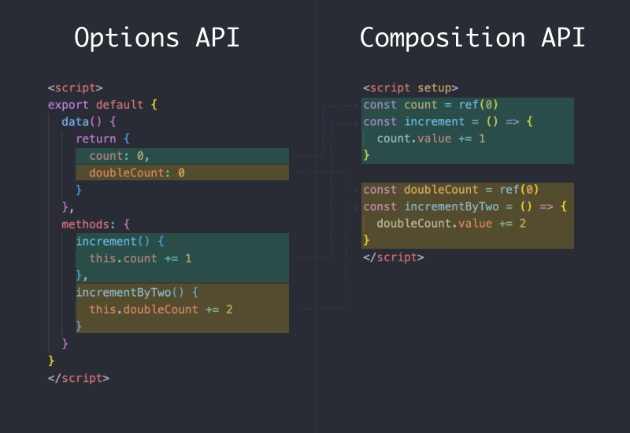

# 10. 組合式函式
  - `組合式函式 (Composables)` 為基於 `Vue 3 Composition API`，用來封裝、複用「`有狀態邏輯`」的函式
  - 將通用商業邏輯放在 `composables` 目錄，讓多個頁面共用
  - `Nuxt` 會自動載入 `composables` 裡的函式 (自動匯入)

## `Options API` 與 `Composition API`
  - ### 選項式 API (Options API)
    以 `data`、`methods` 等選項分類程式碼（Vue 2 常用），範例展示 `data()`、`methods` 使用與更新狀態的寫法。

    ```xml
    <script>
    export default {
      data() {
        return {
          count: 0,
          doubleCount: 0
        }
      },
      methods: {
        increment() {
          this.count += 1
        },
        incrementByTwo() {
          this.doubleCount += 2
        }
      }
    }
    </script>
    ```

  - ### 組合式 API (Composition API)
    以功能邏輯分組（把相關的 `data`、`computed`、`methods`、`watch` 集中在同一區塊），提高複雜元件的可讀性與維護性，並適合重構大型邏輯。

  - ### 比較視覺說明
    範例圖示說明用顏色把同一邏輯的程式碼集中，改善 `Options API` 分散問題。
    
    當使用 `Composition API` 重構後，同一個邏輯功能將會集中在同一個區塊，也使得複雜的元件能有更好的可讀性。

    

  - ### Mixins 與 Composables
    `Mixins` 在大型專案易產生命名衝突與耦合，`Composables` 基於 `Composition API` 提供更乾淨的重用方式，解決 `mixin` 的缺點。

## 組合式函式 (Composables)
  - ### 建立範例
    - 內容包含 `const count = ref(0)`、`increment()`，並回傳 `{ count, increment }`。

    首先，在 `./composables/useCounter.js` 建立預設函式，內容如下：
    
    ```js
    export default function () {
      const count = ref(0)

      const increment = () => {
        count.value += 1
      }

      return {
        count,
        increment
      }
    }
    ```


  - ### 使用範例
    - 在頁面 `./pages/count.vue` 使用：於 `<script setup>` 中呼叫 `const { count, increment } = useCounter()`，並在 `template` 綁定顯示與按鈕觸發。

    新增 `./pages/count.vue`，內容如下：
    ```xml
    <template>
      <div class="flex flex-col items-center">
        <span class="mt-8 text-4xl text-gray-700">{{ count }}</span>
        <button
          class="my-6 rounded-sm bg-sky-600 py-2 px-4 text-base font-medium text-white hover:bg-sky-700 focus:outline-none focus:ring-2 focus:ring-sky-500 focus:ring-offset-2"
          @click="increment"
        >
          增加 1
        </button>
      </div>
    </template>

    <script setup>
    const { count, increment } = useCounter()
    </script>
    ```

  - ### Nuxt 行為
    放在 `composables` 目錄下的常用函式會被 `Nuxt` 自動載入以供元件直接使用（免手動 `import`）。

## Composables 組合式函式的名稱
  - ### 1. 使用預設匯出 (Default export):
    若檔案採預設匯出，函式名稱由檔案名稱對應（可用 `camelCase` 或 `kebab-case`），例如 `useCounter.js` 或 `use-counter.js` → 使用時為 `useCounter()`。

    ```js
    export default function () {
      const count = ref(0)

      const increment = () => {
        count.value += 1
      }

      return {
        count,
        increment
      }
    }
    ```

  - ### 2. 使用具名匯出 (Named export):
    若使用具名匯出，組合式函式名稱以匯出的名稱為準（即非由檔名決定）。例如在 `count.js` 中 `export const useCounter = () => { ... }`，使用時為 `useCounter()`。

     ```js
    export const useCounter = () => {
      const count = ref(0)

      const increment = () => {
        count.value += 1
      }

      return {
        count,
        increment
      }
    }
    ```

  - ### 建議
    建立 `composables` 時以 `use` 為前綴以便識別。

## Composables 自動載入的規則
  - ### 預設行為
    `Nuxt` 會自動掃描 `composables` 目錄下的 `.js`、`.ts`、`.vue` 檔案，但僅「`最上層的檔案`」會自動成為可用的組合式函式。

    - #### 範例
      若目錄是 `composables/time/useDateFormat.js` 與 `composables/useCounter.js`，只有 `useCounter.js`（最上層）會自動載入。

      ```sh
      composables/
      ├── time/
      │   └── useDateFormat.js
      └── useCounter.js
      ```

      下列這種形式，`./composables/time/index.js` 也能正確的自動載入：
      ```sh
      composables/
      ├── time/
      │   └── index.js
      └── useCounter.js
      ```

  - ### 巢狀目錄載入
    - #### A. 重新匯出（推薦）
      在 `./composables/index.js` 中統一 `re-export`（將巢狀目錄函式匯出），使 `Nuxt` 可使用。
    
    - #### B. 配置掃描巢狀目錄
      在 `nuxt.config.ts` 調整 `imports.dirs`，例如：
      - `dirs: ['composables', 'composables/*/index.{ts,js,mjs,mts}', 'composables/**']`
      - 此配置可擴展自動掃描深層檔案與目錄模式。

      ```ts
      export default defineNuxtConfig({
        imports: {
          dirs: [
            // 掃描 composables 目錄頂層
            'composables',
            // 掃描深度一層的特定檔案
            'composables/*/index.{ts,js,mjs,mts}',
            // 掃描整個 composables 目錄下的檔案
            'composables/**'
          ]
        }
      })
      ```