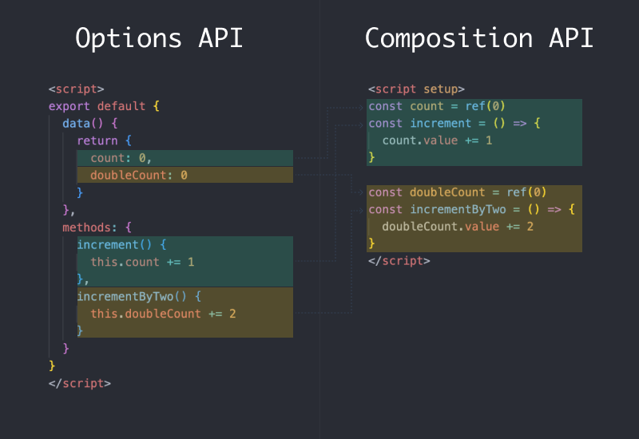

# 10. 組合式函式
  `組合式函式 (Composables)` 是一種利用 `Vue 3` 的 `Composition API` 來封裝和複用 `有狀態邏輯` 的函式，在 `Nuxt` 我們可以將一些通用的商業邏輯放置在 `composables` 來建立組合式函式，這樣一來就可以在各個頁面共用這個組合式函式。

## `Options API` 與 `Composition API`
  - ### 選項式 API (Options API)
    下列這段是 `Vue` 依據 `Options API` 撰寫出來的程式碼，也是 `Vue 2` 處理邏輯的寫法，所謂 Options (選項、可選的) 指的就是以程式碼的性質來分割程式碼，所有設定資料初始值的都會在 `data` 這邊處理，這個元件所需要的方法則會在 `methods` 這裡建立，`data` 及 `methods` 也就是使用者需要的 `選項`。

    ```xml
    <script>
    export default {
      data() {
        return {
          count: 0,
          doubleCount: 0
        }
      },
      methods: {
        increment() {
          this.count += 1
        },
        incrementByTwo() {
          this.doubleCount += 2
        }
      }
    }
    </script>
    ```

  - ### 組合式 API (Composition API)
    目前在 `Vue 3` 你仍可以繼續使用 `Vue 2` 的 `Options API`，但隨著程式碼邏輯的增加，看似有條理的分類，其實對於理解及維護上沒有想像中便利。`Vue 3` 提出的 `組合式 API (Composition API)` 則是以邏輯功能來進行分類，你可以將所有與某個功能的 `data`、`computed`、`methods` 與 `watch` 等，寫在同一個段落形成一個區塊。

    下圖中每種邏輯問題所需要得程式碼使用相同顏色表示，當使用 `Composition API` 重構後，同一個邏輯功能將會集中在同一個區塊，也使得複雜的元件能有更好的可讀性。

    

  - ### Mixins 與 Composables
    在 `Options API` 可以使用 `mixin` 來引入可以重複使用的程式碼，讓不同的元件可以共用函式方法，但隨著專案變大，同一個元件可能使用 `mixin` 同時來引用許多的共用函式，這將導致容易產生命名衝突、元件間的耦合與來源不夠清晰等問題。

    `Vue 3` 為我們帶來了 `組合式 API`，實現了更乾淨的程式碼編排與高效的邏輯重用，`組合式函式 (Composables)` 也基於 `組合式 API` 來進行封裝這些可複用的邏輯，更解決了使用 `mixin` 實現共用函式的缺點。

## 組合式函式 (Composables)
  在 `Nuxt 3` 中要建立一個 `組合式函式 (Composables)` 我們可以在 `composables` 目錄下編寫，這些常用的函式，將會被 `Nuxt 3` 自動載入做使用，實現在各個元件使用這些函式方法。

  - ### 建立組合式函式
    首先，我們新增 `./composables/useCounter.js`，內容如下：
    
    ```js
    export default function () {
      const count = ref(0)

      const increment = () => {
        count.value += 1
      }

      return {
        count,
        increment
      }
    }
    ```

    `Nuxt` 自動導入的特性，現在我們就能在其他元件中使用 `useCounter` 組合式函式。
    
    新增 `./pages/count.vue`，內容如下：
    ```xml
    <template>
      <div class="flex flex-col items-center">
        <span class="mt-8 text-4xl text-gray-700">{{ count }}</span>
        <button
          class="my-6 rounded-sm bg-sky-600 py-2 px-4 text-base font-medium text-white hover:bg-sky-700 focus:outline-none focus:ring-2 focus:ring-sky-500 focus:ring-offset-2"
          @click="increment"
        >
          增加 1
        </button>
      </div>
    </template>

    <script setup>
    const { count, increment } = useCounter()
    </script>
    ```

## Composables 組合式函式的名稱
  前面範例使用的 `useCounter()` 是 `Nuxt 3` 從 `./composables/useCounter.js` 自動載入的，而且 `Nuxt 3` 的組合式函式的名稱，有兩種方式會影響使用時的函式名稱，不過也建議在建立組合式函式可以使用 `use` 作為開頭來加以識別。

  - ### 1. 使用預設匯出 (Default export)
    如果在檔案內使用的是預設匯出，那麼這個組合式函式在使用時，即對應檔案名稱，檔案名稱可以是 `小寫駝峰式 (Camel case)` 或 `烤肉串 (Kebab case)`，例如建立 `./composables/useCounter.js` 或 `./composables/use-counter.js` 檔案內容如下，使用時組合式函式為 `小寫駝峰式(Camel case)` 名為 `useCounter`。

    ```js
    export default function () {
      const count = ref(0)

      const increment = () => {
        count.value += 1
      }

      return {
        count,
        increment
      }
    }
    ```

  - ### 2. 使用具名匯出 (Named export)
    如果建立組合式函式時，使用的是有具名的匯出，那麼 `組合式函式對應的名稱，就不是檔案名稱，而是檔案內 export 出來的名稱`。

    例如，建立 `./composables/count.js`，檔案內容如下，組合式函式名稱就不會是檔案名稱 `count`，而是具名導出的名稱 `useCounter`。

    ```js
    export const useCounter = () => {
      const count = ref(0)

      const increment = () => {
        count.value += 1
      }

      return {
        count,
        increment
      }
    }
    ```

## Composables 自動載入的規則
  `composables` 目錄下，`Nuxt 3` 會自動掃描 `.js`, `.ts` 與 `.vue` 副檔名的檔案，但只有 `最上層的檔案`，才會自動的被載入為組合式函式，以下面這個目錄結構為例，只有 `./composables/useCounter.js` 才會被正確的自動載入。

  ```sh
  composables/
  ├── time/
  │   └── useDateFormat.js
  └── useCounter.js
  ```

  下列這種形式，`./composables/time/index.js` 也能正確的自動載入：
  ```sh
  composables/
  ├── time/
  │   └── index.js
  └── useCounter.js
  ```

  如果你想讓巢狀的目錄結構下也能被 `Nuxt` 自動掃描載入，那麼你可以使用下面兩種方法：

  - ### A. 重新匯出 `[推薦]`
    配置 `./composables/index.js` 將目錄下的函式於這裡整理並匯出你需要的作為組合式函式。

  - ### B. 配置掃描巢狀目錄
    修改 `nuxt.config.ts` 檔案，配置自動載入額外掃描 `composables` 下的巢狀目錄。
    ```ts
    export default defineNuxtConfig({
      imports: {
        dirs: [
          // 掃描 composables 目錄頂層
          'composables',
          // 掃描深度一層的特定檔案
          'composables/*/index.{ts,js,mjs,mts}',
          // 掃描整個 composables 目錄下的檔案
          'composables/**'
        ]
      }
    })
    ```

## 小結
  不論在 `Nuxt 3` 或是 `Vue 3`，`組合式函式 (Composables)` 都是能幫助你在整個網站可以共用函式的方法，目前也有專案 `VueUse` 提供了常用與實用的組合式函式集合，能幫我們省去不少開發時間與提升重複使用性。