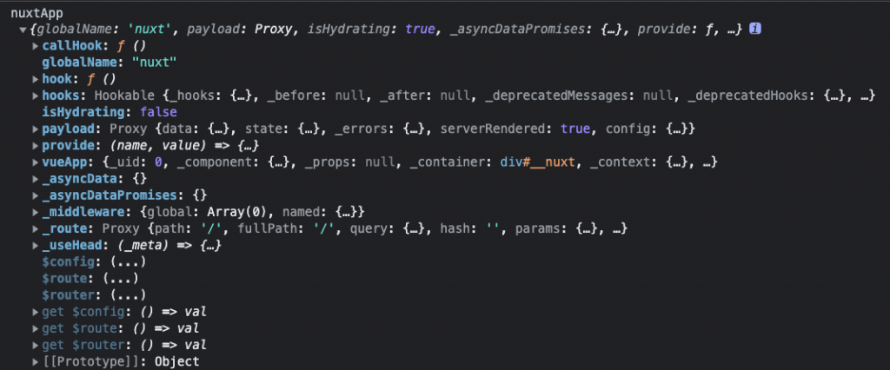
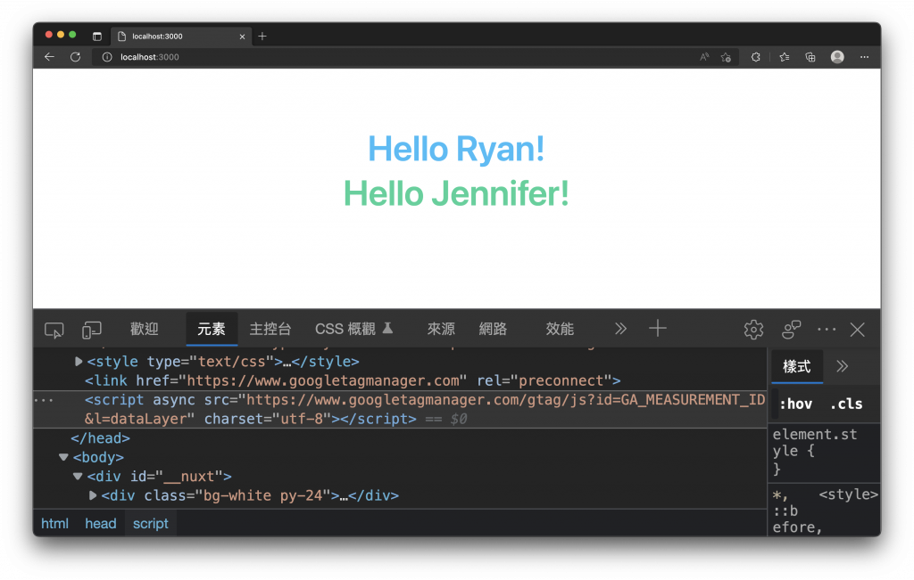
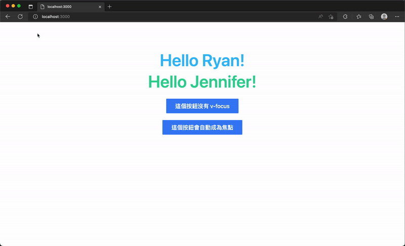

# 11. 插件 (Plugins)
  - #### 目的
    說明 `Nuxt 3` 插件 `(Plugins)` 的規則、特性，如何建立自訂插件，及如何在 `Nuxt 3` 中安裝／使用 Vue 插件。

  - #### 情境
    當第三方套件沒有 `Nuxt` 模組時，可用插件方式整合到 `Nuxt` 專案中。

## 插件 (Plugins)
  - ### Nuxt 3 插件目錄
    - `Nuxt` 會自動讀取專案根目錄下的 `plugins` 目錄，且自動載入該目錄中最上層的 `.js`、`.ts`、`.vue` 檔案，以及最上層目錄下的 `index.js`。
      - 例如，只有 `./plugins/myPlugin.js` 及 `./plugins/myPlugin/index.js` 會自動的被 `Nuxt` 載入。

    - 範例結構：
      ```sh
      plugins/
      ├── myPlugin/
      │   └── index.js
      └── myPlugin.js
      ```

    - 不需要在 `nuxt.config.ts` 逐一註冊這些檔案。

  - ### 如何建立插件
    - 使用 `defineNuxtPlugin` 預設導出，唯一參數為 `nuxtApp`，可以透過 `nuxtApp` 存取 `Nuxt` 與 `Vue` 實例
      ```js
      export default defineNuxtPlugin(nuxtApp => {
        // 可以使用 nuxtApp 來做一些事情
      })
      ```
    - 在初次建立時可印出 `nuxtApp` 觀察可用的實例（例如 `nuxtApp.vueApp` 可用來安裝 `Vue` 插件）。
      

  - ### 在插件中使用組合式函數 (Composables)
    - 可以在自訂插件中使用 `composables`，但有幾項限制與注意事項：
      - #### 插件的載入順序
        - 插件會依檔案載入順序被呼叫；若某個 `composable` 依賴尚未載入的插件，將會失效。除非能保證載入順序，否則避免在插件內依賴其他尚未載入的插件所提供的 `composable`。

      - #### 依賴 Vue 的生命週期
        - 若 `plugin` 中使用的 `composable` 需要在 `Vue` 元件生命週期上下文（如 `onMounted`）才能正確運作，直接在 `plugin` 裡使用可能失敗，因為 `plugin` 綁定在 `nuxtApp` 上，與元件實例的生命週期不同。

  - ### Automatically Providing Helpers
    - 插件可回傳 `provide` 物件，將 `helper` 掛載到 `NuxtApp` 實例上，並可在模板或組件中以 `$` 前綴使用：
      - 範例插件 `./plugins/myPlugin.js`：
        ```js
        export default defineNuxtPlugin(() => {
          return {
            provide: {
              hello: (msg) => `Hello ${msg}!`
            }
          }
        })
        ```

      - 使用方式（在元件或 `app.vue`）：
        ```xml
        <template>
          <div class="bg-white py-24">
            <div class="flex flex-col items-center">
              <h1 class="my-2 text-6xl font-semibold text-sky-400">{{ title }}</h1>
              <h1 class="my-2 text-6xl font-semibold text-emerald-400">{{ $hello('Jennifer') }}</h1>
            </div>
          </div>
        </template>

        <script setup>
        const { $hello } = useNuxtApp()
        const title = $hello('Ryan')
        </script>
        ```

      - 在 `template` 中可直接用 `{ {$hello('Jennifer')} }`

  - ### 僅限伺服器端或客戶端中使用
    若某插件只能在瀏覽器端或伺服器端使用，可透過檔名後綴控制：使用 `.client` 或 `.server` 後綴來限制載入環境（例如 `myPlugin.client.js`）。

## Vue 插件與指令
  - ### Nuxt 3 中使用 vue-gtag 插件
    - #### Step 1. 安裝套件
      ```sh
      npm install -D vue-gtag
      ```

    - #### Step 2. 建立 Nuxt 插件
      新增 `vue-gtag.client.js` 檔案，內容如下：
      ```js
      import { createGtag } from 'vue-gtag'

      export default defineNuxtPlugin((nuxtApp) => {
        nuxtApp.vueApp.use(
          createGtag({
            tagId: 'GA_MEASUREMENT_ID'
          })
        )
      })
      ```

    - #### 完成效果
      範例會自動在瀏覽器插入與設定相應的 `script`（確認為 `client-only`，故使用 .`client`）。

      

  - ### Nuxt 3 中建立 Vue 指令
    - 在 `plugin` 裡可透過 `nuxtApp.vueApp.directive` 註冊自定義指令（範例 `./plugins/directive.js`）
      ```js
      export default defineNuxtPlugin((nuxtApp) => {
        nuxtApp.vueApp.directive('focus', {
          mounted(el) {
            el.focus()
          },
          getSSRProps() {
            // you can provide SSR-specific props here
            return {}
          }
        })
      })
      ```

    - 使用方式：在模板上使用 `v-focus`，例如將按鈕自動聚焦。
      
      調整 `./app.vue` 內容：
      ```xml
      <template>
        <div class="bg-white py-24">
          <div class="flex flex-col items-center">
            <button
              v-focus
              class="mt-6 rounded-sm bg-blue-500 px-8 py-3 text-xl font-medium text-white hover:bg-blue-600 focus:outline-none focus:ring-2 focus:ring-blue-400 focus:ring-offset-2"
            >
              這個按鈕會自動成為焦點
            </button>
          </div>
        </div>
      </template>
      ```

      透過 `v-focus` 這個指令來控制元素聚焦的效果如下圖。
      

## 小結
  `Nuxt` 讓我們可以很輕鬆的建立插件並選擇配置於伺服器端或客戶端，對於使用 UI 框架或元件，更能在插件中直接取得實例來安裝 Vue 的插件與指令，不過呢，目前也有個 [RFC](https://github.com/nuxt/framework/discussions/1175) 正在徵求意見期待讓 `Nuxt` 使用 `Vue` 插件可以更方便容易。