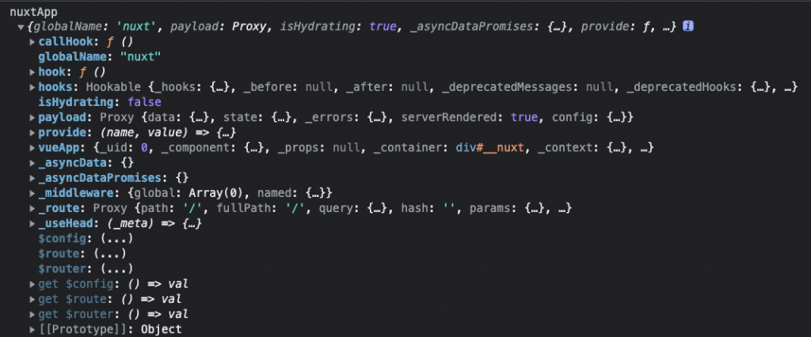
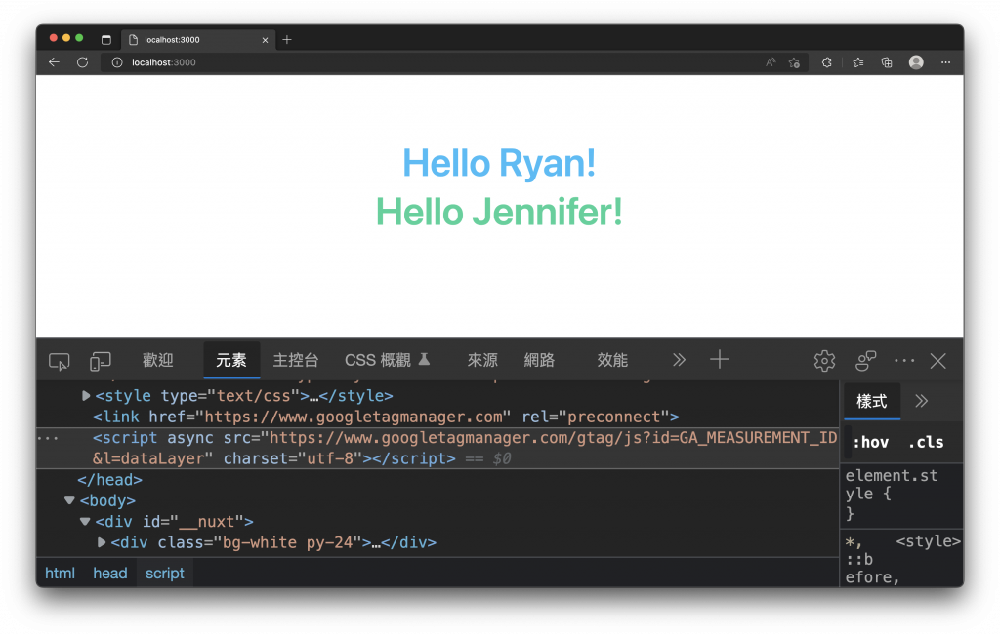

# 11. 插件 (Plugins)
  在開發時，為了不重複造輪子，我們可能會在網路上找看看有沒有現成的套件可以做使用，如果這個套件在 `Nuxt 3` 沒有專用的模組或插件，那麼我們就只能依照套件的支援與安裝方式嘗試添加至 `Nuxt` 中使用。這篇文章將會介紹在 `Nuxt` 插件的規則與特性，如何建立自己的插件及安裝 `Vue` 的插件。

## 插件 (Plugins)
  說到 `插件 (Plugins)`，Chrome 或 Firefox 等瀏覽器的使用者，一定都聽過也安裝過插件；如果瀏覽器中的功能不夠滿足你的需求，那麼你可以透過安裝插件來嘗試解決你的問題，而插件做的就是幫助你的瀏覽器或是網站，添加一些功能或是配置，做一個擴充的動作。在 `Nuxt 3` 指的插件，道理也是一樣的，我們可以透過插件來協助我們擴充功能。

  - ### Nuxt 3 插件目錄
    `Nuxt` 將自動讀取 `plugins` 目錄中的檔案並自動載入它們，也因為目錄中的所有插件都是自動載入的，因此不必於 `nuxt.config.ts` 中再個別配置。

    `Nuxt` 會自動掃描 `plugins` 目錄下的 `.js`, `.ts` 與 `.vue` 副檔名的檔案，但只有最上層的檔案或最上層目錄下的 `index.js` 檔案才會被自動載入。

    例如，只有 `./plugins/myPlugin.js` 及 `./plugins/myPlugin/index.js` 會自動的被 `Nuxt` 載入。

    ```sh
    plugins/
    ├── myPlugin/
    │   └── index.js
    └── myPlugin.js
    ```

  - ### 如何建立插件
    當您建立好插件的檔案後，只需要使用預設導出 `Nuxt 3` 中的 `defineNuxtPlugin` 方法，傳遞給插件的唯一參數是 `nuxtApp`，接著就可以在裡頭實作功能。

    ```js
    export default defineNuxtPlugin(nuxtApp => {
      // 可以使用 nuxtApp 來做一些事情
    })
    ```

    初次建立插件時，可以嘗試印出 `nuxtApp` 參數看看，如下圖， `nuxtApp` 包含了各種的 `實例 (Instance)`，例如我們要使用 `Vue` 的 `app.use`，就可以在 `nuxtApp` 找到 `Vue` 的實例 `vueApp`，並透過 `nuxtApp.vueApp.use` 來安裝 `Vue` 的插件。

    

  - ### 在插件中使用組合式函數 (Composables)
    你也可以在自定義的插件中使用組合式函數，但在插件中存在著一些限制和差異。

    - #### 插件的載入順序
      插件是依照順序來呼叫的，如果你使用的組合式函數，依賴著尚未載入的插件，它將無法正常的執行；除非你很確定插件的載入順序，不然儘量不在插件內使用其他會依賴插件或由其他插件所提供的組合式函數。

    - #### 依賴 Vue 的生命週期
      如果插件內所使用的組合式函數，依賴於 `Vue` 的生命週期，那麼也會無法正常的執行，因為插件只會綁定到 `nuxtApp` 的實例上，與 `Vue` 元件內使用組合式函數綁定的元件實例，有所不同。

  - ### Automatically Providing Helpers
    如果想在 `NuxtApp` 的實例上提供 `helper`，我們可以在插件回傳的物件中添加 `provide`。

    例如，我們建立一個插件 `./plugins/myPlugin.js`，內容如下：
    ```js
    export default defineNuxtPlugin(() => {
      return {
        provide: {
          hello: (msg) => `Hello ${msg}!`
        }
      }
    })
    ```

    調整 `./app.vue` 內容：
    ```xml
    <template>
      <div class="bg-white py-24">
        <div class="flex flex-col items-center">
          <h1 class="my-2 text-6xl font-semibold text-sky-400">{{ title }}</h1>
          <h1 class="my-2 text-6xl font-semibold text-emerald-400">{{ $hello('Jennifer') }}</h1>
        </div>
      </div>
    </template>

    <script setup>
    const { $hello } = useNuxtApp()
    const title = $hello('Ryan')
    </script>
    ```

    我們就可以直接在 `template` 中使用 `$hello`，這個由插件提供的 `Helper`，注意這邊要加上錢字符號 $。也可以透過 `useNuxtApp` 方法取得 `NuxtApp` 的實例後再使用 `$hello`。

  - ### 僅限伺服器端或客戶端中使用
    有些插件可能只能在瀏覽器中使用，原因可能是這個插件不需要或無法在伺服器端中執行。

    我們可以透過插件的檔案名稱來添加後綴 `.client` 或 `.server`，控制伺服器端或客戶端中使用。

## Vue 插件與指令
  這裡我們嘗試在 `Nuxt 3` 中使用 `Vue` 的 `vue-gtag` 插件，來添加 `Google` 分析標籤。

  - ### Nuxt 3 中使用 vue-gtag 插件
    - #### Step 1. 安裝套件
      ```sh
      npm install -D vue-gtag
      ```

    - #### Step 2. 建立 Nuxt 插件
      新增 `vue-gtag.client.js` 檔案，內容如下：
      ```js
      import VueGtag from 'vue-gtag'

      export default defineNuxtPlugin((nuxtApp) => {
        nuxtApp.vueApp.use(VueGtag, {
          property: {
            id: 'GA_MEASUREMENT_ID'
          }
        })
      })
      ```

    - #### 完成效果
      可以看見瀏覽器就出現使用 `vue-gtag` 插件，幫我們自動插入與配置 `script` 的效果囉！

      

  - ### Nuxt 3 中建立 Vue 指令
    在插件中可以取得 `Vue` 的實例，所以我們也能在插件註冊自定義的指令。

    例如，新增 `./plugins/directive.js` 檔案，內容如下：
    ```js
    export default defineNuxtPlugin((nuxtApp) => {
      nuxtApp.vueApp.directive('focus', {
        mounted(el) {
          el.focus()
        },
        getSSRProps() {
          // you can provide SSR-specific props here
          return {}
        }
      })
    })
    ```

    我們就可以直接使用 `v-focus` 這個指令，並添加在元件中，調整 `./app.vue` 內容：

    ```xml
    <template>
      <div class="bg-white py-24">
        <div class="flex flex-col items-center">
          <button
            v-focus
            class="mt-6 rounded-sm bg-blue-500 px-8 py-3 text-xl font-medium text-white hover:bg-blue-600 focus:outline-none focus:ring-2 focus:ring-blue-400 focus:ring-offset-2"
          >
            這個按鈕會自動成為焦點
          </button>
        </div>
      </div>
    </template>
    ```

    透過 `v-focus` 這個指令來控制元素聚焦的效果如下圖。
    

## 小結
  `Nuxt` 讓我們可以很輕鬆的建立插件並選擇配置於伺服器端或客戶端，對於使用 UI 框架或元件，更能在插件中直接取得實例來安裝 Vue 的插件與指令，不過呢，目前也有個 [RFC](https://github.com/nuxt/framework/discussions/1175) 正在徵求意見期待讓 `Nuxt` 使用 `Vue` 插件可以更方便容易。
