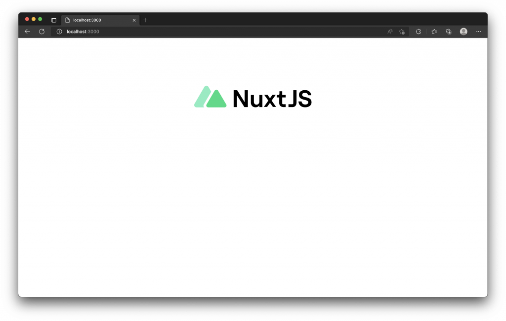

# 12. 模組 (Modules)
  - #### 目的
    比較 Nuxt `模組（Modules）`與 `插件（Plugins）`，說明模組的使用情境與延伸能力。
  - #### 情境
    當需簡化跨專案、繁瑣或需在啟動/建構時改寫環境的整合時，建議使用模組。

## 模組 (Modules)
  - #### 定義
    `Nuxt` 模組通常為導出一個非同步函式的 JS 檔，可在 `Nuxt` 啟動階段執行，擴充框架行為。

  - #### 安裝配置
    在 `nuxt.config.ts` 的 `modules` 陣列加入模組名稱、相對路徑或 `[path, options]`
    - 例如 [配置 Nuxt Tailwind 模組](https://ithelp.ithome.com.tw/articles/10294705) 會添加上` '@nuxtjs/tailwindcss'`。

      通常模組的開發人員會提供這些模組應該如何在 `modules` 屬性來做配置，甚至一些可選用的參數來配置這些模組。

      ```js
      export default defineNuxtConfig({
        modules: [
          // 使用套件名稱 (推薦使用)
          '@nuxtjs/example',

          // 載入本地目錄的模組
          './modules/example',

          // 添加模組的選項參數
          ['./modules/example', { token: '123' }]

          // 在行內定義模組
          async (inlineOptions, nuxt) => { }
        ]
      })
      ```
      
  - #### 能力
    模組載入時間早於 `plugin`，能在 `nuxi dev` / `nuxi build` 階段`修改模板`、`加入元件`、`設定 runtime`、`調整 bundler` 等。

  - ### Nuxt 3 中插件與模組的差異
    - ##### 載入順序
      `模組` 在 `Nuxt` 啟動時最先載入並執行；`插件` 在模組與 `Nuxt` 環境建立之後才執行。

    - ##### 使用情境
      - ###### 模組
        整合第三方工具、全域封裝、建立元件/runtime、在 build/dev 階段調整行為。
      - ###### 插件
        在已建立的 `NuxtApp` / `Vue instance` 上注入功能、註冊指令或安裝 Vue 插件。

    - ##### 結論
      `模組` 能做較重、需在啟動或建構時處理的工作；`插件` 適合在執行時操作 Vue/Nuxt 實例。

## Nuxt 3 模組列表
  你可以在 [Explore Nuxt Modules](https://modules.nuxtjs.org/) 上尋找由 `Nuxt` 官方或社群生態所發展建置的模組，`Nuxt` 的模組通常遵循著官方指南所製，使用時只需要安裝與添加至 `nuxt.config` 中，基本上就能完成配置。

  - ### 使用 Nuxt Icon 模組
    - #### Step 1（安裝）
      ```sh
      npm install -D nuxt-icon
      ```

    - #### Step 2（配置）
      在 `nuxt.config.ts` 中加入：
      ```ts
      export default defineNuxtConfig({
        modules: ['nuxt-icon']
      })
      ```

    - #### Step 3（使用）
      - 模組會提供全域元件 `Icon`，範例：
        ```xml
        <template>
          <div class="flex justify-center">
            <Icon name="logos:nuxt" size="360" />
          </div>
        </template>
        ```
        
    - #### 說明
      `Nuxt Icon` 整合 `Iconify`，提供大量圖示，安裝後直接透過模組暴露的元件使用。

## 如何建立 Nuxt 模組
  - #### 建議工具
    使用 `Nuxt Kit（@nuxt/kit`）來建立模組。

  - #### 範例骨架
    通常如下程式碼使用 `defineNuxtModule` 方法來建立一個模組：
    ```js
    import { defineNuxtModule } from '@nuxt/kit'

    export default defineNuxtModule({
      meta: {
        // 模組的名稱，通常也會對應 NPM 發布的套件名稱
        name: '@nuxtjs/example',
        // 如果有配置這個模組的一些選項，會將其保存在這個設定鍵值下
        configKey: 'sample',
        // 相容性限制 `nuxt.config`
        compatibility: {
          // 為了控制模組的版本相容性，通常會在這裡配置 Nuxt 版本的需求
          nuxt: '^3.0.0'
        }
      },
      // 模組預設的選項
      defaults: {},
      hooks: {},
      async setup(moduleOptions, nuxt) {
        // Nuxt 啟動載入模組後，模組所執行的邏輯會在這裡實作
      }
    })
    ```
  - #### 要點
    - `meta` 提供模組名稱、設定鍵與相容性；
    - `setup` 為模組載入後的執行點，可呼叫 `addComponent`、`extendVite`、`addPlugin` 等 `Nuxt kit API`。

  更多 `Nuxt` 模組的建立指南可以參考 [Nuxt 3 - Module Author Guide](https://v3.nuxtjs.org/guide/going-further/modules)，這邊就不再贅述，畢竟我們比較常為模組的使用者。

## 模組的載入
  - #### 實作位置
    模組會在 `module.ts` (或 `src/module.ts`) 定義 `defineNuxtModule`，並在 `setup` 中呼叫 `kit API`。

  - #### 範例片段（摘自 Nuxt Icon）
     ```js
    export default defineNuxtModule<ModuleOptions>({
      meta: {
        name: 'nuxt-icon',
        configKey: 'icon',
        compatibility: {
          nuxt: '^3.0.0-rc.9'
        }
      },
      defaults: {},
      setup (_options, nuxt) {
        const { resolve } = createResolver(import.meta.url)

        addComponent({
          name: 'Icon',
          global: true,
          filePath: resolve('./runtime/Icon.vue')
        })
      }
    })
    ```

  - #### 效果
    模組可自動註冊元件（如 Icon）、提供 runtime 檔案、並讀取模組設定。

## 小結
  - #### 重點回顧
    - 模組與插件在載入時間與能力上不同：`模組` 早期載入且能影響 build/run 流程；`插件` 於 `NuxtApp/Vue instance` 可用時注入功能。
    - 若套件已有 `Nuxt` 模組，使用模組可省去繁瑣配置；否則可用插件在 `Nuxt` 中包裝第三方 Vue 插件。