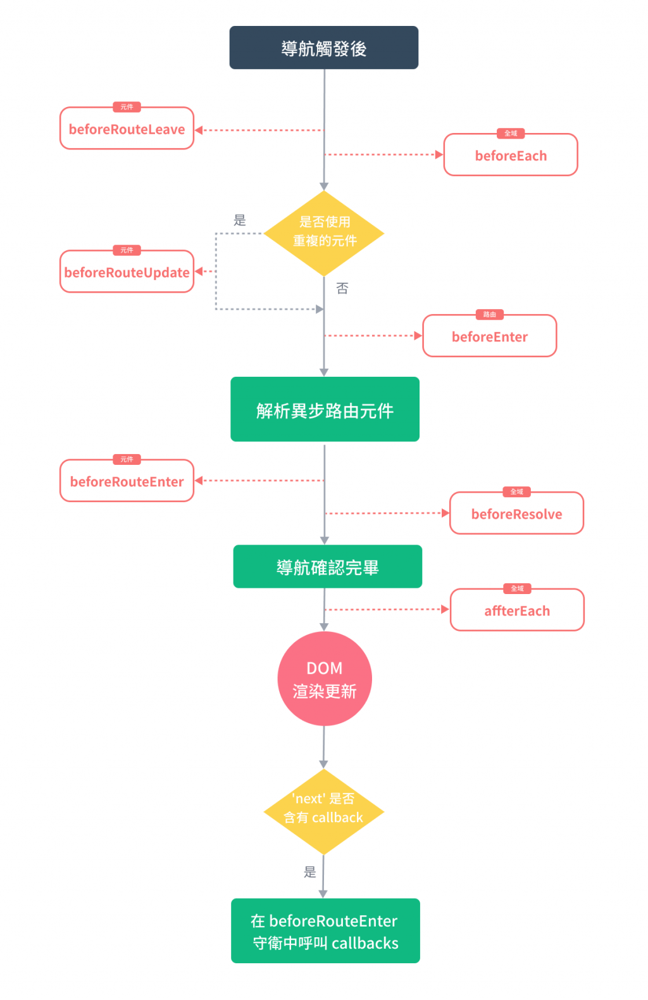
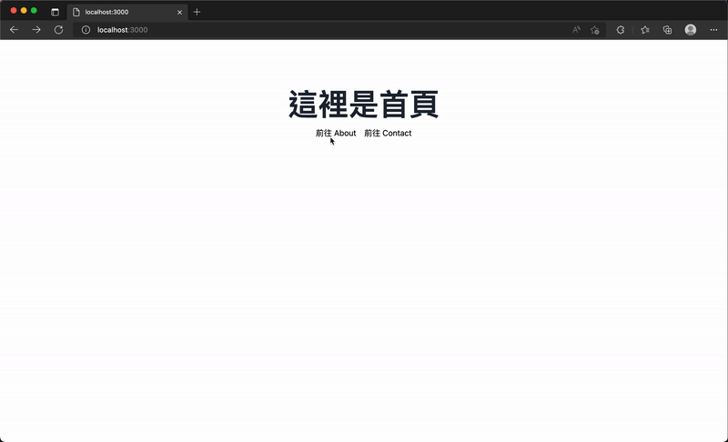
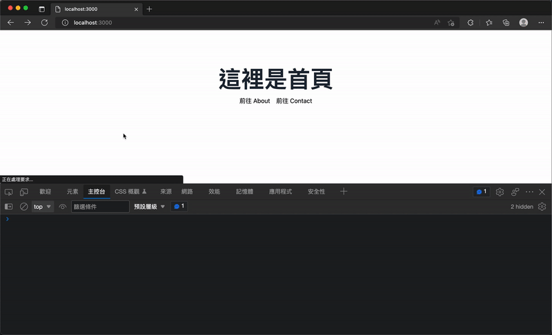

# 13. 中間件目錄 (Middleware Directory)
  - #### 目的
    介紹 `Nuxt 3` 的路由 `中間件（middleware）`，說明如何在 `Nuxt` 中實作類似 `Vue Router` 的導航守衛（Navigation Guards）。

  - #### 注意
    `路由中間件` 與 `伺服器端（Nitro）中間件` 不同，名稱相似但執行時機與用途不同。

## Vue Router 的導航守衛 (Navigation Guards)
  - ### 全域守衛（Global）
    - #### 全域前置守衛 (Global Before Guards)
      使用 `router.beforeEach()`，在進入任一路由前執行，為異步流程，會在所有守衛 `resolve` 前保持 `pending` 狀態。

    - #### 全域解析守衛 (Global Resolve Guards)
      `router.beforeResolve()`，在元件內守衛與路由解析完後再執行，時間點晚於 `beforeEach`。

    - #### 全域後置 Hooks (Global After Hooks)
      `router.afterEach()`，在路由跳轉完成後觸發，常用於分析或更新 UI 顯示。

  - ### 路由獨有守衛 (Per-Route Guard)
    每個路由可定義 `beforeEnter()`，僅在該路由發生導航時觸發。

  - ### 元件內的守衛 (In-Component Guards)
    在元件的內部中，也提供三種 `hooks` 分別為：
    - #### `beforeRouteEnter()`
      在路由進入並渲染這個元件之前呼叫，所以還沒有元件的實體可以操作使用。

    - #### `beforeRouteUpdate()`
      目前的路由改變，而且還處於同一個元件中時呼叫。

    - #### `beforeRouteLeave()`
      當導航準備離開時且沒有使用到這個元件時呼叫。

    `導航守衛 (Navigation Guards)` 在導航出發後的 hook 觸發順序如下圖：

    

## Nuxt 3 路由中間件
  `Nuxt 3` 中提供了一個路由中間件的框架，我們可以在專案下建立名為 `middleware` 目錄，在這個目錄下我們可以建立中間件，並讓整個 `Nuxt` 頁面或特定的路由做使用，也可以在頁面中添加，這個中間件可以理解為 `Vue Router` 中的 `導航守衛 (Navigation Guards)`，同樣有 `to` 與 `from` 參數用以在導航至特定路由之前驗證權限或執行商業邏輯等。

  - ### 路由中間件格式
    在 `middleware` 目錄下建立檔案，並預設導出 `defineNuxtRouteMiddleware()` 的函數，接受 `to` 與 `from` 參數：

    ```js
    export default defineNuxtRouteMiddleware((to, from) => {
      if (to.params.id === '1') {
        return abortNavigation()
      }
      return navigateTo('/')
    })
    ```

  - ### 路由中間件的回傳
    - #### navigateTo(to, options)
      用於重定向，可在伺服器端設定 HTTP 狀態碼（options.redirectCode，例如 301 或 302）。

      `navigateTo` 參數依序為：
      - `to`: `RouteLocationRaw | undefined | null`
      - `options`: `{ replace: boolean, redirectCode: number, external: boolean }`

    - #### abortNavigation(err)
      中止導航，可回傳錯誤訊息或錯誤物件。

      `abortNavigation` 參數為：
      - `err?`: `string | Error`

    - 若中間件不回傳任何東西，表示不阻塞導航；若有多個中間件則繼續執行下一個。


    - `nothing` - 不阻塞導航並且會移動到下一個中間件功能，如果有的話，或者完成路由導航 `return navigateTo('/')` 或 `return navigateTo({ path: '/' })` - 重定向到給定路徑，

    - 如果使用 `navigateTo()` 重定向是發生在伺服器端，則將 `HTTP Status Code` 設置為 `暫時` 重定向狀態碼 `302 Found`。

    - 如果使用 `navigateTo()` 並夾入 `options.redirectCode` 屬性，例如 `return navigateTo('/', { redirectCode: 301 })`，發生的重定向在伺服器端，將 `HTTP Status Code` 設置為 `永久` 重定向狀態碼 `301 Moved Permanently`。

  - ### 路由中間件的種類
    在 `Nuxt` 中路由中間件分為以下三種：

    - #### 匿名/行內的路由中間件
      可在頁面用 `definePageMeta()` 直接定義匿名的 `defineNuxtRouteMiddleware()`，不需建立檔案。

      例如，直接定義一個匿名的中間件在頁面元件中使用：
      ```xml
      <script setup>
      definePageMeta({
        middleware: defineNuxtRouteMiddleware(() => {
          console.log(`[匿名中間件] 我是直接定義在頁面內的匿名中間件`)
        })
      })
      </script>
      ```

    - #### 具名的路由中間件
      放在 `middleware` 目錄下的檔案，以 `kebab-case` 命名，並在頁面用 `definePageMeta({ middleware: 'random-redirect' })` 指定。可傳入陣列使用多個中間件。

      例如，建立一個 `./middleware/random-redirect.js` 中間件檔案：
      ```js
      export default defineNuxtRouteMiddleware(() => {
        if (Math.random() > 0.5) {
          console.log(`[來自 random-redirect 中間件] 重新導向至 /haha`)
          return navigateTo('/haha')
        }

        console.log(`[來自 random-redirect 中間件] 沒發生什麼特別的事情～`)
      })
      ```

      當我們要使用這個中間件時，可以在頁面中使用 `definePageMeta()` 並傳入 `middleware` 屬性，來添加路由中間件。
      ```xml
      <script setup>
      definePageMeta({
        middleware: 'random-redirect'
      })
      </script>
      ```

      如果中間件有多個，你也可以使用陣列來傳入多個中間件，並且會依序執行這些路由中間件。
      ```xml
      <script setup>
      definePageMeta({
        middleware: ['random-redirect', 'other']
      })
      </script>
      ```

      當我們在頁面中添加這個中間件後，在切換到這個路由頁面時，約有一半的機會，會被導航至 `/haha` 頁面。
      

    - #### 全域的路由中間件
      在檔名後綴 `.global`（如 `auth.global.js`）即會自動載入並在每次導航時執行。
      
      例如，我們建立一個 `./middleware/always-run.global.js` 中間件檔案，內容如下：
      ```js
      export default defineNuxtRouteMiddleware((to, from) => {
        console.log(`[全域中間件] to: ${to.path}, from: ${from.path}`)
      })
      ```

      這個全域的路由中間件，將會在每一次導航切換頁面時執行。
      

  - ### 動態添加路由中間件
    可在 `plugin` 中使用 `addRouteMiddleware()` 手動添加具名或全域中間件
    
    ```js
    export default defineNuxtPlugin(() => {
      addRouteMiddleware('global-test', () => {
        console.log('這個是由插件添加的全域中間件，並將在每次路由變更時執行')
      }, { global: true })

      addRouteMiddleware('named-test', () => {
        console.log('這個是由插件添加的具名中間件，並將會覆蓋任何現有的同名中間件')
      })
    })
    ```

    - 注意: `Nuxt` 的路由中間件是針對頁面導航（`client`/`server`）執行，與 `Nitro server-side middleware`（伺服器啟動時執行）不同。

## 小結
  - `Nuxt` 提供易用的中間件機制，可實作路由守衛功能（權限驗證、重導向或阻止導航）。
  - 支援匿名、具名與全域中間件，也能動態在 `plugin` 中新增。
  - 中間件可以回傳 `navigateTo` 或 `abortNavigation` 來控制導航流。