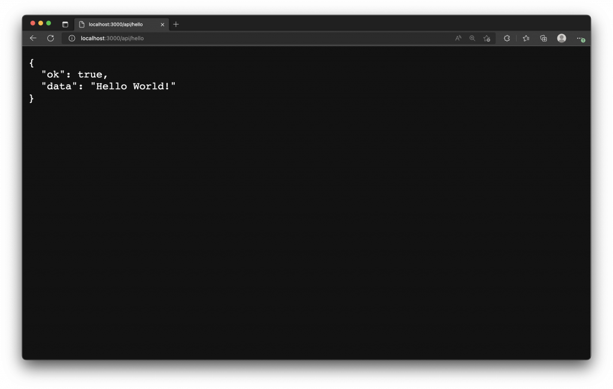
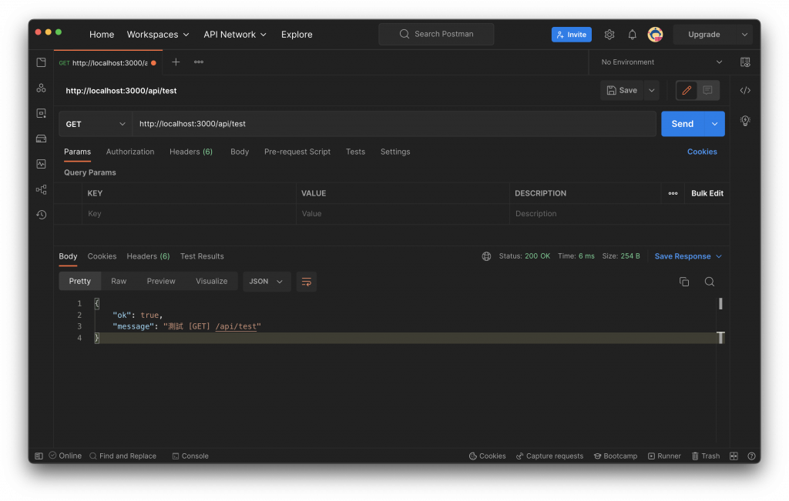
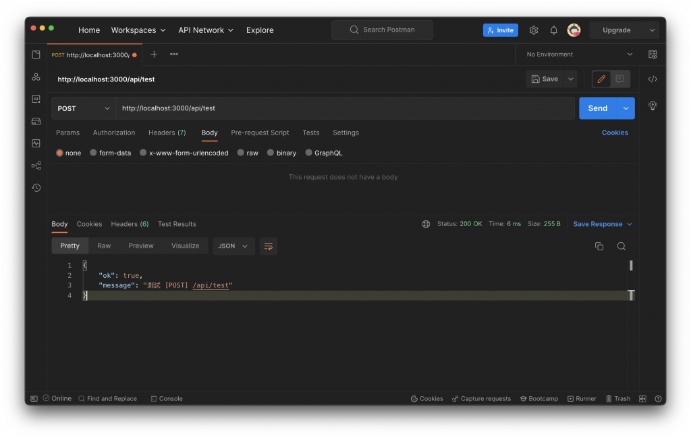
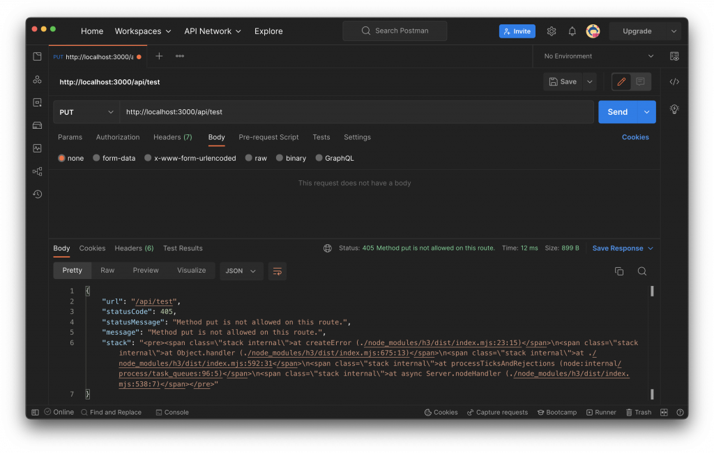
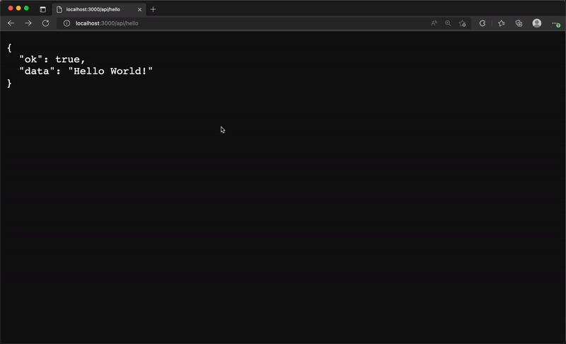
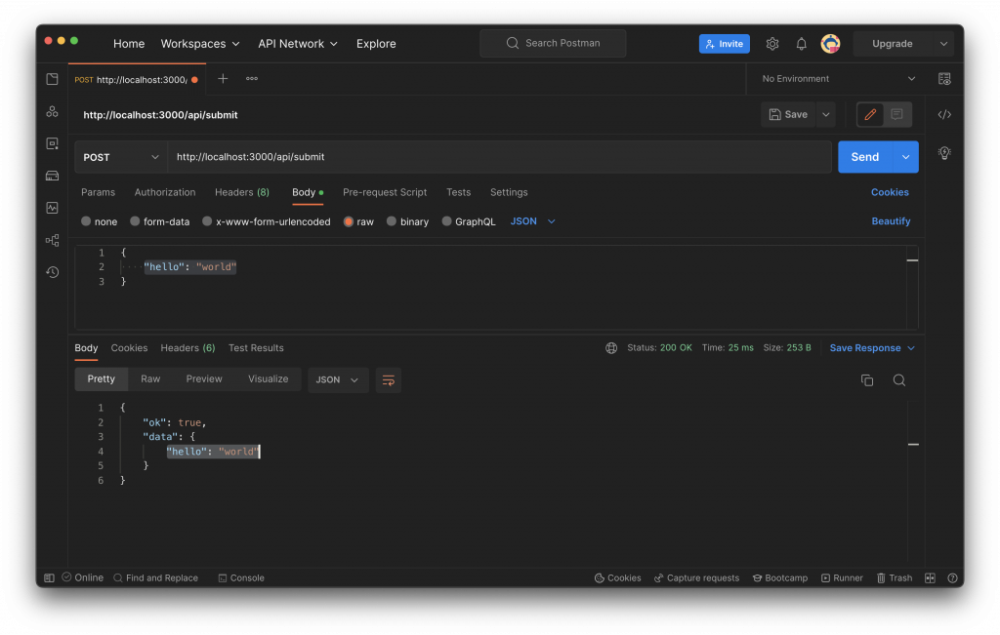
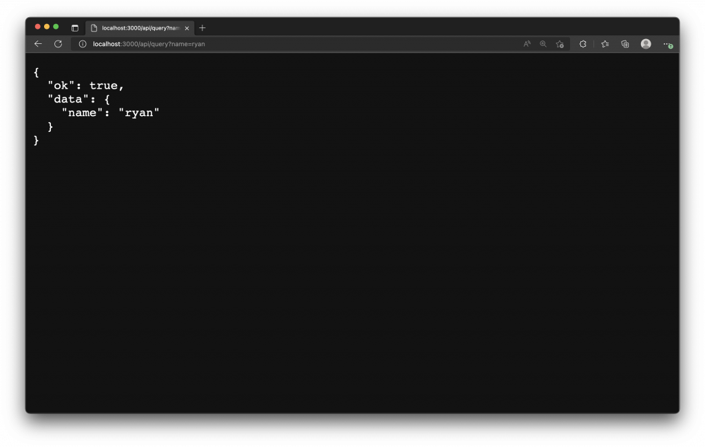
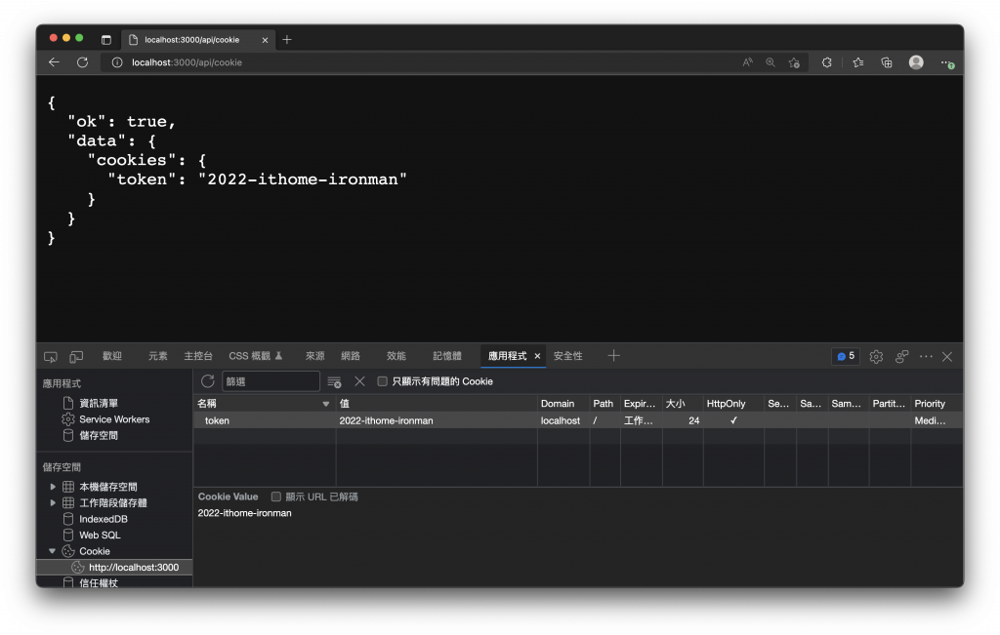

# 14. Server API 與 Nitro Engine
  `Nitro` 是 `Nuxt 3` 的伺服器引擎，支援跨平台與 API 路由，可在 `Nuxt` 上直接開發後端邏輯或與資料庫互動，回傳結果給前端。

## Nitro Engine
  - #### Nitro 定義
    [Nitro](https://github.com/unjs/nitro) `伺服器引擎 (Server Engine)` 基於 `rollup` 與 [h3](https://github.com/unjs/h3) 的最小 `HTTP 框架`，目標為高效能與可移植性

  - ### 快速的開發體驗
    開箱即用，支援 `hot module reloading (HMR)`，存檔即可載入新的伺服器邏輯。

  - ### 基於檔案的路由
    自動載入伺服器目錄與路由，依檔案結構產生路由。

  - ### 可移植且便攜
    建構後的 `.output` 不需 `node_modules`，使部署更輕便。

  - ### 混合模式 (Hybrid mode)
    支援部分頁面預渲染成靜態、部分動態由伺服器或客戶端渲染，可配合快取規則與 `無伺服器(Serverless)` 部署，實現混合渲染([Hybrid Rendering](https://v3.nuxtjs.org/guide/concepts/rendering#hybrid-rendering))。

  建議參考文件：[Nuxt 3 - Server Engine](https://v3.nuxtjs.org/guide/concepts/server-engine)、[Nitro 官方文件](https://nitro.unjs.io/)。

## Nuxt 3 的 Server 目錄
  在專案根目錄下 `server` 目錄可建立支援 `HMR` 的 `Server API` 與後端處理。
  
  `server` 目錄 常見子目錄：`api`、`routes`、`middleware`、`plugins` 等。

  - #### api
    - 放在 `./server/api` 下的檔案會被 `Nuxt` 自動載入並產生以 `/api` 為前綴的路由。
    - 範例：建立 `./server/api/hello.js`，即可對應 `/api/hello`。

  - #### routes
    - 將檔案放於 `./server/routes`，則路由不會有 `/api` 前綴
    - 例如 `./server/routes/world.js` 會對應 `/world`。

  - #### middleware
    - `./server/middleware` 內的檔案會被加入為「伺服器中間件」，在每個 `Request` 進入伺服器 API 路由前執行（注意：`pages` 頁面路由不會執行伺服器中間件）。
    - 用途：檢查/擴展請求物件、記錄請求、檢查 headers 等。中間件不應該直接回傳內容或中斷請求（但可 `拋錯`）。

  - ### 建立第一個伺服器 API
    - `Nuxt` 會自動掃描 `server` 目錄中的檔案結構，建立 `Server API` 時通常以 `.js` 或 `.ts` 作為副檔名，並依照官方建議，每個 `server` 檔案預設匯出 `defineEventHandler()`，`handler` 接收 `event` 參數用來解析請求資料。

    - `handler` 可回傳`字串`、`JSON`、`Promise`，或使用 `event.res.end()` 送出回應。
    
    - 舉例來說，我們建立一個檔案 `./server/api/hello.js`，內容如下：
      ```js
      export default defineEventHandler(() => {
        return {
          ok: true,
          data: 'Hello World!'
        }
      })
      ```

    - 訪問範例：啟動開發伺服器後可透過 http://localhost:3000/api/hello 訪問。

    - 訪問該路由，看見回傳的 JSON 資料。
      

  - ### 伺服器路由
    - #### 基於檔案的路由
      `server/api` 下會自動依檔案系統產生路由；若不想有 `/api` 前綴，改放 `server/routes`。

      舉例來說，以下的檔案結構會產生兩個可以訪問的伺服器 API 路由，分別為 `/api/hello` 及 `/routes/world`。

      ```sh
      nuxt-app/
      └── server/
          ├── api/
          │   └── hello.js
          └── routes/
              └── world.js
      ```

    - #### 匹配路由參數
      檔名使用中括號 `[]`，例如 `./server/api/hello/[name].js`，在 `handler` 使用 `event.context.params` 取得 `name`：

      ```js
      export default defineEventHandler((event) => {
        const { name } = event.context.params
        return `Hello, ${name}!`
      })
      ```

      在 `handler` 內就能使用 `event.context.params` 來訪問 `name` 路由參數。
      

    - #### 匹配 HTTP 請求方法 (HTTP Request Method)
      可在檔名後加 `.get`、`.post`、`.put`、`.delete` 等後綴，例如：
      - `server/api/test.get.js` 處理 `GET`
      - `server/api/test.post.js` 處理 `POST`

      新增 `server/api/test.get.js`，內容如下：
      ```js
      export default defineEventHandler(() => {
        return {
          ok: true,
          message: '測試 [GET] /api/test'
        }
      })
      ```

      新增 `server/api/test.post.js`，內容如下：
      ```js
      export default defineEventHandler((event) => {
        return {
          ok: true,
          message: '測試 [POST] /api/test'
        }
      })
      ```

      我們使用 [Postman](https://www.postman.com/) 來打這兩隻 API，可以看到使用不同的 `HTTP Request Method`，就會匹配至對應後綴檔案中的 `handler` 進行處理。

      - `[GET] /api/test`
        

      - `[POST] /api/test`
        

      - 若請求方法未被匹配，會回傳 `HTTP 405 Method Not Allowed`。
        
      
    - #### 匹配包羅萬象的路由 (Catch-all Route)
      使用 `[…].js` 捕捉任意層級路由，例如 `./server/api/catch-all/[…].js` 可匹配 `/api/catch-all/x/y` 等；同理 `./server/api/[…].js` 可接手 `/api` 下所有未匹配路由。範例 `handler` 可回傳 `event.path` 相關資訊。

      例如，建立 `./server/api/catch-all/[…].js`，將可以匹配 `/api/catch-all/x`、`/api/catch-all/x/y` 等 `/catch-all` 下所有層級的路由。

      ```js
      export default defineEventHandler((event) => {
        return {
          ok: true,
          data: {
            url: event.path
          },
          message: '/api/catch-all 下不匹配的路由都會進入這裡'
        }
      })
      ```

      建立 `./server/api/[…].js` 檔案如下，將可以接手所有 `/api` 下無法匹配的路由。
      ```js
      export default defineEventHandler((event) => {
        return {
          ok: true,
          data: {
            url: event.path
          },
          message: '/api 下不匹配的路由都會進入這裡'
        }
      })
      ```

      下圖示範中，當我們輸入的路由如果沒有辦法處理，將會被 `[...].js` 所匹配，以此我們可以來實作返回、重新導向或錯誤頁面。
      

  - ### 伺服器中間件
    - `Nuxt` 會自動載入 `./server/middleware`，並添加至伺服器中間件，在每個進入伺服器 API 的 `Request` 前執行。

    - 中間件範例 — 記錄 Request
      舉理來說，你可以新增 `./server/middleware/log.js` 用來記錄每個請求的 `URL`。
      ```js
      export default defineEventHandler((event) => {
        console.log('New request: ' + event.path)
      })
      ```

    - 中間件範例 — 擴展請求上下文
      或者，新增 `./server/middleware/auth.js` 用來解析請求或擴展請求物件。
      ```js
      export default defineEventHandler((event) => {
        event.context.auth = { username: 'ryan' }
      })
      ```

      > 伺服器中間件的處理邏輯，不應該回傳任何內容，也不應中斷或直接回應請求，伺服器中間件應該僅檢查、擴展請求上下文或直接拋出錯誤。

  - ### 伺服器插件
    - `Nuxt` 會自動掃描並載入 `./server/plugins` 目錄下的檔案，並註冊為 `Nitro` 插件，插件在 `Nitro` 啟動時執行，可擴充 `Nitro` 行為或連接生命週期事件。
    - 更多細節可以參考 [Nitro Plugins](https://nitro.unjs.io/guide/advanced/plugins) 文件與範例。

    - #### 伺服器通用功能
      `Nuxt` 中伺服器的路由，是由 [unjs/h3](https://github.com/unjs/h3) 所提供，`h3` 內建一些方便實用的 `helpers`，可以參考 [Available H3 Request Helpers](https://www.jsdocs.io/package/h3#package-index-functions)。

  - ### 伺服器路由常用的 HTTP 請求處理
    - #### 解析 Body
      使用 `readBody(event)`（為 `async` 異步函數），範例
      ```js
      export default defineEventHandler(async (event) => {
        const body = await readBody(event)
        return { ok: true, data: body }
      })
      ```
      

    - #### 解析 Query 參數
      使用 `getQuery(event)`，範例
      ```js
      export default defineEventHandler((event) => {
        const query = getQuery(event)
        return { ok: true, data: { name: query.name } }
      })
      ```
      

    - #### 解析 Cookie
      使用 `parseCookies(event)`，範例
      ```js
      export default defineEventHandler((event) => {
        const cookies = parseCookies(event)
        return { ok: true, data: { cookies } }
      })
      ```
      

  - ### 進階使用範例
    - #### Nitro 配置
      可在 `nuxt.config.ts` 中使用 `nitro` 屬性進行設定，[Nitro 設定](https://nitro.unjs.io/config)。
      ```js
      export default defineNuxtConfig({
        nitro: {}
      })
      ```

    - #### 使用巢狀路由
      可直接使用 `h3` 的 `createRouter()` 建立巢狀路由，範例
      ```js
      import { createRouter } from 'h3'
      const router = createRouter()
      router.get('/', () => 'Hello World')
      export default router
      ```

  - ### 伺服器儲存
    `Nitro` 提供跨平台[儲存層](https://nitro.unjs.io/guide/introduction/storage)，並可於 `Nitro` 配置中設定 `storage`，官方也提供 [Redis](https://v3.nuxtjs.org/guide/directory-structure/server/#example-using-redis) 範例。

## 小結
  透過 `Nuxt 3` 的 `server` 目錄與 `Nitro`，能快速建立具 `HMR` 支援的 `Server API`，並支援基於檔案路由、路由參數、方法匹配、catch-all、中間件、插件與跨平台儲存等功能。
