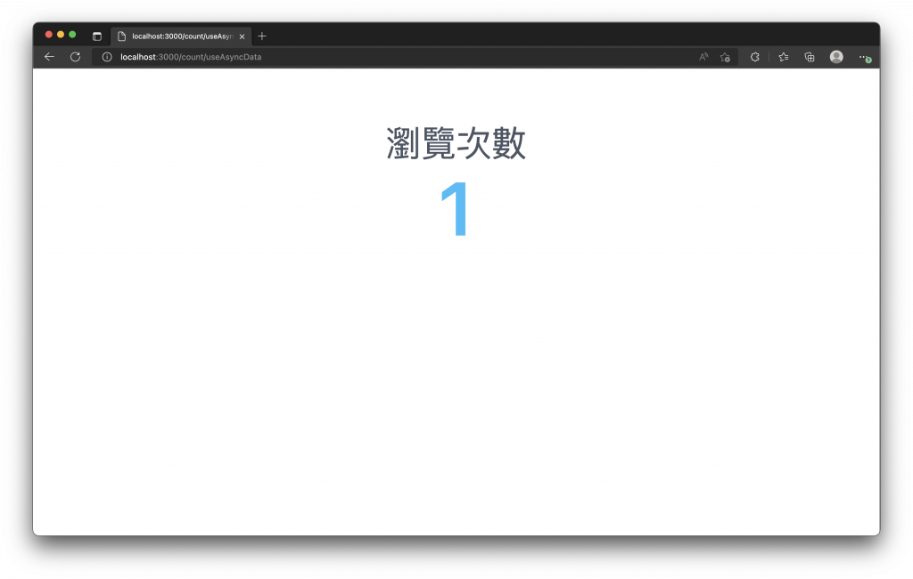
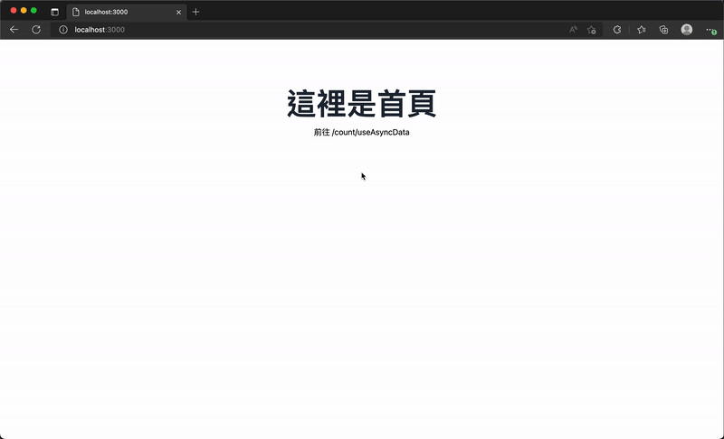
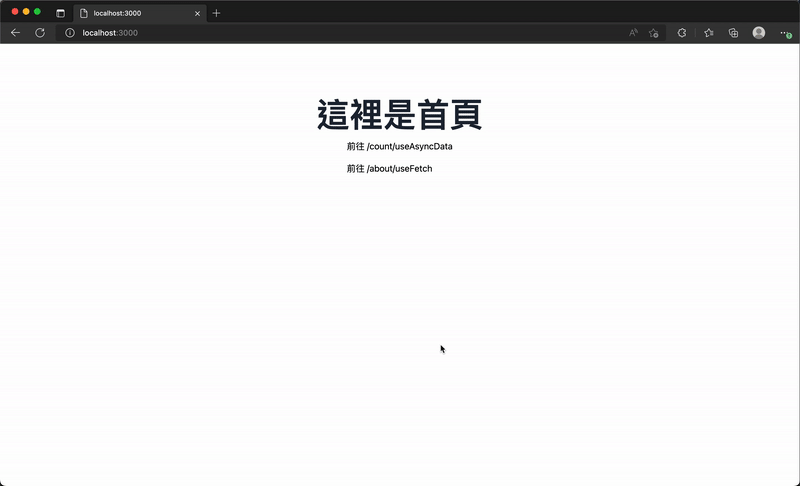
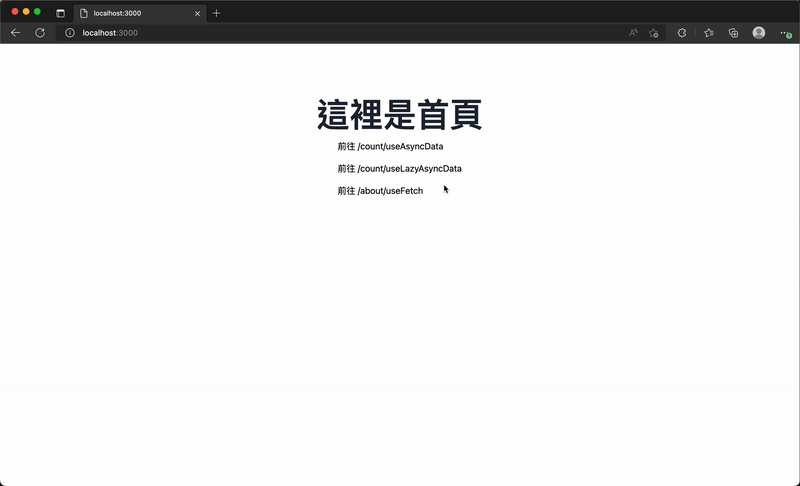
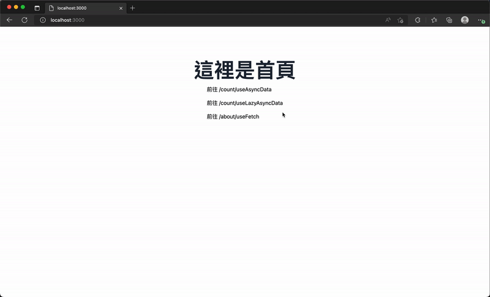

# 15. 資料獲取 (Data Fetching)
  - 現代前端常用 `AJAX`（打 `API`）取得後端資料。
  - 在 `Vue` 專案常用 `axios`，但 `Nuxt` 內建了方便的組合式函數與 `$fetch`（基於 [ohmyfetch](https://github.com/unjs/ohmyfetch)），可用來發送 `HTTP` 請求，不需額外安裝 `HTTP client`。
  - 介紹 `Nuxt` 提供的資料獲取方法與使用情境（`useAsyncData`、`useFetch`、`lazy 變體`、`$fetch` 等

## 資料獲取 (Data Fetching)
  `Nuxt` 提供 `$fetch` 與四個主要 composables（`useAsyncData`、`useFetch`、`useLazyAsyncData`、`useLazyFetch`），可在頁面、元件、插件中直接使用，並支援 `SSR` 時呼叫內部 `server API` 的最佳化（直接呼叫函數避免額外 `HTTP` 請求）。

  使用的方法，如下：
  ```js
  $fetch(url, options)
  ```

  接下來我們就來依序介紹，如何使用 `Nuxt` 提供的四種組合函數來從 API 獲取資料。

  - ### useAsyncData
    - #### 函式簽名
      有兩種呼法，一種帶 `key（string）`、一種不帶；
      兩種皆接受 `handler`（回傳 `Promise` 的函數）與 `options`（`AsyncDataOptions`）。

    - #### 常見 options（AsyncDataOptions）
      - `server`（預設 true）：是否在伺服器端獲取資料。
      - `lazy`（預設 false）：若 false，會在進入路由時執行並阻塞路由載入直到完成；若 true，延遲執行（不阻塞）。
      - `default`：在資料回傳前給予預設值（對 lazy 情境特別有用）。
      - `transform`：處理或轉換 handler 回傳結果的函數。
      - `pick`：若 handler 回傳物件，從中挑選特定 key。
      - `watch`：監聽 ref/reactive 變動後重新請求（適用分頁、搜尋等）。
      - `initialCache`（預設 true）：首次請求會快取 payload，相同 key 的後續請求會回傳快取。
      - `immediate`（預設 true）：是否立即觸發請求。

    - #### 傳入參數說明
      - `key`：唯一鍵，避免重複請求（相同 key 會重用快取，除非整頁重新 SSR 或呼叫 refresh()）。
      - `handler`：放置異步請求或加工邏輯（通常在內部使用 $fetch）。
      
    - #### 回傳值：
      - `data`: 傳入異步函數的回傳結果。
      - `pending`: 以 `true` 或 `false` 表示是否正在獲取資料。
      - `refresh` / `execute`: 一個函數，可以用來重新執行 `handler` 函數，回傳新的資料，類似重新整理、重打一次 API 的概念。預設情況下 `refresh()` 執行完並回傳後才能再次執行。
      - `error`: 資料獲取失敗時回傳的物件。

    - #### 行為說明
      `useAsyncData` 本身不直接發出 HTTP，實際請求是在 `handler` 內以 `$fetch` 等完成；在等待 `await useAsyncData()` 時，頁面會被阻塞直到 `handler` 完成（示範：`/server/api/count.js` 模擬 2 秒延遲，頁面在 SSR 或客戶端導航時的阻塞差異）。

    - #### 範例重點
      在頁面中使用 `await useAsyncData('count', () => $fetch('/api/count'))`，SSR 時會在服務端完成並返回；客戶端導航時會看到路由變更但內容延遲渲染（因等待資料）。

    我們新增一個 `Server API`，並稍微添加一下延遲，模擬 API 約需要處理 2 秒才回傳資料，`./server/api/count.js` 內容如下：
    ```js
    let counter = 0

    export default defineEventHandler(async () => {
      await new Promise((resolve) => setTimeout(resolve, 2000)) // 等待 2 秒

      counter += 1

      return JSON.stringify(counter)
    })
    ```

    新增一個路由頁面，`./pages/count/useAsyncData.vue` 內容如下：
    ```xml
    <template>
      <div class="my-24 flex flex-col items-center">
        <p class="text-4xl text-gray-600">瀏覽次數</p>
        <span class="mt-4 text-6xl font-semibold text-sky-400">{{ data }}</span>
      </div>
    </template>

    <script setup>
    const { data } = await useAsyncData('count', () => $fetch('/api/count'))
    </script>
    ```

    當我們瀏覽 `/count/useAsyncData` 時，會打 `/api/count` 這隻 API，並等待返回後才開始渲染元件。
    

    因為瀏覽 `http://localho:3000/count/useAsyncData` 時，第一次都是由後端渲染處理，看不太出導航有被阻塞的效果，建議可以添加一下路由連結來進行導航，就可以發現差異。

    當我們從首頁，由客戶端導航至 `/count/useAsyncData` 頁面時，會發現網址的路由已經變化，但是頁面約等了一會兒才渲染出現，這就是因為頁面中使用了 `useAsyncData()` 來獲取資料 `await` 將阻塞整個頁面元件的載入與渲染，直至 API 處理完畢回傳後才開始載入路由渲染元件。
    

    `useAsyncData()` 共有兩種呼叫時使用參數差異，可以選擇是否傳入第一個參數 `key`，所傳入參數的類型如下
    ```js
    function useAsyncData(
      handler: (nuxtApp?: NuxtApp) => Promise<DataT>,
      options?: AsyncDataOptions<DataT>
    ): AsyncData<DataT>

    function useAsyncData(
      key: string,
      handler: (nuxtApp?: NuxtApp) => Promise<DataT>,
      options?: AsyncDataOptions<DataT>
    ): Promise<AsyncData<DataT>>


    type AsyncDataOptions<DataT> = {
      server?: boolean
      lazy?: boolean
      default?: () => DataT | Ref<DataT> | null
      transform?: (input: DataT) => DataT
      pick?: string[]
      watch?: WatchSource[]
      initialCache?: boolean
      immediate?: boolean
    }

    interface RefreshOptions {
      _initial?: boolean
    }

    type AsyncData<DataT, ErrorT> = {
      data: Ref<DataT | null>
      pending: Ref<boolean>
      execute: () => Promise<void>
      refresh: (opts?: RefreshOptions) => Promise<void>
      error: Ref<ErrorT | null>
    }
    ```

  - ### useFetch
    - #### 函式簽名
      `useFetch(url, options?)`，會回傳類似 `AsyncData` 的物件。

    - #### options (繼承自 [unjs/ohmyfetch](https://github.com/unjs/ohmyfetch) 選項與 [AsyncDataOptions](https://v3.nuxtjs.org/api/composables/use-async-data#params))
      - `method`: 發送 HTTP 請求的方法，例如 GET、POST 或 DELETE 等。
      - `params`: 查詢參數 (Query params)。
      - `body`: 請求的 body，可以傳入一個物件，它將自動被轉化為字串。
      - `headers`: 請求的標頭 (headers)。
      - `baseURL`: 請求的 API 路徑，基於的 URL。

    - #### options (繼承自 `useAsyncData` 的選項)
      - `key`: 唯一鍵，可以確保資料不會重複的獲取，也就是如果 Key 相同便不會再發送相同的請求，除非重新整理頁面由後端再次渲染獲取，或呼叫 `useAsyncData` 回傳的 `refresh()` 函數重新取得資料。
      - `server`: 是否在伺服器端獲取資料，預設為 true 。
      - `lazy`: 是否於載入路由後才開始執行異步請求函數，預設為 false，所以會阻止路由載入直到請求完成後才開始渲染頁面元件。
      - `immediate`: 預設為 true，請求將會立即觸發。
      - `default`: 當傳入這個 factory function，可以將異步請求發送與回傳解析前，設定資料的預設值，對於設定 lazy: true 選項特別有用處，至少有個預設值可以使用及渲染顯示。
      - `transform`: 修改加工 handler 回傳結果的函數。
      - `pick`: handler 若回傳一個物件，只從中依照需要的 key 取出資料，例如只從 JSON 物件中取的某幾個 key 組成新的物件。
      - `watch`: 監聽 ref 或 reactive 響應式資料發生變化時，觸發重新請求資料，適用於資料分頁、過濾結果或搜尋等情境。
      - `initialCache`: 預設為 true，當第一次請求資料時，將會把有效的 payload 快取，之後的請求只要是相同的 key，都會直接回傳快取的結果。

      `useFetch()` 所傳入參數的類型如下
      ```js
      function useFetch(
        url: string | Request | Ref<string | Request> | () => string | Request,
        options?: UseFetchOptions<DataT>
      ): Promise<AsyncData<DataT>>

      type UseFetchOptions = {
        key?: string
        method?: string
        params?: SearchParams
        body?: RequestInit['body'] | Record<string, any>
        headers?: { key: string, value: string }[]
        baseURL?: string
        server?: boolean
        lazy?: boolean
        immediate?: boolean
        default?: () => DataT
        transform?: (input: DataT) => DataT
        pick?: string[]
        watch?: WatchSource[]
        initialCache?: boolean
      }

      type AsyncData<DataT> = {
        data: Ref<DataT>
        pending: Ref<boolean>
        refresh: () => Promise<void>
        execute: () => Promise<void>
        error: Ref<Error | boolean>
      }
      ```

    - #### 參數說明
      - `url` 可為 字串、Request、Ref 或函式
      - `options` 可控制 HTTP 方法、查詢參數、body、headers 等。若呼叫的是內部 server API，Nuxt 會提供類型提示並直接呼叫處理函數以節省請求。

    - #### 回傳值
      - `data`: 傳入異步函數的回傳結果。
      - `pending`: 以 true 或 false 表示是否正在獲取資料。
      - `refresh` / `execute`: 一個函數，可以用來重新執行 handler 函數，回傳新的資料，類似重新整理、重打一次 API 的概念。預設情況下 refresh() 執行完並回傳後才能再次執行。
      - `error`: 資料獲取失敗時回傳的物件。

    - #### 攔截器
      可傳入 `$fetch` 支援的回呼選項，如 `onRequest`（可設定 headers）、`onRequestError`、`onResponse`（可處理並回傳 response._data）、`onResponseError` 等，用於統一處理授權、錯誤或回應格式。

      我們也可以透過 `$fetch` 提供的選項來設置攔截器。
      ```js
      const { data, pending, error, refresh } = await useFetch('/api/auth/login', {
        onRequest({ request, options }) {
          // 設定請求時夾帶的標頭
          options.headers = options.headers || {}
          options.headers.authorization = '...'
        },
        onRequestError({ request, options, error }) {
          // 處理請求時發生的錯誤
        },
        onResponse({ request, response, options }) {
          // 處理請求回應的資料
          return response._data
        },
        onResponseError({ request, response, options }) {
          // 處理請求回應發生的錯誤
        }
      })
      ```

    - #### 範例
      建立 `/server/api/about.js` 回傳物件，在頁面以 `await useFetch('/api/about', { pick: ['name','counter'] })` 取得部分資料並展示請求狀態與錯誤處理，範例亦示範使用 `refresh` 重新取得。

      我們新增一個 Server API，`./server/api/about.js` 內容如下：
      ```js
      let counter = 0

      export default defineEventHandler(() => {
        counter += 1

        return {
          name: 'Ryan',
          gender: '男',
          email: 'ryanchien8125@gmail.com',
          counter
        }
      })
      ```

      新增一個路由頁面，`./pages/about/useFetch.vue` 內容如下：
      ```xml
      <template>
        <div class="my-24 flex flex-col items-center">
          <p class="text-2xl text-gray-600">
            請求狀態:
            {{ pending ? '請求中' : '完成' }}
          </p>
          <span v-if="error" class="mt-4 text-6xl text-gray-600">是否錯誤: {{ error }}</span>
          <span class="mt-4 text-2xl text-gray-600">回傳資料:</span>
          <p class="mt-4 text-3xl font-semibold text-blue-500">{{ data }}</p>
          <button
            class="mt-6 rounded-sm bg-blue-500 py-3 px-8 text-xl font-medium text-white hover:bg-blue-600 focus:outline-none focus:ring-2 focus:ring-blue-400 focus:ring-offset-2"
            @click="refresh"
          >
            重新獲取資料
          </button>
        </div>
      </template>

      <script setup>
      const { data, pending, error, refresh } = await useFetch('/api/about', {
        pick: ['name', 'counter']
      })
      </script>
      ```

      透過 `useFetch()` 我們能更簡單的發送 API 請求，並能得到狀態與重新獲取資料的函數，甚至在第一次進入頁面時，利用 `$fetch` 可以直接呼叫伺服器 API 函數的特性來降低 API 的請求次數。

      


  - ### useLazyAsyncData
    為 `useAsyncData` 的 `lazy` 封裝，預設 `options.lazy = true`，即不會阻塞路由載入，元件先渲染，待資料回來再更新內容。

    - #### 建議
      搭配 `default option` 設定初始顯示值（提升使用者體驗），例如 `default: () => '-'`，在資料回來前可先顯示 `-`。

    - #### 範例
      `const { data } = useLazyAsyncData('count', () => $fetch('/api/count'))`，頁面會先顯示文字，稍後再填入資料。

      我們新增一個 `Server API`，並稍微添加一下延遲，模擬 API 約需要處理 2 秒才回傳資料，`./server/api/count.js` 內容如下：
      ```js
      let counter = 0

      export default defineEventHandler(async () => {
        await new Promise((resolve) => setTimeout(resolve, 2000)) // 等待 2 秒

        counter += 1

        return JSON.stringify(counter)
      })
      ```

      新增一個路由頁面，`./server/pages/count/useLazyAsyncData.vue` 內容如下：
      ```xml
      <template>
        <div class="my-24 flex flex-col items-center">
          <p class="text-6xl text-gray-600">瀏覽次數</p>
          <span class="mt-4 text-9xl font-semibold text-sky-400">{{ data }}</span>
          <div class="mt-8">
            <NuxtLink to="/count">回首頁</NuxtLink>
          </div>
        </div>
      </template>

      <script setup>
      const { data } = useLazyAsyncData('count', () => $fetch('/api/count'))
      </script>
      ```

      可以發現，我們使用 `useLazyAsyncData()` 後，會與前面使用 `useAsyncData()` 的效果不一樣，會先渲染出元件，即看到的文字「瀏覽次數」，並再 API 回傳後才響應資料重新渲染數值。

      

      透過 `default` 選項可以來建立 API 回傳前的預設值，在 `options.lazy` 為 `true` 的情況下，都建議設定一下預設值，可以讓使用者體驗更好一些。

      添加 `default` 選項，`./server/pages/count/useLazyAsyncData.vue` 內容如下：
      ```xml
      <template>
        <div class="my-24 flex flex-col items-center">
          <p class="text-6xl text-gray-600">瀏覽次數</p>
          <span class="mt-4 text-9xl font-semibold text-sky-400">{{ data }}</span>
          <div class="mt-8">
            <NuxtLink to="/">回首頁</NuxtLink>
          </div>
        </div>
      </template>

      <script setup>
      const { data } = useLazyAsyncData('count', () => $fetch('/api/count'), {
        default: () => '-'
      })
      </script>
      ```

      在 API 請求回來前，預設值會是 `-`。
      

  - ### useLazyFetch
    與 `useLazyAsyncData` 相同概念，但為 `useFetch` 的 `lazy` 封裝（預設不阻塞、延遲取得資料）。

  - ### 重新獲取資料
    - #### refresh()
      針對單一 `useAsyncData` / `useFetch` 實例重新執行 `handler` 取得新資料（常用於變更查詢參數或重新整理）。

    - #### refreshNuxtData(key?)
      可使相關的 `useAsyncData` / `useLazyAsyncData` / `useFetch` / `useLazyFetch` 的快取失效並觸發刷新（範例展示如何在按鈕觸發時呼叫 `refreshNuxtData('count')）`。
      
      ```xml
      <template>
        <div>
          {{ pending ? 'Loading' : count }}
        </div>
        <button @click="refresh">Refresh</button>
      </template>

      <script setup>
      const { pending, data: count } = useLazyAsyncData('count', () => $fetch('/api/count'))

      const refresh = () => refreshNuxtData('count')
      </script>
      ```

## $fetch（由 Nuxt 提供的封裝）
  - `$fetch` 基於 `ohmyfetch`，語法簡潔：`$fetch(url, options)`，回傳 `Promise`。
  - 在 `SSR` 期間若呼叫內部 API（`./server` 下的路由），`Nuxt` 會直接呼叫後端函數而非發出外部 `HTTP`，此機制可降低不必要的網絡請求。
  - `$fetch` 的 `options` 與攔截器功能可參照 [ohmyfetch](https://github.com/unjs/ohmyfetch) 文件；常與上面提到的 `composables` 結合使用以簡化資料獲取邏輯。
  - 範例：`$fetch('/api/count')` 建立 GET 請求並取得回傳結果。

## 小結
  - `Nuxt` 內建 `$fetch` 與四種主要 `composables`（`useAsyncData`、`useFetch`、`useLazyAsyncData`、`useLazyFetch`），開發者通常不需額外安裝 `axios` 即可完成大部分資料獲取與 `SSR/CSR` 流程控制。
  - 建議依場景選擇：若需阻塞路由等待資料用 `useAsyncData`；若需非阻塞顯示先渲染再填資料用 `lazy` 版本；若要簡易請求 `URL` 並享用 `$fetch` 功能可用 `useFetch`。
