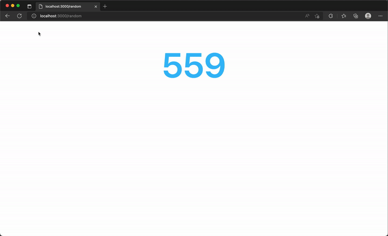
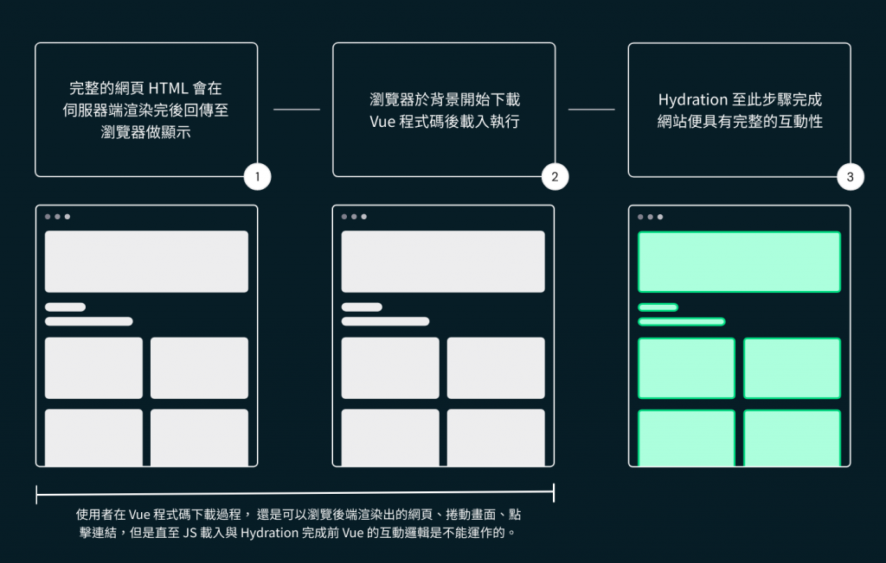
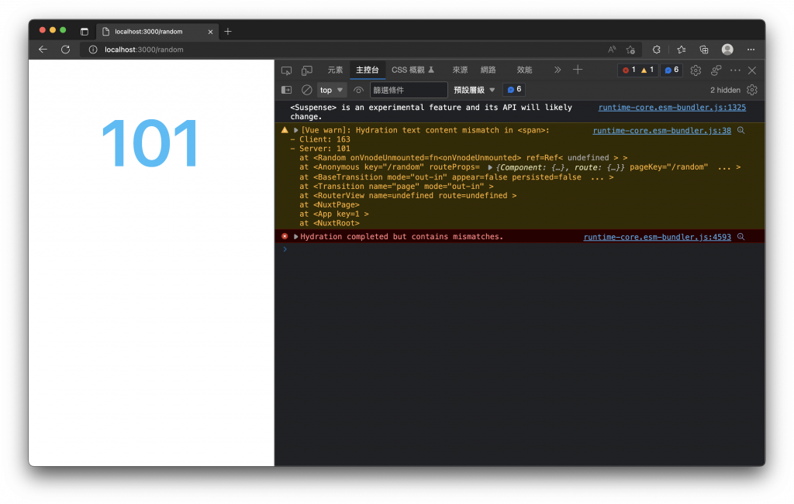
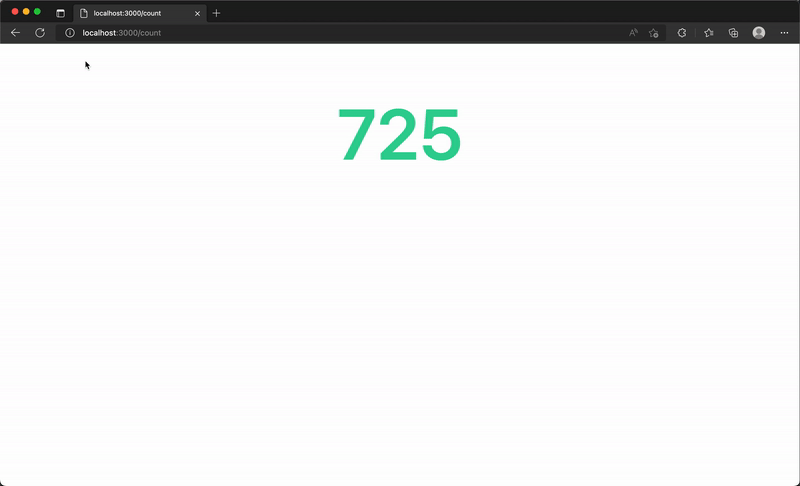
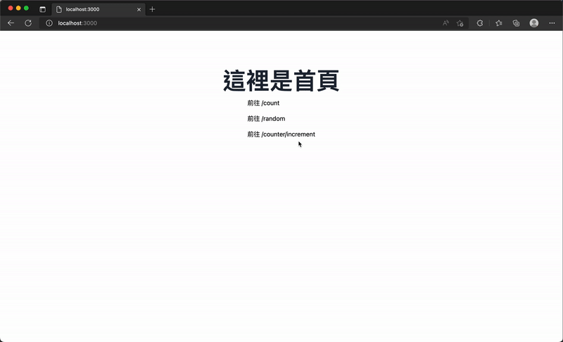
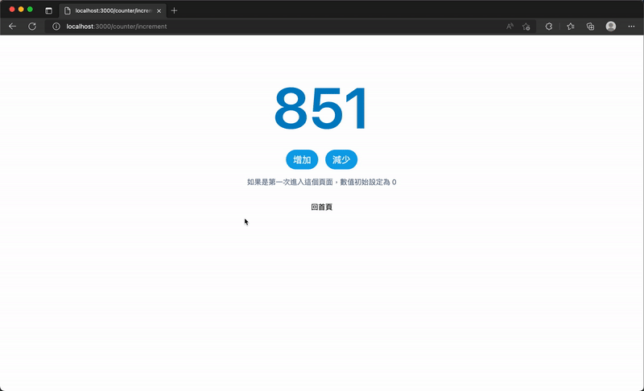
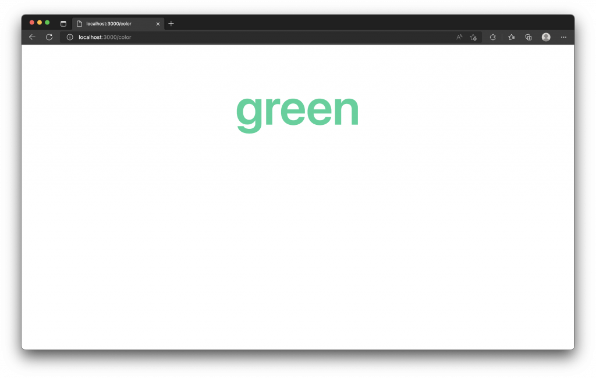

# 16. 狀態管理 (State Management)
  Vue 3 父子元件間資料傳遞與讀寫或是跨元件間的狀態共享，可以選擇使用 `Props / Emit`、`Provide / Inject` 或 `Vuex store` 來處理，這三種資料流都不大一樣，我們也會依據情境來決定狀態管理的方式。本篇會針對 `Nuxt 3` 所提供的組合式函數 `useState` 來講述元件間的共享狀態，應該如何做定義。

## Hydration
  首先，我們先來看一個例子，建立 `./pages/random.vue` 內容如下：
  ```xml
  <template>
    <div class="bg-white py-24">
      <div class="flex flex-col items-center">
        <span class="text-9xl font-semibold text-sky-400">{{ count }}</span>
      </div>
    </div>
  </template>

  <script setup>
  const count = ref(Math.round(Math.random() * 1000))
  </script>
  ```

  頁面呈現出，每次重新整理頁面，頁面會顯示新的亂數：
  

  細心你的可能會發現，每次重整頁面，數字好像 `變化了兩次`，圖中數字停留在 `517`，重新整理網頁後竟然先變成了 `163` 後再變成 `101`。

  這個現象其實是伺服器端渲染後與客戶端再次渲染所導致的。講的白話一點就是，因為 `Nuxt` 預設的渲染模式 [Universal Rendering](https://v3.nuxtjs.org/guide/concepts/rendering/#universal-rendering) 在 SSR 時期，將 `random.vue` 內容於伺服器端渲染完成後亂出產生出 `163` 作為初始值，意即 `const count = ref(163)`，所以網頁先顯示了 `163` 這個數字，同時，瀏覽器的背景也正在下載客戶端所需要的 JS 準備接手做 CSR，當 JS 載入完成後又再一次的執行 Vue 元件的 `const count = ref(Math.round(Math.random() * 1000))` 這段程式碼，此時亂數產生了 `101` 這個數字，客戶端也就重新渲染出了 `101` 於頁面上，這也就是為什麼每次重新整理數字會變化兩次的原因。

  `Nuxt` 預設的 `通用渲染 (Universal Rendering)` 模式，是結合了 `SSR` 與 `CSR` 的技術，在 `Nuxt` 收到網頁請求後，會在伺服器渲染出 `HTML` 回傳至瀏覽器渲染顯示出靜態頁面，同時開始載入需要的 `Vue` 程式碼，讓客戶端接手為 `SPA` 使得網頁具有互動性，接手後的渲染行為都是在客戶端進行的 `CSR`，這也就讓通用渲染同時兼具 `SSR` 對 `SEO` 的友善以及 `CSR` 良好互通性的使用者體驗。

  這種在瀏覽器中使後端渲染出的靜態頁面具有交互性，稱之為「 `Hydration` 」。

  依據官網所提供的 [圖片](https://v3.nuxtjs.org/guide/concepts/rendering/)，我添加了一些文字來幫助理解。前述提到了在伺服器渲染網頁 HTML 給瀏覽器時，使用可以正常的看見網頁，但是在 JS 下載完成之前，網頁是 `不具有互動性` 的，也就是還不具有路由跳轉等 Vue 互動邏輯，直至 JS 下載完後會 `Hydrate Vue` 程式碼，這時客戶端就完全接手後續的互動與 `CSR`，到這邊 `Hydration` 完成，我們也就能與網站完整的互動了。
  

  回到一開始的例子，我們在瀏覽器打開開發者工具的主控台 (Console)，可以發現到其實開發的過程，也出現了錯誤提示「`Hydration completed but contains mismatches.`」，告訴我們 `Hydration` 完成了，但是包含了不匹配，正是前端與後端初始值不同的錯誤。
  

  > 這張圖所顯示的警告，因為 Vue 核心的問題，`Client` 與 `Server` 渲染的值錯置了！`Client` 應該是 `101`，`Server` 應該是 `163`。關於錯置的問題，`Vue` 核心的程式碼，已經於 https://github.com/vuejs/core/commit/8f311c6f823f6776ca1c49bfbbbf8c7d9dea9cf1 進行修整，等待後續 `Nuxt` 整合發布新版應該就能顯示正確的警告了！！！

  接下來我們將介紹 `Nuxt` 提供的組合式函數 `useState`，可以來解決這個問題。

## Nuxt 3 - 狀態管理 (State Management)
  `Nuxt` 提供了一個組合式函數 `useState`，用來建立具有響應式及對於 `SSR` 友善的共享狀態。

  在前面的例子我們提到因為 `Hydration` 而導致前後端的初始值可能不一致，而 `useState` 是一個對 `SSR` 友善的 `ref` 替代品，使用 `useState` 建立的響應式變數，它的值會在伺服器端渲染後與客戶端 `Hydration` 期間的得以被保留。

  `useState` 有兩種接收不同數量參數的呼叫方式：

  ```ts
  useState<T>(init?: () => T | Ref<T>): Ref<T>
  useState<T>(key: string, init?: () => T | Ref<T>): Ref<T>
  ```

  - `key`: 唯一鍵，用於確保資料能被正確請求且不重複。
  - `init`: 用於提供的初始值給 `State` 的函數，這個函數也可以回傳一個 `ref`。

  舉個例子

  新增 `./pages/count.vue`，內容如下：
  ```xml
  <template>
    <div class="bg-white py-24">
      <div class="flex flex-col items-center">
        <span class="text-9xl font-semibold text-emerald-400">{{ count }}</span>
      </div>
    </div>
  </template>

  <script setup>
  const count = useState('count', () => Math.round(Math.random() * 1000))
  </script>
  ```

  可以發現，使用 `useState` 初始化 `count` 的值後，瀏覽器重整頁面，就不像前面的例子會發生兩次的數值變動。
  

  當我們使用 `useState` 並以 `count` 當作 key，在網頁請求進入伺服器端執行時，還沒有這個 `count` 狀態，所以執行了初始化函數產生出一個亂數，例如 `888` 就會回傳給 `count` 當作響應式變數的初始值，此時這個網頁請求，已經有一個 `count` 的響應式狀態，當前端於 `Hydration` 步驟再次的執行了下面這段程式碼，`useState` 一樣是以 `count` 當作 key，但是存在了一個由伺服器端建立好的 `count`，就會直接使用該狀態，也就不會在執行初始化函數，而導致前後端的初始狀態不一致的問題。

  ```js
  const count = useState('count', () => Math.round(Math.random() * 1000))
  ```

## `useState` 的基本用法
  新增 `./pages/counter/increment.vue`，內容如下：
  ```xml
  <template>
    <div class="bg-white py-24">
      <div class="flex flex-col items-center">
        <span class="text-9xl font-semibold text-sky-600">{{ counter }}</span>
        <div class="mt-8 flex flex-row">
          <button
            class="font-base mx-2 rounded-full bg-sky-500 px-4 py-2 text-xl text-white hover:bg-sky-600 focus:outline-none focus:ring-2 focus:ring-sky-400 focus:ring-offset-2"
            @click="counter++"
          >
            增加
          </button>
          <button
            class="font-base mx-2 rounded-full bg-sky-500 px-4 py-2 text-xl text-white hover:bg-sky-600 focus:outline-none focus:ring-2 focus:ring-sky-400 focus:ring-offset-2"
            @click="counter--"
          >
            減少
          </button>
        </div>
        <p class="mt-4 text-slate-500">如果是第一次進入這個頁面，數值初始設定為 0</p>
        <div class="mt-8">
          <NuxtLink to="/">回首頁</NuxtLink>
        </div>
      </div>
    </div>
  </template>

  <script setup>
  const counter = useState('counter', () => 0)
  </script>
  ```

  我們使用 `useState` 並以 `counter` 當作 `key`，首次於後端渲染時會初始化為 `0`，當前端 `Hydration` 步驟載入 Vue 或跳轉頁面，因為使用相同的 key 所以這個狀態也會繼續被保留，直至我們下一次重新整理網頁。

  

## `useState` 的共享狀態
  前面 `useState` 的基本用法以 `counter` 當作 `key`，我們可以再建立不同的頁面元件並使用 `useState('counter')` 就可以把這個狀態拿出來用，也就達到了在任何元件中可以共享相同的響應式狀態。

  新增 `./pages/counter/surprise.vue`，內容如下：
  ```xml
  <template>
    <div class="bg-white py-24">
      <div class="flex flex-col items-center">
        <span class="text-9xl font-semibold text-sky-600">{{ counter }}</span>
        <div class="mt-8 flex flex-row">
          <button
            class="font-base mx-2 rounded-full bg-sky-500 px-4 py-2 text-xl text-white hover:bg-sky-600 focus:outline-none focus:ring-2 focus:ring-sky-400 focus:ring-offset-2"
            @click="counter++"
          >
            增加
          </button>
          <button
            class="font-base mx-2 rounded-full bg-sky-500 px-4 py-2 text-xl text-white hover:bg-sky-600 focus:outline-none focus:ring-2 focus:ring-sky-400 focus:ring-offset-2"
            @click="counter--"
          >
            減少
          </button>
        </div>
        <p class="mt-4 text-slate-500">如果是第一次進入這個頁面，數值初始設定為亂數</p>
        <div class="mt-8">
          <NuxtLink to="/">回首頁</NuxtLink>
        </div>
      </div>
    </div>
  </template>

  <script setup>
  const counter = useState('counter', () => Math.round(Math.random() * 1000))
  </script>
  ```

  我們可以任意導航至 `/counter/increment` 與 `/counter/surprise` 頁面，可以發現兩個頁面可以共享相同的 `counter` 狀態，當首次進入或重新整理 `increment.vue` 頁面，會將 `counter` 初始化為 `0`；而首次進入或重新整理 `surprise.vue` 頁面則是產生一個亂數給予 `counter`。

  

  當然你也可以直接在其他元件中使用 `useState('counter')`，就可以取得共享的響應式裝態，但如果這個元件是初次進入而沒有預設值的建立函數，可能會引發一些錯誤，要特別的注意。

## 使用組合式函數建立共享狀態
  如下例子，我們可以建立 `組合式函數 (Composables)` 來搭配 `useState`。

  新增 `./composables/states.ts`，內容如下：
  ```js
  export const useColor = () => useState<string>('color', () => 'green')
  ```

  新增 `./pages/color.vue`，內容如下：
  ```xml
  <template>
    <div class="bg-white py-24">
      <div class="flex flex-col items-center">
        <span class="text-9xl font-semibold text-emerald-400">{{ color }}</span>
      </div>
    </div>
  </template>

  <script setup>
  const color = useColor()
  </script>
  ```

  如此一來我們定義好的組合式函數就可以被自動的導入及建立具有類型安全的狀態，在各個元件之間就可以呼叫這個組合函數來取得共享狀態。

  

## 小結
  在通用渲染的模式之下，瀏覽器於 `Hydration` 完成前，網頁雖然能瀏覽但是尚不具有互動性，直至 `Hydration` 完成後，`Vue` 的頁面元件會重新載入與綁定，因此我們對於響應式的變數，儘量使用 `useState` 來替代 `ref` 以確保 `Hydration` 前後的初始值得以被保留，而且 `useState` 因為可以使用 `key` 來使狀態於元件間共享。