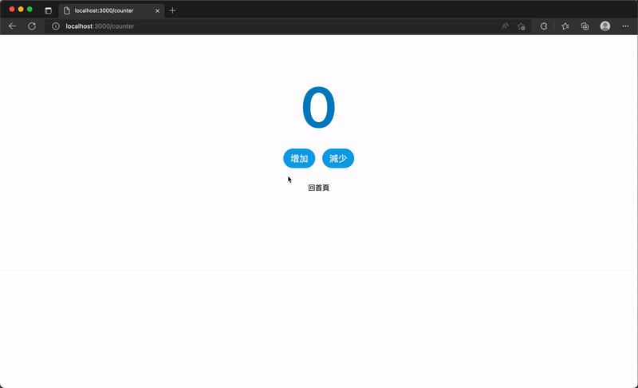
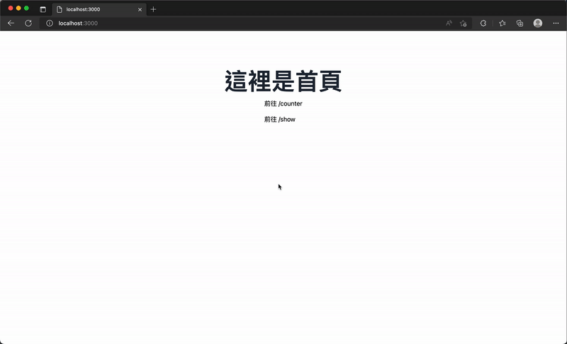
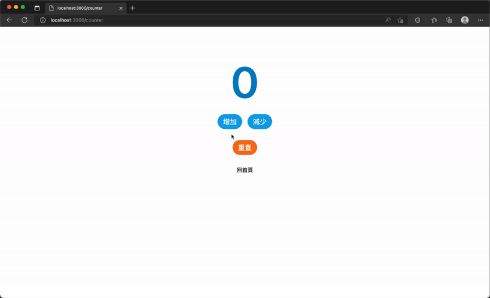

# 17. 狀態管理 - Store & Pinia
## 前言
  - 上一篇介紹：
    - 使用 `useState` 建立「`元件間共享狀態`」
  - 問題：
    - 隨專案規模變大
    - 需要更完善的狀態管理方式
  - 解法：
    - 使用 `Store`（如 `Vuex` / `Pinia`）
  - `Pinia` 說明：
    - 可視為 `Vuex v5` 概念
    - 已成為 `Vue` 官方推薦方案

  

## Pinia
  - ### Pinia 與 Vuex
    - #### Pinia 與 Vuex 的關係：
      - `Pinia` 由 `Vue` 核心團隊成員開發
      - 源自 `Vuex v5` 提案的實驗與實現
    - #### Pinia 已：
      - API 穩定
      - 成為官方推薦狀態管理方案

  - ### Pinia 與 Vuex 差異
    - 沒有 `mutation`
      - 直接使用 `action` 修改狀態
    - 沒有 `modules` 巢狀結構
      - 每個 `store` 自帶命名空間
    - `TypeScript` 支援更完整
      - 型別推斷佳
    - 體積小（約 1KB）
    - 支援：
      - `伺服器端渲染 - SSR`
      - `程式碼自動拆分 - Code splitting`

  - ### Nuxt 3 安裝 Pinia
    - #### 安裝指令
      （照官方安裝會發生一些問題，故加上 --force 參數）
      ```sh
      npm install -D pinia @pinia/nuxt --force
      ```

    - #### 配置方式：
      將 `@pinia/nuxt` 新增至 `nuxt.config.ts` 的 `modules` 屬性中。
      ```ts
      export default defineNuxtConfig({
        modules: ['@pinia/nuxt']
      })
      ```

  - ### 建立第一個 Pinia 的 Store
    - #### `Pinia` 提供 `defineStore` 函數來定義 `store`。呼叫時第一個參數需要傳入唯一的名稱（即 `id`），`Pinia` 會用它將 `store` 連接到 `devtools`。

    - #### 建議將回傳的函數命名以 `use...` 開頭（例如 `useCounterStore`），符合組合式函數命名的約定與使用習慣。

    - #### `defineStore` 的第二個參數可以傳入 `Options` 物件 或是 `Setup` 函數：
      - ##### Options 物件方式（新增 `./stores/counter.js`）：
        與 `Vue` 的 `Options API` 類似，傳遞帶有 `state`、`actions` 和 `getters` 的物件。
        它們分別呼應彼此的關係：`state` 對應 data、`actions` 對應 methods、`getters` 對應 computed。

        ```js
        import { defineStore } from 'pinia'

        export const useCounterStore = defineStore('counter', {
          state: () => ({
            count: 0
          }),
          actions: {
            increment() {
              this.count += 1
            },
            decrement() {
              this.count -= 1
            }
          },
          getters: {
            doubleCount: (state) => state.count * 2
          }
        })
        ```

      - ##### Setup 函數方式：
        與 `Vue` `Composition API` 的 `setup` 函數類似，傳入一個函數，在裡面定義響應式屬性、方法等，最後回傳想公開的屬性和方法組成的物件。

        ```js
        import { defineStore } from 'pinia'

        export const useCounterStore = defineStore('counter', () => {
          const count = ref(0)
          const increment = () => {
            count.value += 1
          }
          const decrement = () => {
            count.value -= 1
          }
          const doubleCount = computed(() => count.value * 2)
          return {
            count,
            increment,
            decrement,
            doubleCount
          }
        })
        ```

  - ### 開始使用 Store
    我們新增一個頁面元件 `./pages/counter.vue`，內容如下：
    ```xml
    <template>
      <div class="bg-white py-24">
        <div class="flex flex-col items-center">
          <span class="text-9xl font-semibold text-sky-600">{{ counterStore.count }}</span>
          <div class="mt-8 flex flex-row">
            <button
              class="font-base mx-2 rounded-full bg-sky-500 px-4 py-2 text-xl text-white hover:bg-sky-600 focus:outline-none focus:ring-2 focus:ring-sky-400 focus:ring-offset-2"
              @click="counterStore.increment"
            >
              增加
            </button>
            <button
              class="font-base mx-2 rounded-full bg-sky-500 px-4 py-2 text-xl text-white hover:bg-sky-600 focus:outline-none focus:ring-2 focus:ring-sky-400 focus:ring-offset-2"
              @click="counterStore.decrement"
            >
              減少
            </button>
          </div>
          <div class="mt-8">
            <NuxtLink to="/">回首頁</NuxtLink>
          </div>
        </div>
      </div>
    </template>

    <script setup>
    import { useCounterStore } from '@/stores/counter'

    const counterStore = useCounterStore()
    </script>
    ```

    - 在元件中匯入並呼叫 `useCounterStore()` 即可操作 `store` 內的方法或屬性：
      
      ```js
      import { useCounterStore } from '@/stores/counter'
      const counterStore = useCounterStore()
      ```

    - 範例中新增了頁面元件 `./pages/counter.vue`，透過按鈕點擊事件觸發 `counterStore.increment` 與 `counterStore.decrement` 來改變狀態，並在畫面上顯示狀態值。

    - 在不同的元件間，同樣可以使用 `useCounterStore` 取得已建立好的 `store` 來共享狀態或進行操作。

    這樣我們就完成了一個 `store` 的顯示狀態值，透過呼叫 `counterStore` 內定義的 `increment` 與 `decrement` 來改變狀態。
    

    在不同的元件間，你也可以使用 `useCounterStore` 取得已經建立好的 `store` 來共享這些狀態或進行操作。
    

  - ### Pinia Store 的 State
    - 預設情況下可以直接對 `store` 的實例取得狀態。

    - 比較特別的是，不用透過呼叫函數，也可以直接對 `store` 的狀態進行修改（例如：`counterStore.count += 10`）。
      ```js
      const counterStore = useCounterStore()
      counterStore.count += 10
      ```

    - #### 改變狀態
      - 除了直接修改，還可以使用 `store` 提供的 helper `$patch` 來修改部分的狀態：
        ```js
        userStore.$patch({
          name: 'Ryan',
          money: '88888888'
        })
        ```

      - 對於集合類型（如陣列的新增、刪除或指定修改某元素等較複雜的操作），`$patch` 可以傳入一個接收 `state` 的函數來進行修改。
        ```js
        cartStore.$patch((state) => {
          state.items.push({ name: 'shoes', quantity: 1 })
          state.hasChanged = true
        })
        ```

      - 如果需要，也可以將整個 `state` 重新設置為一個新的物件（例如：`cartStore.$state = { ... }`）。
        ```js
        cartStore.$state = {
          items: [],
          hasChanged: false,
        }
        ```

    - #### 重置狀態
      `sotre` 的實例提供了一個 `$reset()` 的 helper，呼叫它就可以將 `store` 的狀態重置至初始值，
      不過目前只有在使用 `Option` 物件定義的 `store` 才有實作。
      ```js
      const counterStore = useCounterStore()

      counterStore.$reset()
      ```

  - ### Pinia Store 的 Getters
    - #### 使用同一個 store 中的其他 getter
      在 `store` 內你可以組合多個 `getter`，在 `Option` 物件下，可以透過使用 `this` 來呼叫使用其他的 `getter`。
      ```js
      export const useStore = defineStore('main', {
        state: () => ({
          counter: 0,
        }),
        getters: {
          doubleCount: (state) => state.counter * 2,
          doubleCountPlusOne() {
            return this.doubleCount + 1
          },
        }
      })
      ```

    - #### 使用其他 store 的 getter
      在 `store` 內也可以組合其他 `store` 的 `getter`，只要在內部建立出其他 `store` 實例，就可以呼叫使用。
      ```js
      import { useOtherStore } from './other-store'

      export const useStore = defineStore('main', {
        state: () => ({
          // ...
        }),
        getters: {
          otherGetter(state) {
            const otherStore = useOtherStore()
            return state.localData + otherStore.data
          },
        },
      })
      ```

  - ### Pinia Store 的 Actions
    - `Actions` 相當於元件中的方法，也是修改狀態的商業邏輯定義的位置
    - `Action` 可以是同步也可以是異步的，因此可以在 `action` 中打後端 API（例如使用 `useFetch`）來取得資料並更新狀態。
      ```js
      import { defineStore } from 'pinia'

      export const useUserStore = defineStore('user', {
        state: () => ({
          profile: {
            name: '',
            gender: '',
            email: ''
          }
        }),
        actions: {
          async getUserProfile() {
            try {
              const { data } = await useFetch('/api/profile')
              this.profile = data
            } catch (error) {
              return error
            }
          }
        }
      })
      ```

  - ### Store 的解構
    - 有些情況需要將 `Store` 中的屬性或方法獨立提取出來，為了保持屬性的響應性，必須使用 `storeToRefs` 來建立屬性的參考（類似使用 `toRefs` 建立 `props` 的參考）。

    - 方法（如 `increment`, `decrement`）則可以直接從 `store` 中解構。
      ```js
      import { storeToRefs } from 'pinia'
      import { useCounterStore } from '@/stores/counter'

      const counterStore = useCounterStore()

      const { count } = storeToRefs(counterStore)
      const { increment, decrement } = counterStore
      ```

## Pinia 持久化插件 - Pinia Plugin Persistedstate
  - `Pinia` 提供底層 API 讓使用者自定義插件以擴展功能。
    例如：需要將狀態儲存在瀏覽器中以便下次瀏覽時讀取，就需要將 `store` 狀態持久化。

  - [Pinia Plugin Persistedstate](https://www.npmjs.com/package/@pinia-plugin-persistedstate/nuxt) 插件非常適合用來儲存使用者資訊或登入狀態。

  - ### 在 Nuxt 3 中配置使用 Pinia Plugin Persistedstate
    - #### Step 1. 安裝套件：加上 --force 參數安裝。
      ```sh
      npm install -D @pinia-plugin-persistedstate/nuxt --force
      ```

    - #### Step 2. 在 Nuxt 3 為 Pinia 添加 Persist 模組：將套件新增至 `nuxt.config.ts` 的 `modules` 中。
      ```js
      export default defineNuxtConfig({
        modules: ['@pinia/nuxt', '@pinia-plugin-persistedstate/nuxt']
      })
      ```

    - #### Step 3. 為你的 Store 添加持久化配置
      - `Option` 形式：在 `store` 定義中新增 `persist` 屬性，配置 key 與將狀態儲存在 `persistedState.localStorage`。
        ```js
        import { defineStore } from 'pinia'

        export const useCounterStore = defineStore('counter', {
          state: () => ({
            count: 0
          }),
          actions: {
            increment() {
              this.count += 1
            },
            decrement() {
              this.count -= 1
            }
          },
          getters: {
            doubleCount: (state) => state.count * 2
          },
          persist: {
            key: 'counter',
            storage: persistedState.localStorage
          }
        })
        ```

      - `Setup` 形式：在 `defineStore` 傳入第三個參數並添加 `persist` 屬性。
        ```js
        import { defineStore } from 'pinia'

        export const useCounterStore = defineStore(
          'counter',
          () => {
            const count = useState('count', () => 0)

            const increment = () => {
              count.value += 1
            }
            const decrement = () => {
              count.value -= 1
            }

            const doubleCount = computed(() => count.value * 2)

            return {
              count,
              increment,
              decrement,
              doubleCount
            }
          },
          {
            persist: {
              key: 'counter',
              storage: persistedState.localStorage
            }
          }
        )
        ```

    - #### Step 4. 持久化效果
      設置好後，狀態會被儲存在瀏覽器的 `localStorage` 中。即使關閉瀏覽器或重新整理網頁，狀態都會再從 `localStorage` 讀取出來。

      

## 小結
  - 小型專案中可使用 `useState` 來管理狀態；但大專案中會需要如 `Pinia` 這樣更好的方式來管理並定義多個 `store`。

  - `Pinia` 的插件能協助擴展功能，其中 `Pinia Plugin Persistedstate` 是很常用的插件，能協助將狀態持久化至瀏覽器的 `localStorage` 或 `sessionStorage` 中。