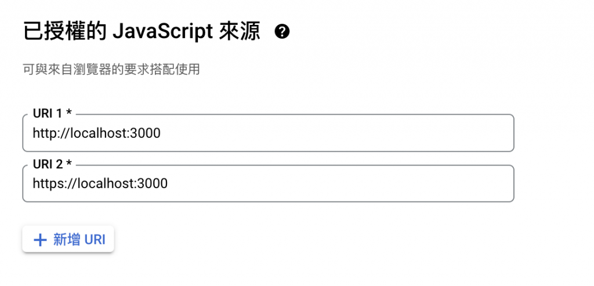
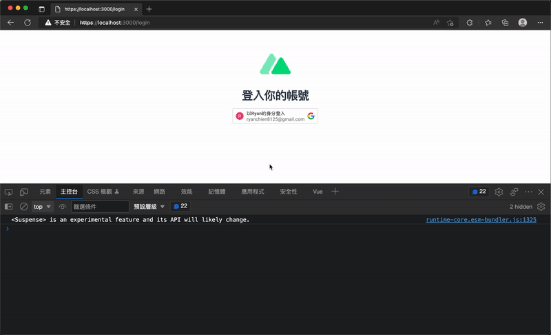
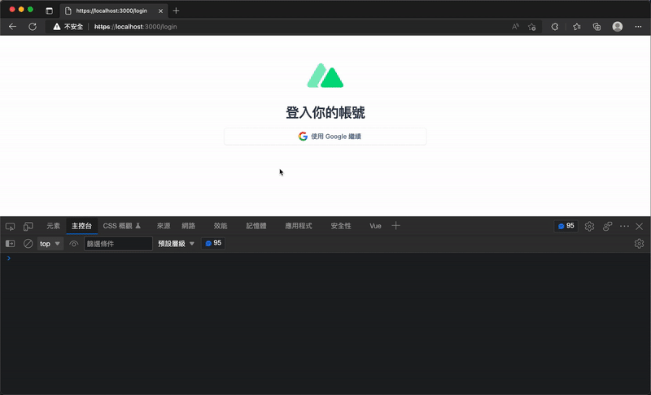
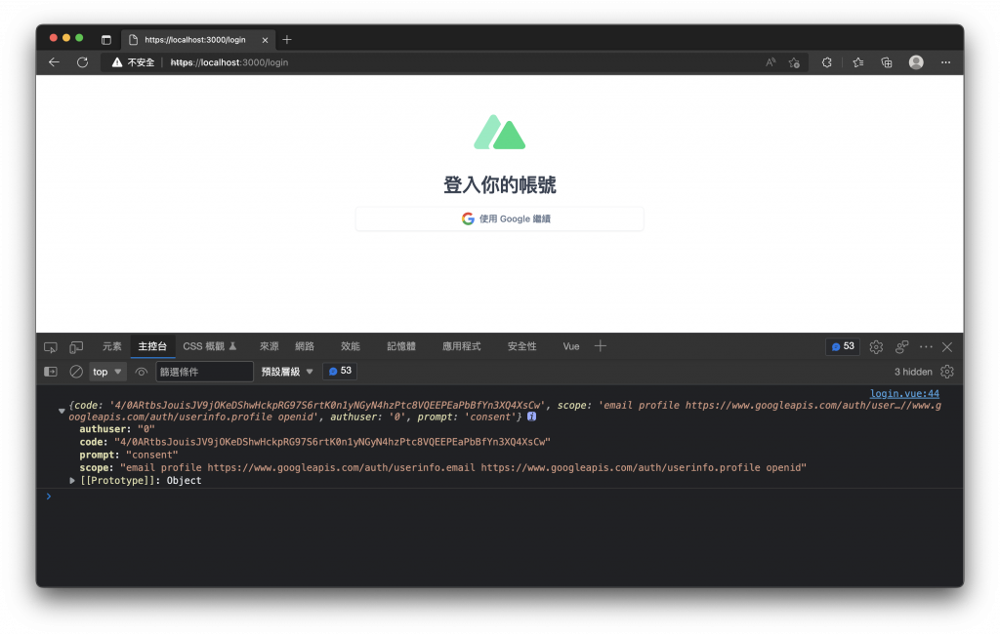
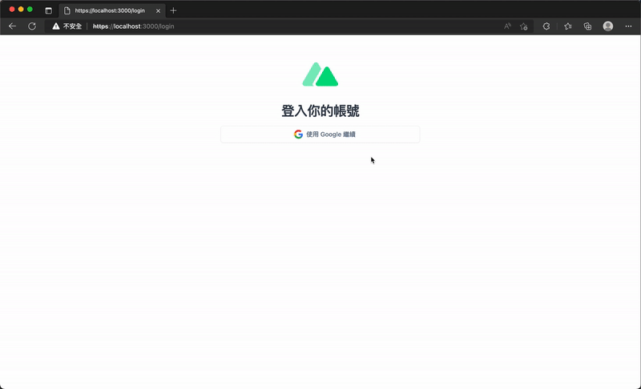

# 19. 串接 Google OAuth 登入
## 前言
  - 隨著對 `Nuxt 3` 功能的熟悉，後續文章將會分享如何建立一個簡易的部落格網站，並結合 `Nuxt 3` 的搜尋引擎最佳化（SEO）配置函數來加強 `SEO`。
  - 在建立網站的會員系統時，常會使用到第三方登入，本篇將以 `Google OAuth` 為例，實際在 `Nuxt 3` 中進行串接。

## 串接 Google OAuth 登入
  - ### 1. 建立 Google OAuth Client ID
    需要先到 [Google Cloud Console](https://console.cloud.google.com/apis/credentials) 建立 **OAuth 2.0 用戶端 ID**。

    建立時需注意：
    - 設定「`已授權的 JavaScript 來源`」
    
    - 開發環境與正式環境網域都要加入 `Domain`
    - 建議使用 `HTTPS`
    - 妥善保管 `Client Secret`(用戶密碼)
    - 記錄 `Client ID`，後續程式會使用到

  - ### 2. 將 Client ID 放入 Runtime Config
    修改 `./nuxt.config.ts` 內容：
    ```ts
    export default defineNuxtConfig({
      runtimeConfig: {
        public: {
          googleClientId: 'Google Client ID'
        }
      }
    })
    ```

    目的：
    - 統一管理設定值
    - 方便前端取得 `這邊放上你的 Google Client ID`

  - ### 3. 安裝 vue3-google-login
    - #### 安裝套件
      ```sh
      npm install -D vue3-google-login
      ```

    - #### 此套件提供
      - `Google Login` 元件
      - `One Tap Login`
      - `Token Login`
      - `Auth Code Login` 等功能

  - ### 4. 建立 Nuxt Plugin
    - 新增 `plugins/vue3-google-login.client.js`
      ```js
      import vue3GoogleLogin from 'vue3-google-login'

      export default defineNuxtPlugin((nuxtApp) => {
        const runtimeConfig = useRuntimeConfig()
        const { googleClientId: GOOGLE_CLIENT_ID } = runtimeConfig.public

        nuxtApp.vueApp.use(vue3GoogleLogin, {
          clientId: GOOGLE_CLIENT_ID
        })
      })
      ```

    - 功能：
      - 取得 `Runtime Config` 中的 `Google Client ID`
      - 將 `vue3-google-login` 註冊到 `Vue App`
      - 只在 `Client Side` 載入（`.client.js`）

  - ### 5. 使用 GoogleLogin 元件
    範例：
    ```xml
    <ClientOnly>
      <GoogleLogin :callback="callback" />
    </ClientOnly>
    ```

    - #### callback
      登入成功後會收到 `Google` 回傳資料：
      ```js
      const callback = (response) => {
        console.log(response)
      }
      ```

    - #### 為什麼要使用 ClientOnly？
      `Google Login` 元件依賴瀏覽器環境。

      使用：
      ```xml
      <ClientOnly>
      ```
      > 可以避免 SSR 初始化時發生問題。



## One Tap Prompt
  Google 提供類似「一鍵登入」功能。

  - ### 方法一：直接啟用 prompt (添加 prompt 屬性)
    ```xml
    <GoogleLogin :callback="callback" prompt />
    ```
    > 登入元件載入時就會出現 One Tap 視窗。

  - ### 方法二：使用 googleOneTap()
    ```js
    import { googleOneTap } from 'vue3-google-login'

    onMounted(() => {
      googleOneTap()
        .then((response) => {
          console.log(response)
        })
    })
    ```

    特點：
    - 不需要顯示登入按鈕
    - 頁面載入後直接觸發 `One Tap` 登入流程

## 自訂按鈕
  若不想使用 `Google` 預設樣式，可透過 `Slot` 自訂。

  範例：
  ```xml
  <GoogleLogin :callback="callback">
    <button>
      使用 Google 進行登入
    </button>
  </GoogleLogin>
  ```

  - ### 預設回傳 Auth Code
    - 使用自訂按鈕時：
      - 登入成功後預設取得的是：`Auth Code`，而非 `Access Token`。

  - ### 改為取得 Access Token
    - 加入：
      ```xml
      popup-type="TOKEN"
      ```
    - 範例：
      ```xml
      <GoogleLogin :callback="callback" popup-type="TOKEN" >
        <button>
          使用 Google 進行登入
        </button>
      </GoogleLogin>
      ```
      > 登入成功後會回傳：`Access Token`

## 使用 `googleTokenLogin()`
  除了 `<GoogleLogin>` 元件外，也可以自己控制登入流程。

  - ### 建立登入方法
    ```js
    import { googleTokenLogin } from 'vue3-google-login'
    const runtimeConfig = useRuntimeConfig()
    const { googleClientId: GOOGLE_CLIENT_ID } = runtimeConfig.public


    const handleGoogleLogin = () => {
      googleTokenLogin({
        clientId: GOOGLE_CLIENT_ID
      }).then((response) => {
        console.log(response)
      })
    }
    ```

  - ### 建立按鈕
    ```xml
    <button type="button" @click="handleGoogleLogin" >
      使用 Google 繼續
    </button>
    ```

  - ### 效果：
    - 點擊按鈕
    - 開啟 `Google` 登入視窗
    - 回傳 `Access Token`

    

## 使用 `googleAuthCodeLogin()`
  若希望取得 `Auth Code`：
  ```js
  import { googleAuthCodeLogin } from 'vue3-google-login'
  const runtimeConfig = useRuntimeConfig()
  const { googleClientId: GOOGLE_CLIENT_ID } = runtimeConfig.public

  const handleGoogleLogin = () => {
    googleAuthCodeLogin({
      clientId: GOOGLE_CLIENT_ID
    }).then((response) => {
      console.log(response)
    })
  }
  ```

  登入成功後取得：`Auth Code`，通常適合後端交換 `Token` 的 `OAuth Flow`。

  

## 伺服器端驗證
  `Google` 登入完成後，不應直接相信前端資料。

  - ### 標準流程：
    ```
    Google 登入
        ↓
    取得 Token / Credential / Auth Code
        ↓
    送到後端 API
        ↓
    Google 驗證
        ↓
    取得使用者資訊
        ↓
    建立網站 Session 或 JWT
    ```

    使用：`npm install -D google-auth-library` 來完成後端驗證。

    依照不同的登入方式取得的 `Credential`、`Access Token` 或 `Auth Code` 送至後端做驗證

  - ### 驗證 Access Token
    - #### 流程
      ```
      Google Login
          ↓
      取得 Access Token
          ↓
      POST /api/auth/google
          ↓
      Google UserInfo API
          ↓
      取得使用者資訊
      ```

    - #### Server API 功能
      - ##### 利用：OAuth2Client
      - ##### 取得：
        - sub
        - name
        - picture
        - email
        - email_verified

      - ##### 若 Token 無效：
        ```js
        throw createError({
          statusCode: 400
        })
        ```
  
    - #### 前端流程
      - 1. 使用 `googleTokenLogin()`
      - 2. 取得 `Access Token`
      - 3. 呼叫 `/api/auth/google`
      - 4. 後端驗證
      - 5. 回傳 User 資料
      - 6. 存入前端狀態管理

    建立 `./server/api/auth/google.post.js`
    ```js
    import { OAuth2Client } from 'google-auth-library'

    export default defineEventHandler(async (event) => {
      const body = await readBody(event)
      const oauth2Client = new OAuth2Client()
      oauth2Client.setCredentials({ access_token: body.accessToken })

      const userInfo = await oauth2Client
        .request({
          url: 'https://www.googleapis.com/oauth2/v3/userinfo'
        })
        .then((response) => response.data)
        .catch(() => null)

      oauth2Client.revokeCredentials()

      if (!userInfo) {
        throw createError({
          statusCode: 400,
          statusMessage: 'Invalid token'
        })
      }

      return {
        id: userInfo.sub,
        name: userInfo.name,
        avatar: userInfo.picture,
        email: userInfo.email,
        emailVerified: userInfo.email_verified,
      }
    })
    ```

    調整元件內的登入流程
    ```js
    <script setup>
    import { googleTokenLogin } from 'vue3-google-login'

    const runtimeConfig = useRuntimeConfig()
    const { googleClientId: GOOGLE_CLIENT_ID } = runtimeConfig.public

    const userInfo = ref()

    const handleGoogleLogin = async () => {
      const accessToken = await googleTokenLogin({
        clientId: GOOGLE_CLIENT_ID
      }).then((response) => response?.access_token)

      if (!accessToken) {
        return '登入失敗'
      }

      const { data } = await useFetch('/api/auth/google', {
        method: 'POST',
        body: {
          accessToken
        },
        initialCache: false
      })

      userInfo.value = data.value
    }
    </script>
    ```

    

  - ### 驗證 Credential
    適用情境：
      - Google 預設登入按鈕
      - One Tap Prompt

    回傳資料包含： `Credential`

    - #### 驗證方式
      - 使用： `oauth2Client.verifyIdToken()`
      - 驗證： `body.credential`
      - 成功後： `ticket.getPayload()`
      - 取得使用者資訊：
        - sub
        - name
        - picture
        - email
        - email_verified

    建立 `./server/api/auth/google.post.js`
    ```js
    import { OAuth2Client } from 'google-auth-library'

    export default defineEventHandler(async (event) => {
      const body = await readBody(event)
      const oauth2Client = new OAuth2Client()

      const ticket = await oauth2Client.verifyIdToken({
        idToken: body.credential,
      })

      const payload = ticket.getPayload()

      if (!payload) {
        throw createError({
          statusCode: 400,
          statusMessage: 'Invalid token'
        })
      }

      return {
        id: payload.sub,
        name: payload.name,
        avatar: payload.picture,
        email: payload.email,
        emailVerified: payload.email_verified
      }
    })
    ```

    調整元件內程式
    ```xml
    <template>
      <div>
        <ClientOnly>
          <GoogleLogin :callback="handleGoogleLogin" />
        </ClientOnly>
        {{ userInfo }}
      </div>
    </template>

    <script setup>
    const userInfo = ref()

    const handleGoogleLogin = async (resp) => {
      if (!resp.credential) {
        return '登入失敗'
      }

      const { data } = await useFetch('/api/auth/google', {
        method: 'POST',
        body: {
          credential: resp.credential
        },
        initialCache: false
      })

      userInfo.value = data.value
    }
    </script>
    ```

  - ### 驗證 Auth Code
    適用情境： `googleAuthCodeLogin()`

    - #### 驗證流程
      ```
      Auth Code
          ↓
      Google Token Exchange
          ↓
      Access Token
          ↓
      UserInfo API
          ↓
      取得使用者資訊
      ```

    - #### OAuth2Client 需設定
      - `clientId`
      - `clientSecret`
      - `redirectUri`

    - #### 核心步驟
      - ##### 1. Auth Code 換 Token
        ```js
        oauth2Client.getToken(authCode)
        ```
      - ##### 2. 設定 Credentials
        ```js
        oauth2Client.setCredentials()
        ```
      - ##### 3. 呼叫 UserInfo API
        ```js
        https://www.googleapis.com/oauth2/v3/userinfo
        ```
      - ##### 4. 回傳使用者資訊
        - id
        - name
        - avatar
        - email
        - emailVerified

    建立 `./server/api/auth/google.post.js`
    ```js
    import { OAuth2Client } from 'google-auth-library'

    export default defineEventHandler(async (event) => {
      const body = await readBody(event)
      const oauth2Client = new OAuth2Client({
        clientId: '你的 Google Client ID',
        clientSecret: '你的 Google Client Secret',
        redirectUri: '你的 Google Redirect Uri'
      })

      let { tokens } = await oauth2Client.getToken(body.authCode)
      oauth2Client.setCredentials({ access_token: tokens.access_token })

      const userInfo = await oauth2Client
        .request({
          url: 'https://www.googleapis.com/oauth2/v3/userinfo'
        })
        .then((response) => response.data)
        .catch(() => null)

      oauth2Client.revokeCredentials()

      if (!userInfo) {
        throw createError({
          statusCode: 400,
          statusMessage: 'Invalid token'
        })
      }

      return {
        id: userInfo.sub,
        name: userInfo.name,
        avatar: userInfo.picture,
        email: userInfo.email,
        emailVerified: userInfo.email_verified,
      }
    })
    ```

## 小結
  `Nuxt 3` 與 `Google OAuth` 的整合，並介紹三種登入資料型態：

  | 登入方式                         | 回傳內容       | 驗證方式                  |
  |---------------------------------|--------------|---------------------------|
  | `Google 預設按鈕`                   | `Credential `  | `verifyIdToken()`           |
  | `One Tap Prompt `                  | `Credential`   | `verifyIdToken()`        |
  | `googleTokenLogin()  `             | `Access Token` | `UserInfo API`            |
  | `GoogleLogin + popup-type="TOKEN"` | `Access Token` | `UserInfo API`              |
  | `googleAuthCodeLogin()`            | `Auth Code`    | `getToken()` → `UserInfo API` |

  - ### 實務上建議流程：
    ```
    Google OAuth
        ↓
    後端驗證
        ↓
    建立會員資料
        ↓
    產生 JWT / Session
        ↓
    Cookie 儲存登入狀態
    ```
    
## 實作步驟（或設定流程）
  - ### 測試環境準備
    - 在本地端啟動 `Nuxt` 開發伺服器時，作者習慣使用 `npm run dev -- --https` 來啟用 `HTTPS` 做測試。

    - 這樣可以在 `Google` 帳號登入成功後，正常返回並接收 `憑證`（`Credential`）。

## 伺服器端驗證
  - ### 概念說明
    - 當使用者在前端（`Client` 端）成功登入並取得 `Google` 返回的資訊後，通常需要將這些資訊傳送到後端（`Server` 端）進行驗證或記錄使用者，接著再產生網站專用的 `Token`、`Cookie` 或 `Session`，以供後續的網站權限驗證使用。

  - ### 工具安裝
    - 在後端進行驗證或取得使用者資訊，可以使用 `Google` 官方提供的 `google-auth-library` 核心套件。
    - 安裝指令
      ```sh
      npm install -D google-auth-library
      ```

  - ### 驗證邏輯
    - 根據前端採取不同的 `Google` 登入方式，後端可以接收 `Credential`（憑證）、`Access Token` 或 `Auth Code` 並送至 `Google` 端做驗證。
    - #### Access Token
      前端登入成功取得 `Access Token `後，將其傳送至 `Nuxt 3` 的 `Server API`（例如 `/api/auth/google`）。該 `API` 接收到 `Access Token` 後，使用 `google-auth-library` 與 `Google API` 進行驗證並取得使用者詳細資訊，最後再回傳給前端。

## 範例程式碼
  文章中提供了以下幾種實作場景的範例程式碼參考連結：

  - [Nuxt 3 - 使用 Google 登入及伺服器端驗證 Access Token 範例](https://github.com/ryanchien8125/ithome-2022-ironman-nuxt3/tree/day19/nuxt-app-google-oauth)
  - [Nuxt 3 - 使用 Google 預設渲染按鈕登入範例](https://github.com/ryanchien8125/ithome-2022-ironman-nuxt3/tree/day19/nuxt-app-google-oauth-one-tap-prompt)
  - [Nuxt 3 - 使用自訂按鈕登入取得 Access Token 範例](https://github.com/ryanchien8125/ithome-2022-ironman-nuxt3/tree/day19/nuxt-app-google-oauth-token-login)
  - [Nuxt 3 - 使用自訂按鈕登入取得 Auth Code 範例](https://github.com/ryanchien8125/ithome-2022-ironman-nuxt3/tree/day19/nuxt-app-google-oauth-auth-code-login)