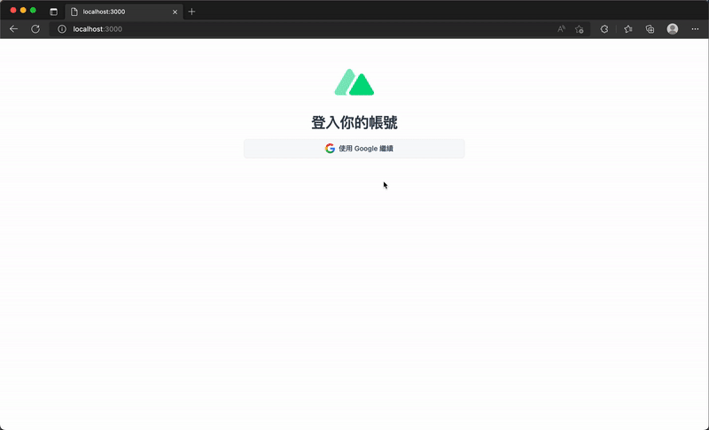

# 20. Cookie 的設置與 JWT 的搭配

## 前言
  - 在 Web 開發中，處理使用者的身分驗證與狀態保持是不可或缺的，常見的手段是利用 `Cookie` 與 `JWT (JSON Web Token)` 來相互搭配。

  - 本篇將介紹 `Nuxt 3` 提供內建操作 `Cookie` 的方法、在伺服器端（Server 端）的操作，以及如何與 `JWT` 相互配合進行身分驗證。

## Nuxt 3 的 Cookie 設置方式：`useCookie`
  - Nuxt 3 提供了 `useCookie(name, options)` 組合式函數，讓開發者在 `SSR（伺服器端渲染）`與 `Client 端` 都能輕鬆讀取與寫入 `Cookie`。

  - ### 參數說明：
    - `name`：對應的是 cookie 的 key。
    - `options`：傳入一個物件來設置多個 cookie 屬性，包含以下常見設定：
      - `maxAge`：指定 `Max-Age` 屬性的值，單位是 `秒`。若未設置，則該 cookie 屬於 `Session Only（網頁關閉後即消失）`。
      - `expires`：指定一個 `Date` 物件作為過期時間，通常用於相容較舊的瀏覽器。若與 `maxAge` 同時設定，兩者時間應保持一致。
      - `httpOnly`：布林值，預設為 `false`。當設置為 `true` 時，客戶端的 JavaScript 將無法使用 `document.cookie` 查看此 cookie。常用於保護敏感訊息（如 Token 或 Session Id）防止外洩。
      - `secure`：布林值，預設為 `false`。設置為 `true` 時，瀏覽器只有在 HTTPS 加密傳輸協定的情境下才會自動夾帶此 cookie。
      - `domain`：指定 cookie 適用的 Domain，預設為適用於自己的 Domain 之下。
      - `path`：指定 cookie 適用的路徑。
      - `sameSite`：布林值或字串，用於設定跨站請求的 [安全策略](https://developer.mozilla.org/en-US/docs/Web/HTTP/Headers/Set-Cookie/SameSite)。
      - `encode`：由於 cookie 的值只能使用有限字元集，此設置可將其編碼為合法字串。預設使用 `JSON.stringify` + `encodeURIComponent()`。
      - `decode`：預設解碼方式使用 `decodeURIComponent` + `destr`。
      - `default`：為一個函數，可用於回傳 cookie 的預設值，也可以回傳一個 `Ref`。

  - ### 範例
    新增 `./pages/cookie.vue`
    ```xml
    <template>
      <div class="flex flex-col items-center justify-center py-12 px-4 sm:px-6 lg:px-8">
        <div class="w-full max-w-md">
          <div class="flex flex-col items-center">
            <h2 class="mt-2 text-center text-3xl font-bold tracking-tight text-gray-700">Cookie</h2>
          </div>
          <div class="mt-2 flex w-full max-w-md flex-col items-center">
            <button
              type="button"
              class="mt-2 w-fit rounded-sm bg-emerald-500 py-2 px-4 text-sm text-white hover:bg-emerald-600 focus:outline-none focus:ring-2 focus:ring-emerald-400 focus:ring-offset-2"
              @click="setNameCookie"
            >
              設置 name
            </button>
            <div class="mt-2 flex">
              <label class="text-lg font-semibold text-emerald-500">name:</label>
              <span class="ml-2 flex text-lg text-slate-700">{{ name }}</span>
            </div>
          </div>
          <div class="mt-2 flex w-full max-w-md flex-col items-center">
            <button
              type="button"
              class="mt-2 w-fit rounded-sm bg-emerald-500 py-2 px-4 text-sm text-white hover:bg-emerald-600 focus:outline-none focus:ring-2 focus:ring-emerald-400 focus:ring-offset-2"
              @click="setCounterCookie"
            >
              設置 counter
            </button>
            <div class="mt-2 flex">
              <label class="text-lg font-semibold text-emerald-500">counter:</label>
              <span class="ml-2 flex text-lg text-slate-700">{{ counter }}</span>
            </div>
          </div>
        </div>
      </div>
    </template>

    <script setup>
    const name = useCookie('name')
    const counter = useCookie('counter', { maxAge: 60 })

    const setNameCookie = () => {
      name.value = 'Ryan'
    }

    const setCounterCookie = () => {
      counter.value = Math.round(Math.random() * 1000)
    }
    </script>
    ```

## 伺服器端操作 Cookie
  - 在 Nuxt 3 的伺服器端（Server API 或 Nitro 路由中），不使用 `useCookie`，而是透過由 `h3` 套件提供的 `getCookie` 與 `setCookie` 函數來操作。

  - 範例： 新增 `./server/api/cookie.js`，當前端發出 `/api/cookie` 請求時，伺服器會自動解析夾帶的 cookie 取得 `counter` 值，將其加 1 後再重新設定並回傳給前端。
    ```js
    export default defineEventHandler((event) => {
      let counter = getCookie(event, 'counter')

      counter = parseInt(counter, 10) || 0
      counter += 1

      setCookie(event, 'counter', counter)

      return { counter }
    })
    ```

## 什麼是 JWT (JSON Web Token)？
  - `JWT` 是一種基於 JSON 的開放標準（RFC 7519），用於在各方之間以 JSON 物件的形式安全地傳輸資訊。它通常由三個部分組成：`Header（標頭）`、`Payload（負載）`、`Signature（簽章）`，並以 `.` 分隔。

  - ### 安全性機制：
    由於 `Payload` 可以被解碼，為了防止被任意篡改，需要借助 `Header` 與 `Signature` 來確認當初加密的演算法及驗證簽章是否符合。

  - ### 注意事項：
    JWT 的 Payload 就算不知道加密私鑰也能被解碼，因此切記不要在 Payload 中放置敏感資料或密鑰。在簽發 JWT 時，也盡量採用非對稱式加密（例如使用 `ES256` 演算法產生的非對稱金鑰）。

## Token 要放在 Cookie 還是 Local Storage？
  - 兩種方式各有優缺點，只要注意特性與安全，存放在哪裡都是可以被接受的。

  - ### Local Storage 隱憂：
    容易受到 `XSS（跨網站指令碼）`攻擊而被偷取。

  - ### Cookie 防護：
    儲存在 cookie 的敏感資料也可以透過 JavaScript 的 `document.cookie` 存取。
    為防範 `XSS` 導致外洩，建議將 cookie 的 `httpOnly` 設置為 `true`。
    雖然這仍可能面臨 `CSRF（跨站請求偽造）`的攻擊，但可以藉由 `sameSite` 策略來進行阻擋。

## 實戰：Nuxt 3 結合 Google OAuth、JWT 與 Cookie
  文章說明了串接與驗證的完整工作流程：

  - ### 1. 核發 Token：
    前端透過 `Google` 登入取得 `Access Token` 後發送至後端，後端驗證成功後，使用 `jsonwebtoken` 套件產生含有使用者資訊的 `JWT`。
    核發時需要簽署金鑰，此金鑰定義在 `nuxt.config.ts` 的 `runtimeConfig.jwtSignSecret` 中。

  - ### 2. 寫入 Cookie：
    後端透過 `setCookie` 將生成的 `JWT` 寫入瀏覽器的 `Cookie` 中（建議設定 `httpOnly: true` 等安全屬性）。

  - ### 3. 身分驗證（/api/whoami）：
    當前端需要確認目前使用者身分時，會呼叫後端 API（如 `/api/whoami`），
    後端利用 `getCookie` 解析出 `access_token` 並驗證該 `JWT`，確認無誤後將使用者資訊回傳至前端渲染。

  首先，安裝 `jwt`
  ```sh
  npm i -D jsonwebtoken
  ```

  完整的 `./server/api/auth/google.post.js`:
  ```js
  import { OAuth2Client } from 'google-auth-library'
  import jwt from 'jsonwebtoken'

  const runtimeConfig = useRuntimeConfig()

  export default defineEventHandler(async (event) => {
    const body = await readBody(event)
    const oauth2Client = new OAuth2Client()
    oauth2Client.setCredentials({ access_token: body.accessToken })

    const userInfo = await oauth2Client
      .request({
        url: 'https://www.googleapis.com/oauth2/v3/userinfo'
      })
      .then((response) => response.data)
      .catch(() => null)

    oauth2Client.revokeCredentials()

    if (!userInfo) {
      throw createError({
        statusCode: 400,
        statusMessage: 'Invalid token'
      })
    }

    const jwtTokenPayload = {
      id: userInfo.sub,
      nickname: userInfo.name,
      email: userInfo.email
    }

    const maxAge = 60 * 60 * 24 * 7
    const expires = Math.floor(Date.now() / 1000) + maxAge

    const jwtToken = jwt.sign(
      {
        exp: expires,
        data: jwtTokenPayload
      },
      runtimeConfig.jwtSignSecret   // 在 ./nuxt.config.ts 中自行加入加密字串
    )

    setCookie(event, 'access_token', jwtToken, {
      httpOnly: true,
      maxAge,
      expires: new Date(expires * 1000),
      secure: process.env.NODE_ENV === 'production',
      path: '/'
    })

    return {
      id: userInfo.id,
      nickname: userInfo.name,
      avatar: userInfo.picture,
      email: userInfo.email
    }
  })
  ```

  完整的 `./server/api/whoami.js`，從 `cookie` 取得 `access_token`，再用 `jwt.verify()` 驗證使用者資訊
  ```js
  import jwt from 'jsonwebtoken'

  const runtimeConfig = useRuntimeConfig()

  export default defineEventHandler((event) => {
    const jwtToken = getCookie(event, 'access_token')

    try {
      const { data: userInfo } = jwt.verify(jwtToken, runtimeConfig.jwtSignSecret)

      return {
        id: userInfo.id,
        nickname: userInfo.nickname,
        email: userInfo.email
      }
    } catch (e) {
      throw createError({
        statusCode: 401,
        statusMessage: 'Unauthorized'
      })
    }
  })
  ```

  

## 小結
  - 透過將代表使用者的字串或 J`WT` 於登入後產生，並在後續請求中夾帶，即可達到驗證使用者的效果。

  - 除了 `JWT`，後端只要能回推或從資料庫比對出所代表的使用者資訊，也可以使用隨意產生的字串。