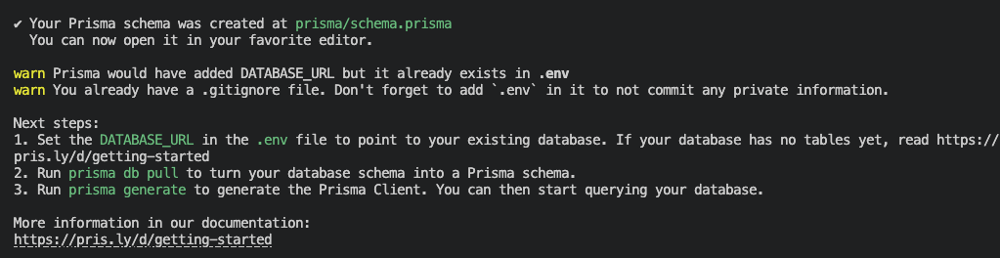
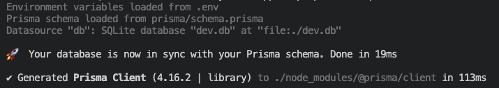
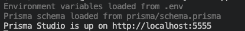
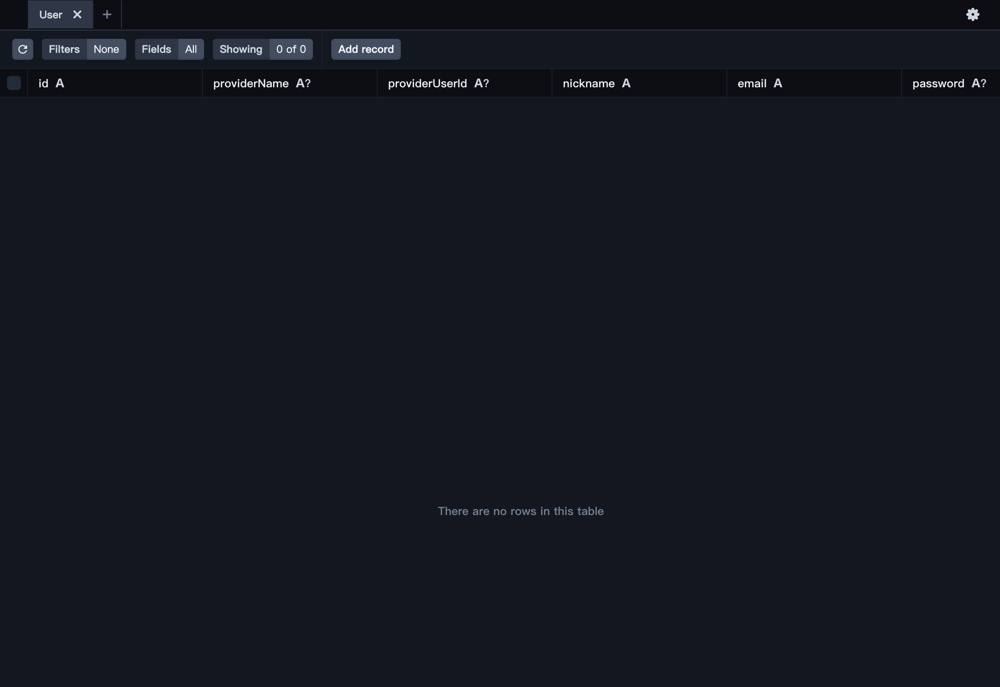
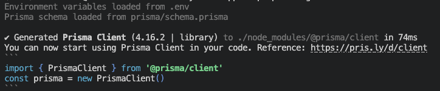

# 21. 實作部落格 - 資料庫與會員系統
## 前言
  - 介紹了前面系列文章已經對 `Nuxt 3` 有了基本認知與工具使用，接下來要進一步實作一個具備資料庫、會員系統與後台管理的「部落格系統」。

  - 本篇主要分享如何將 `Nuxt 3` 串接資料庫，以及如何利用資料庫完善前面的 `Google` 第三方登入功能，來建立一個完整的會員系統。

## 使用 Prisma 串接資料庫
  - ### Prisma 簡介：
    `Prisma` 是 `Vue/Nuxt` 生態系中極受歡迎的 `ORM` 工具。
    開發者只需要撰寫直觀的 `schema.prisma` 檔案來定義資料結構（Model），`Prisma` 就能自動映射到後端資料庫。在程式中進行 CRUD 只要操作 `Prisma Client` 即可，完全不需要手寫 SQL 語句。

  - ### 相容於 Prisma 4 的安裝指令： 安裝 `prisma` 與 `@prisma/client`
    ```sh
    # 安裝指定版本 4.16.2，確保與 Nuxt 3 穩定相容
    npm install -D prisma@4.16.2 @prisma/client@4.16.2
    ```

  - ### 初始化 `Schema` 指令（在專案中建立 Prisma 基礎建設）：
    ```sh
    npx prisma init --datasource-provider sqlite
    ```

    
    > (在 Prisma 4 中，這會在根目錄自動建立 prisma/schema.prisma 與 .env 檔案)

  - ### 調整 `./prisma/schema.prisma`
      將 `datasource` 替換為 `SQLITE`，url 改成本地端 `./dev.db`
      ```prisma
      datasource db {
        provider = "sqlite"
        url      = env("DATABASE_URL")
      }
      ```

      並將 `.env` 改成
      ```
      DATABASE_URL="file:../prisma/dev.db"
      ```

      > 你也可以將 provider 替換為 PostgreSQL 或 MySQL 等，可以參考[這裡](https://www.prisma.io/docs/concepts/database-connectors)，但要注意可能後面定義的 Schema 語法會略微不同。

## 設計 User Model
  - ### 接下來定義一個 `User` 的資料表，在 `schema.prisma` (`./prisma/schema.prisma`) 撰寫如下：
    ```prisma
    // This is your Prisma schema file,
    // learn more about it in the docs: https://pris.ly/d/prisma-schema

    generator client {
      provider = "prisma-client-js"
    }

    datasource db {
      provider = "sqlite"
      url      = env("DATABASE_URL")
    }

    model User {
      id             String   @id @default(uuid())
      providerName   String?
      providerUserId String?
      nickname       String   @default("User")
      email          String   @unique
      password       String?
      avatar         String?
      emailVerified  Boolean  @default(false)
      createdAt      DateTime @default(now())
      updatedAt      DateTime @updatedAt
    }
    ```

    文章中定義了使用者的資料庫結構（`Schema`），並對各個欄位做出了細部說明：
    - `id`：預設為 UUID，作為使用者的唯一識別碼。
    - `providerName`：作為第三方登入的供應商紀錄使用。例如使用者若使用 Google OAuth 註冊登入，該欄位會填入 `google`。如果為空值 `(null)`，表示使用者是用電子信箱註冊登入。
    - `providerUserId`：與 `providerName` 搭配使用。第三方供應商通常會有一組專屬於該使用者的 Id，以此即可在資料庫中比對登入的是哪位使用者。若為空值 `(null)`，表示為電子信箱註冊。
    - `nickname`：使用者暱稱，預設值為字串 `"User"`。
    - `email`：使用者登入的電子信箱，設定為 `@unique` 代表該信箱在系統中是唯一的。
    - `password`：使用者密碼的雜湊值。如果使用者是透過第三方（如 Google）註冊登入，則此欄位會是空值 `(null)`。
    - `avatar`：使用者的頭像，用來存放圖片網址。
    - `emailVerified`：布林值，預設為 `false`，表示使用者的電子信箱是否已通過驗證。
    - `createdAt`：使用者帳號的建立時間，預設為插入該筆資料的時間。
    - `updatedAt`：使用者更新個人資料的時間，預設為更新該筆資料的時間。

  - ### 初始化資料庫
    當調整好 `schema` 後，執行下列指令，來初始化資料庫，`Prisma` 會依照 `schema.prisma` 來建立對應的資料表
    ```sh
    npx prisma db push
    ```

    

  - ### 查看資料庫是否建立成功
    使用 `Prisma` 提供的 `Prisma Studio` 來快速的檢視與操作資料庫內的資料
    ```sh
    npx prisma studio
    ```

    

    在 `Prisma Studio` 就可以看到我們建立的 `User` 資料表

    

## 建立 `Prisma Client`
  這樣就可以在 `Nuxt 3` 中使用 `Prisma Client` 操作資料庫了
  ```sh
  npx prisma generate
  ```
  

## 測試 Prisma Client
  在 `Prisma 4` 環境下，你不需要處理複雜的動態匯入，可以在 `Nuxt 3` 的全域工具（`server/utils`）中以最正統、最優雅的具名匯入來建立單例模式（Singleton），避免 HMR 熱更新造成連線爆炸。
  - ### 請建立 `./server/utils/prisma.ts`（Nuxt 3 會自動掃描並全域匯入此資料夾內的方法）：
    ```ts
    import { PrismaClient } from '@prisma/client'

    // 防止在開發模式下因為熱更新（HMR）重複實例化 PrismaClient
    const globalForPrisma = globalThis as unknown as { prisma: PrismaClient }

    export const prisma = globalForPrisma.prisma || new PrismaClient()

    if (process.env.NODE_ENV !== 'production') globalForPrisma.prisma = prisma
    ```
  - ### 測試建立一個測試使用者資料：
    - #### 新增一個 `Server API` 路由
      `./server/api/test-create-user.get.ts`，在裡面呼叫 `prisma.user.create()` 帶入測試資料。
      
      當前端發送請求至 `/api/test-create-user` 後，後端就會透過 `Prisma Client` 操作 `User Model`，在資料庫中建立一筆測試使用者的紀錄。

      ```js
      export default defineEventHandler(async () => {
        try {
          // 操作 User Model 新增一筆測試資料
          const newUser = await prisma.user.create({
            data: {
              providerName: null,
              providerUserId: null,
              nickname: 'Ryan',
              email: 'ryanchien8125@gmail.com',
              password: '這裡要放密碼的雜湊值',
              avatar: '',
              emailVerified: true
            }
          })
          return { success: true, data: newUser }
        } catch (error: any) {
          return { success: false, error: error.message }
        }
      })
      ```

## Nuxt 3 使用者註冊帳號
  - ### 核心邏輯整合：
    本節將「`Google OAuth 驗證`」、「`Prisma 資料庫操作`」與「`JWT/Cookie 登入狀態保持`」進行三位一體的完整結合。

  - ### 會員系統運作流程（以後端 `/api/auth/google.post.ts` 為例）：
    -  #### 接收與驗證：
      前端發送 `Google` 登入成功後的 `Access Token` 給後端，後端透過 `google-auth-library` 向 `Google` 官方驗證，取得使用者的 email、姓名（nickname）與 Google 用戶唯一識別碼（sub）。

    - #### 資料庫比對：
      利用 `Prisma 4` 的查詢語法，去資料庫尋找該用戶是否已經註冊過：
      ```ts
      const existingUser = await prisma.user.findFirst({
        where: {
          providerName: 'google',
          providerUserId: googleUserData.sub
        }
      })
      ```

    - #### 自動註冊機制：
      如果資料庫中找不到該用戶，代表是初次登入，後端會利用 `Prisma` 自動在資料庫中新建一筆 `User` 紀錄（此時 id 會自動生成 UUID 填入）。

    - #### 核發憑證：
      不論是新註冊還是老用戶，最後一步皆是將使用者的 id 與 email 簽署成 JWT，並透過 `setCookie` 寫入瀏覽器的 `httpOnly Cookie` 中，完成完整的會員登入流程。

    
    - #### Google 註冊方式
      `./server/api/auth/google.post.js`
      ```js
      import { OAuth2Client } from 'google-auth-library'
      import jwt from 'jsonwebtoken'
      import db from '../../db'

      const runtimeConfig = useRuntimeConfig()

      export default defineEventHandler(async (event) => {
        const body = await readBody(event)
        const oauth2Client = new OAuth2Client()
        oauth2Client.setCredentials({ access_token: body.accessToken })

        const userInfo = await oauth2Client
          .request({
            url: 'https://www.googleapis.com/oauth2/v3/userinfo'
          })
          .then((response) => response.data)
          .catch(() => null)

        oauth2Client.revokeCredentials()

        if (!userInfo) {
          throw createError({
            statusCode: 400,
            statusMessage: 'Invalid token'
          })
        }

        let userRecord = await db.user.getUserByEmail({
          email: userInfo.email
        })

        if (userRecord) {
          if (
            (userRecord.providerName === 'google' && userRecord.providerUserId === userInfo.sub) === false
          ) {
            throw createError({
              statusCode: 400,
              statusMessage: 'This email address does not apply to this login method'
            })
          }
        } else {
          userRecord = await db.user.createUser({
            providerName: 'google',
            providerUserId: userInfo.sub,
            nickname: userInfo.name,
            email: userInfo.email,
            password: null,
            avatar: userInfo.picture,
            emailVerified: userInfo.email_verified
          })
        }

        const jwtTokenPayload = {
          id: userRecord.id
        }

        const maxAge = 60 * 60 * 24 * 7
        const expires = Math.floor(Date.now() / 1000) + maxAge

        const jwtToken = jwt.sign(
          {
            exp: expires,
            data: jwtTokenPayload
          },
          runtimeConfig.jwtSignSecret
        )

        setCookie(event, 'access_token', jwtToken, {
          httpOnly: true,
          maxAge,
          expires: new Date(expires * 1000),
          secure: process.env.NODE_ENV === 'production',
          path: '/'
        })

        return {
          id: userRecord.id,
          provider: {
            name: userRecord.providerName,
            userId: userRecord.providerUserId
          },
          nickname: userRecord.nickname,
          avatar: userRecord.avatar,
          email: userRecord.email
        }
      })
      ```

      - ##### 程式說明
        - 當前端 `Google OAuth` 登入成功後，將回傳的 `Google access_token` 傳送至這隻 API，並使用 `Google API` 取得使用者資訊。
        - `db.user.getUserByEmail` 這個是封裝的方法，裡面對應著 `Prisma` 的 `ORM` 操作，依照使用者的 `Email` 回傳資料庫內是否存在一筆符合的使用者記錄。
        - 如果存在，會判斷 `provider` 是否符合 `Google` 的使用者資訊，否則判斷為應該是用電子信箱註冊的使用者。
        - 如果不存在，則建立一個新的使用者至資料庫內，建立時不需要傳入 `id` 資料庫，因為設定為自動產生 UUID。
        - 最後就是產生使用者的 `JWT` 並設定在 `cookie` 之中。

    - #### 電子信箱註冊方式
      `./server/api/auth/register.post.js`
      ```js
      import bcrypt from 'bcrypt'
      import db from '../../db'

      export default defineEventHandler(async (event) => {
        const body = await readBody(event)

        let userRecord = await db.user.getUserByEmail({
          email: body.email
        })

        if (userRecord) {
          throw createError({
            statusCode: 400,
            statusMessage: 'A user with that email address already exists'
          })
        }

        userRecord = await db.user.createUser({
          providerName: null,
          providerUserId: null,
          nickname: body.nickname,
          email: body.email,
          password: bcrypt.hashSync(body.password, 10),
          avatar: null,
          emailVerified: false
        })

        return {
          id: userRecord.id,
          nickname: userRecord.nickname,
          email: userRecord.email
        }
      })
      ```
    
    - #### 電子信箱登入方式
      ```js
      import db from '../../db'

      export default defineEventHandler(async (event) => {
        const user = event.context?.auth?.user

        if (!user?.id) {
          throw createError({
            statusCode: 401,
            statusMessage: 'Unauthorized'
          })
        }

        const userRecord = await db.user.getUserById({
          id: user.id
        })

        if (!userRecord) {
          throw createError({
            statusCode: 400,
            statusMessage: 'Could not find user.'
          })
        }

        return {
          id: userRecord.id,
          provider: {
            name: userRecord.providerName,
            userId: userRecord.providerUserId
          },
          nickname: userRecord.nickname,
          avatar: userRecord.avatar,
          email: userRecord.email
        }
      })
      ```

## 結合 Pinia 儲存使用者資料
  - ### 建立 `./server/profile.get.js` ，取得使用者資料
    ```js
    import db from '../../db'

    export default defineEventHandler(async (event) => {
      const user = event.context?.auth?.user

      if (!user?.id) {
        throw createError({
          statusCode: 401,
          statusMessage: 'Unauthorized'
        })
      }

      const userRecord = await db.user.getUserById({
        id: user.id
      })

      if (!userRecord) {
        throw createError({
          statusCode: 400,
          statusMessage: 'Could not find user.'
        })
      }

      return {
        id: userRecord.id,
        provider: {
          name: userRecord.providerName,
          userId: userRecord.providerUserId
        },
        nickname: userRecord.nickname,
        avatar: userRecord.avatar,
        email: userRecord.email
      }
    })
    ```

  - ### 新增一個 user 的 store，`./stores/user.js`
    ```js
    import { defineStore } from 'pinia'

    export const useUserStore = defineStore('user', {
      state: () => ({
        profile: {
          id: null,
          provider: {
            name: null,
            userId: null
          },
          nickname: null,
          avatar: null,
          email: null
        }
      }),
      actions: {
        async refreshUserProfile() {
          const { data, error } = await useFetch('/api/user/profile', { initialCache: false })
          if (data.value) {
            this.profile = data.value
          } else {
            return error.value?.data?.message ?? '未知錯誤'
          }
        }
      },
      persist: {
        enabled: true,
        strategies: [
          {
            key: 'user',
            storage: process.client ? localStorage : null
          }
        ]
      }
    })
    ```

    就可以直接使用 `refreshUserProfile()` 來發送請求至 `/api/user/profile` 取得最新的使用者資料來更新 `store`。

## 使用伺服器中間件來驗證 JWT
  會員系統在登入後，會產生一組 `JWT` 放置於 `cookie` 之中，在後端 API 使用時都要在呼叫 `getCookie()` 來解析 `cookie`，所以我們可以將驗證 `JWT` 的流程，放置在伺服器`中間件 (middleware)` 之中，後端收到的每個請求就會經過這個中間件，只要有夾帶 `access_token` 的 `cookie` 就會進行驗證解析出 `JWT` 所含的 `payload id`，即為使用者的 ID。

  建立 `./server/middleware/auth.js` 檔案
  ```js
  import jwt from 'jsonwebtoken'

  const runtimeConfig = useRuntimeConfig()

  export default defineEventHandler((event) => {
    const jwtToken = getCookie(event, 'access_token')

    if (!jwtToken) {
      return
    }

    let userInfo = null

    try {
      const { data } = jwt.verify(jwtToken, runtimeConfig.jwtSignSecret)

      userInfo = data
      if (userInfo?.id) {
        event.context.auth = {
          user: {
            id: userInfo.id
          }
        }
      }
    } catch (e) {}
  })
  ```

  伺服器的中間件只要定義在 `./server/middleware` 目錄下就會自動被載入，之後在每個 `Server API` 收到請求，中間件只要有成功驗證並解析 `JWT`，就會在 `event.context.auth` 添加使用者資訊，之後在 `Server API` 的處理函數中，就可以以下列程式碼進行使用。

## 小結
  藉由 `Prisma 4` 的高相容性，我們在 `Nuxt 3` 中用最精簡的程式碼串接了持久化資料庫，並讓第三方登入無縫升級為一套具備「`自動註冊`」與「`身分識別`」的完整會員系統。