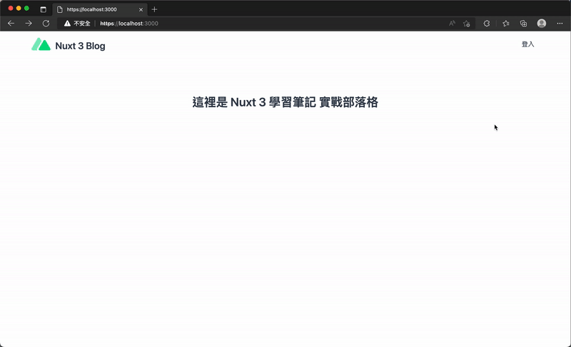
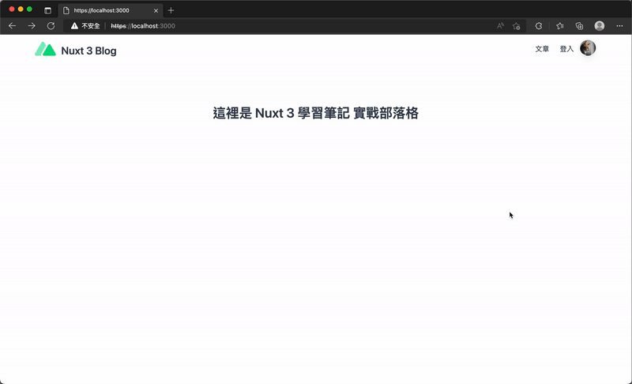
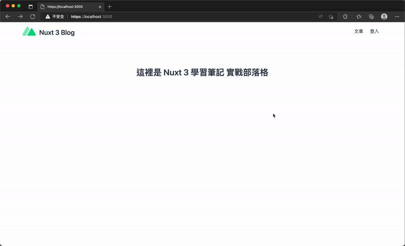

# 22. 實作部落格 - 導覽列模板與新增文章
## 前言
  主要實作「建立前台首頁與後台管理的導覽列（Navbar）」以及「建立新增文章的頁面與後端 API」。

## 預設佈局模板
  調整 `./layouts/default.vue`，增加導覽列
  ```xml
  <template>
    <div>
      <header class="flex w-full justify-center px-8 xl:px-0">
        <nav class="flex w-full max-w-7xl items-center justify-between py-2">
          <div>
            <a aria-label="TailwindBlog" href="/">
              <div class="flex items-center justify-between">
                <div class="mr-3">
                  <Icon class="h-12 w-12" name="logos:nuxt-icon" />
                </div>
                <div class="hidden h-6 text-2xl font-semibold text-gray-700 sm:block">
                  Nuxt 3 Blog
                </div>
              </div>
            </a>
          </div>
          <div class="flex items-center text-base leading-5">
            <div class="flex flex-row items-center">
              <NuxtLink
                class="px-3 py-2 text-gray-700 transition hover:text-emerald-500"
                to="/login"
              >
                登入
              </NuxtLink>
            </div>
          </div>
        </nav>
      </header>
      <slot />
    </div>
  </template>

  <script setup>
  import { useUserStore } from '@/stores/user'

  const userStore = useUserStore()
  const userProfile = computed(() => userStore.profile)
  </script>
  ```
  

## 取消或替換特定頁面的布局模板
  調整登入頁面 `./pages/login.vue`，登入頁不顯示導覽列
  ```xml
  <script setup>
  definePageMeta({
    layout: false
  })
  </script>
  ```

  > 必須將 app.vue 中的 `<NuxtLayout>` 移除，需使用的頁面再寫上 `definePageMeta({ layout: 'custom' })`

## 建立使用者選單
  - ### 安裝 headless UI
    ```sh
    npm install -D @headlessui/vue
    ```

    調整 `nuxt.config`，將 `@headlessui/vue` 新增至 `build.transpile` 屬性之中。
    ```
    export default defineNuxtConfig({
      build: {
        transpile: ['@headlessui/vue']
      }
    })
    ```

  - ### 建立使用者頭像選單元件
    新增 `./components/NavigationBar/NavigationBarAvatarMenu.vue`
    ```xml
    <template>
      <div>
        <Menu as="div" class="relative inline-block text-left">
          <div>
            <MenuButton class="inline-flex w-full justify-center">
              
            </MenuButton>
          </div>

          <transition
            enter-active-class="transition duration-100 ease-out"
            enter-from-class="transform scale-95 opacity-0"
            enter-to-class="transform scale-100 opacity-100"
            leave-active-class="transition duration-75 ease-in"
            leave-from-class="transform scale-100 opacity-100"
            leave-to-class="transform scale-95 opacity-0"
          >
            <MenuItems
              class="absolute right-0 mt-2 w-56 origin-top-right divide-y divide-gray-100 rounded-md bg-white shadow-lg ring-1 ring-black ring-opacity-5 focus:outline-none"
            >
              <div class="px-1 py-1">
                <MenuItem v-slot="{ active }">
                  <button
                    :class="[
                      active ? 'bg-emerald-500 text-white' : 'text-gray-900',
                      'group flex w-full items-center rounded-md px-2 py-2 text-sm'
                    ]"
                  >
                    <Icon
                      :active="active"
                      class="mr-2 h-5 w-5 text-emerald-400"
                      name="ri:logout-box-line"
                      aria-hidden="true"
                    />
                    登出
                  </button>
                </MenuItem>
              </div>
            </MenuItems>
          </transition>
        </Menu>
      </div>
    </template>

    <script setup>
    import { Menu, MenuButton, MenuItems, MenuItem } from '@headlessui/vue'
    </script>
    ```

    將 `<NavigationBarAvatarMenu>` 元件添加至導覽列之中。

    

## 結合使用者 Store 來控制顯示的時機
  使用者頭像選單的元件應該控制於 `使用者登入之後再顯示`，所以可以結合 `Pinia` 進行狀態管理，來檢查使用者資訊的 `store` 是否具有資料且符合判定依據再進行顯示，否則，僅需要渲染出登入的按鈕即可。

  例如，從 `User Store` 取出使用者資訊 (Profile)，並判斷是否有 `id` 來決定要顯示使用者頭像選單或登入。

  ```xml
  <template>
    <div>
      <ClientOnly>
        <NavigationBarAvatarMenu v-if="userProfile?.id" />
        <NuxtLink
          v-else
          class="px-3 py-2 text-gray-700 transition hover:text-emerald-500"
          to="/login"
        >
          登入
        </NuxtLink>
      </ClientOnly>
    </div>
  </template>

  <script setup>
  import { useUserStore } from '@/stores/user'

  const userStore = useUserStore()
  const userProfile = computed(() => userStore.profile)
  </script>
  ```

  

## 新增部落格文章
  - ### 建立文章資料表
    我們的資料庫，是透過 `Prisma` 的 `Schema` 來自動產生資料表，我們可以建立如下的 `Schema`，來作為儲存文章內容的資料表。

    `./prisma/schema.prisma`
    ```
    // ...

    // 文章
    model Article {
      id             Int      @id @default(autoincrement())
      title          String
      content        String
      summary        String
      cover          String
      tags           String
      authorId       String?
      createdAt      DateTime @default(now())
      updatedAt      DateTime @updatedAt
      User           User?    @relation(fields: [authorId], references: [id])
    }
    ```

    - #### 欄位說明如下：
      - `id`: 文章的 ID，採用自動遞增的數字。
      - `title`: 文章的標題。
      - `content`: 文章的內容。
      - `cover`: 文章的封面圖片。
      - `tags`: 文章的標籤。
      - `authorId`: 對應 `User` 資料表的 `id` 欄位，表示文章的作者。
      - `createdAt`: 文章建立時間，預設為插入該筆資料的時間。
      - `updatedAt`: 使用者更新文章資料的時間，預設為更新該筆資料的時間。

    - #### 建立資料表關聯性
      ```
      // This is your Prisma schema file,
      // learn more about it in the docs: https://pris.ly/d/prisma-schema

      generator client {
        provider = "prisma-client-js"
      }

      datasource db {
        provider = "sqlite"
        url      = env("DATABASE_URL")
      }

      // 使用者
      model User {
        id             String   @id @default(uuid())
        providerName   String?
        providerUserId String?
        nickname       String   @default("User")
        email          String   @unique
        password       String?
        avatar         String?
        emailVerified  Boolean  @default(false)
        createdAt      DateTime @default(now())
        updatedAt      DateTime @updatedAt
        Article        Article[]
      }

      // 文章
      model Article {
        id             Int      @id @default(autoincrement())
        title          String
        content        String
        summary        String
        cover          String
        tags           String
        authorId       String?
        createdAt      DateTime @default(now())
        updatedAt      DateTime @updatedAt
        User           User?    @relation(fields: [authorId], references: [id])
      }
      ```

    - #### 執行建立資料表
      ```sh
      npx prisma db push
      ```

  - ### 建立新增文章的 API
    建立 `./server/api/manage/articles.post.js`
    ```js
    import db from '../../db'

    export default defineEventHandler(async (event) => {
      const user = event.context?.auth?.user

      if (!user?.id) {
        throw createError({
          statusCode: 401,
          statusMessage: 'Unauthorized'
        })
      }

      const body = await readBody(event)

      const authorId = user.id

      const articleRecord = await db.article.createArticle({
        title: body.title,
        content: body.content,
        summary: body.summary,
        cover: body.cover,
        tags: body.tags,
        authorId
      })

      if (!articleRecord) {
        throw createError({
          statusCode: 400,
          statusMessage: 'Create article failed. Please try again later.'
        })
      }

      return articleRecord
    })
    ```

    - #### Server API 運作流程
      - 使用者將欲新增的文章資料以 `POST` 發送至 `/api/manage/articles`，伺服器中間件，將會解析 `JWT` 來得到 `user`。
      - 並判斷 `user.id` 來決定是否具有權限，如果正確解析 `JWT`，表示請求為一個已登入的使用者發送，也將放行給予新增文章。
      - 處理函數將解析 `Body` 內的資料，並建構出往資料庫新增文章記錄的內容。
      - 判斷是否新增成功，回傳新增的文章資料。

  - ### 建立文章 Prisma Client
    ```js
    async createArticle(options) {
      const articleRecord = await prisma.article
        .create({
          data: {
            title: options.title,
            content: options.content,
            summary: options.summary,
            cover: options.cover,
            tags: options.tags,
            authorId: options.authorId
          }
        })
        .catch((error) => {
          console.error(error)
          throw createError({
            statusCode: 500,
            statusMessage: 'Could not create article. Please try again later.'
          })
        })

      return articleRecord
    }
    ```

## 取得部落格文章
  - ### 建立取得所有文章的 API
    建立 `./server/api/articles.get.js`
    ```js
    import db from '../db'

    export default defineEventHandler(async () => {
      const articlesRecord = await db.article.getArticles()

      return {
        data: articlesRecord
      }
    })
    ```

    調整 `./server/db/article.js`
    ```js
    async getArticles(options = {}) {
      const articleRecords = await prisma.article
        .findMany({
          orderBy: {
            createdAt: 'desc'
          },
          skip: options.pageSize ? options.page * options.pageSize : undefined,
          take: options.pageSize
        })
        .catch((error) => {
          console.error(error)
          throw createError({
            statusCode: 500,
            statusMessage: 'Could not get article. Please try again later.'
          })
        })

      return articleRecords
    }
    ```