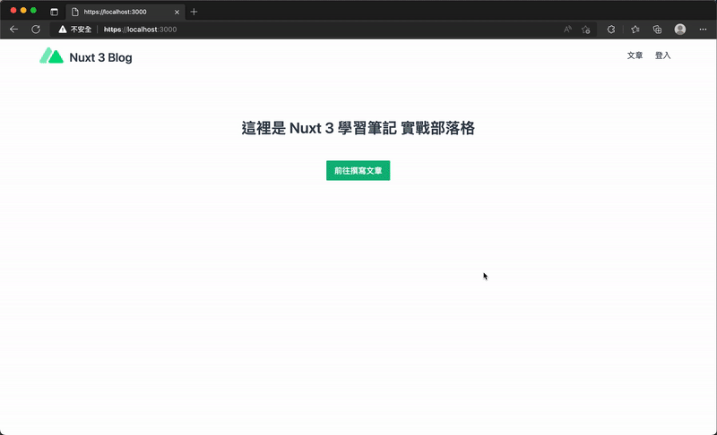

# 23. 實作部落格 - 頁面的導航守衛與切換效果
## 前言
  - 在網站開發中，部分頁面（如管理者頁面）需要瀏覽限制。
  - `Nuxt 3` 提供「`路由中間件（Route Middleware）`」，可在導航至頁面之前執行處理函數，藉此實作 `導航守衛（Navigation Guards）`。
  - 本篇亦會介紹 `Nuxt 3` 內建的 `頁面/布局切換進度條（Progress bar）`與`轉場效果（Transitions）`。

## 頁面間的導航守衛
  - ### 只允許已登入使用者新增文章
    - #### 實作方式：
      - 新增路由中間件 `./middleware/manage-auth.js`。
        ```js
        import { useUserStore } from '@/stores/user'

        export default defineNuxtRouteMiddleware(() => {
          if (import.meta.client) {
            const userStore = useUserStore()

            if (!userStore.profile?.id) {
              return navigateTo('/login')
            }
          } else {
            return navigateTo('/')
          }
        })
        ```

      - 在客戶端（`import.meta.client`）環境下，透過 `useUserStore()` 檢查使用者 `profile?.id` 是否存在。若未登入則使用 `navigateTo('/login')` 導向登入頁。

      - 若在伺服器端觸發（直接輸入網址進入），則一律重新導航至首頁（`/`）。

      - 在目標頁面（`./pages/manage/articles/create.vue`）使用 `definePageMeta({ middleware: 'manage-auth' })` 套用此中間件。
        ```js
        <script setup>
        // ...

        definePageMeta({
          middleware: 'manage-auth'
        })
        </script>
        ```

  - ### 登入完成後導回至登入前瀏覽的頁面
    - #### 實作方式：
      - 新增路由中間件 `./middleware/logged-in-redirect.js`。
        ```js
        export default defineNuxtRouteMiddleware((to, from) => {
          if (from && to.path !== from.path && !to.query.redirect_to) {
            let redirectTo = null
            if (from.query.redirect_to) {
              redirectTo = from.query.redirect_to
              from.query.redirect_to = undefined
            } else {
              redirectTo = from.fullPath
            }

            to.query.redirect_to = redirectTo

            return navigateTo(to)
          }
        })
        ```

      - 接收目標頁面（`to`）與來源頁面（`from`）。當使用者前往 `/login` 且尚未帶有 `redirect_to` 參數時，將來源的完整路徑（`from.fullPath`）記錄到 `to.query.redirect_to` 中並進行導向。

      - 在登入頁面（`./pages/login.vue`）套用該中間件。
        ```js
        <script setup>
        // ...

        definePageMeta({
          middleware: 'logged-in-redirect'
        })
        </script>
        ```

      - 登入成功後，利用 `navigateTo(route.query.redirect_to ?? '/')` 導回原本瀏覽的頁面（若無則回首頁）。
        ```js
        <script setup>
        const route = useRoute()

        const handleEmailLogin = async () => {
          // ...

          navigateTo(route.query.redirect_to ?? '/')
        }
        </script>
        ```

      

## 頁面載入進度元件
  - Nuxt 3 提供 `<NuxtLoadingIndicator>` 元件，用於在頁面導航時於網頁上方顯示進度條。

  - ### 使用方式：
    直接將元件添加至 `app.vue` 或布局中（位於 `<NuxtLayout>` 內、`<NuxtPage />` 上方）。

    ```xml
    <template>
      <NuxtLayout>
        <NuxtLoadingIndicator />
        <NuxtPage />
      </NuxtLayout>
    </template>
    ```

  - ### 可傳入屬性（Props）：
    - `color`: 進度條顏色，支援 CSS `色碼`或 `repeating-linear-gradient()`，預設為綠/藍/藍紫漸層。

    - `height`: 進度條高度（單位 `px`），預設值為 `3`。

    - `duration`: 進度條載入持續時間（單位`毫秒`），預設值為 `2000`。

    - `throttle`: 限制特定時間內僅觸發一次的隱藏與顯示機制（單位`毫秒`），預設值為 `200`。

## 頁面切換的轉場效果
  `Nuxt` 利用 Vue 內建的 `<Transition>` 元件來處理轉場動畫。

  - ### 頁面的轉場效果
    - `Nuxt` 預設為所有頁面設置了轉場。

    - #### 啟用方式：
      在 `app.vue` 中添加對應的 CSS 類別（如 `.page-enter-active`, `.page-leave-active`, `.page-enter-from`, `.page-leave-to`），預設效果可使用模糊（blur）與透明度（opacity）變化。

      `app.vue`
      ```xml
      <template>
        <NuxtPage />
      </template>

      <style>
      .page-enter-active,
      .page-leave-active {
        transition: all 0.4s;
      }
      .page-enter-from,
      .page-leave-to {
        opacity: 0;
        filter: blur(1rem);
      }
      </style>
      ```

    - 每個頁面的 `pageTransition` 預設屬性為 `{ name: 'page', mode: 'out-in' }`。
      `mode` 有 `in-out`, `out-in` 及 `default` 三種參數可選
      ```js
      <script setup>
      // ...

      definePageMeta({
        pageTransition: {
          name: 'rotate',
          mode: 'out-in',
        }
      })
      </script>
      ```

  - ### 自訂頁面的轉場
    - 可自訂不同前綴的 CSS 類別名稱（例如 `.rotate-`...）。
      ```css
      <style>
      /* ... */
      .rotate-enter-active,
      .rotate-leave-active {
        transition: all 0.4s;
      }
      .rotate-enter-from,
      .rotate-leave-to {
        opacity: 0;
        transform: rotate3d(1, 1, 1, 15deg);
      }
      </style>
      ```

    - 在特定頁面中使用 `definePageMeta({ pageTransition: { name: 'rotate' } })` 即可讓該頁面套用專屬的轉場效果（例如旋轉效果）。
      ```js
      <script setup>
      // ...

      definePageMeta({
        pageTransition: {
          name: 'rotate'
        }
      })
      </script>
      ```

  - ### 布局的轉場效果
    - Nuxt 同樣支援布局（`Layouts`）的轉場，可在 `app.vue` 中新增 `.layout-enter-active` 等 CSS 類別（例如實作灰階 grayscale 轉場）。
      ```css
      <style>
      .layout-enter-active,
      .layout-leave-active {
        transition: all 0.4s;
      }
      .layout-enter-from,
      .layout-leave-to {
        filter: grayscale(1);
      }
      </style>
      ```

    - 當切換的兩個頁面使用不同布局（例如綠色背景與藍綠色背景布局）時，就會觸發布局轉場。

    - 可透過 `definePageMeta` 中的 `layoutTransition: { name: '自訂名稱' }` 來指定自訂的布局轉場。
      ```js
      <script setup>
      definePageMeta({
        layout: 'green',
        layoutTransition: {
          name: 'slide-in'
        }
      })
      </script>
      ```

  - ### 禁用轉場效果
    可在頁面中使用 `definePageMeta` 將 `pageTransition` 或 `layoutTransition` 設為 `false` 來禁用轉場。

    ```js
    <script setup>
    definePageMeta({
      pageTransition: false
      layoutTransition: false
    })
    </script>
    ```

  - ### 全域預設的轉場效果
    可在 `nuxt.config.ts` 中進行全域配置，例如：
    ```ts
    export default defineNuxtConfig({
      pageTransition: {
        name: 'fade',
        mode: 'out-in' // default
      },
      layoutTransition: {
        name: 'slide',
        mode: 'out-in' // default
      }  
    })
    ```

    亦可在 `nuxt.config.ts` 中將兩者設為 `false` 來全域禁用。
    ```ts
    export default defineNuxtConfig({
      pageTransition: false,
      layoutTransition: false
    })
    ```
    > 屬性可參考：[TransitionProps](https://vuejs.org/api/built-in-components.html#transition)

  - ### 元件屬性傳入 transition
    - 在 `app.vue` 中，可以直接將屬性作為 `Props` 傳給元件：`<NuxtPage :transition="{ name: 'bounce', mode: 'out-in' }" />`。

    - #### 注意：
      使用此方法設定全域轉場後，無法在個別頁面中透過 `definePageMeta()` 來覆蓋該設置。

## 小結
  - 本篇主要實作導航守衛以限制特定頁面的瀏覽權限。

  - 除了前端攔截與 `Store` 驗證，實務上亦可結合 `Cookie` 於後端驗證。作者強調後端 API 同樣需要進行權限驗證，否則使用者仍可能透過直接呼叫 API 進行非法操作。

  - 透過進度條與切換轉場效果，能有效提升整體的網站使用者體驗。
