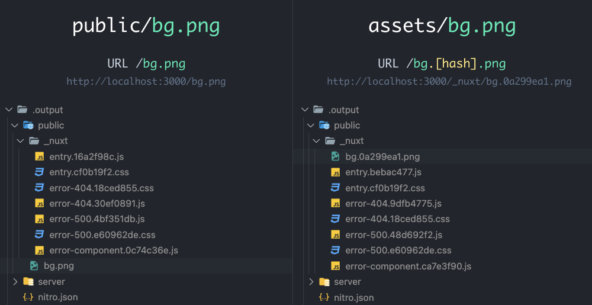

# 26. Public 與 Assets 資源目錄
## 前言
  - 在使用 `create-vue` 建立的 `Vue` 專案中，通常包含 `public` 與 src 內的 `assets` 目錄，兩者皆可用於存放不常變動的靜態資源。

  - 然而，這兩個目錄因其特性不同，建議放置的檔案類型與使用目的也有所區別。

## Nuxt 3 的靜態資源
  `Nuxt 3` 使用專案下的兩個主要目錄來處理`圖片`、`樣式（CSS/SCSS）`或`字體`等資源，分別是 `public` 與 `assets`。

  - ### public 目錄
    - #### 特性
      等同於 `Vue` 中的 `public` 目錄或 Nuxt 2 中的 `static` 目錄。

    - #### 路徑映射
      此目錄下的檔案將會由 `Nuxt` 直接映射並對應到網站的根路徑（`/`）提供存取。

    - #### 範例
      若將一張圖片放在 `./public/bg.png`，在網頁模板中直接使用 `` 即可成功讀取與顯示。

  - ### assets 目錄
    - ### 特性
      此目錄適合放置需要經過編譯工具（如 `Vite` 或 `Webpack`）進行轉換、壓縮、加工或處理的資源（例如包含 Scss/Less 的樣式表、需要優化的圖片）。

    - ### 使用別名
      在程式碼中引用 `assets` 目錄時，可使用 `~/assets` 或 `@/assets` 作為路徑別名（Alias）來代表相對路徑。

    - ### 範例
      若將圖片放置於 `./assets/bg.png`，則可在網頁中寫作：
      ```xml
      <template>
        <div>
          
        </div>
      </template>
      ```

      - 在開發環境下，該路徑會被轉換為 `/_nuxt/assets/bg.png` 並可直接訪問。

## public 與 assets 的打包差異
  - ### 快取防護（Cache Busting）：
    - #### public 目錄
      檔案在建構（Build）時會原封不動地被複製到產出目錄（`.output/public/`）下。若更新了圖片但檔名不變（依然是 `/bg.png`），可能因為瀏覽器的快取機制，導致使用者依然看到舊圖。

    - #### assets 目錄
      檔案在建構時通常會被加上一組 `雜湊值（Hash）`，例如將 `bg.png` 處理後變成 `bg.0a299ea1.png`，並放置在 .`output/public/_nuxt/` 下。每當檔案內容更新，`Hash` 都會隨之改變，能有效防止瀏覽器快取導致網站更新失效的問題。

  - ### 使用情境判斷：
    - #### 建議放置於 assets
      多數情況下的靜態資源、圖片、CSS、SFC（單一元件檔）內部引用的檔案。

    - #### 必須放置於 public
      當有例外情況不適合被加工、需要維持絕對路徑且檔名不可被更改時（例如 robots.txt、sitemap.xml 或 favicon.ico），就必須放在 `public` 目錄提供存取。

  

## 小結
  - 了解 `public` 與 `assets` 目錄的運作原理與打包後的結構差異，有助於開發者正確安排靜態資源的存放位置。

  - 善用 `assets` 目錄可以藉由編譯工具加上 `Hash` 機制，解決前端常見的瀏覽器快取問題；
  而 `public` 則是提供固定路由與特定檔案（如搜尋引擎所需的設定檔）的最佳位置。