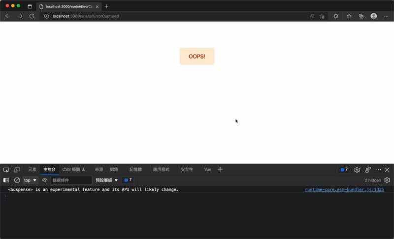

# 27. 測試 (Testing) 與錯誤處理 (Error handling)
## 前言
  - 結合測試能大幅降低網站出錯的可能性。由於撰文時官方測試工具尚未完善，本文重點將放在錯誤處理上。

  - 網站上線後難免遇到 Bug，未攔截的錯誤會導致全站 JavaScript 停止運作、喪失互動。如何捕獲錯誤並給予適當提示，是開發的重要一環。

## Nuxt 3 測試(Testing)
  - 狀態：目前測試工具處於預覽階段（Preview），API 和行為可能會發生變化，尚未準備好用於正式環境專案。如果是模組開發者可參考[模組作者指南](https://v3.nuxtjs.org/guide/going-further/modules#testing)。

  - `Nuxt 3` 重寫了 `@nuxt/test-utils`，目前發佈於 `@nuxt/test-utils-edge`，可支援 `Vitest` 與 `Jest`。

  - ### 安裝指令
    ```sh
    npm install -D @nuxt/test-utils-edge vitest
    ```

  - ### 使用方式
    在每一個 `describe` 區塊中，開始測試前需使用 `@nuxt/test-utils-edge` 提供的 `setup()` 輔助函數來取得與設置 `Test Context`。

  - ### 範例程式碼
    ```js
    import { describe, test } from 'vitest'
    import { setup, $fetch } from '@nuxt/test-utils-edge'

    describe('My test', async () => {
      await setup({ /* test context options */ })
      test('my test', () => { /* ... */ })
    })
    ```

## Nuxt 3 錯誤處理(Error handling)
  - ### Vue 渲染生命週期中的錯誤(SSR + SPA)
    - 啟用 `SSR` 時（包含後端 Vue 生命週期中發生的錯誤），可使用 `Vue` 提供的 `onErrorCaptured()` 函數註冊 Hook 來捕獲子元件拋出的錯誤。

    - 在單一檔案元件（SFC）中使用 `onErrorCaptured()` 處理完錯誤後，可透過 `return false` 來阻止錯誤向上冒泡（Bubbling）。

    ```xml
    <template>
      <div class="flex flex-col items-center bg-white py-24">
        <button @click="onError">OOPS!</button>
        <div class="mt-4 text-red-500">
          {{ errorMessage }}
        </div>
      </div>
    </template>

    <script setup>
    import { onErrorCaptured } from 'vue'

    const errorMessage = ref()

    const onError = () => {
      throw new Error('由 ButtonOOPS 元件，拋出一個錯誤！')
    }

    onErrorCaptured((err) => {
      console.error('[捕獲錯誤]', err.message)
      errorMessage.value = err.message

      return false
    })
    </script>
    ```

    

  - ### `vueApp.config.errorHandler`
    - 如果想接收 `Vue` 發生的所有頂層錯誤，可自訂一個插件（`Plugin`）來攔截。

    - #### 實作方式
      新增 `./plugins/vueErrorHandle.js`。
      ```js
      export default defineNuxtPlugin((nuxtApp) => {
        nuxtApp.vueApp.config.errorHandler = (error) => {
          console.error('[由vueErrorHandle 插件捕獲的錯誤]', error)
        }
      })
      ```

    - 元件中拋出的錯誤若沒有在底層被攔截（繼續冒泡到頂層），就會被此插件中定義的 `vue:error` 鉤子捕捉。

## Nuxt 3 錯誤處理的輔助函數
  - ### `useError`
    - #### 用途
      回傳 `Nuxt` 正在處理的全域錯誤物件（型態為 `Ref`），內含 `url`、`statusCode`、`statusMessage`、`message`、`description` 與 `data`。

    - #### 用法
      ```js
      const error = useError()
      ```

  - ### `clearError`
    - #### 用途
      清除目前 `Nuxt` 處理中的錯誤。可傳入 `options` 參數帶有 `redirect` 路徑，在清除錯誤後重導向至安全網頁（如首頁）。

    - #### 用法
      ```js
      clearError()

      // or

      clearError({ redirect: '/safe' })
      ```

  - ### createError
    - #### 用途
      用來建立一個帶有附加資訊的錯誤物件，可在 `Vue` 或 `Nitro（後端）`中使用，並透過 `throw` 拋出。

    - #### 端點差異表現
      - ##### 伺服器端（Server-side）
        拋出 `createError()` 物件時，將直接觸發客製化的全螢幕錯誤頁面。

      - ##### 客戶端（Client-side）
        拋出時預設為「非致命錯誤」。若想在瀏覽器端也觸發全螢幕錯誤頁面，必須將屬性設定為 `fatal: true`。

  - ### showError
    - #### 用途
      可在客戶端任何地方，或伺服器端的中間件、插件、setup() 內呼叫，會直接觸發全螢幕錯誤頁面。

    - #### 備註
      由於其效果與 `createError` 相同，官方建議統一改用 `throw createError()` 來建立與拋出錯誤。

## 小結
  - 測試與錯誤處理對於上線前後的專案維護至關重要。

  - 建議在建立網頁頁面、元件或 Server API 時盡量攔截錯誤，並使用 `createError` 建立適當的 HTTP 狀態碼與錯誤訊息，避免讓使用者遇到網頁完全喪失回應、需要強制重新整理的糟糕體驗。