# 1. 開始使用 AI 技術輔助搜尋廣告活動
## 1. 探索 AI 技術輔助搜尋廣告
  - ### Google 資深副總裁兼業務長 Philipp Schindler 和 Google Search Ad Automation 資深總監 Brian Burdick 的分享
    人工智慧仍然是最深刻的技術。`Google` 正在努力，我們在這個領域的持續投資，是我最興奮的事情之一。
    我對企業未來發展的意義感到興奮。對於使用 `Google` 產品的數十億用戶，以及將因持續演進的驚人能力而改變的社會而言，這都是值得的

    我還特別期待 `Google` 的人工智慧如何助力客戶實現成長和成果。
      
    讓我們看看每天搜尋的最佳範例之一，
    
    用戶可以使用鏡頭的多重搜尋來搜尋他們所看到的內容，並將這些圖像與文字結合。
    具有對話搜尋功能，他們可以透過反覆交談來尋找答案、獲得靈感或研究要購買什麼。
    先進的語言理解能力有助於 `Google` 在正確的時間提供正確的資訊。

    現在，關於這些搜尋，請記住一點。其中所多搜尋都是全新的。那麼這對行銷專業人士意味著什麼？

    這意味著您擁有前所未有的機會來分析數據，並根據不同客戶的需求量身定制您的產品。
    消費者的需求比以往任何時候都更難預測，你面臨的壓力也更大。
    現在，為了在這些不確定的時期保持競爭力，您需要將預算與獲利的成長動力相結合。

    `Google` 的人工智慧和更直觀的搜尋體驗，為消費者帶來的好消息，也意味著行銷人員可以獲得更直覺的廣告體驗。
    廣泛匹配的自適應搜尋廣告和基於價值的出價，可以幫助提高轉換率。兩者相輔相成，互相促進。
    
    理解搜尋查詢的生命週期。
    首先，使用者輸入搜尋內容。了解用戶的意圖是關鍵。以及其他訊號，例如廣告商、登陸頁面，與查詢意圖進行比較，以確保更高品質的匹配。
    這就是廣泛匹配如何看待一系列訊號匹配。
    
    用戶查詢意圖與廣告商意圖相結合，有助於將您的品牌與您可能沒有注意到的新受眾聯繫起來。
    接下來，我們了解了廣泛匹配的細微差別，考慮用戶看到的廣告。自適應搜尋廣告會整合所有優質內容、圖片、業務資訊和網站連結。
    
    行銷人員已經提供了讓他們真正脫穎而出的機會。

    `Google` 的人工智慧會利用這些所有資產，並更深入理解查詢意圖，從而組合出針對該搜尋查詢進行最佳化的響應式搜尋廣告。
    借助智能出價。`Google` 的 AI使用來自搜尋查詢意圖的上下文。廣告商意圖和添加成分有助於透過預測未來的廣告轉換及其價值來通知出價。
    
    此外，透過基於價值的競標，`Google` 的 AI 可以與您的行銷資料無縫連接，將您的廣告與對您的業務最有價值的客戶進行配對。
    透過結合廣泛匹配基於價值的出價和搜尋廣告的回應，您可以充分利用 `Google` 的 AI 功能，從而增加您的專業知識、釋放新的需求並透過搜尋廣告獲得有意義的結果。
    
    工具，人工智慧不僅僅是未來需要思考的事情。它從我們早期開始就是搜尋的一部分，並且他可以為您的業務帶來獲利成長。

## 2. 瞭解 AI 技術輔助搜尋廣告的價值
  - ### 瞭解 Google 搜尋廣告的價值
    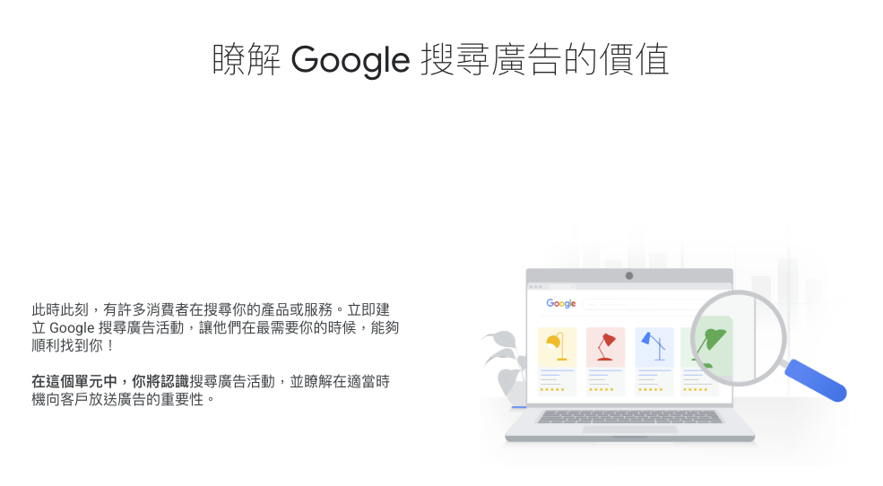
    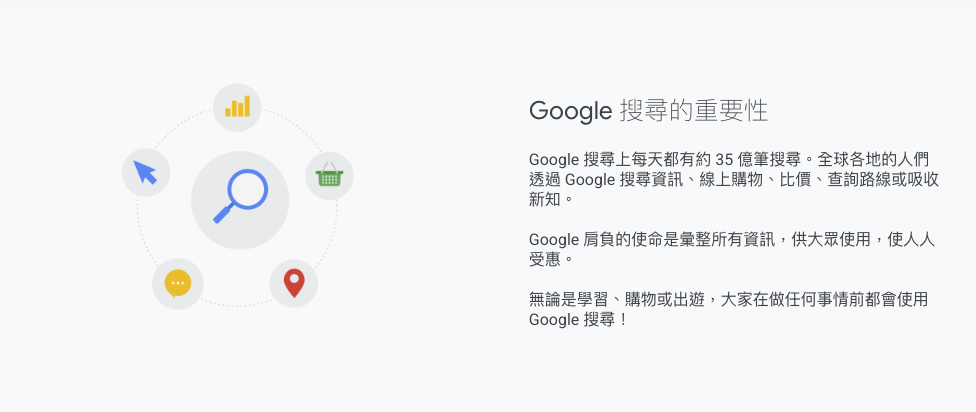

    - #### 將使用者意圖化為業務成果
      有了 `Google` 搜尋廣告活動，就能在使用者搜尋產品或服務時，在搜尋結果旁顯示自家廣告。

    - #### `Google` 搜尋廣告如何拉近你和客戶的距離？
      讓我們看看潛在買家小路的購物歷程，藉此瞭解 Google 搜尋廣告的運作方式。住在市區一段時間後，小路決定要騎單車上班，不過該買哪一輛腳踏車呢？
      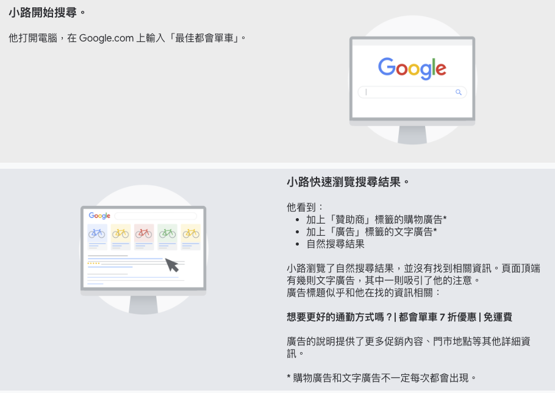
      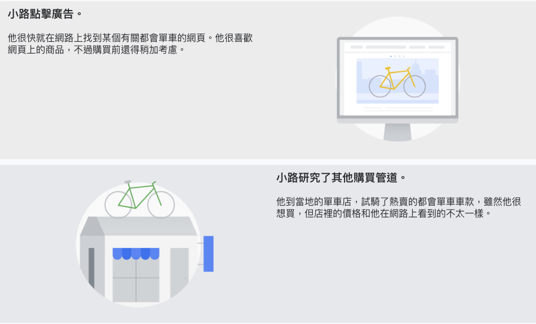
      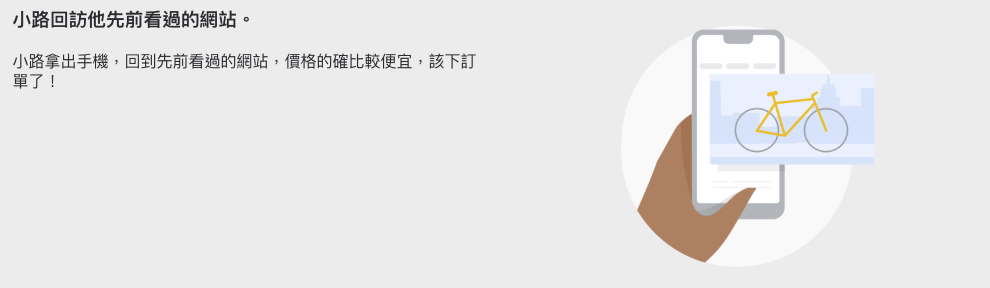

    - #### 隨堂測驗
      - 1. 吸引小路購買單車的原因是什麼？
        - 1. 小路在實體店面看到那輛單車，然後重返網站查看同款商品
        - 2. 文字廣告上的標題很吸引人
        - 3. 小路點擊廣告，抵達正確的頁面
        - 4. 廣告客戶建立了 Google 搜尋廣告活動
        :::details 解答
        以上都是吸引小路購買單車的原因。他使用 Google 搜尋來研究車款，因此看見了廣告客戶為自家搜尋廣告活動建立的吸睛標題。
        小路逛了實體商店後，又回到廣告客戶的網站上下單。
        :::

      - 2. 你的商家是否適合放送 `Google` 搜尋廣告活動？
        - 1. 你希望使用者在研究及比較不同的購買管道時，能看到你的商家嗎？
        - 2. 你希望使用者在尋找你供應的同類產品或服務時，剛好看到你的商家嗎？ 
        - 3. 你希望使用者在搜尋類似商家時，搜尋結果中也會顯示你的商家嗎？
        - 4. 你想瞭解使用者會搜尋什麼內容、和哪些廣告互動，藉此掌握充分資訊，做出明智的決策，為使用者的生活增添價值嗎？
        :::details 解答
        只要有勾選其中一個項目，`Google` 搜尋廣告活動就是你的絕佳選擇。
        :::

      - 3. 下列何者最能說明 `Google` 搜尋廣告活動的價值？
        - 1. 讓使用者在尋找你供應的同類產品或服務時，剛好看到你的商家。
        - 2. 讓使用者利用 `Google` 搜尋研究及比較不同的購買管道時，能看到你的商家。
        - 3. 讓你的商家隨著其他類似商家一起出現在 `Google` 搜尋結果中。
        - 4. 以上皆是
        :::details 解答
        4. 以上皆是
        :::

  - ### 重點整理
    - `Google` 搜尋上每天都有約 35 億筆搜尋。
    - 有了 `Google` 搜尋廣告活動，就能在使用者搜尋產品或服務時，在搜尋結果旁顯示自家廣告。

## 3. 建立 AI 技術輔助的搜尋廣告活動
  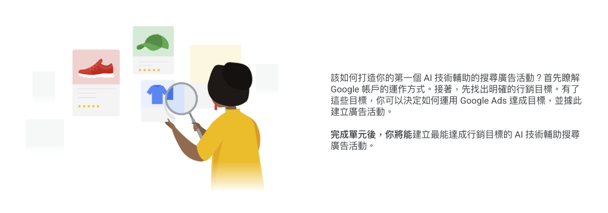

  - ### Google Ads 帳戶的架構
    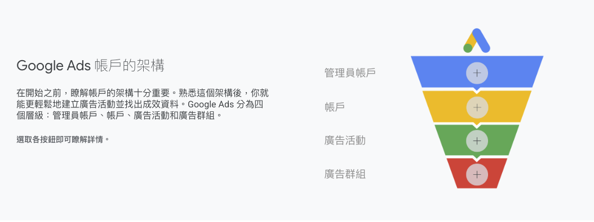
    - #### 管理員帳戶
      部分廣告主會管理多個 Google Ads 帳戶。為了從單一位置輕鬆查看及管理 Google Ads 帳戶，廣告主可以選擇建立管理員帳戶，進而節省在報表、存取權控管與合併帳單方面花費的時間。如要瞭解詳情，包括如何建立管理員帳戶，請參閱這篇[說明中心文章](https://support.google.com/google-ads/answer/7459399)。

    - #### 帳戶
      帳戶是由多個廣告活動所組成，每個帳戶都有專屬的電子郵件地址、密碼和帳單資訊。想為你的商家管理多個帳戶嗎？如要進一步瞭解如何建立及管理管理員帳戶，請參閱這篇[說明中心文章](https://support.google.com/google-ads/answer/6139186)。

    - #### 廣告活動
      廣告活動是由多個廣告群組所組成。每個廣告活動都有各自的預算，還有可決定廣告顯示位置的各項設定。

    - #### 廣告群組
      廣告群組內含一組類似的廣告和關鍵字，後者是指可觸發廣告放送的字詞。

  - ### 廣告活動的三個關鍵要素
    廣告活動的三個要素為 `指定目標`、`廣告格式` 及 `出價策略`。熟悉各個要素後，就能運用於廣告活動中。
    - #### 指定目標
      使用目標對象解決方案和關鍵字來觸及目標對象。前者是可協助你增加消費者觸及率的工具，後者則可用來比對廣告與消費者搜尋的字詞。
      
      此外還有兩種廣告活動可協助你擴大觸及範圍：`動態搜尋廣告 (DSA)` 和 `最高成效廣告活動`。這兩種廣告活動不含關鍵字、已啟用搜尋，且都會使用 Google AI 來達成觸及增量，幫助你迅速拓展業務。

    - #### 廣告格式
      使用回應式搜尋廣告，在消費者搜尋產品或服務的當下，向他們介紹相關內容。採用回應式搜尋廣告時，`Google AI` 會使用你提供的廣告標題、說明和圖片 (合稱素材資源) 來製作與消費者目標對象相關的廣告。

    - #### 出價策略
      根據行銷目標使用最合適的出價策略。為爭取更高的轉換量或轉換價值，`Google AI` 會採用「`智慧出價`」這套出價策略。

  - ### 我們和小艾一起來建立 AI 技術輔助的搜尋廣告活動
    

  - ### 首先考量小艾的行銷目標
    AI 技術輔助的搜尋廣告有多種方法可協助你達成行銷目標，但首先你需要確定想達成的業務成果，這樣才能針對目標最佳化及評估廣告活動成效。
      
    一起來看看一些行銷目標。留意何者最符合小艾的業務目標。

    - #### 待開發客戶
      鼓勵消費者採取行動來提高轉換率。
      
      例如，致力於吸引客戶上網站詢價的保險公司。

    - #### 銷售
      提升線上通路、應用程式內購、實體通路或電話通路的銷售量。
      
      例如，想提高實體店面單車與配件銷售量的單車連鎖店。

    - #### 網站流量
      吸引目標客群造訪網站。
      
      例如，想增加網站訪客人數，進而提升品牌知名度的新飯店。

    > 根據你對小艾商店大型宣傳活動的瞭解，他們的目標是增加銷售量。

  - ### 建立搜尋廣告活動並選擇目標
    確定小艾的廣告活動目標後，就能在 `Google Ads` 建立 AI 技術輔助的搜尋廣告活動。請根據你對小艾目標的瞭解，決定廣告活動的重點和設定。
      
    注意：螢幕截圖中的範例資料僅供參考。

    - #### 步驟 1：新增廣告活動
      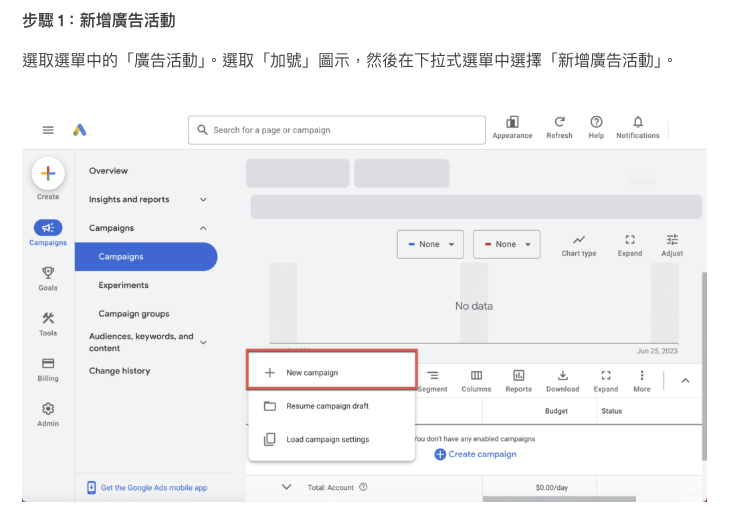
    
    - #### 步驟 2：選擇廣告活動目標
      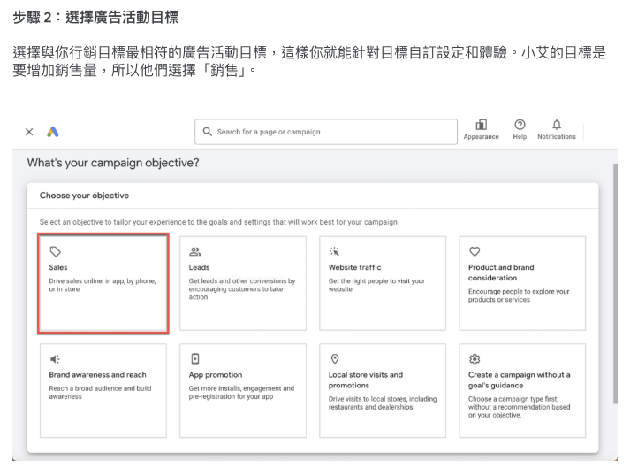

    - #### 步驟 3：選擇廣告活動類型
      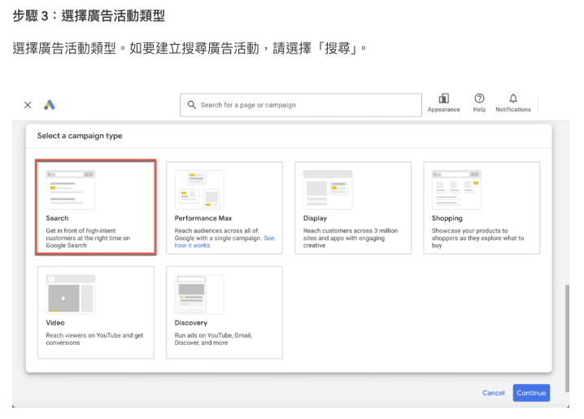

    - #### 步驟 4：選擇目標達成方式
      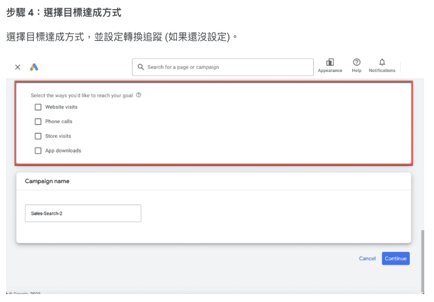

    - #### 步驟 5：設定廣告活動名稱
      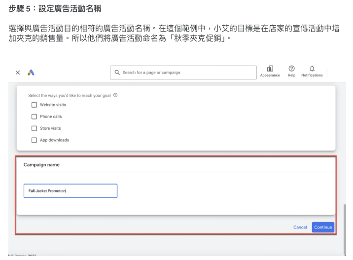

  - ### 分門別類
    你或許記得小艾店家的宣傳活動包括鞋子和手提包。他們希望為各項產品提供特定訊息並最佳化投資報酬率，因此小艾應該為每個產品系列建立單獨的廣告活動。在這個範例中，他們先從夾克著手。

  - ### 選取廣告活動設定並設定廣告
    現在來為小艾的廣告活動選取最適合的設定。過程中，你可以使用畫面左側的選單前後瀏覽設定。

    - #### 步驟 6：出價
      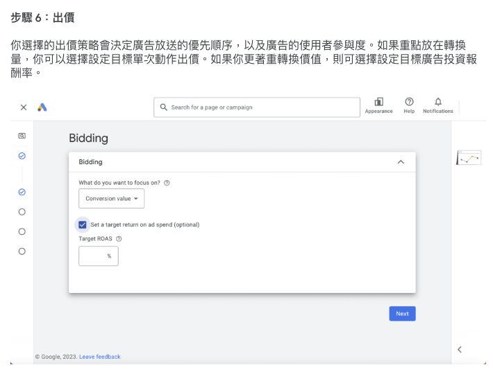

    - #### 步驟 7：選擇聯播網
      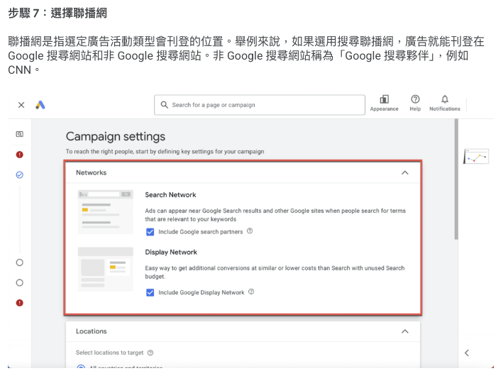

    - #### 步驟 8：選擇地區和語言
      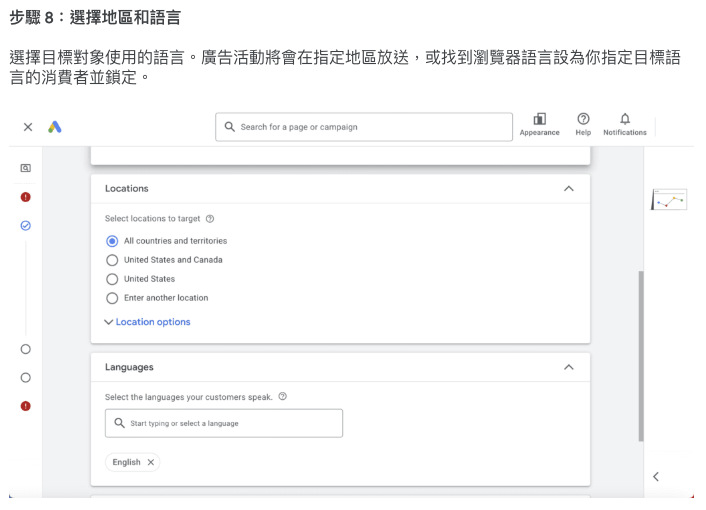

    - #### 步驟 9：建立廣告群組
      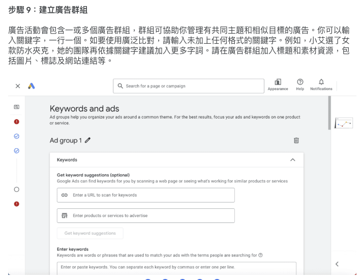

    - #### 步驟 10：設定預算
      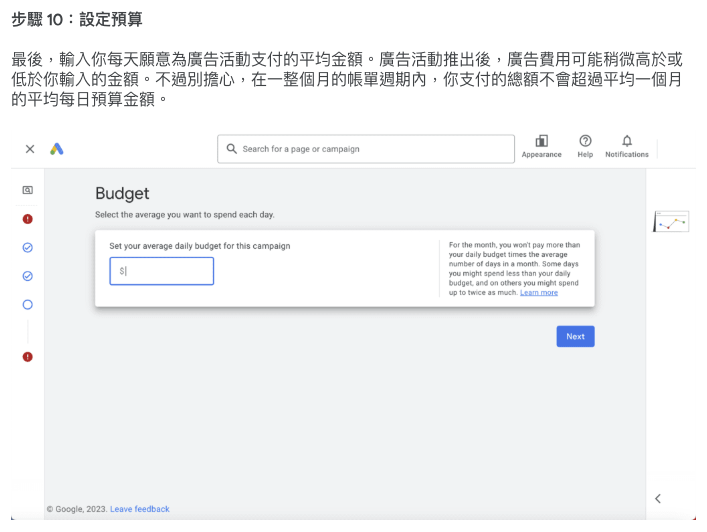

  > 當廣告活動類型設為「搜尋」時，你會發現最高成效廣告活動出現。採用 AI 技術輔助的搜尋廣告活動與最高成效廣告活動，兩者相輔相成，可進一步發揮 `Google Ads` 的強大威力，在所有 `Google` 平台上盡量爭取轉換。首先以廣泛比對和以價值為準的出價，強化 AI 技術輔助的搜尋廣告。再來瞭解如何運用 `Google AI` 擴張你的影響力。

  - ### 學以致用
    你是台北市一間披薩店的老闆，想以每個月 `NT$10,000` 元的廣告支出金額，提高當地客戶的訂單量。你應該使用下列哪兩項廣告活動設定？
    - 1. 地區設定設為「台灣」
    - 2. 預算設為每日 NT$330 元
    - 3. 地區設定設為「台北市」
    - 4. 廣告活動名稱設為「台北市披薩」
    :::details 解答
    2、4
    :::

  - ### 重點整理
    - `Google Ads` 分為四個層級：`管理員帳戶`、`帳戶`、`廣告活動` 和 `廣告群組`。
    - 製作廣告活動的第一步，是根據行銷目標設定 `Google Ads`。搜尋廣告活動能協助你達成各種行銷目標，例如提高銷售量、吸引待開發客戶和增加網站流量。
    - 搜尋廣告活動由三個要素組成：`指定目標`、`廣告格式` 及 `出價策略`。你也可以透過 `地區` 和 `語言` 設定，調整廣告活動的觸及範圍。
    - 廣告活動的每日預算由你掌控。你可以將預算調整成自己能接受的支出金額，設定時請留意每個月的支出總額。
    - 建議你採用架構相關的最佳做法來整理廣告活動，像是簡化報表或將廣告群組分類。

## 資源
  - [建立廣告活動 | Google 說明中心 ↗](https://support.google.com/google-ads/answer/6324971)
  - [建立良好基礎，發揮 AI 力量 | Google Ads 說明中心 ↗](https://support.google.com/google-ads/answer/13580022?#zippy=%2Cget-ready-with-the-right-foundation%2Ctake-action-to-maximize-results-with-ai-powered-campaigns%2Cshift-mindsets-to-set-your-org-up-for-success)
  - [Google 最佳做法 | Google 說明中心 ↗](https://support.google.com/google-ads/answer/6154846)
  - [Google Ads 管理員帳戶簡介 | Google Ads 說明中心 ↗](https://support.google.com/google-ads/answer/6139186)
  - [設定成效出色的廣告活動 | Google 說明中心 ↗](https://support.google.com/google-ads/answer/9451609)
  - [智慧出價指南 | Google 說明中心 ↗](https://support.google.com/google-ads/answer/11095984)
  - [Google 目標對象解決方案簡介 | Google Ads 說明中心 ↗](https://support.google.com/google-ads/answer/7640036?#:~:text=Using%20audience%20information%2C%20like%20age,search%2C%20display%2C%20and%20video.)
  - [運用搜尋與最高成效廣告活動，加倍提升成效 | Google Ads 說明中心 ↗](https://support.google.com/google-ads/answer/13602916?)
