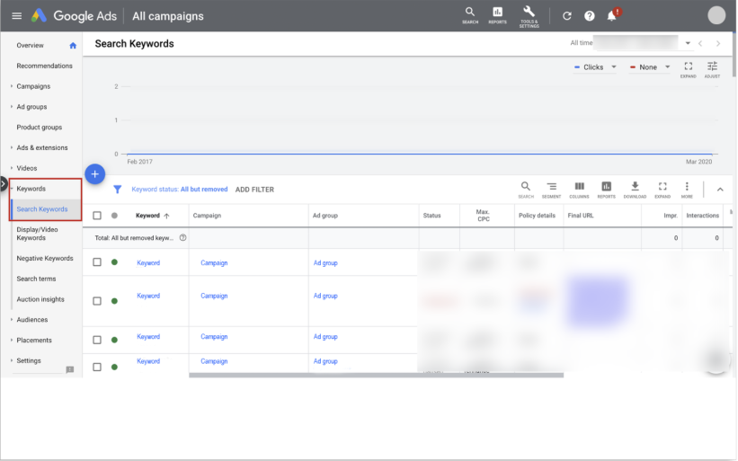
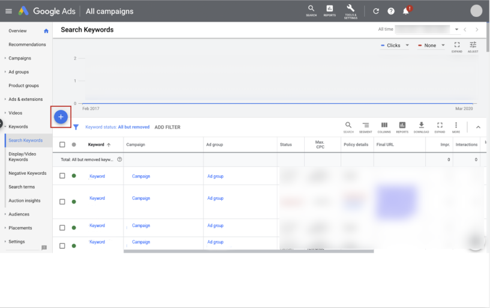
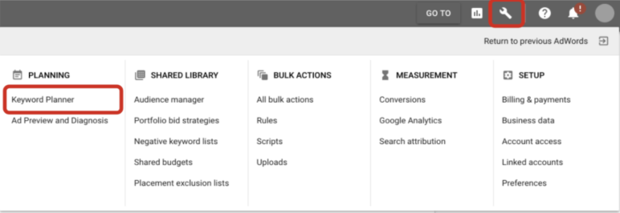

# 3. 以 AI 技術輔助搜尋廣告吸引使用者
## 1. 擬定關鍵字策略，有效觸及使用者
  你可以找出消費者可能會用來尋找貴商家的搜尋字詞，藉此擬定有效的關鍵字策略，依據客戶的查詢內容放送相關廣告。

  完成本課程後，你將瞭解如何擬定關鍵字策略，達成搜尋廣告活動的目標。
  - ### 擬定有效的關鍵字策略
    每天都有消費者透過 `Google` 搜尋尋找想要的產品和服務。搜尋產品或服務時，使用者通常會使用不同的詞彙組合來描述自己的需求。這些詞彙稱為「搜尋字詞」，不同的搜尋字詞會產生不同的搜尋結果。使用者輸入的搜尋字詞與你在帳戶中建立的關鍵字清單相符時，系統就有可能放送你的廣告。

    舉例來說，如果小玲在銷售運動鞋的公司工作，就可以在 `Google Ads` 廣告活動中將「慢跑鞋」設為關鍵字。使用者在 Google 上輸入搜尋字詞「慢跑鞋」後，系統會依據多項因素，決定是否在搜尋結果網頁上顯示她的廣告。一起來看看吧！

  - ### 如何使用關鍵字比對類型？
    擬定關鍵字策略時，你可以選擇使用不同的關鍵字比對類型。由於小玲準備為網球鞋製作新的廣告活動，現在就讓我們進一步瞭解她可以使用的比對類型，並透過幾個例子看看這些選項如何帶出適合向使用者放送的廣告。

    - #### 完全比對 `[網球鞋]`
      如果搜尋字詞與關鍵字的含意或意圖相同，系統就有可能會放送廣告。在三種關鍵字比對選項中，「`完全比對`」可讓你充分掌控哪些目標對象能看到你的廣告，但觸及的搜尋量較「`詞組比對`」與「`廣泛比對`」低。

      - **示例**：「`網球鞋評論`」、「`紅色網球鞋`」或「`網球運動鞋`」這類搜尋字詞無法觸發這位廣告客戶的廣告。只有使用者搜尋「網球鞋」時，這則廣告才會出現。

      - **優點**：儘管流量可能會受限，但你可以透過這個比對類型，進一步掌握與廣告相符的搜尋字詞。

      - **設定方式**：在字詞前後加上方括號 (`[ ]`)。

    - #### 詞組比對 `"網球鞋"`
      如果搜尋字詞包含關鍵字的含意，系統就有可能會放送廣告。即便使用者搜尋的是更具體明確的字詞，只要關鍵字的意義可從上下文推敲，廣告就可能會出現。使用「`詞組比對`」時，觸及的搜尋量會多於「`完全比對`」，但少於「`廣泛比對`」。你可以使用這種比對方式，只讓包含自家產品/服務字詞的搜尋查詢帶出廣告。

      - **示例**：「網球童鞋」這個搜尋字詞無法觸發這位廣告客戶的廣告，但「網球鞋評論」可以。
      
      - **優點**：這個比對類型可確保搜尋字詞符合指定關鍵字的核心概念，而且帶來的流量比 `完全比對關鍵字` 更多。

      - **設定方式**：在字詞前後加上半形引號 (`" "`)。

    - #### 廣泛比對 `網球鞋`
      搜尋字詞即使未包含關鍵字在內，只要是與關鍵字相關，系統就有可能會放送廣告。這個比對類型有助於吸引更多網站訪客、縮短建立關鍵字清單所需的時間，並能讓你將資金投注在真正有效的關鍵字上。
      
      - **示例**：「網球鞋」、「網球運動服飾」、「二手網球鞋」和「評價最高的網球配備」等搜尋字詞均會觸發這則廣告。

      - **優點**：這個比對類型可讓你觸及搜尋貴商家產品或服務的消費者，不僅涵蓋人數最多，而且不必費時新增多個關鍵字。「`廣泛比對`」搭配自動出價策略使用時的成效最佳。

      - **設定方式**：所有關鍵字均 `預設` 採用「`廣泛比對`」類型，因此不必另行指定「`完全比對`」、「`詞組比對`」或「`排除比對`」等其他比對類型。

  - ### 近似變體
    `近似變體` 是指 `與特定關鍵字相似 但 非完全相同` 的字詞，所有正面關鍵字比對類型均能與近似變體達成比對。目前所有比對類型皆以語意為依據；
    也就是說，關鍵字是依照查詢的意義擴大涵蓋範圍，而不是依據查詢結構。

    近似變體讓你不必建立詳盡的關鍵字清單，就能觸及正在尋找貴商家的消費者，即便他們使用的搜尋字詞略有不同也能觸發廣告。比對類型的近似變體可能包含：
    - 錯別字
    - 單複數形式
    - 字根變化 (例如「地板」和「地板材料」)
    - 縮寫
    - 重音符號

    如要進一步瞭解近似變體，請造訪 [Google 說明中心](https://support.google.com/google-ads/answer/9342105)。

    > 你不必在廣告群組中，針對 `完全比對`、`詞組比對` 和 `廣泛比對` 加入同一個關鍵字，因為與廣泛比對關鍵字相符的搜尋查詢，也會與完全比對和詞組比對關鍵字相符，且廣泛比對涵蓋的範圍更廣。

  - ### 改用廣泛比對策略
    視你目前的關鍵字策略而定，有多種方法能協助你成功調整關鍵字策略，改以「`廣泛比對`」類型為主。
    - #### 我想使用標準的測試解決方案來測試廣泛比對
      - 「`建議`」頁面中一鍵執行實驗，測試新增的廣泛比對關鍵字。
      - 系統隨即會自動建立實驗。控制組會將目前的廣告活動保持原樣並繼續放送，實驗組則會加入現有`完全比對`/`詞組比對`關鍵字的廣泛比對版本。
      - 請務必使用廣告活動採用的自動出價策略定義目標。
      - 讓系統進行實驗，直到有統計顯著性的結果產生。原則上，請等到 `30 天`內獲得 `30 次`轉換為止。評估成效時，別忘了排除適應期 (通常約為 `7 天`)，並讓系統執行測試至少 `3` 到 `4` 週或更久，以便獲得具統計顯著性的實驗結果。
      - 根據先前定義的 `KPI` 評估指標衡量實驗結果，藉此確保關聯性，並進一步將廣泛比對的套用範圍擴大至多個廣告活動或帳戶。

    - #### 我想為廣泛比對測試指定更多自訂設定
      - 找出測試廣告活動，然後使用 [自訂實驗](https://support.google.com/google-ads/answer/6261395?ref_topic=6319800) 選項，手動將關鍵字升級為`廣泛比對`。
      - 請務必在所選的廣告活動中取消預算限制。如果預算受限，可能就無法發揮實際的升幅潛力。
      - 決定成效目標，並在整個測試階段固定採用該目標。手動調整設定可能會造成干擾，導致實驗無法成功。
      - 為盡可能提高觸及數，請避免新增排除關鍵字，或是以任何方式限制廣告放送。
      - 實驗數據彙整完畢後，請評估結果，並進一步將廣泛比對的套用範圍擴大至多個廣告活動或帳戶。

    - #### 我已經準備好擴大廣泛比對的套用範圍
      - 請開始採用最佳化建議。如果升級關鍵字可望讓廣告活動獲得更多轉換，則系統會針對該廣告活動顯示新增廣泛比對關鍵字的建議，方便你排定工作的優先順序。由於廣泛比對已經涵蓋與完全比對/詞組比對相符的查詢，你可以選擇採納「`移除多餘關鍵字`」的建議，將冗餘的完全比對和詞組比對關鍵字移除。
      - 你可以自動套用最佳化建議，在多個廣告活動中啟用 `廣泛比對`，這樣不僅能省下手動導入的麻煩，還能確保採用最佳做法。

  - ### 開始設定：擬定關鍵字策略
    - #### 步驟 1：
      在「總覽」頁面上，依序選取「關鍵字」和「搜尋關鍵字」。
      

    - #### 步驟 2：
      選取「加號」按鈕，然後選擇要新增關鍵字的「廣告活動」和「廣告群組」。
      

    - #### 步驟 3：
      輸入關鍵字。或者，你也可以前往 `Google Ads` 介面上的「`規劃`」分頁，並選用關鍵字規劃工具，藉此探索關鍵字、估算流量，以及建立 `Google` 搜尋廣告活動。

      如要使用關鍵字規劃工具，請選取「`工具`」圖示。接著利用任意客戶 ID，在 `Google Ads` 介面中選取「`關鍵字規劃工具`」。

      

  - ### 最佳化分數實用秘訣
    `最佳化分數建議` 有助你找出改善關鍵字策略的方法，例如新增關鍵字、移除重複關鍵字、新增排除關鍵字，或是解決衝突的排除關鍵字等等。

  - ### 隨堂測驗
    假設你任職於某家鞋子公司，因為想要打入兒童足球釘鞋市場而放送廣告，以下各個關鍵字分別符合哪個比對類型？

    - **廣泛比對**：不必使用任何符號，即可讓系統識別廣泛比對關鍵字。在這個示例中，兒童足球釘鞋即為廣泛比對關鍵字。
    - **廣泛比對修飾符**：必須使用加號 (+)，才能讓系統識別廣泛比對修飾符。在這個示例中，+兒童 +足球 +釘鞋即為廣泛比對修飾符關鍵字。
    - **詞組比對**：必須使用半形引號 (" ")，才能讓系統識別詞組比對關鍵字。在這個示例中，"兒童足球釘鞋" 即為詞組比對關鍵字。
    - **完全比對**：必須使用方括號 ([ ])，才能讓系統識別完全比對關鍵字。在這個示例中，[兒童足球釘鞋] 即為完全比對關鍵字。

  - ### 最佳做法
    只要在廣告活動中設定合適的關鍵字清單，就能向合適的消費者放送切合需求的廣告。設定關鍵字時，請記得選用消費者會用來尋找貴商家產品/服務的字詞。
    
    以下介紹幾個最佳做法，幫助你建立成效良好的關鍵字清單。

    - #### 以目標對象的角度考量
      建立關鍵字清單時，應該全盤思考潛在消費者可能用來搜尋貴商家的各種字詞。

    - #### 按照主題將關鍵字分門別類
      只要建立定義明確的關鍵字群組，你就能更輕鬆地管理及維護帳戶，同時放送更相關的廣告。
      舉例來說，假設你經營鞋店，可以按照以下方式將廣告活動分類：

      - 廣告群組 1：慢跑鞋
        - 關鍵字 1：慢跑鞋
        - 關鍵字 2：跑鞋
        - 關鍵字 3：運動鞋

      - 廣告群組 2：晚宴鞋
        - 關鍵字 1：晚宴鞋
        - 關鍵字 2：高跟鞋
        - 關鍵字 3：西裝鞋

    - #### 查看搜尋字詞報表
      這份報表可協助你瞭解哪些查詢會在搜尋聯播網上觸發廣告。
      
      搜尋字詞報表可用來構思新的關鍵字，並找出可能需要使用排除關鍵字的情況。如要進一步瞭解這份報表，請造訪 [Google 說明中心](https://support.google.com/google-ads/answer/2472708)。

    - #### 使用排除關鍵字
      `排除關鍵字` 可防止不相關的搜尋在符合查詢條件時觸發廣告。
      你可以新增 `排除關鍵字` 來減少不需要的流量，集中針對所需的搜尋類型放送廣告。
      
      舉例來說，假設你販售的是男用運動鞋，但商品項目不含足球釘鞋，則可將「釘鞋」設為排除關鍵字。
      請謹慎在廣告活動中新增排除關鍵字，因為這類關鍵字可能會一併限制尚未考慮到的其他搜尋。

  - ### 學以致用
    正確回答這個問題即可完成本單元。

    你是銀行的行銷經理，為了提高申辦新信用卡的人數，特地建立了搜尋廣告活動。廣告活動經過幾週放送後，你設法提高成效。

    下列哪兩項策略有助於你提高廣告活動成效？

    - A. 在廣告活動的各個廣告群組中，納入至少 50 個新的關鍵字。
    - B. 新增排除關鍵字來避免任何不必要的流量。
    - C. 使用搜尋字詞報表，找出成效良好的關鍵字。
    - D. 暫停使用所有現有的關鍵字，並改用新的關鍵字。
    :::details 解答
    B. C.
    :::

  - ### 重點整理
    - `Google Ads` 搜尋廣告活動能以多種關鍵字類型觸及已知和未知的查詢。
    - 建議你依據業務目標，按照主題和比對類型將關鍵字新增至廣告群組。
    - 你可以透過多種方式提升關鍵字的成效，例如運用排除關鍵字、搜尋字詞報表，以及帳戶最佳化分數提供的建議。

  - ### 資源
    如要進一步瞭解這個主題，請選取下列連結。

- [建立關鍵字清單的基本訣竅 | 說明中心 ↗](https://support.google.com/google-ads/answer/2453981)
- [改善關鍵字清單 | 說明中心 ↗](https://support.google.com/google-ads/answer/6337820)
- [新增、編輯或移除關鍵字 | 說明中心 ↗](https://support.google.com/adwords/answer/2453980)
- [最佳化分數簡介 | 說明中心 ↗](https://support.google.com/google-ads/answer/9061546)
- [Google 最佳做法 | 說明中心 ↗](https://support.google.com/google-ads/answer/6154846)
- [使用排除關鍵字過濾無效流量 | Google 說明中心 ↗](https://support.google.com/google-ads/answer/6167105)

## 2. 用廣泛比對發掘全新商機
  `廣泛比對` 已歷經大幅升級。這種比對類型不停地在演變，越來越能掌握搜尋查詢意圖、額外信號和關鍵字變體的關聯性。

  如今，`廣泛比對` 會找出高成效的新查詢及新興趨勢，協助行銷人觸及更多消費者並取得更好的成果。

  完成本單元後，你將能依循最佳做法，在 AI 技術輔助的搜尋廣告活動中導入廣泛比對。

  - ### 探索廣泛比對如何演變
    `廣泛比對` 能為廣告主提升觸及率並節省時間，不需管理相同關鍵字的多個變體。
    聽聽行銷人和專家討論下列主題：廣泛比對的重新設計；行銷人如何透過測試，進一步瞭解這種比對類型找到新查詢的潛力。

    - #### 影片內容
      - 過去的「次佳結果」導致懷疑：
        - 多年前，廣泛比對曾產生「非常次佳的結果 (very sub-optimal results)」，這導致了高度的懷疑態度，使得人們對於重新嘗試廣泛比對感到猶豫。
        - 過去，使用者可能需要手動建構關鍵字與搜尋字詞之間的配對，以確保搜尋的相關性。

      - 廣泛比對的改進與智慧出價的發展：
        - Google 透過電子郵件告知，廣泛比對現在會考慮更多過去未曾考慮的額外訊號 (extra signals)。
        - 隨著時間的推移，自動化出價 (automated bidding) 的發展也日趨完善，並能整合各種不同的訊號。這使得過去對廣泛比對的不信任，可以轉變為像信任自動化出價管理資金一樣，去信任它管理所顯示的搜尋字詞。
        - 現今，系統會使用許多額外訊號來判斷搜尋是否真的與您的業務相關，這些訊號包括轉換訊號 (conversion signals)、位置訊號 (location signals) 和一天中的時段訊號 (time of day) 等。

      - 克服懷疑並實現更好結果的方法：
        - 透明化與深入探討：
          - 公開演算法的運作方式：與客戶和團隊分享演算法的運作方式、優先順序以及所使用的不同訊號。
          - 緊跟生態系統發展：確保您與 Google 搜尋生態系統一同演進。

        - 數據導向而非假設導向：
          - 鼓勵以數據為基礎 (data driven) 的決策，而不是基於假設。

        - 測試與實踐：
          - 即使過去的經驗令人沮喪，也鼓勵實際測試 (test) 新的方法。
          - 以業務目標為導向：重點是達到最終的業務目標，如果人工智慧 (AI) 能幫助更快、更有效地實現這一目標，就應該運用它。
          - 影片中提及，他們曾與一位客戶進行測試，並立即獲得了顯著的成果 (instant results)。測試後，原先持懷疑態度的團隊成員也轉變為廣泛比對的「忠實擁護者」。

        - 協作討論：
          - 與代理商和團隊討論數據點 (data points)，進行協作討論，以說服他們測試新事物。

        - 心態轉變：
          - 最大的心態轉變是從過去的「修修補補 (tinkering)」轉變為對系統有全面的理解 (holistic understanding)。
          - 這包括了解如何向系統提供有價值的資訊，並給予它學習的空間。
          - 這種轉變讓您可以退一步，從更宏觀的角度看待您對業務的影響。

        - 向系統提供有價值的資訊：
          - 有更多機會向系統提供對您的業務重要的資訊。
          - 您可以輸入的數據包括：`轉換價值 (conversion values)`、`第一方數據 (first party data)` 或`離線轉換 (offline conversions)`。

  - ### 你知道嗎？
    `廣泛比對` 搭配以價值為準的 `智慧出價` 時效果很好。事實上，在採用智慧出價的廣告主中，有 75% 也對文字廣告使用廣泛比對。

  - ### 廣泛比對搭配智慧出價能協助行銷人充分發揮成效
    廣泛比對與智慧出價能一同協助爭取有價值的流量，並簡化帳戶管理工作。來思考廣泛比對搭配智慧出價，以及其他比對類型之間的差異。
    
    讓我們以網球鞋為例。
    - #### 完全比對
      - 定義：如果搜尋字詞與關鍵字的含意或意圖相同，系統就有可能會放送廣告。這種類型僅提供嚴格比對。
      - 示例：關鍵字放在括號內，如 [網球鞋]。如果選擇完全比對，只有「網球鞋」搜尋字詞才可能會觸發廣告。
      - 競價影響：Google Ads 競價會考慮某些信號，依循語意上的產品定義。

    - #### 詞組比對
      - 定義：如果搜尋字詞與關鍵字的含意或意圖相同，系統就有可能會放送廣告。這種類型僅提供嚴格比對。
      - 示例：關鍵字放在括號內，如 [網球鞋]。如果選擇完全比對，只有「網球鞋」搜尋字詞才可能會觸發廣告。
      - 競價影響：Google Ads 競價會考慮某些信號，依循語意上的產品定義。

    - #### 廣泛比對
      - 定義：如果搜尋字詞與關鍵字相關，即使關鍵字未出現在查詢中，系統也可能會放送廣告。廣泛比對關鍵字能提供全面比對，不僅涵蓋其他比對類型的相同查詢，且範圍更廣。
      - 示例：關鍵字為「網球鞋」且不帶任何標記。「網球鞋」、「網球運動服飾」、「二手網球鞋」或「評價最高的網球配備」等搜尋字詞，均會觸發這則廣告。
      - 競價影響：廣泛比對會為競價期間和查詢層級比對採用所有可用的信號。透過智慧出價，這種信號組合可以設定最合適的出價，取得關鍵字關聯性。

  - ### 廣泛比對搭配智慧出價的成效最佳，而智慧出價搭配轉換資料的效果最好
    對於 AI 技術輔助的搜尋廣告活動，首先應設定正確的業務目標。行銷人應確保傳遞至 Google 的轉換資料能準確反映業務資料。

  - ### 測試廣泛比對的最佳方式
    讓我們查看一些選項，瞭解廣告主如何能在現有的廣告活動中，成功導入及測試廣泛比對。

    - #### 透過「最佳化建議」頁面導入
      如果廣告主想提升成效，但需優先考量不需測試且容易操作的導入流程，這個選項可能最適用。
      - ##### 導入
        - ###### 運作方式
          透過這個選項，行銷人能在廣告活動中，將廣泛比對關鍵字新增至完全比對和詞組比對關鍵字所在的廣告群組中。
        - ###### 需完成的步驟
          前往「最佳化建議」頁面，選取「全部套用」。

      - ##### 成果評估
        - ###### 成果評估方式
          新增比對類型後，Google Ads 會保留報表、成效和歷史記錄。經過一段轉換時間後，你可以透過[搜尋字詞報表](https://support.google.com/google-ads/answer/2472708)評估成果。

    - #### 一鍵套用實驗
      如果廣告主想在廣告活動實驗中測試廣泛比對，並依循最佳做法，這個選項可能最適用。
      - ##### 導入
        - ###### 運作方式
          「一鍵套用實驗」可自動建立實驗。這項功能會採用一個控制組 (目前的廣告活動) 和一個實驗組 (廣泛比對)，在現有的詞組比對或完全比對關鍵字以外，新增廣泛比對關鍵字。

        - ###### 需完成的步驟
          1. 在「最佳化建議」頁面，找到「新增廣泛比對關鍵字」的最佳化建議。
          2. 找出你要進行實驗的廣告活動，然後選取右側的三點圖示選單。
          3. 選取「套用實驗」。
          4. 在對話方塊中，選取「儲存」。

      - ##### 成果評估
        - ###### 成果評估方式
          導入後，請務必依循[實驗最佳做法](https://support.google.com/google-ads/answer/7281575)。實驗結束後，前往「實驗」頁面評估成果並調整規模。

    - #### 按照這些步驟進行有效的實驗
      測試時，行銷人應進行實驗直到達統計顯著程度，這通常至少需要四週。在此期間，請避免變更基礎或試用廣告活動。接著評估實驗結果，同時排除適應期 (通常約一週)。

      - ##### 步驟 1：設定
        - 在「最佳化建議」頁面，查看廣告活動的 `比對類型最佳化建議`。
        - 放送廣告活動前，請先確認是否已啟用以轉換為準的 `智慧出價` 和 `完全比對` 或 `詞組比對`。
        - 套用實驗，在現有的關鍵字中，新增廣泛比對關鍵字。
      - ##### 步驟 2：觀察
        讓實驗至少進行四週，或直到達統計顯著程度。

        實驗應有開放預算，且在過程中不得修改，以取得更明確的結果。
      - ##### 步驟 3：分析結果
        注意有多少額外轉換是透過廣泛比對產生。

        為取得更明確的結果，請在分析中排除實驗開始時的適應期，並考量成果評估中的任何轉換延遲。

  - ### 依循下列最佳做法，用廣泛比對擴大觸及範圍
    行銷人可依循這些最佳做法，搭配使用廣泛比對和智慧出價，並設定正確的轉換價值，充分利用 Google AI 的潛力達成目標。

    - #### 依共同主題設定廣告群組。
      例如，為相似的產品和服務設定廣告群組。請記得，測試與導入廣泛比對關鍵字和智慧出價，不需要調整帳戶架構。

    - #### 依循廣告素材最佳做法。
      使用回應式搜尋廣告，加入所有相關的素材資源，並確保廣告標題和網站到達網頁反映廣告活動中鎖定的查詢。

    - #### 留意排除指定。
      留意可能已累積多年的排除關鍵字。定期調整並審慎選擇指定排除關鍵字，確保這些關鍵字只會用於你不希望帶出廣告的查詢。

    - #### 考量廣泛比對的品牌限制。
      有些行銷人僅需為特定品牌流量進行廣告活動比對。透過公開測試版中的廣泛比對品牌限制功能，Google AI 可以將流量限制在特定品牌、相關產品和服務。如需更多資訊和導入操作說明，請參閱[Google Ads 說明中心](https://support.google.com/google-ads/answer/13721847?sjid=2166056668469036808-NA#Search)。

  - ### 重點整理
    - 廣泛比對關鍵字爭取到的流量，與詞組比對及完全比對相同，甚至更多。
    - 廣泛比對搭配智慧出價，能以合理的價格對更多相關查詢放送廣告。
    - 使用「最佳化建議」頁面和「一鍵實驗」是測試廣告活動中廣泛比對的最佳方式。

  - ### 資源
    如要進一步瞭解這個主題，請選取下列連結。

    - [廣泛比對：定義 | Google Ads 說明中心 ↗](https://support.google.com/google-ads/answer/2407779)
    - [廣泛比對指南 | Google Ads 說明中心 ↗](https://support.google.com/google-ads/answer/12159290)
    - [「建立良好基礎，發揮 AI 力量」檢查清單 | Google Ads 說明中心 ↗](https://support.google.com/google-ads/answer/13580022?#zippy=%2Cget-ready-with-the-right-foundation%2Ctake-action-to-maximize-results-with-ai-powered-campaigns%2Cshift-mindsets-to-set-your-org-up-for-success)
    - [關於「實驗」頁面 | Google Ads 說明中心 ↗](https://support.google.com/google-ads/answer/10682377)
    - [設定自訂實驗 | Google Ads 說明中心 ↗](https://support.google.com/google-ads/answer/6261395?&ref_topic=6319800)
    - [搜尋和最高成效廣告活動的品牌設定 | Google Ads 說明中心 ↗](https://support.google.com/google-ads/answer/13721847?sjid=2166056668469036808-NA#Search)