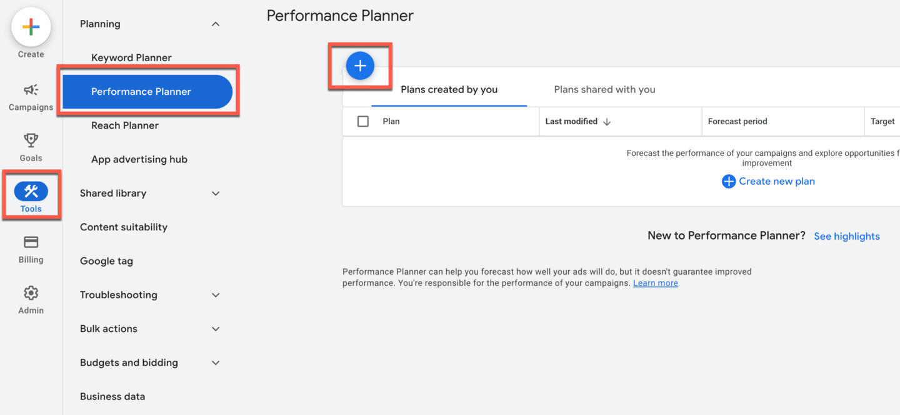
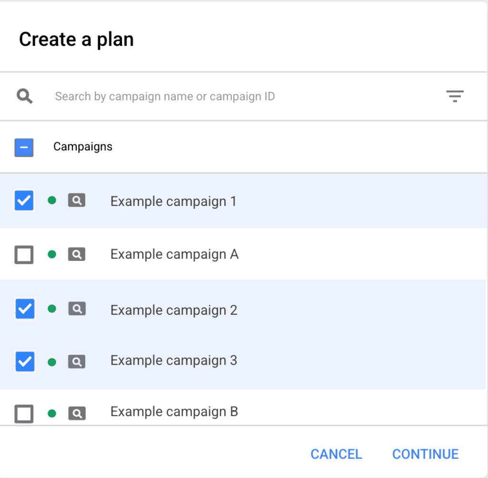
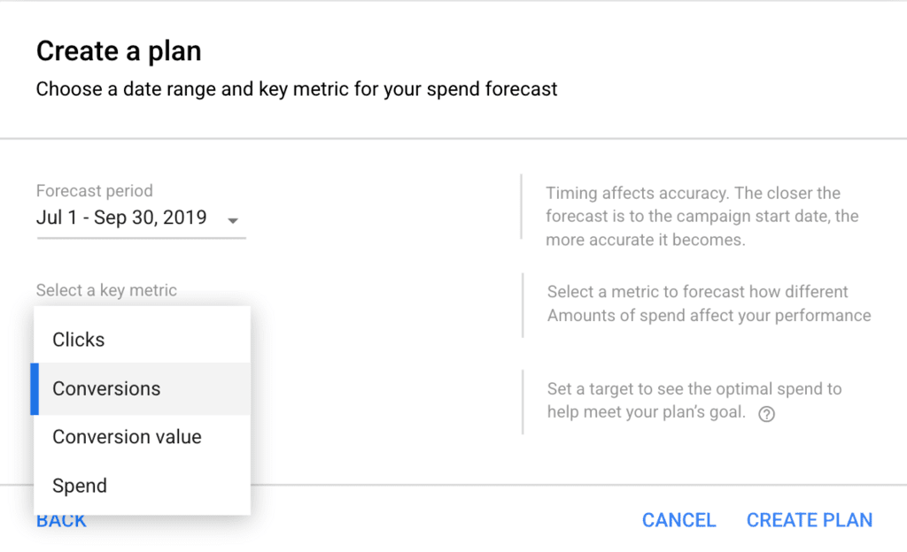
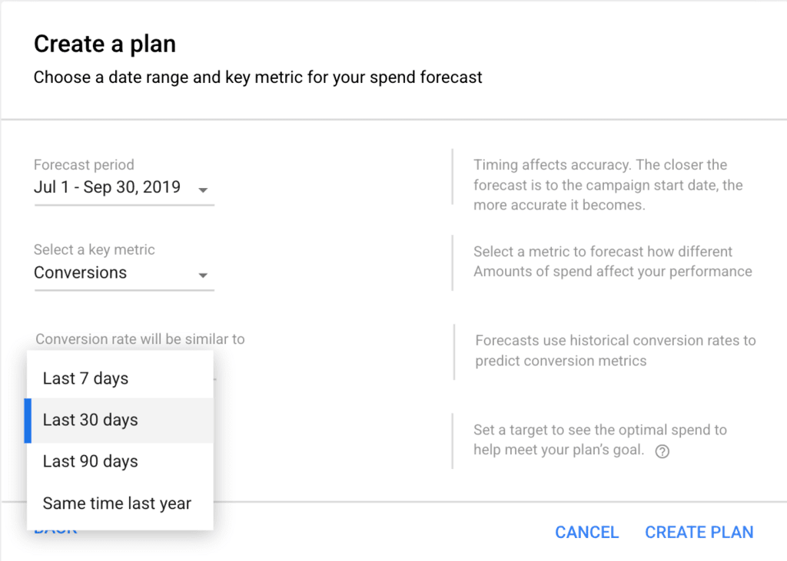
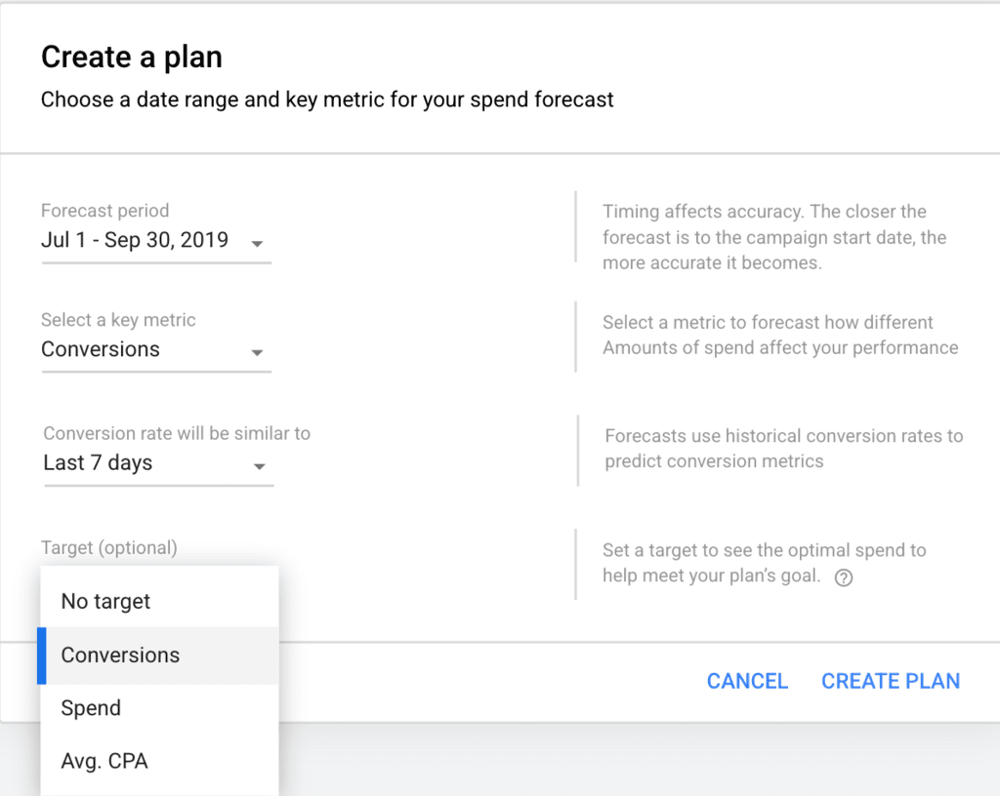
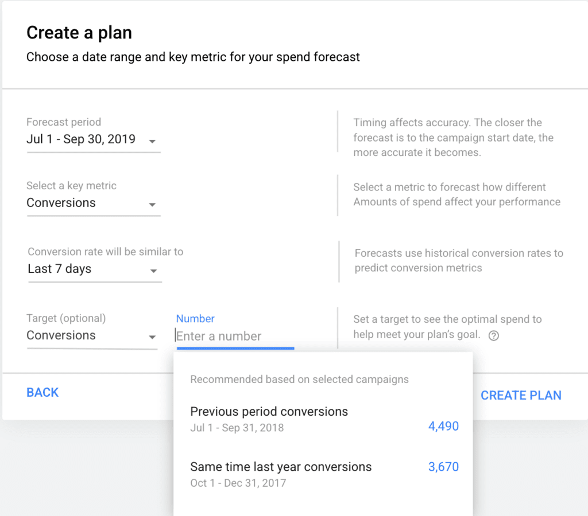
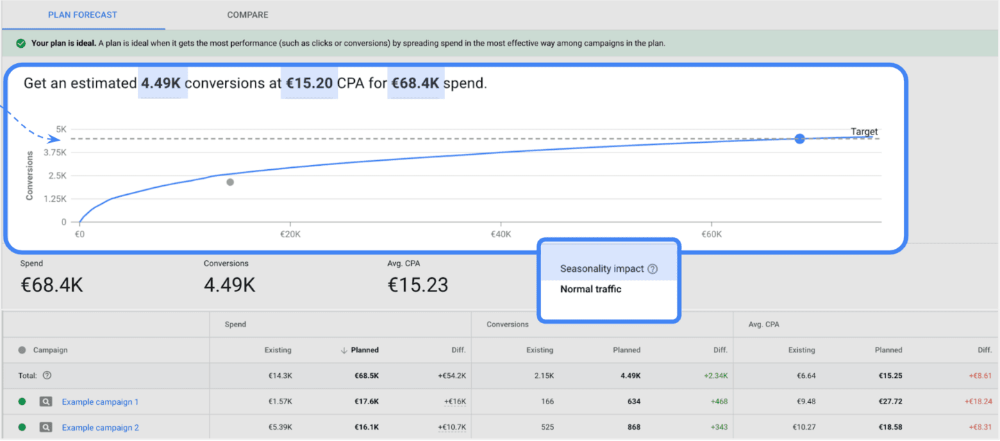
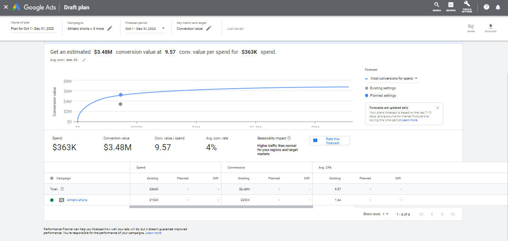

# 6. 運用工具拓展業務
## 自動套用最佳化建議
  徹底發揮 `Google Ads` 帳戶的潛力是達成目標的關鍵。自動套用最佳化建議可協助提升帳戶的效益和成效，同時省下寶貴時間。

  在本單元中，你將瞭解以下主題：
  - 說明自動套用最佳化建議如何提升帳戶的成效
  - 辨識可自動套用的最佳化建議類別
  - 實施自動套用最佳化建議的策略

  - ### 自動套用最佳化建議
    最佳化分數可用來評估 `Google Ads` 帳戶在搜尋、多媒體、購物、探索和影片行動廣告活動的成效。
    系統會根據你 `帳戶的成效記錄`、`廣告活動設定` 及 `Google 的整體趨勢`，為你量身打造最佳化建議。
    將這些因素綜合考量後，系統會判定應更新哪些地方才能提升帳戶成效及效益。

    - #### 運作方式
      選擇自動套用最佳化建議代表你將 `Google Ads` 帳戶設為套用最佳做法，如此你便能將注意力集中在策略性計畫上。
      你仍然可以在不增加預算的情況下，自動套用特定最佳化建議。

  - ### 主要優點
    自動套用最佳化建議有五項主要優點，讓我們來一探究竟。
    - #### 大規模實行最佳做法
      這項功能會根據帳戶設定與目標提供量身打造的最佳化建議，因此你會有更多接觸潛在客戶的機會。
      系統會隨時根據你的設定和目標，為帳戶執行適當的功能，確保廣告活動能發揮最高效益。

    - #### 提升成效
      最佳化分數會根據成效記錄、廣告活動設定及 Google 上的整體趨勢，
      為帳戶套用最相關的最佳化建議，藉此協助提升成效。

    - #### 提高效益
      減少執行人工作業的時間，並將更多時間用在業務策略上。
      自訂最佳化建議是根據帳戶的成效記錄、廣告活動設定以及 Google 的整體趨勢打造而成。

    - #### 可見度和控管能力
      你可以選擇不要自動套用特定最佳化建議，包括停止自動套用單項或大量的最佳化建議。
      你可以透過每週的成效報表、帳戶的「變更記錄」頁面和「最佳化建議」頁面的「記錄」分頁，追蹤進展及查看最近套用的最佳化建議。

    - #### 不增加預算
      自動套用最佳化建議不會增加帳戶層級預算，或是重新分配現有廣告活動的預算。若要檢視成長或預算相關的最佳化建議，請記得前往「最佳化建議」頁面。

  - ### 適合自動套用最佳化建議的對象為何？
    `代理商`、`行銷人` 及 `廣告客戶` 均借助 `Google` 來瞭解隱私權等關鍵業界趨勢，以便能有效成長並為消費者提供優質服務。
    在你邁向更進階的策略時，可能會發現持續處理最佳化作業的可用時間變少了。
    我們的系統可讓你自行「選擇」要自動套用的特定最佳化建議。如此一來，你就能專注在重要的策略性計畫上。

  - ### 讓我們看看成效
    一家荷蘭代理商的某個部門在客戶產品組合中自動套用最佳化建議，並收穫絕佳成效。
    相較於以往，該代理商在重複作業上節省 20% 的時間，而 `Google Ads` 最佳化分數平均也提高了 18 分。
    該部門還發現這項功能也對客戶成效帶來了正面影響。在他們的客戶中有一間建設公司，其轉換量提升了 10%，轉換率則提升 20%。

  - ### 最佳化建議類型
    系統會根據成效記錄、廣告活動設定及 Google 上的整體趨勢，提供三種可自動套用的最佳化建議。
    - #### 廣告和額外資訊
      改善現有廣告和廣告群組，並讓成效最佳的廣告最常顯示。

      範例：
      - 使用最佳化廣告輪播
      - 改善回應式搜尋廣告

    - #### 關鍵字和指定目標
      接觸更多對產品/服務有興趣的人

      範例：
      - 新增關鍵字
      - 移除衝突的排除關鍵字

    - #### 出價與預算
      找到適當的出價策略來達成業務目標。

      範例：
      - 使用目標單次轉換出價搭配盡量爭取轉換策略，以更有效益的方式進行出價
      - 調整廣告投資報酬率目標

  - ### 管理及檢視自動套用的最佳化建議。
    選擇自動套用最佳化建議後，即可在「`最佳化建議`」頁面的「`記錄`」分頁中查看已啟用的最佳化建議，並能隨時選擇停用。
    你可以檢視自動套用的最佳化建議，瞭解過去一週套用某項最佳化建議的頻率、最近的套用時間，以及首次選用的時間。

    提醒事項：自動套用最佳化建議並不會增加預算，請不時查看「最佳化建議」頁面，確保預算不會侷限廣告成效。

    - #### 管理最佳化建議
      在這個頁面上，使用者可以管理要自動套用的最佳化建議，只要從可用的類別中選取所需項目即可。

    - #### 追蹤最佳化建議
      選擇自動套用最佳化建議後，你可以在「最佳化建議」頁面的「記錄」分頁中，追蹤已啟用的最佳化建議。
      此外，你也能查看該項最佳化建議在過去一週的套用次數、最近的套用時間，以及首次選用的時間。

    - #### 停用最佳化建議
      你隨時都可以選擇停用自動套用的最佳化建議。

      可從「記錄」表格停用自動套用的單項建議，或是從「管理」設定停用自動套用的單項或大量最佳化建議。

  - ### 常見問題
    在考量自動套用最佳化建議的優點時，請務必瞭解真實情況。我們來看看一些常見的問題！
    - #### 自動套用建議是否會導致我的帳戶支出增加？
      不會。雖然任何的帳戶變更 (包含透過自動套用最佳化建議所進行的變更) 都可能導致廣告支出的增減，但這些變更絕對不會超過你所選的預算。
      此功能的目的在於協助你為帳戶爭取最高的點擊次數、來電次數及銷售量，同時讓你可全盤掌控整體預算。

    - #### 我的帳戶中顯示的所有最佳化建議都會自動套用嗎？
      不會。在啟用自動套用的最佳化建議時，你必須從選單中選擇你想使用的最佳化建議。系統僅會自動套用你所選的最佳化建議。

    - #### 是否可以在廣告活動層級啟用自動套用的最佳化建議？
      不行。自動套用的最佳化建議只能在 `帳戶及管理員層級` 啟用。也就是說，一旦為特定帳戶啟用這項功能，該帳戶中的所有廣告活動都會一併套用。

    - #### 在我的帳戶自動套用最佳化建議後，可以回復變更嗎？
      可以。就像你回復 `Google Ads` 帳戶的變更或更新一樣，只要登入帳戶，並將設定改回採用自動套用的最佳化建議之前的狀態即可。
      若你無法從「變更記錄」頁面回復變更，則需前往特定的廣告活動來回復變更 (例如逐一移除關鍵字)。

  - ### 學以致用
    艾亞擁有一間服飾精品店。一直以來，她都使用 `Google Ads` 提高品牌知名度和收益。
    她想要充分發揮廣告活動的效益，並確保使用的功能符合她的設定和目標，卻沒有額外的時間可以執行人工作業。
    她希望提高最佳化分數，但同時也有預算顧慮。自動套用最佳化建議可如何協助她提升帳戶成效？

    - A. 該功能會定期為帳戶實行最佳做法，且不會自動增加預算。
    - B. 該功能會在未取得人工核准的情況下，自動套用所有最佳化建議。
    - C. 該功能可在廣告活動層級套用，確保功能僅會依據特定預算執行。
    - D. 該功能會從帳戶的最佳化程序中，移除人工管理最佳化建議的步驟。

    :::details 解答
    A.
    :::

  - ### 重點整理
    - 只要啟用自動套用最佳化建議，你就能定期為 `Google Ads` 帳戶採用最佳做法。
    - 最佳化建議共有三大類：`廣告與額外資訊`、`關鍵字與指定目標`，以及 `出價與預算`。
    - 在「最佳化建議」頁面的「記錄」分頁中，你可以管理及檢視已啟用的最佳化建議。

  - ### 資源
    如要進一步瞭解這個主題，請選取下列連結。
    - [管理你選擇自動套用的最佳化建議 | Google 說明中心 ↗](https://support.google.com/google-ads/answer/10276359)
    - [進一步瞭解帳戶預算| Google 說明中心 ↗](https://support.google.com/google-ads/answer/7054229)
    
## 利用成效規劃工具設定最佳預算
  我們無法預知未來，但成效規劃工具能協助你調整廣告活動，做好面對未來的準備。
  成效規劃工具的優點包括：確保廣告活動能幫助你達成目標、對目標進行最適當的調整，以及考量流量成長的可能性。

  完成本單元後，你將能說明成效規劃工具最佳做法，如何協助你達成行銷目標。

  - ### 什麼是成效規劃工具？
    `Google Ads` 內含的成效規劃工具，可用來制定接下來最長 18 個月的計畫。
    它可以預測經過最佳化調整的目標和預算，對於主要指標與整體廣告投資報酬率的正面影響，我們建議每個月固定使用成效規劃工具，
    確保預算和廣告活動層級的智慧出價目標皆設定得宜，能將消費者的需求成功轉換為業績。

    - #### 你可以利用成效規劃工具完成以下工作：
      - 查看廣告活動的成效預測資料
      - 調整廣告活動設定並瞭解不同設定帶來的成效
      - 瞭解季節性商機
      - 為多個帳戶和廣告活動管理預算
    
    - #### 成效規劃工具如何預測成效？
      為了盡可能提供最準確的預測結果，成效規劃工具會將數十億筆搜尋查詢納入考量，而且每 24 小時會更新一次。
      這項工具會使用過去 7 到 10 天的相關資料模擬廣告競價，考量的變數包括季節性因素、查詢量成長、競爭對手活動和到達網頁。

      成效規劃工具進行模擬並收集資料後，會對照廣告活動放送後獲得的最終實際成效，評估成效規劃工具的成效預測準確度，然後使用機器學習技術微調預測資料。

  - ### 隨堂測驗
    定期規劃預算對於提升廣告活動成效有哪三種幫助？
    - A. 可預測不同預算帶來的影響，瞭解廣告成效的變化趨勢。
    - B. 瞭解帳戶可能最適合哪種付款方式。
    - C. 找出可提升轉換量的機會
    - D. 可針對季節性因素及容易提升銷售量/待開發客戶數的檔期進行規劃。

    :::details 解答
    A. C. D.
    :::

  - ### 在成效規劃工具中建立新企劃書
    - 1. 存取成效規劃工具
      依序點選「工具」>「規劃」>「成效規劃工具」，前往成效規劃工具，然後按一下加號 (+) 圖示，建立新企劃書。
      

    - 2. 選取目標相似且共用同一筆預算的廣告活動
      你可以使用成效規劃工具，為多個設有相同成效目標的廣告活動或帳戶提高成效。
      

    - 3. 選擇要提升的指標
      請先瞭解不同預測選項的用途，再建立企劃書，並根據行銷目標選擇要「盡量爭取轉換」還是「盡量爭取點擊」。
      

    - 4. 選取回溯期做為評估轉換率的依據
      企劃書預設為使用過去 7 天的轉換率，但你可以根據期望選擇過去 30 天、過去 90 天或去年同期，看看對預測結果有什麼影響。
      

    - 5. 選擇指定目標或門檻
      建議你設定指定目標 (例如平均單次轉換出價、轉換量或支出金額)，確保企劃書提供有助於達成目標的資料。
      

    - 6. 參考過往成效來設定指定目標
      你可以根據上一段期間或去年同期的成效資料，設定支出、平均單次轉換出價或轉換量指定目標。
      

    - 7. 在「企劃書預測」畫面 (如本頁螢幕截圖) 調整預算金額和指定目標，瞭解會造成哪些影響
      你可以根據轉換相關數據調整支出，或點選圓點，查看採用不同單次轉換出價或轉換門檻時需支付的費用。

      如果預期需求還會有波動，這主要會對費用有影響，查看預測時請留意這一點。
      

  - ### 增加轉換次數
    想知道需追加多少投資預算，才能維持穩定的廣告投資報酬率 (`ROAS`)，同時增加轉換量嗎？很簡單，只要在成效規劃工具中，調整單筆支出轉換價值目標即可。

    選取各按鈕即可瞭解詳情。
    顯示兩個圓點按鈕的成效規劃工具「草擬企劃書」介面
    

    - 系統會針對各個廣告活動，妥善調度曲線上的藍點，方便你瞭解如何以該預算創造最大價值。
    - 曲線下方圓點代表系統根據目前出價和預算設定，預測得出的成效。

  - ### 最佳做法
    請參考以下最佳做法，瞭解如何善用成效規劃工具。
    - #### 提前 18 個月開始規劃
      成效規劃工具能讓你提前最多 18 個月，為下列各種廣告活動類型進行規劃：搜尋、購物、地區、多媒體、影片、最高成效，以及應用程式。

    - #### 定期查看進度
      建立為期 18 個月的企劃書後，建議你每月或每季定期查看情況，確保能根據過去 7 天至 10 天的資料執行企劃書。企劃書會反映這段期間的市場變動，如有即將到來的季節性轉變，也會納入預測範圍中。建議你多多利用成效規劃工具進行企劃，因應難以預測的市場和業務變動。Google 無法保證預測結果能夠完整呈現市場變化的其他不確定性。

  - ### 學以致用
    下列哪三項是成效規劃工具的重要用途？
    - A. 為多個帳戶和廣告活動管理預算。
    - B. 瞭解未來有哪些季節性商機。
    - C. 可調整廣告活動設定，瞭解不同設定的預測成效。
    - D. 瞭解哪些產品賣得不好。

    :::details 解答
    A. B. C.
    :::

  - ### 重點整理
    - 成效規劃工具有助於制定前瞻性計畫，而不是用於每日例行的帳戶健全度作業。你可以利用這項工具拓展業務、發掘可掌握的商機，
    以及瞭解不同的出價與預算設定會帶來什麼樣的影響。

    - 將成效規劃工具納入例行規劃程序。持續定期評估預算非常重要，這麼做能幫助你研擬出可因應未來趨勢的策略，並在瞬息萬變的市場中達成目標。

  - ### 資源
    如要進一步瞭解這個主題，請選取下列連結。
    - [個案研究 | 網誌 ↗](https://blog.google/products/ads-commerce/new-helpful-tools/)
    - [使用成效規劃工具盡量提升投資報酬率 | YouTube ↗](https://www.youtube.com/watch?v=Lxy9XJkfH0I)