# 7. 依據業務目標改進 AI 技術輔助搜尋廣告活動
## 探索最佳化分數的價值
  想讓廣告活動的成效更上一層樓嗎？你可以透過最佳化分數輕鬆發掘各種廣告活動的潛力，分析搜尋、購物、影片行動、多媒體、探索、最高成效和應用程式廣告活動。

  完成本課程後，你將能運用最佳化分數改善廣告活動成效。

  - ### 什麼是最佳化分數？
    最佳化分數可用來評估 `Google Ads` 帳戶的預期成效。
    這個分數會介於 0 到 100 之間。分數越高，代表廣告活動或帳戶經過更妥善的最佳化設定，可參考的行動建議較少。

    最佳化分數結合統計模型、模擬作業和機器學習技術，能夠判定每項最佳化建議可能帶來的最佳化分數增幅。如果某項最佳化建議與成效的關聯性較高，該建議在整體分數的權重就會提升。升幅百分比較高的最佳化建議，會對廣告客戶的成效帶來較大的影響。

    除了分數，系統也會列出最佳化建議，協助你將各個廣告活動最佳化。每項最佳化建議都有百分比值，表示採用該建議後，最佳化分數預期會有的升幅。

    系統只會針對下列的有效廣告活動顯示最佳化分數：搜尋、多媒體、探索、影片行動、購物、應用程式和最高成效廣告活動。

  - ### 參考最佳化分數打造成效出色的廣告活動
    - #### 最佳化帳戶
      如果需要能改善成效的最佳化建議，可以先從帳戶最佳化分數著手。此外，這項功能也能加快最佳化作業的執行程序，幫助你省下寶貴時間。

    - #### 排定廣告活動的最佳化優先順序
      透過追蹤帳戶的最佳化分數指標，你可以判斷哪些廣告活動最有進步空間，並優先將這些廣告活動最佳化。

  - ### 深入瞭解最佳化分數 
    如要查看最佳化分數，請在管理員 (我的客戶中心) 或單一帳戶層級開啟「建議」頁面。在這個頁面中，你可以探索最佳化分數的所有功能。
    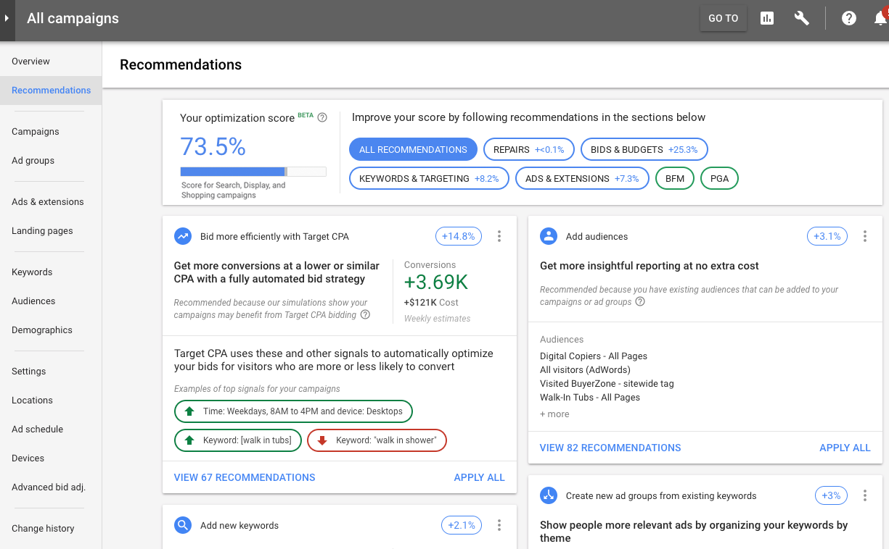

    - #### 最佳化進步空間
      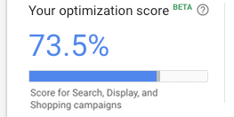

      在本範例中，帳戶分數為 73.5%，表示這個帳戶有 26.5% 的最佳化進步空間。你可以逐一查看系統列出的建議，瞭解從哪些部分著手可帶來最大影響。

    - #### 篩選器
      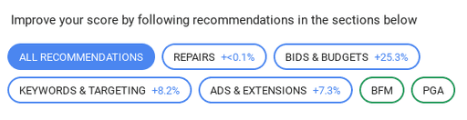

      你可以依專區進行篩選，查看特定最佳化建議。舉例來說，如果需要觸及更多消費者，建議你查看「所有建議」專區，新增更多有利增加轉換次數的關鍵字。

    - #### 潛在分數升幅
      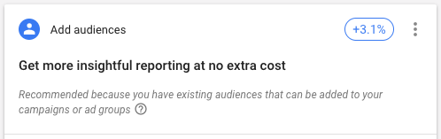

      在這張資訊卡中，你可以看見新增目標對象後，這個帳戶的最佳化分數可能提升 3.1%。

    - #### 全部套用
      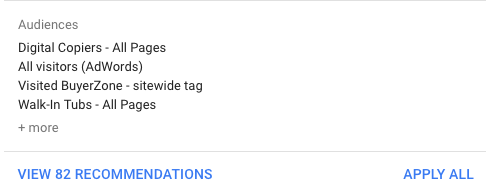

      你可以選取「全部套用」，採用特定資訊卡中的所有最佳化建議。

    - #### 自動套用最佳化建議
      

      只要選擇自動將特定最佳化建議套用至帳戶，你就能輕鬆改善帳戶成效，並節省寶貴的時間。啟用這項功能後，Google Ads 就會代你持續套用「最佳化建議」頁面中的最佳化建議。

  - ### 隨堂測驗
    在上方範例中，帳戶的最佳化分數為 73.5%，要怎麼做才能讓帳戶分數提高 14.8%？

    - A. 關閉所有最佳化建議
    - B. 在「新增關鍵字」資訊卡中，選取「全部套用」
    - C. 在「使用目標單次轉換出價提高出價效率」資訊卡中，選取「全部套用」
    - D. 篩選出「廣告與額外資訊」的相關最佳化建議

    :::details 解答
    C.
    :::

  - ### 提示
    你可以關閉與自身目標不符的建議，不過如果在關閉某項建議後改變心意，該怎麼辦？
    別擔心！
    透過篩選器查看「已關閉」的選項，即可再次查看這類最佳化建議並取消關閉。
    此外，如果系統日後再次判定某項最佳化建議符合你的需求，就會再度顯示該項最佳化建議。

  - ### 學以致用
    你之前決定關閉所有的「出價與預算」最佳化建議，但現在貴公司的目標有所改變，而你希望再次查看這些建議。你該怎麼做？

    - A. 你必須手動整合已關閉的建議，並儲存到「建議」頁面中。
    - B. 透過篩選器查看「已關閉」的選項，即可查看這類建議並取消關閉。
    - C. 你必須等待系統日後判定這些建議符合你的需求，才會再次顯示這些建議。
    - D. 已關閉的建議無法復原，最佳化分數功能也不會再次顯示這些建議。

    :::details 解答
    B.
    :::

  - ### 重點整理
    - 透過最佳化分數，你可以找出廣告活動最佳化和提升成效的機會。
    - 這項動態即時的工具可根據你的需求進行調整，確保你的帳戶經過完整最佳化，並協助達成期望的目標。

  - ### 資源
    如要進一步瞭解這個主題，請選取下列連結。
    - [最佳化分數 | YouTube ↗](https://www.youtube.com/watch?v=IPDCTST6hVE&list=PL40w1jd_knPWbweQXyQBQattyii4ddd-B&index=6)

## 使用 AI 技術輔助的搜尋和最高成效廣告活動，成效加倍
  搜尋和最高成效廣告活動是 `Google` 最強大的 AI 技術輔助廣告活動。
  將兩者搭配使用，行銷人就能全面發揮 Google AI 的威力，達成業務目標。

  完成本單元後，你將能學到如何使用 AI 技術輔助的搜尋和最高成效廣告活動，達到行銷目標。

  - ### Google AI 能讓行銷成效倍增
    充滿變數的時代也許能帶來意想不到的商機，對於保持敏捷且能迅速因應變動的商家，更是如此。
    Google AI 能協助提高獲利、重視廣告主的需求並創造新價值。

    - #### 觸及更多消費者
      消費者行為瞬息萬變且難以預測。將搜尋和最高成效廣告活動搭配使用，行銷人就更有機會觸及消費者，找出預料之外的消費需求。

    - #### 加倍提升成效
      將行銷視為帶來利潤的成長引擎，商家可以更靈活的分配預算，充分發揮成長潛力。商家應謹慎考量每筆額外支出可獲得的投資報酬率，並思考如何繼續使用下一筆資金推動未來業務成長。

    - #### 專業知識發揮加乘效果
      行銷人可以運用素材資源型的廣告素材，大幅提升自己的專業知識，並使用 `Google Ads` 的「洞察」頁面預測新的需求。Google AI 會使用行銷人的資料，幫助尋找新的目標對象。

  - ### 瞭解 Best Buy 如何在行銷策略中採用以 AI 為主的做法
    影片中團隊分享了如何運用 AI 技術輔助的搜尋和最高成效廣告活動，讓廣告成效倍增。
    [影片連結](https://youtu.be/vy40IYMzQhk)

    百思買透過 Google 廣告分享了他們如何運用AI工具來提升數位行銷成效。
    他們強調將顧客置於核心的策略，並將AI應用擴展到行銷領域，尤其是在 `Google` 廣告上。

    儘管起初對 `Performance Max` 和廣泛比對等AI工具有所疑慮，百思買經過徹底測試後發現，
    這些工具帶來了顯著的營收成長，其中全通路營收增長42%，廣告投資報酬率提升33%。
    這使得他們能夠觸及更廣泛的潛在顧客，並更有效率地運用數據，證明AI在當前經濟環境下對業務成長的關鍵作用。

  - ### 你知道嗎？
    平均來說，廣告主採用最高成效廣告活動後，能以相近的單次動作出價，將轉換量提高 18% 以上。
    過去一年來，隨著 Google AI 在出價、廣告素材、搜尋查詢比對等方面的持續發展，這項指標也有提升。

    注意：成效平均升幅是根據無產品動態饋給的廣告活動，由內部研究得出。個別結果可能因廣告活動資料及設定而有不同。

  - ### 以下說明如何運用 AI 技術輔助的搜尋和最高成效廣告活動，獲得更出色的成效
    以下說明如何盡量提高搜尋查詢的涵蓋率，將觸角延伸至其他管道，爭取更多轉換。
    - #### 搜尋廣告活動
      使用廣泛比對、智慧出價和回應式搜尋廣告，盡可能提高相關查詢的轉換成效。

    - #### 最高成效廣告活動
      可全面發揮 Google AI 技術的威力，讓你在所有 Google Ads 廣告空間中加倍提升轉換量，從新的搜尋查詢和管道發掘成長商機，提升成效並達成目標。

  - ### 深入瞭解如何提升最高成效廣告活動中的搜尋成效
    請將這篇 [Google Ads 說明中心文章](https://support.google.com/google-ads/answer/13311048?&sjid=10739797760258309249-NA) 加入書籤，其中大致介紹了帳戶、廣告活動、素材資源、深入分析，以及報表等內容的最佳做法。

  - ### 如果你使用的是動態搜尋廣告活動，建議升級為最高成效廣告活動
    目前有兩種不含關鍵字且已啟用搜尋的廣告活動：動態搜尋廣告 (DSA) 和最高成效廣告活動。這兩種廣告活動都使用 Google AI，提升觸及增量並協助迅速拓展業務。瞭解各個廣告活動類型。

    - #### 動態搜尋廣告 (DSA)
      動態搜尋廣告 (DSA) 能為廣告主提供顯著價值。這種廣告能大規模指定到達網頁，並產生適用於搜尋廣告的廣告素材，爭取更多由相關搜尋查詢帶來的轉換。

    - #### 最高成效廣告活動
      最高成效廣告活動可讓你從搜尋以外的管道，以相同的費用獲得更多轉換。將動態搜尋廣告升級為最高成效廣告活動，就能更輕鬆地透過單一購買平台，執行完全自動化廣告活動 (如動態搜尋廣告)。

  - ### 將動態搜尋廣告升級為最高成效廣告活動有何優點？
    若行銷人將不含關鍵字的廣告活動升級為最高成效廣告活動，就能獲得更出色的成效。
    - #### 強化成效表現
      根據 2023 年的 Google 內部資料，廣告主將動態搜尋廣告活動升級為最高成效廣告活動後，轉換量或轉換價值平均提高 15% 以上，
      且能維持相近的單次動作出價/廣告投資報酬率。最高成效廣告活動僅著重以轉換和價值為準的出價策略，因此能讓 Google AI 找出更多可轉換的查詢。

      不僅如此，最高成效廣告活動只要透過一個整合的廣告活動，就能提升所有管道的整體成效。這樣一來，你就能設定合適的出價，充分運用預算並獲得更出色的成效。

    - #### 更先進的技術
      在最高成效廣告活動中，搜尋廣告的指定目標功能以廣告主提供的素材資源做為信號，有助於找出可能轉換的查詢。
      如果廣告主的到達網頁或網站上內容不多，這項功能就相當實用。

      此外，最高成效廣告活動也改善了後端指定目標技術，因此相較於動態搜尋廣告，廣告主能在搜尋中觸及更多高品質的查詢。

    - #### 自動調整的廣告素材
      最高成效廣告活動不只具備動態搜尋廣告的標題生成技術，還能使用素材資源為搜尋查詢建立高度相關的廣告。
      這類廣告的關聯性較高，因此這些自動調整的廣告素材可爭取更多轉換。

  - ### 以下說明如何將動態搜尋廣告升級為最高成效廣告活動
    如果決定升級，請按照下列指示和最佳做法操作。

    注意：`Google Ads` 的功能日新月異，使用者介面的部分內容可能與這裡顯示的畫面不同。螢幕截圖中的範例資料僅供參考。

    - #### 步驟 1
      在「總覽」部分選取「最佳化建議」分頁標籤。接著，找到將動態搜尋廣告升級為最高成效廣告活動的最佳化建議。
      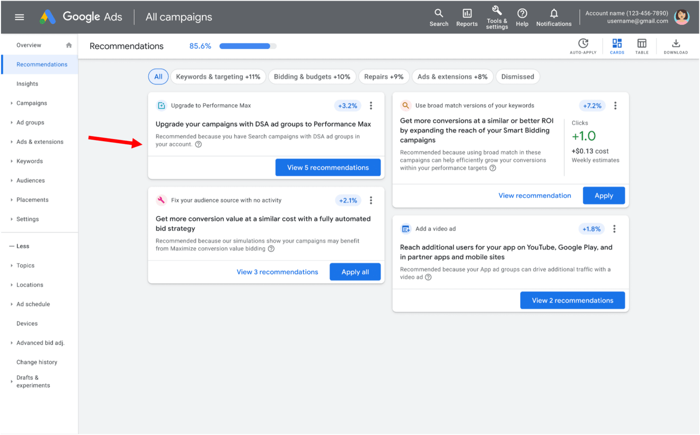

    - #### 步驟 2
      Google 會協助你從到達網頁、廣告及其他來源自動建立素材資源，並為你預先填入內容。
      - 如果你已將圖片素材資源新增到動態搜尋廣告，系統會使用這些素材資源。
      - 如果你沒有圖片素材資源，系統會從相關的動態搜尋廣告到達網頁提取圖片。
      - 如果 Google 在你的到達網頁中找不到任何圖片素材資源，你將需要自行新增。

      現在你已做好發布廣告活動的準備。你也可以編輯系統預先填入的資訊。
      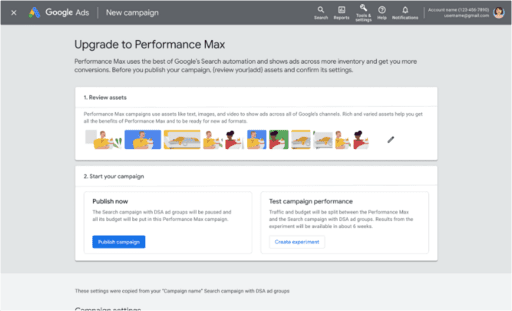

    - #### 步驟 3
      Google 會盡可能填入最多素材資源，但也會在你發布廣告活動前，要求填入缺少的素材資源。最高成效廣告活動需要使用動態搜尋廣告用不到的素材資源。
      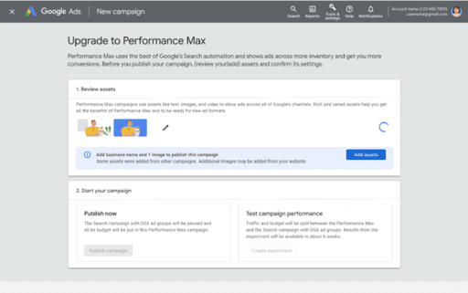

    - #### 步驟 4
      新增相似的素材資源，以建立最高成效廣告活動。
      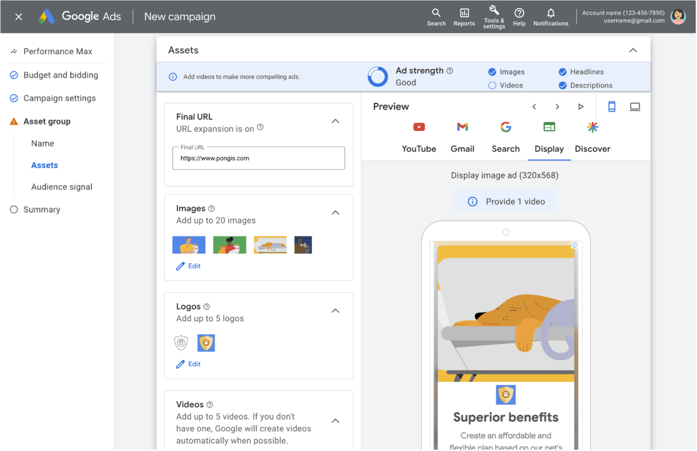

    - #### 步驟 5
      選取「發布」。接著你就會看到已發布的廣告活動。
      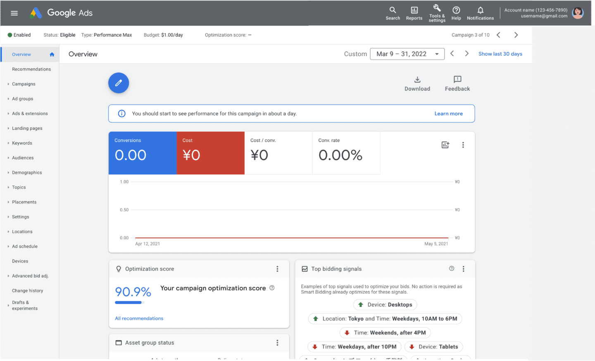

    - #### 步驟 6
      如要建立 A/B 版本測試且符合建立資格，請選取「`建立實驗`」。

      注意：視轉換量而定，只有部分廣告活動可執行 A/B 版本測試。
      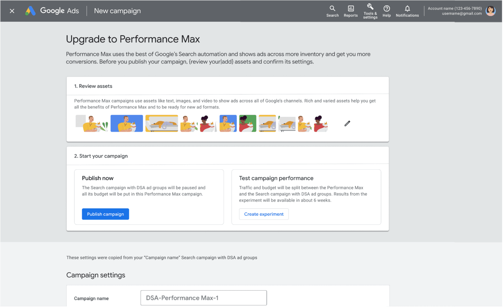

    - #### 步驟 7
      設定實驗，測試動態搜尋廣告和最高成效廣告活動的成效。
      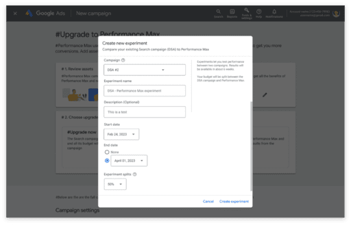

    - #### 步驟 8
      等待實驗執行完畢。
      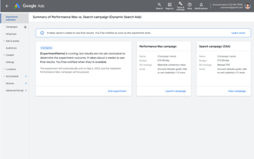

    - #### 步驟 9
      實驗完成後，前往「實驗」分頁查看結果。
      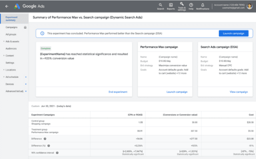

  - ### 學以致用
    下列敘述是否正確？有了最佳成效廣告活動，就不再需要重視 AI 技術輔助的搜尋廣告活動。

    - A. 正確
    - B. 錯誤

    :::details 解答
    B.
    :::

  - ### 重點整理
    - `Google AI` 能協助達成下列目的，讓行銷成效倍增：
      - 加深與廣告主的關係
      - 加倍提升成效
      - 專業知識發揮加乘效果

    - 廣告主採用最高成效廣告活動後，能以相近的單次動作出價獲得更多轉換。

  - ### 資源
    如要進一步瞭解這個主題，請選取下列連結。

- [關於最高成效廣告活動 | 說明中心 ↗](https://support.google.com/google-ads/answer/10724817)
- [最高成效廣告活動的新功能 | 說明中心 ↗](https://support.google.com/google-ads/answer/13311048)