# 5. 探索 AI 技術輔助搜尋廣告出價策略
## 1. 探索搜尋廣告活動的出價策略
  每天都有數百萬人使用 `Google` 搜尋資訊，其中不乏有極高業務價值的客戶，但是你該如何從使用者的查詢內容中過濾出這些客戶？
  對智慧出價策略進行最佳化調整或許能解決這個問題，因為這些解決方案會併用多種信號，針對各次競價精確設定出價。

  本單元將說明如何利用 `Google Ads` 出價最佳化做法達成行銷標的。

  - ### 出價最佳化為何如此重要？
    Google 的智慧出價解決方案採用先進的機器學習技術，可針對各次競價精確設定出價，協助商家推動事業成長。如要達成行銷標的與業務目標，制定廣告活動的智慧出價策略時應採行最佳做法。

    建立與管理廣告活動時，請務必持續檢視目標與預算，確保皆與行銷標的相符。此外，我們也有數種工具 (如出價策略報表和模擬工具) 能提供指引，讓你瞭解如何根據目標調整策略。

  - ### 小高的任務
    小高是一位代理商策略專家，專門協助他的客戶招攬待開發客戶。
    他的客戶是一間協助企業家管理客戶群的新創軟體公司，該新創公司開發新客戶時，主要會從客戶在公司網站上留下的資訊著手。

    小高主要是和這家公司的行銷長小路合作，而最近小路決定稍微調整一下行銷策略。雖然公司的標的仍維持不變 (透過網站招攬待開發客戶)，
    但他們必須提高搜尋廣告活動的成效。小路想要監控每位待開發客戶費用，並且調整廣告活動，以相近的單次操作出價盡量提升轉換量。

    為了確保廣告活動能達到這個目標，小高必須先確認客戶目前的單次操作出價，然後在單次操作出價不變的情況下，持續提升轉換量。

  - ### 找出廣告活動的成效指標
    你可以在 `Google Ads` 介面上查看已建立廣告活動的成效指標，系統顯示的指標會依廣告目標而有所不同。以下說明如何找到這些指標。
    > 注意：螢幕截圖中的範例資料僅供參考。

    - #### 步驟 1 選取左側選單中的 `[廣告活動]`。
      

    - #### 步驟 2 在表格上方的選單中，選取「欄」圖示，然後選擇 `[修改欄]`。
      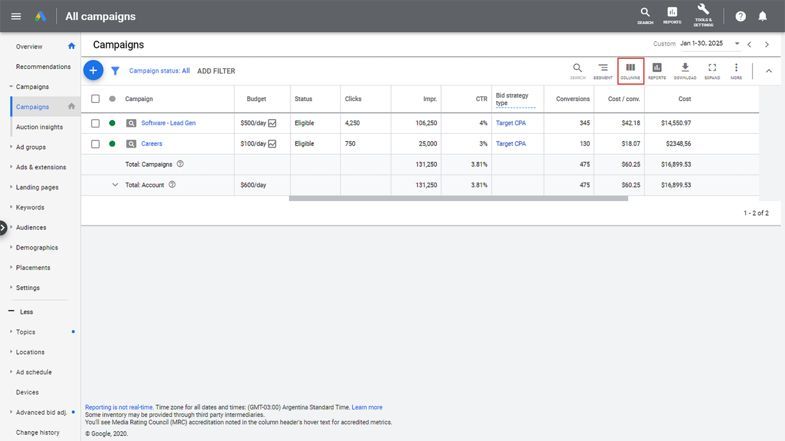

    - #### 步驟 3 選取 `[轉換]` 下拉式清單，然後選擇與標的相符的資料欄選項。
      

    - #### 步驟 4 選取 `[套用]`。
      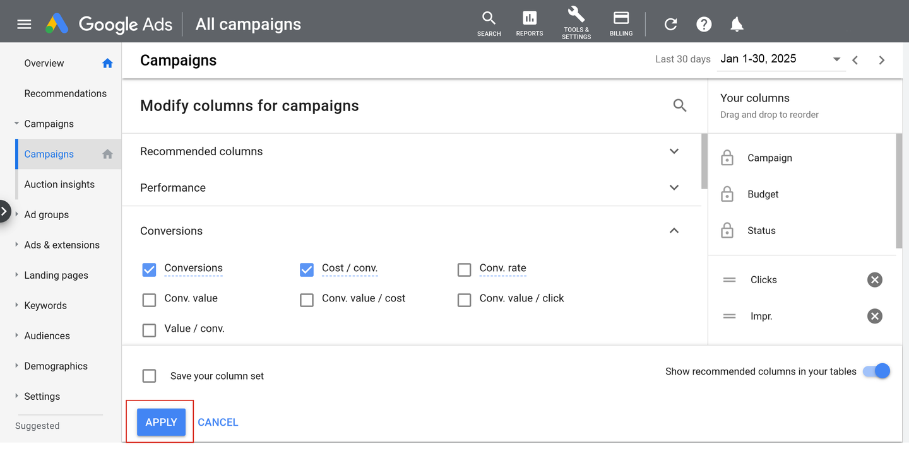

  - ### 注意事項
    請查看「建議」頁面，找出其他適合使用智慧出價功能的廣告活動，然後設定合適的目標及預算。
    如果發現廣告活動尚未採用智慧出價，請查看系統提供的相關建議，確認應使用哪一種智慧出價策略，以及應根據過往成效設定什麼目標。

    在某些情況下，系統也會在建議中顯示套用特定智慧出價策略後的預期影響或成效升幅。
    即使廣告活動已採用智慧出價，系統在顯示相關建議時，可能也會告訴你應如何調整目標或預算，以及預期的成效。

  - ### 設定：出價策略報表
    出價策略報表是瞭解智慧出價策略成效的重要工具。這份報表包含量身打造的指標，可顯示與各種類型的出價策略最相關的要素，以及出價策略狀態、目標和預算模擬工具、平均目標單次轉換出價、平均目標廣告投資報酬率、轉換延遲和熱門信號各項重要資料。

    以下說明如何設定出價策略報表。

    - #### 步驟 1 選取左側選單中的 `[廣告活動]`。
      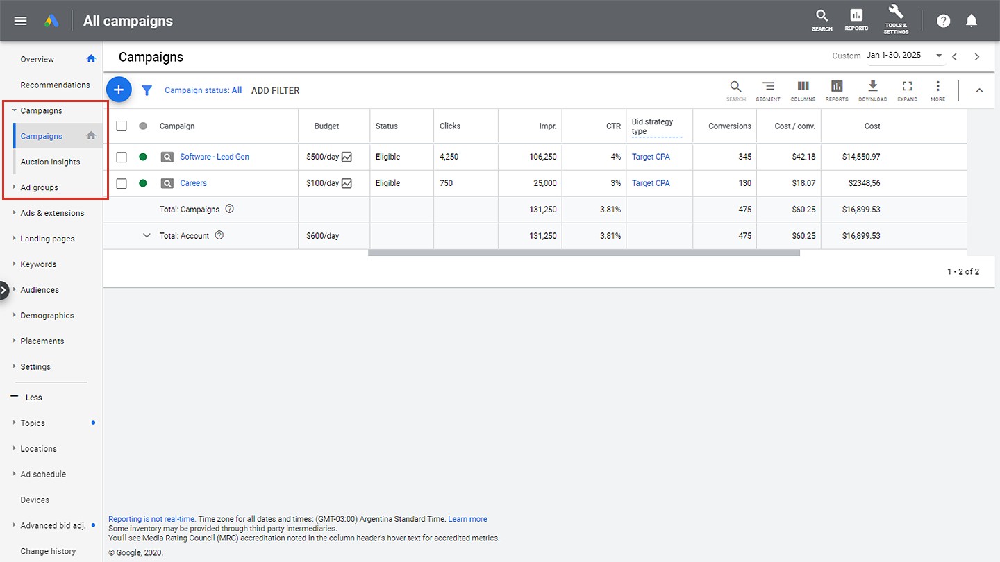

    - #### 步驟 2 在 `「出價策略類型」`欄中選取策略，即可開啟對應的出價策略報表。
      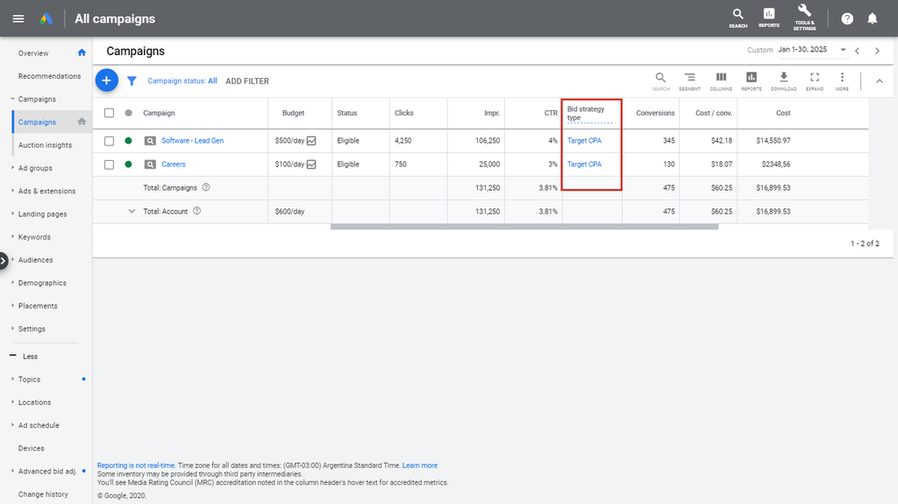

    - #### 步驟 3 查看 `「成效記錄」` 資訊卡上的成效指標。
      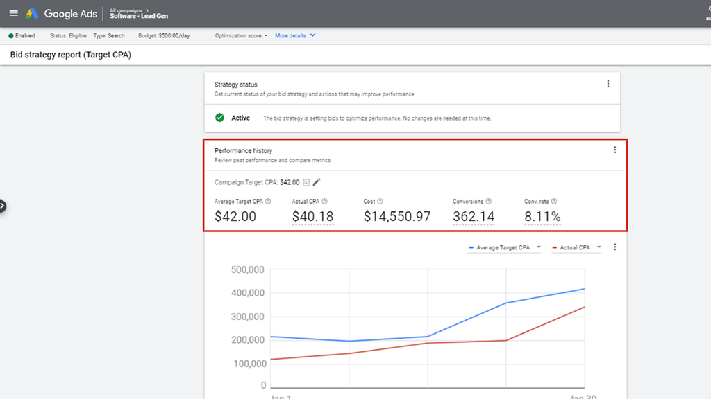

    - #### 步驟 4 將滑鼠游標懸停在 `「成效記錄」` 資訊卡的 `「轉換」` 一詞上方，即可查看特定時間範圍內的預估轉換次數深入分析資料。
      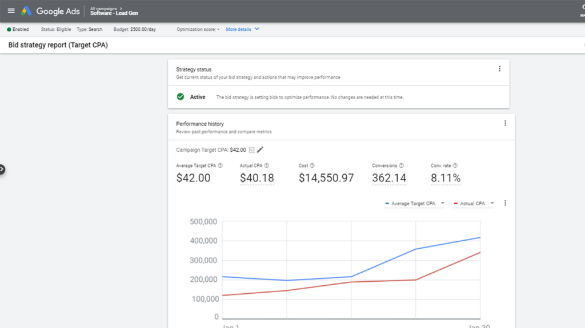

  - ### 「熱門信號」資訊卡
    出價策略報表中可能會顯示「熱門信號」資訊卡。這個資訊卡也會告訴你系統正在根據哪些資料維度自動調整出價，這些資料維度與訪客完成轉換的機率高低相關。熱門信號可能包括 (但不限於) 裝置類型、位置、星期幾、時段、關鍵字和目標對象。
    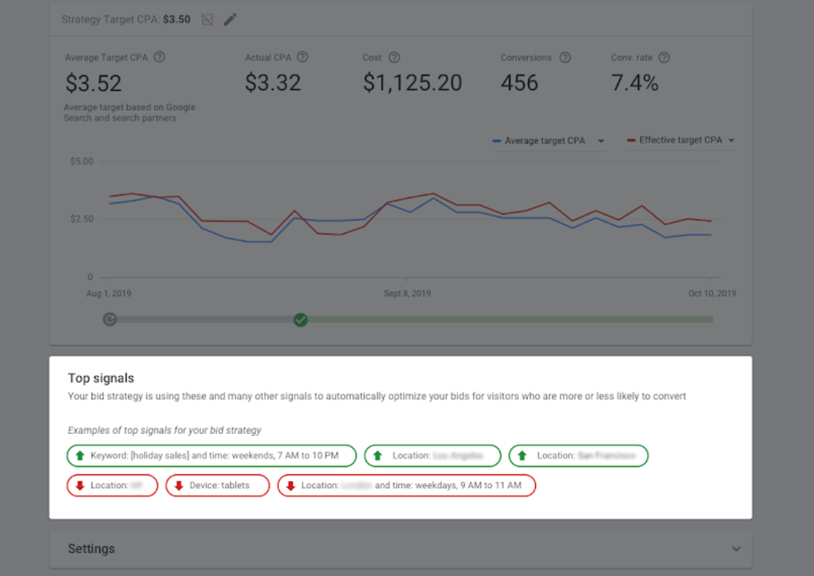

  - ### 設定：智慧出價目標模擬工具
    智慧出價目標和預算模擬工具可用來評估廣告在調整設定後的成效變化。如果想知道變更目標或預算會有什麼影響，這些工具將能派上用場。

    以下是智慧出價模擬工具的使用步驟說明。

    - #### 步驟 1 選取左側選單中的 `[廣告活動]`。
      

    - #### 步驟 2 找出要模擬的廣告活動及相應的「預算」欄。選擇模擬工具圖示。你也可以在出價策略報表中開啟模擬工具。
      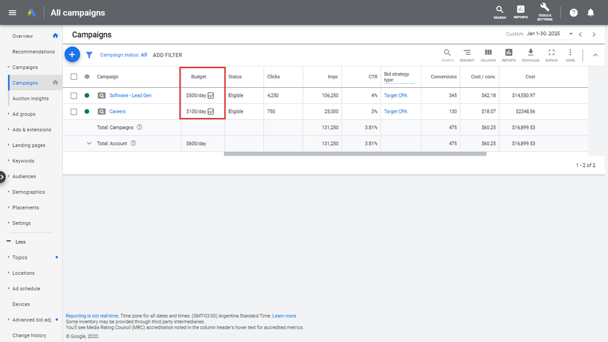

    - #### 步驟 3 檢視「廣告活動目標模擬工具」表格與圖表，看看設定不同的目標或預算可能會對主要的 KPI、點擊次數及相關費用造成什麼樣的影響。這個表格也會模擬各種可能會為廣告活動帶來額外商機的預算情境。
      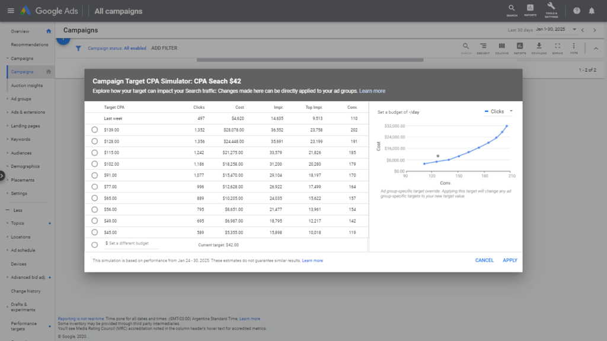

    - #### 步驟 4 在表格中選擇新目標，然後選取 [套用]。
      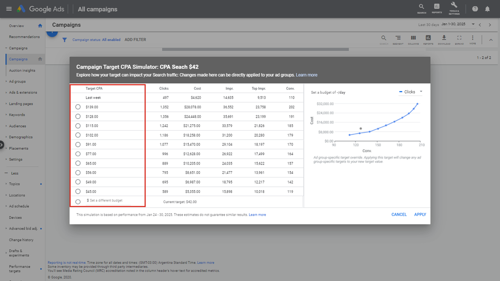

  - ### 利用智慧出價策略強化廣告活動
    採用智慧出價策略且等待廣告活動進入穩定期後，你應能在轉換量與轉換價值方面看見成效，這時請開始考慮強化廣告活動，以招攬更多的客戶。以下介紹兩種做法。
    - #### 如果採用的策略是「盡量爭取轉換」或「盡量提高轉換價值」
      如果採用的策略是「盡量爭取轉換」，請將重心放在轉換量上。

      如果採用的策略是「盡量提高轉換價值」，請著重在轉換價值。

      如果採用的策略是「盡量爭取轉換」或「盡量提高轉換價值」，請務必確保廣告活動有額外的廣告空間可以使用，這樣演算法才有提高轉換量或轉換價值的空間。此外，你也可以新增關鍵字、採用廣泛比對類型、建立動態搜尋廣告及新增第一方目標對象名單，藉此擴大指定範圍。

      調整出價策略後，可以前往「建議」頁面瞭解這些額外投資為何能使你更有效率地創造轉換量或轉換價值。

    - #### 如果採用的策略是「目標單次操作出價」或「目標廣告投資報酬率」
      如果採用的策略是「目標單次操作出價」，請請將重心放在單次操作出價上。

      如果採用的策略是「目標廣告投資報酬率」，請著重在廣告投資報酬率上。

      如果廣告活動預算不足，請查看「建議」頁面，瞭解是否有機會以相近的單次操作出價或廣告投資報酬率爭取更多轉換量或轉換價值。

      如果廣告活動沒有預算限制，請提高目標單次操作出價或降低目標廣告投資報酬率，以爭取更高的轉換量或轉換價值。此外，你也可以新增關鍵字、採用廣泛比對類型、建立動態搜尋廣告及新增第一方目標對象名單，藉此提升涵蓋率和擴大指定範圍。

  - ### 最佳做法
    監控智慧出價策略的成效及進行最佳化調整時，別忘了遵循下列最佳做法。

    - #### 根據行銷標的調整智慧出價策略
      採用最切合廣告活動目標的自動出價策略。

    - #### 調整目標以爭取更高的轉換量
      如果廣告活動沒有預算限制，可以考慮放寬自動出價策略目標的條件，以爭取更高的轉換量；換句話說，就是提高目標單次操作出價，或降低目標廣告投資報酬率。

    - #### 避免套用預算限制
      在採用「目標單次操作出價或「目標廣告投資報酬率」的情況下，如果廣告活動預算不足，以下的出價策略標的將無法達成：於指定的目標內盡量提升轉換量。如果想在維持單次操作出價或廣告投資報酬率不變的情況下爭取更多轉換量或轉換價值，請提高預算。如果你已設定預算目標，可採用「盡量爭取轉換」或「盡量提高轉換價值」策略，在一定的預算範圍內盡量提高成效。

      如要取得預算建議，請查看「建議」頁面與最佳化分數。

    - #### 將轉換延遲納入考量
      多數點擊不會立刻帶來轉換。請熟悉廣告活動的平均轉換時間差 (也就是從點擊到完成轉換所需的平均時間)，並在計算等候期時納入考量，以準確評估轉換成效。對於搜尋廣告活動，你可以善用出價策略報表中的轉換延遲報表。如有追蹤離線轉換，系統也會將報表資料的更新延遲納入考量。

  - ### 重點整理
    - 你可以透過出價策略報表掌握智慧出價策略的成效趨勢，並且發掘更多可提升成效的契機，一步步達成行銷標的。
    - 智慧出價模擬工具提供深入分析資訊，供你瞭解調整智慧出價策略目標或預算後，廣告活動轉換量或轉換價值會如何變化。
    - 應用智慧出價最佳做法，讓廣告活動展現最佳成效。

  - ### 資源
    如要進一步瞭解這個主題，請選取下列連結。
    - [轉換延遲 | 說明中心 ↗](https://support.google.com/google-ads/answer/6239119)
    - [自動出價基本概念 | 線上學習課程 ↗](https://skillshop.exceedlms.com/student/path/17374/activity/23968)
    - [選擇合適的出價策略 | 說明中心 ↗](https://support.google.com/google-ads/answer/2472725)
    - [出價策略狀態 | 說明中心 ↗](https://support.google.com/google-ads/answer/6263057)
    - [Google Ads 最佳做法 | 說明中心 ↗](https://support.google.com/google-ads/answer/6154846)
    - [善用建議提升成效 | 說明中心 ↗](https://support.google.com/google-ads/answer/3416396)

  - ### 學以致用
    小路請小高預測如果提高單次操作出價目標或預算，轉換量可能會提升多少。小高如何運用` Google Ads` 工具預估這些調整所帶來的影響？
    - A. 提高目標單次操作出價幾天，然後監控成效的變動情況。
    - B. 提高廣告活動的每日預算幾天，然後監控成效的變動情況。
    - C. 利用出價策略報表找出目前的成效趨勢，以及可改善之處。
    - D. 使用廣告活動出價模擬工具瞭解不同的單次操作出價和預算會如何影響成效。

    :::details 解答
    D.
    :::

## 2. 瞭解以價值為準出價的運作方式
  持續以收益或價值為業務目標，確實有助於推動業務成長，但也可能導致你必須耗費大量時間處理管理工作。
  透過 `Google` 的智慧出價解決方案，你可以更有效率地管理廣告活動。

  完成本單元後，你將能運用以價值為準出價策略，從搜尋廣告活動中創造更多價值。

  - ### 在搜尋廣告活動中導入以價值為準出價
    AI 系統與你會互相學習。將越優質的資料提供給 `Google AI`，獲得的成果就越可觀，這可能會成為線上廣告策略的競爭優勢。
    [Google Ads Tutorials: Introduction to value based bidding in Search](https://youtu.be/IJkPP_vxFk0)

    這個 `Google Ads` 的教學影片片段說明了 `智慧出價` 如何運用機器學習和情境訊號來設定廣告競價，並強調選擇出價策略前需明確商業目標。
    影片指出，並非所有轉換都具有相同價值，有些轉換對企業目標而言更重要，應當被優先考量。
    
    因此，`價值型出價策略` 允許廣告商根據轉換的實際價值進行優化，以提升整體業務價值。
    研究顯示，從 `目標單次操作成本（Target CPA）` 轉換到 `目標廣告投資報酬率（Target ROAS）`的出價策略，平均可帶來14%的轉換價值增長，且投資報酬率相近。

  - ### 運用機器學習技術爭取最高的轉換價值
    在採用以價值為準出價這種智慧出價策略後，系統會運用機器學習技術盡量提高轉換價值，
    出價爭取有助於達成業務目標的轉換。這種出價策略會參考數十億種信號組合來預測轉換價值，讓你更能掌握廣告活動預算帶來的轉換。

    以價值為準出價可讓你根據攸關業務的靜態或動態價值出價。動態價值的例子包括第一方的轉換層級資料，像是利潤、傾向分數和預估 LTV。

    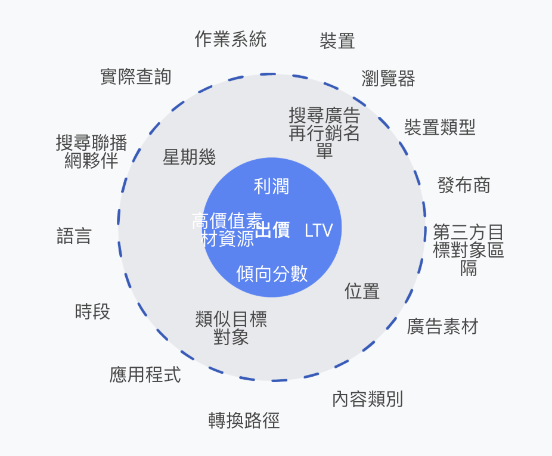

  - ### 為什麼應根據價值出價？
    每位消費者的業務價值不盡相同。有些轉換對你的業務目標較無關緊要，有些則能帶來較高的價值，需妥善記錄並全力爭取。
    採用以價值為準出價，就能盡可能提高整體轉換價值。

    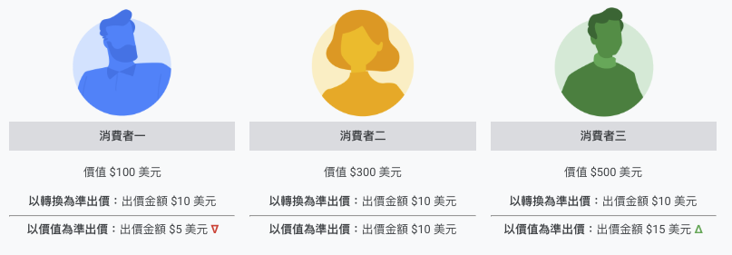

  - ### 以價值為準出價的重要性
    以價值為準出價可進一步發揮智慧出價的優勢，盡量提高 `轉換價值` 和 `投資報酬率 (ROI)`。這種出價策略有助於提升消費者帶來的價值，並大幅提高投資報酬率。
    平均來說，將出價策略從 `目標單次轉換出價 (CPA)` 改成 `目標廣告投資報酬率 (ROAS)` 的廣告主，轉換價值增加了 14%，且保有相近的廣告投資報酬率。

    - #### 區分你的消費者...
      - ##### 區分你的消費者：
        廣告主通常會區分消費者的價值，但不一定會向 Google 的最佳化機制分享這項資訊。
    - #### ...有助於提高成效
      - ##### 提高成效：
        分享消費者價值的資料後，就能採用以價值為準出價。只要對最有價值的消費者出價，廣告主的收益和獲利能力都會提升。

  - ### 以價值為準出價的運作方式為何？
    以價值為準出價適用於各種商業模式，可讓你更深入瞭解消費者。指定轉換價值也有助於深入瞭解自己在 Google 的行銷活動成效。

    

    - #### 以價值為準出價能讓你鎖定最重要的消費者。  
      有些轉換對你的業務目標較無關緊要，有些則能帶來較高的價值，需妥善記錄並全力爭取。
      在廣告策略中加入以價值為準的策略，有助於降低消費者或待開發客戶的開發成本，還能大幅提高帳戶的投資報酬率 (金錢價值)。
      以價值為準出價能讓你鎖定最重要的消費者，並為貴商家創造最高收益。

    - #### 以價值為準出價很適合未來以隱私權為重的環境。
      隨著業界不斷發展，考量到使用者隱私權疑慮、相關法規和瀏覽器更新，以價值為準出價的重要性和關聯性與日俱增。這種解決方案利用了第一方資料和自動化技術，非常適合未來以隱私權為重的環境。

    - #### 以價值為準出價可透過準確且實質的方式進行最佳化。  
      透過以價值為準的功能，你可以匯入第一方資料，以準確且實質的方式進行最佳化，達成客戶的行銷目標。

  - ### 以價值為準出價有助達成大多數的業務目標，同時提升出價效益。
    隨著線上廣告日漸自動化，你要求機器學習演算法進行最佳化的 KPI，以及你分享給演算法的資料，將成為線上廣告策略中最重要的競爭優勢之一。
    - #### 市占率
      提高業界或特定產品/服務領域的市占率。

    - #### 收益
      提高業務帶來的收益。

    - #### 利潤
      提高扣除成本後的業務盈餘。

  - ### 在搜尋廣告活動中導入以價值為準出價的最佳做法
    根據你的商業模式，為以價值為準出價選擇最適當的導入選項。
    歡迎參考這部影片中的實用訣竅，瞭解如何在搜尋廣告活動中，導入以價值為準的智慧出價策略並最佳化，順利達成業務目標。

    [Google Ads Tutorials: Best Practices to implement value based bidding in Search](https://youtu.be/d5QiAUygCoo)

    這份 `Google Ads` 教學影片提供了一系列關於在搜尋廣告中實施 `價值型智慧出價策略` 的最佳實踐。
    
    它強調了五個關鍵步驟：
      - 首先，必須 `建立` 強大的轉換衡量基礎，並為轉換分配價值，以確保廣告投放符合您的業務目標。
      - 其次，根據預算和投資報酬率目標，`選擇` 最合適的智慧出價策略，無論是「最大化轉換價值」還是「最大化轉換價值與目標廣告投資報酬率」。
      - 第三，利用優化分數和建議頁面來識別適合智慧出價的廣告活動並 `設定目標`。
      - 第四，在實施策略後，應 `仔細分析` 廣告活動的表現，並考慮轉換延遲等因素。
      - 最後，隨著業務目標的演變，`持續優化` 您的廣告活動，例如調整廣告投資報酬率目標、使用廣泛配對關鍵字和回應式搜尋廣告，以促進增長。

  - ### 透過轉換評估提升數位行銷成效
    想要在這個瞬息萬變的數位環境提升數位行銷成效，關鍵就在於健全的轉換評估做法。
    透過這些做法，你可以追蹤轉換動作、改用更進階的成效評估解決方案 (例如歸因)，然後運用智慧出價的自動化和最佳化功能。
    - #### 全域網站代碼
      確認網站上的代碼已正確標記。

    - #### 強化轉換
      投入其他第一方資料來源。

    - #### 同意聲明模式
      視需要徵詢同意聲明，尊重使用者的選擇。

  - ### 成為出價達人：以價值為準出價架構
    `以價值為準評估 (VCM)` 是一種架構，可讓行銷人定義轉換價值並匯入 `Google`。`VCM` 是實現以價值為準出價的第一步，代表做法漸漸成熟，從基本追蹤到著重於轉換品質和價值。

  - ### 什麼是以價值為準評估 (VCM)？
    以價值為準出價取決於 VCM，是將價值傳達給 Google 的前置步驟。

    VCM 包括兩個部分：
    - `價值定義`：轉換的價值是多少？(傾向、LTV、待開發客戶分數等等)
    - `價值擷取`：如何將這些價值整合至 Google 系統？(離線轉換匯入、內容管理應用程式設計介面等等)

    - #### 價值定義
      價值定義取決於你能否在轉換發生時擷取或計算價值，這與商業模式和價值產生的時機/時間極為相關。
      
      價值定義可分為三類：
      - `實際價值`：轉換發生時 `實現` 的價值，像是收益、全通路/實體店價值、利潤。
      - `替代價值`：轉換發生時 `推斷` 的一般價值，像是待開發客戶分數。
      - `預測價值`：轉換發生時，系統根據擷取信號計算得出的 `預估` 價值，像是傾向、存續/流失、生命週期價值。

      許多品牌可能有一些廣告素材，但這類素材不符合特定成功公式或可行標準，因此不考慮在 YouTube 放送。

    - #### 價值擷取
      在 Google 系統中擷取或整合價值的方式主要有三種。
      - ##### `全域網站代碼`：
        透過單一 Google 代碼、Google 代碼管理工具、Google Analytics (分析) 4、[待開發客戶強化轉換 (ECL)](https://support.google.com/google-ads/answer/11021502) 這類可追蹤線上活動的網站標籤，觸發轉換追蹤並擷取價值。

      - ##### `匯入`：
        透過匯入直接將轉換傳送至平台，例如離線轉換匯入、Conversions API、離線轉換調整項、商店銷售改善項目。

      - ##### `由 Google 追蹤`：
        Google 系統中追蹤的轉換事件，像是親臨門市、參與收視轉換、來電評估和本地動作。

  - ### 為產品啟用以價值為準出價架構
    在採用以價值為準出價架構的過程中，需要啟用幾項重要產品。
    - #### 分享更準確的資料
      追蹤轉換時，請採用合適的評估做法和隱私權解決方案。

      Google 產品選項
      - 全域網站代碼
      - 離線轉換匯入
      - 強化轉換
      - 以數據為準歸因
      - 轉換調整項

    - #### 指定價值資料
      如要採用以價值為準出價，請為各項轉換指定轉換價值。

      Google 產品選項
      - 動態和靜態轉換價值

    - #### 最佳化出價
      使用競價期間層級出價並盡量提高轉換價值。

      Google 產品選項
      - 盡量提高轉換價值
      - 選用目標廣告投資報酬率
      - 轉換價值規則等等

  - ### 學以致用
    以價值為準出價的運作方式為何？
    - A. 提供出價最佳化建議
    - B. 自動擷取資料並定義價值 
    - C. 建立可增加價值的圖片素材資源
    - D. 參考數十億種信號組合，預測轉換價值

    :::details 解答
    D.
    :::

  - ### 重點整理
    - 在採用以價值為準出價這種智慧出價策略後，系統會運用機器學習技術盡量提高轉換價值，出價爭取有助於達成業務目標的轉換。
    - 以價值為準出價可讓你根據攸關業務的靜態或動態價值出價。
    - 以價值為準出價取決於以價值為準評估架構 (VCM)，是將價值傳達給 Google 的前置步驟。
    - 以價值為準評估 `VCM` 包括兩個部分：`價值定義` 和 `資料擷取`。

  - ### 資源
    如要進一步瞭解這個主題，請選取下列連結。
    - [根據業務 KPI 指定價值 | Google 說明中心 ↗](https://support.google.com/google-ads/answer/13487402)
    - [關於目標廣告投資報酬率出價 | Google 說明中心 ↗](https://support.google.com/google-ads/answer/6268637)
    - [關於盡量提高轉換價值出價 | Google 說明中心 ↗](https://support.google.com/google-ads/answer/7684216)
    - [「建立良好基礎，發揮 AI 力量」檢查清單 | Google Ads 說明中心 ↗](https://support.google.com/google-ads/answer/7684216)
    - [關於轉換調整項 | Google 說明中心 ↗](https://support.google.com/google-ads/answer/7686447?&sjid=8738781338033392050-EU)
    - [待開發客戶強化轉換 (ECL) | Google 說明中心 ↗](https://support.google.com/google-ads/answer/11021502?&sjid=8738781338033392050-EU)

## 3. 建立搜尋廣告出價策略
  如要為貴商家提高銷售量或吸引待開發客戶，你可以使用以轉換為準的智慧出價，不必再憑空猜測出價。

  想提升品牌知名度，或提高廣告訊息在 `Google` 搜尋中的曝光度嗎？與其監控廣告活動的曝光指標來手動進行最佳化，不如改用智慧出價的「目標曝光比重」策略，輕鬆又有效率地設定理想出價。

  完成本單元後，你將瞭解如何採用符合行銷目標的出價策略。

  - ### 確立行銷目標
    根據行銷目標建立出價策略，才能打造出成效卓越的 `Google` 搜尋廣告活動。
    
    請參考下列符合不同業務目標的出價策略。
    - #### 以「轉換」和「價值」為準的智慧出價策略
      - ##### 業務目標：`增加交易量或吸引待開發客戶`
        - 出價策略：盡量爭取轉換
        - 適用時機：在固定預算內盡量爭取轉換。

      - ##### 業務目標：`增加銷售量、利潤或吸引有效待開發客戶`
        - 出價策略：目標單次轉換出價 (CPA)
        - 適用時機：根據目標單次轉換出價盡量爭取轉換。

      - ##### 業務目標：`增加網站訪客數`
        - 出價策略：盡量提高轉換價值
        - 適用時機：在固定預算內盡量提高轉換價值。

      - ##### 業務目標：`提升或維持一定的知名度`
        - 出價策略：目標廣告投資報酬率 (ROAS)
        - 適用時機：根據目標廣告投資報酬率，盡量提高轉換價值。

    - #### 以提升知名度為目標的出價策略
      - ##### 業務目標：`爭取更多點擊/流量`
        - 出價策略：盡量爭取點擊
        - 適用時機：在預算內盡量爭取點擊。

      - ##### 業務目標：`提升知名度/曝光度`
        - 出價策略：目標曝光比重
        - 適用時機：讓廣告顯示在網頁的絕對頂端、網頁頂端，或 Google 搜尋結果網頁上的任一處。

  - ### 開始設定：建立智慧出價策略
    「`盡量爭取轉換`」和「`盡量提高轉換價值`」都屬智慧出價策略，會運用 `Google AI` 在每次競價時最佳化轉換或轉換價值，也就是所謂的「`競價期間出價`」功能。這項功能會自動調整出價，在恰當的時機觸及理想顧客，在預算內取得最佳結果。

    - #### 盡量爭取轉換出價
      「`盡量爭取轉換`」(轉換為銷售或服務的顧客行動) 會協助你盡量增加轉換。
      - 你可以選擇為「盡量爭取轉換」設定目標單次轉換出價，智慧出價就會按照設定內容盡力爭取轉換。如未設定目標單次轉換出價，「盡量爭取轉換」則會依預算盡力爭取轉換。
    - #### 盡量提高轉換價值出價
      系統仍會為每次轉換採用「盡量提高轉換價值」，但價值會因轉換類型而異 (視影響力高低而定)，且費用不會超出你指定的預算。建立「盡量提高轉換價值」出價策略時，你可以設定目標廣告投資報酬率。
      - 如果採用「盡量提高轉換價值」策略，但未設定目標廣告投資報酬率，系統就會根據預算，為廣告活動盡力提高轉換價值。
      - 如果採用「盡量提高轉換價值」策略，且設定目標廣告投資報酬率，系統就會按照設定內容，盡力提高轉換價值。你需要提供交易專屬轉換價值。

  - ### 建立「盡量爭取轉換」或「盡量提高轉換價值」智慧出價策略
    你可以透過下列方式建立這些出價策略：
    - 使用新的廣告活動建立。
    - 在共用資料庫的「出價策略」頁面中建立。
    - 在廣告活動設定中建立或變更。

  - ### 1. 建立新的廣告活動
    建立新的廣告活動時，你可以前往「廣告活動」頁面，然後選取「新增廣告活動」。選取業務目標、轉換目標以及廣告活動類型。
    接著選取目標達成方式並為新的廣告活動命名。
    - #### 步驟 1
      在「出價」專區的下拉式選單中，選取「轉換」或「轉換價值」。
      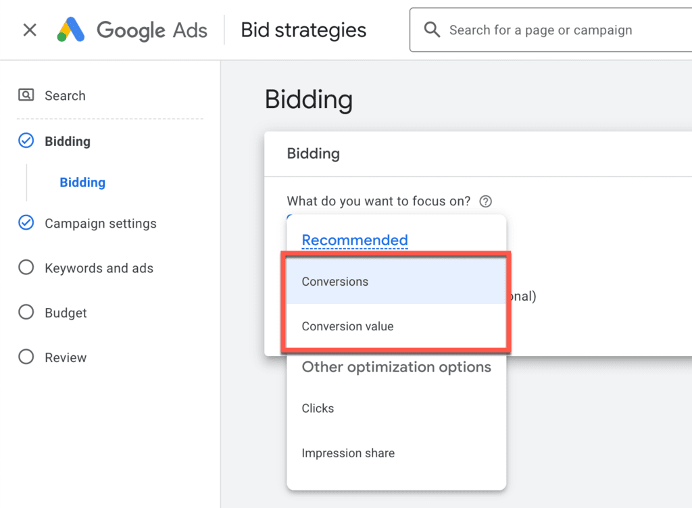
      
    - #### 步驟 2
      從下拉式選單選取「轉換」後：
      - 如果採用「盡量爭取轉換」策略，但未設定目標單次轉換出價，Google Ads 就會依預算為廣告活動盡力爭取轉換。
      - 如果採用「盡量爭取轉換」策略，且設定目標單次轉換出價 (CPA)，Google Ads 就會按照設定內容盡力爭取轉換。
      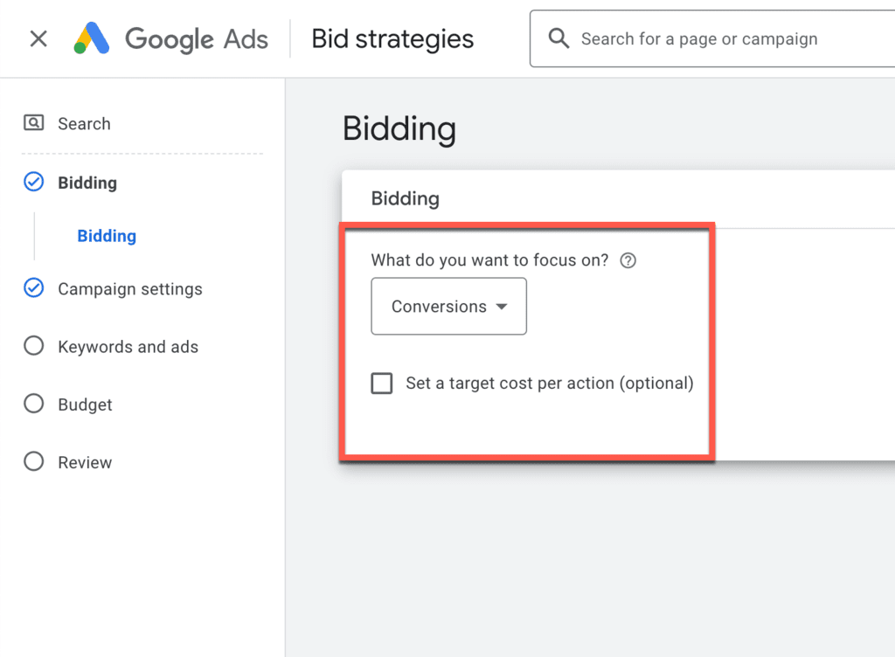

    - #### 步驟 3
      從下拉式選單選取「轉換價值」後：
      - 如果採用「盡量提高轉換價值」策略，但未設定目標廣告投資報酬率，Google Ads 就會根據預算，為廣告活動盡力提高轉換價值。
      - 如果採用「盡量提高轉換價值」策略，且設定目標廣告投資報酬率 (ROAS)，Google Ads 就會按照設定內容，盡力提高轉換價值。
      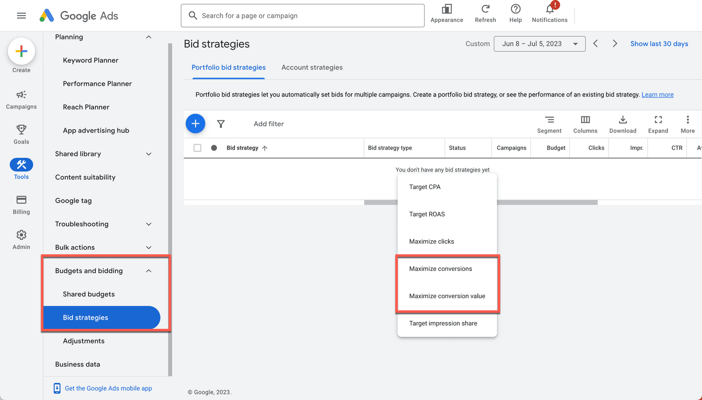

  - ### 2. 在共用資料庫的「出價策略」頁面中，建立組合出價策略
    在 `Google Ads` 帳戶中，選取「工具」圖示。接著依序選取「預算和出價」下拉式選單和「出價策略」。

    
    選取「加號」按鈕，然後選擇要建立的出價策略類型。
    - 輸入新組合出價策略的名稱。
    - 選取要納入的廣告活動。你也可以在組合出價策略建立完成後追加廣告活動。
    - 輸入出價策略設定。完成後，選取「儲存」。

  - ### 3. 以現有廣告活動建立或變更出價策略或組合出價策略
    你也可以在現有廣告活動中編輯出價策略。
    - #### 步驟 1
      如要變更某項廣告活動的出價策略，請選取該廣告活動。在「出價」專區選取「變更出價策略」。
      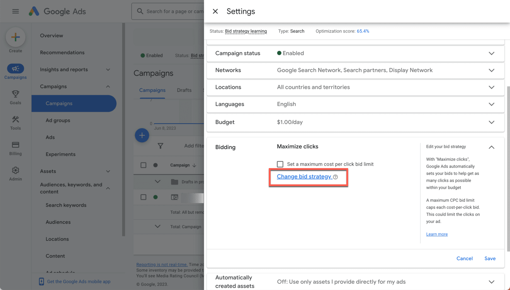
    
    - #### 步驟 2
      你可以修改策略，然後選取「儲存」。
      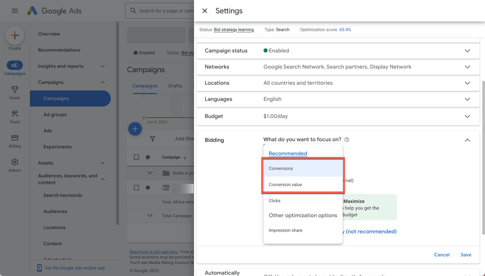

    - #### 步驟 3
      如要變更某一組合策略的出價策略，請找到要納入的廣告活動，然後選取旁邊的核取方塊。
      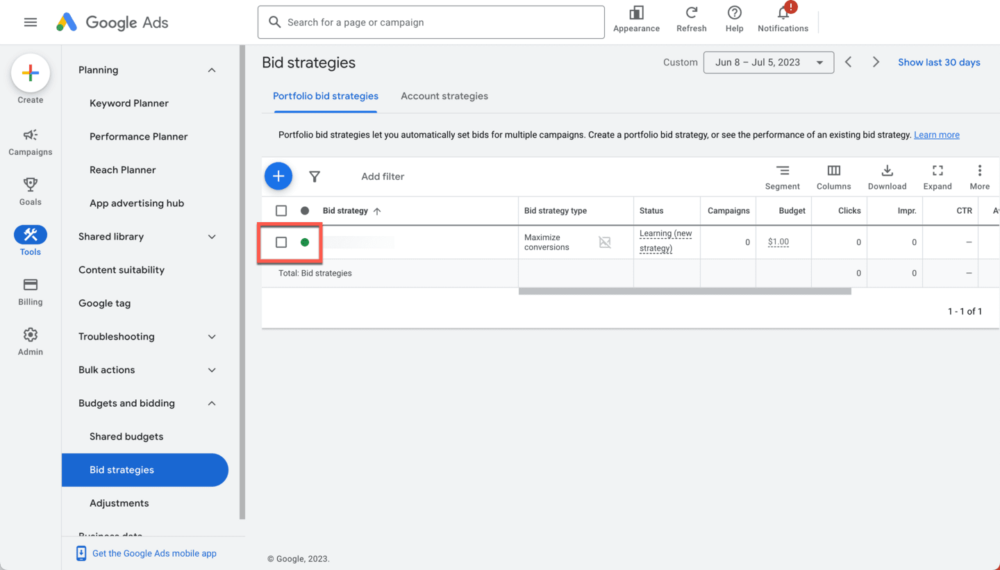

    - #### 步驟 4
      在「出價策略」分頁上，選取策略清單最上方的「編輯」。
      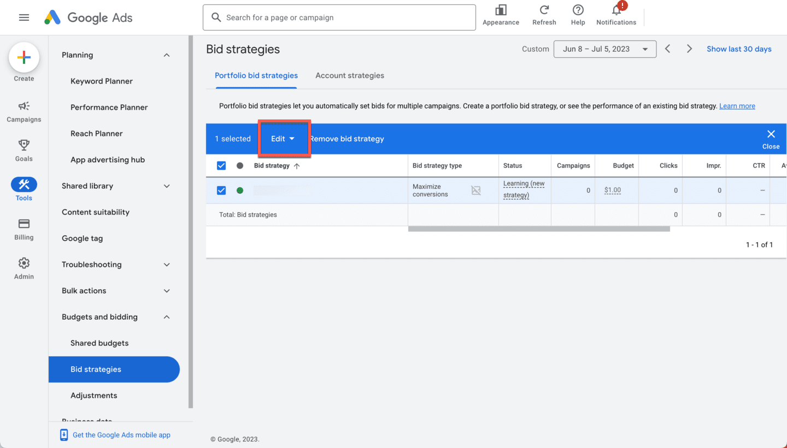

    - #### 步驟 5
      從下拉式選單中選取「變更出價策略目標」。
      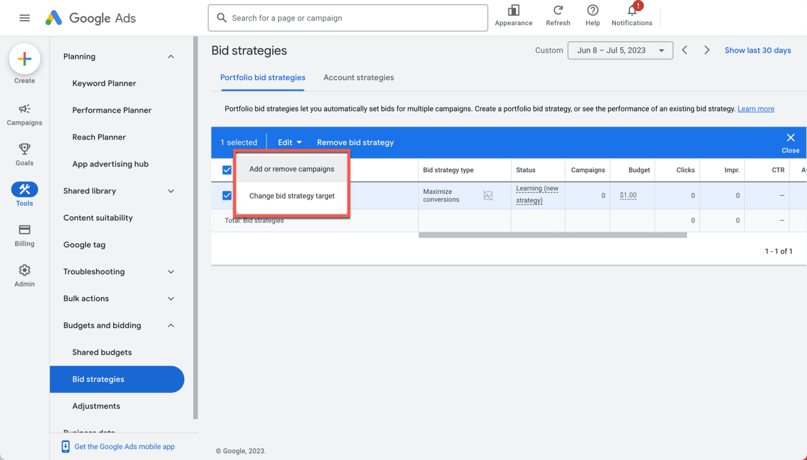

    - #### 步驟 6
      你可以自行編輯廣告活動出價策略。完成後，選取「套用」。
      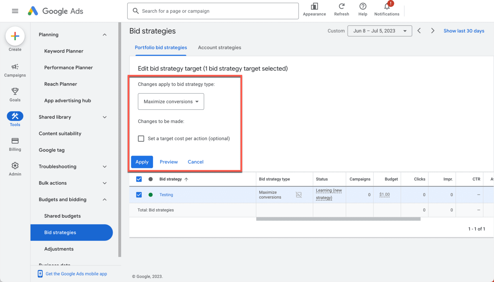

  - ### 最佳做法
    - #### 以下提供一些秘訣，協助你採用以 `價值` 為準的出價策略。
      - ##### 收集更多轉換資料
        在你開啟「`目標廣告投資報酬率`」出價策略前，搜尋廣告活動在過去 30 天內應至少累積 15 次轉換，這樣機器學習演算法才能運用更多資料，做出明智的出價決策。

      - ##### 瞭解採用「盡量提高轉換價值」策略時的支出情形
        「`盡量提高轉換價值`」策略會設法用盡每日預算，盡力爭取轉換，所以如果目前支出遠低於預算，你可能會發現支出大幅增加。
        另外，你也應該評估長期的投資報酬率 (ROI) 目標。如果貴商家有投資報酬率目標，或許可考慮改用「目標單次轉換出價」。

      - ##### 等待一段時間，讓廣告活動完成最佳化調整
        如果採用智慧出價，請務必先等待一段時間，讓廣告活動調整至最佳狀態，再開始評估成效。
        另外在評估近期成效時，也別忘了考量轉換延遲。如要進一步瞭解轉換延遲，請參閱這篇[說明中心文章](https://support.google.com/google-ads/answer/6239119)。

      - ##### 使用出價策略報表
        這份報表能讓你瞭解出價策略各項關鍵指標的成效如何。

    - #### 以下提供一些秘訣，協助你採用以有效 `轉換` 為準的出價策略。
      - ##### 不要將「盡量爭取轉換 (有單次轉換出價目標)」設得過低
        你設定的「`盡量爭取轉換 (有單次轉換出價目標)`」可能會影響可獲得的轉換量。
        舉例來說，如果目標設得過低，可獲得的總轉換量可能會較少。
        如有歷來轉換資料，`Google Ads` 就能根據近期成效推薦合適的「盡量爭取轉換 (有單次轉換出價目標)」。

      - ##### 瞭解採用「盡量爭取轉換 (沒有單次轉換出價目標)」時的支出情形
        「`盡量爭取轉換 (沒有單次轉換出價目標)`」會設法用盡每日預算，盡力爭取轉換。
        如果目前支出低於預算，採用這項策略後的支出可能會大幅增加。請評估長期的投資報酬率 (ROI) 目標。
        如果貴商家有投資報酬率目標，可考慮改用「盡量爭取轉換 (有單次轉換出價目標)」。

      - ##### 等待一段時間，讓廣告活動完成最佳化調整
        如果採用智慧出價，請務必先等待一段時間，讓廣告活動調整至最佳狀態，再開始評估成效。
        另外在評估近期成效時，也別忘了考量轉換延遲。如要進一步瞭解轉換延遲，請參閱這篇[說明中心文章](https://support.google.com/google-ads/answer/6239119)。
        
      - ##### 使用出價策略報表
        這份報表能讓你瞭解出價策略各項關鍵指標的成效如何。如要瞭解詳情，請前往 [Google 說明中心](https://support.google.com/google-ads/answer/7074566)。

  - ### 最佳化分數實用秘訣
    無法確定哪一項廣告活動適合採用這些策略嗎？你可以查看「`最佳化建議`」頁面中的最佳化分數，瞭解哪些廣告活動可能會受益於新的出價策略。

  - ### 利用「目標曝光比重」提升知名度
    - #### 目標曝光比重」出價策略為何如此重要？
      「`目標曝光比重`」出價策略會自動設定出價，設法讓廣告顯示在 `Google` 搜尋結果網頁上的特定位置。
      你可以使用這項出價策略提升品牌知名度，並讓廣告在結果網頁上顯示一段時間。

      這項策略有三種廣告顯示位置可選擇：`網頁的絕對頂端`、`網頁頂端`，或 `Google 搜尋結果網頁上的任一處`。
      `Google Ads` 會根據你選擇的刊登位置自動設定出價。

      舉例來說，如果你將網頁絕對頂端的曝光比重目標設為 70%，`Google Ads` 便會自動設定單次點擊出價，讓廣告在網頁絕對頂端的曝光次數占總曝光次數的 70%。

  - ### 開始設定：建立「目標曝光比重」出價策略
    如要在搜尋廣告活動中建立「`目標曝光比重`」出價策略，請按照下列步驟操作。
    - #### 步驟 1
      選取「`廣告活動`」和「`加號`」圖示，建立新的廣告活動。前往廣告活動建立程序的「`出價`」專區，從下拉式選單中選取「`曝光比重`」。
      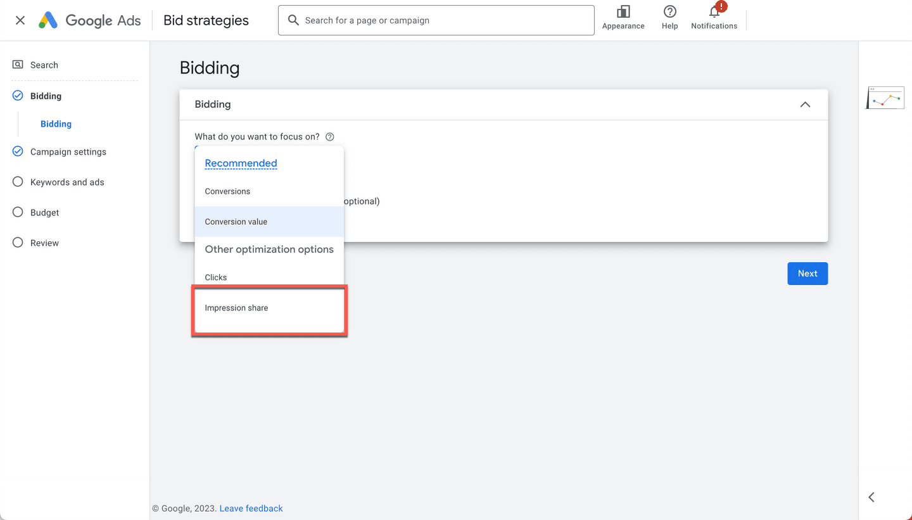

    - #### 步驟 2
      從三個可用的指定目標選項中擇一：`結果網頁的絕對頂端`、`結果網頁頂端`，或`結果網頁上的任一處`。
      設定曝光比重目標和最高單次點擊出價上限，然後選取「下一步」。

      提示：請確保有充足的預算和合理的最高單次點擊出價設定，才能讓策略充分發揮效益。
      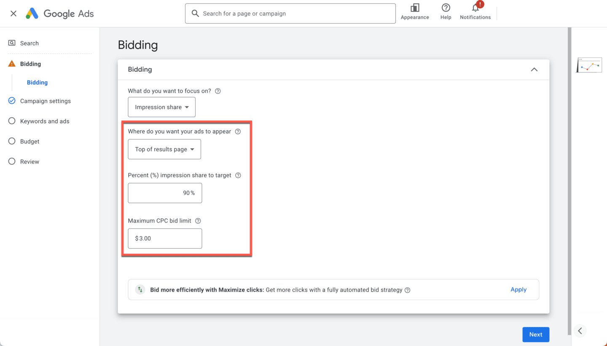

    - #### 步驟 3
      如要為出價組合採用「`目標曝光比重`」出價策略，請前往「`工具`」，然後選取「`出價策略`」。

      選取「`加號`」圖示，即可建立新的組合出價策略，然後選取「目標曝光比重」。
      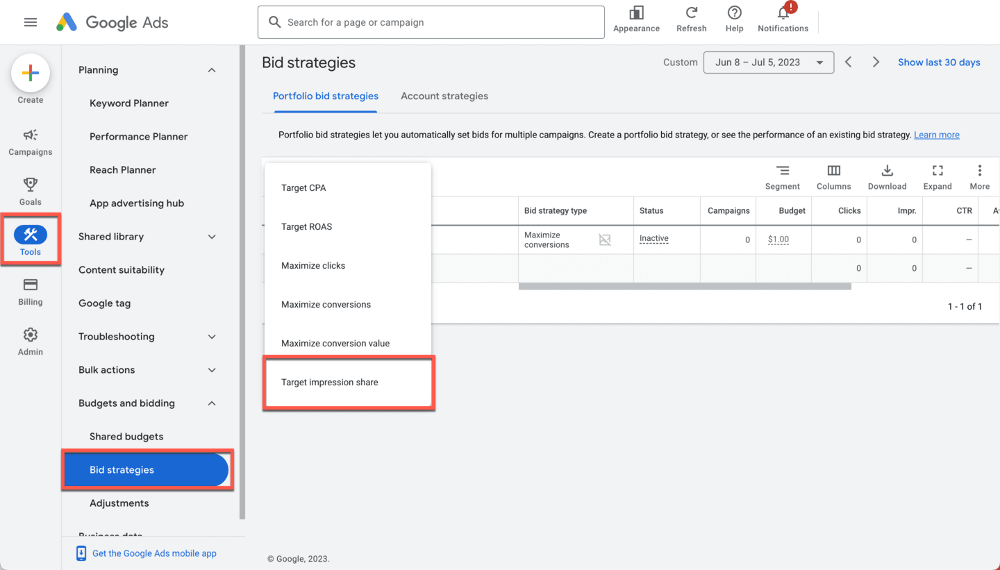

  - ### 最佳做法
    以下提供一些秘訣，協助你採用「`目標曝光比重`」出價策略。
    - #### 不要將出價上限設得過低。
      設定「`目標曝光比重`」出價策略時，也能設定最高單次點擊出價 (CPC) 上限，也就是你允許 `Google Ads` 為每次點擊支付的最高金額。
      請勿將這項上限設得太低，以免阻止 `Google Ads` 設定出價，導致無法達到曝光比重目標。

    - #### 從合適的目標著手。
      一開始在設定曝光比重目標時，請務必根據廣告活動在 30 天內的平均曝光比重設定合理的目標，也請確保廣告活動有充足的預算，
      因為 `Google Ads` 不會在預算受限的廣告活動中，提高關鍵字的出價。

    - #### 等待一段時間，讓廣告活動完成最佳化調整。
      如果採用智慧出價，請務必先等待一段時間，讓廣告活動調整至最佳狀態，再開始評估成效。
      另外在評估近期成效時，也別忘了考量轉換延遲。
      如要進一步瞭解轉換延遲，請參閱這篇[說明中心文章](https://support.google.com/google-ads/answer/6239119)。

    - #### 使用出價策略報表。
      這份報表能讓你瞭解出價策略各項關鍵指標的成效如何。你可以運用這份報表，為採用「`目標曝光比重`」的廣告活動，
      確認最高單次點擊出價上限是否設得太低，以免廣告活動無法達到曝光比重目標。
      如要進一步瞭解出價策略報表，請參閱這篇[說明中心文章](https://support.google.com/google-ads/answer/7074566)。

  - ### 最佳化分數實用秘訣
    你可以透過帳戶的最佳化分數，瞭解哪些廣告活動可能會受惠於「`目標曝光比重`」等智慧出價策略。

  - ### 利用「盡量爭取點擊」增加流量
    - #### 盡量爭取點擊」為何如此重要？
      「`盡量爭取點擊`」是一種自動出價策略，適用於希望增加網站流量但未追蹤轉換的廣告主。
      如果目前未在 `Google Ads` 帳戶中追蹤轉換，建立新的搜尋廣告活動時，系統預設會使用這項出價策略。

      這項策略會在你的每日預算內盡量爭取點擊次數，免去管理出價的手動作業。
      採用這項策略後，系統會自動調整廣告活動的最高單次點擊出價 (CPC)，在預算內盡量提高廣告的點擊次數。

      請留意：「`盡量爭取點擊`」不會最佳化轉換資料。
      如果你在帳戶中追蹤轉換，請考慮使用「`目標單次轉換出價`」、「`盡量爭取轉換`」、「`目標廣告投資報酬率`」或「`盡量提高轉換價值`」等以轉換為準的出價策略。

  - ### 開始設定：建立「盡量爭取點擊」出價策略
    如要在搜尋廣告活動中改用「`盡量爭取點擊`」自動出價策略，請按照下列步驟操作。

    - #### 步驟 1
      - 1. 選取「`廣告活動`」和「`加號`」圖示，建立新的廣告活動。
      - 2. 在廣告活動建立程序的「`出價`」專區，從下拉式選單中選取「`點擊次數`」。
      - 3. 如要設定出價上限，選取「`最高單次點擊出價上限`」方塊後，就能自訂願意為單次點擊支付的最高金額。

      如果不輸入最高單次點擊出價上限，`Google Ads` 就會自動調整出價，依預算盡量爭取點擊。

      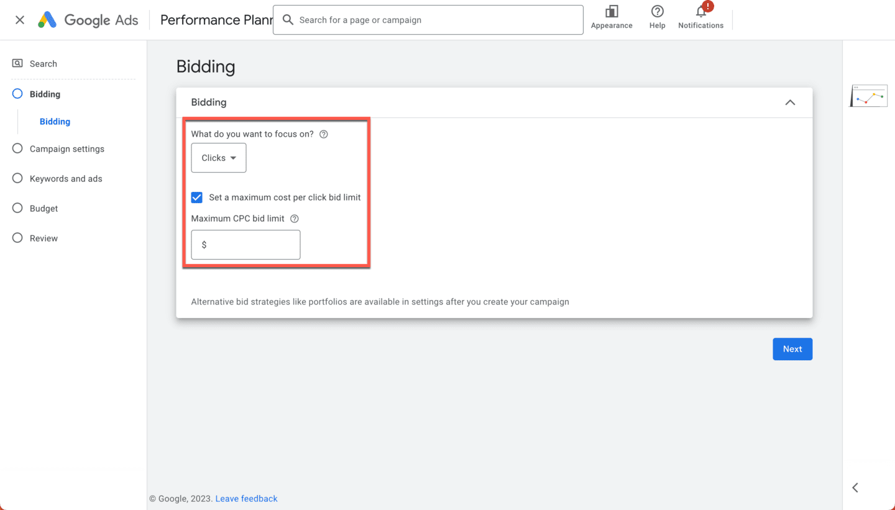

    - #### 步驟 2
      你也可以透過工具、預算和出價或出價策略，為出價組合採用「`盡量爭取點擊`」出價策略。
      如要這麼做，請選取「`加號`」圖示，建立新的組合出價策略，然後選取「盡量爭取點擊」。

      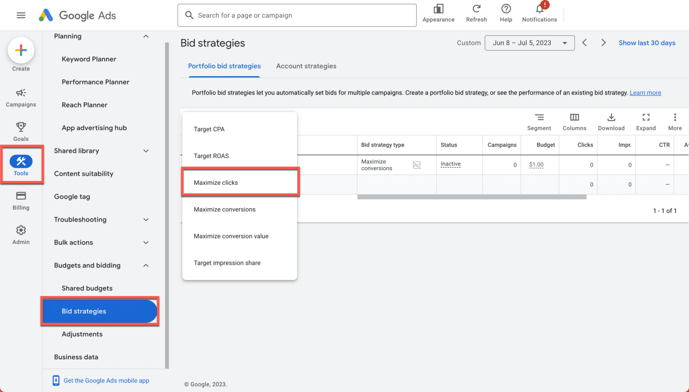

  - ### 學以致用
    各個行銷目標適合哪種策略？
    - A. 以轉換為準出價
    - B. 目標曝光比重
    - C. 盡量爭取點擊

      - 增加流量？
      - 吸引使用者採取行動？
      - 提升知名度？

    :::details 解答
    - 增加流量？ => `C.`
    - 吸引使用者採取行動？ => `A.`
    - 提升知名度？ => `B.`
    :::

  - ### 重點整理
    - 「`盡量爭取點擊`」是一種自動出價策略，適用於希望增加網站流量但未追蹤轉換的廣告主。
    - 為了協助你幫貴商家吸引使用者採取行動，`Google Ads` 提供兩種以轉換為準的出價策略：「`盡量爭取轉換`」和「`盡量提高轉換價值`」。
    - 為了提升品牌知名度，「`目標曝光比重`」智慧出價策略會自動設定出價，設法讓廣告顯示在 `Google` 搜尋結果網頁上的特定位置。

  - ### 資源
    如要進一步瞭解這個主題，請選取下列連結。

    - [關於盡量爭取點擊出價 | Google Ads 說明中心 ↗](https://support.google.com/google-ads/answer/6268626)
    - [最佳化分數簡介 | Google 說明中心 ↗](https://support.google.com/google-ads/answer/9061546)
    - [Google 最佳做法 | Google 說明中心 ↗](https://support.google.com/google-ads/answer/6154846)
    - [為網站設定轉換追蹤 | Google 說明中心 ↗](https://support.google.com/google-ads/answer/6095821)
    - [「盡量爭取轉換 (有單次轉換出價目標)」簡介 | Google 說明中心 ↗](https://support.google.com/google-ads/answer/6268632)
    - [「盡量爭取轉換 (沒有單次轉換出價目標)」簡介 | Google 說明中心 ↗](https://support.google.com/google-ads/answer/7381968)
    - [目標曝光比重出價簡介 | Google 說明中心 ↗](https://support.google.com/google-ads/answer/9121108)

## 4. 在搜尋廣告活動中善加運用已轉換為準的策略
  本課程將確保你能達到預期的 `Google Ads` 廣告活動行銷目標。
  許多搜尋廣告主十分重視 `轉換次數` 成長，包括發掘待開發客戶或促進銷售業績。

  完成本單元後，你將瞭解如何善用最佳化策略，改善搜尋廣告活動的成效。

  - ### 發揮搜尋廣告活動的最大效益
    建立搜尋廣告活動後，請務必等到轉換開始累積，再著手評估成效或調整。
    
    接下來，你就可以根據行銷目標對廣告活動進行準確的最佳化調整。以下讓我們用一個例子來說明。

  - ### 小高的案例
    小高是代理商策略專家，專門替一家銷售軟體的新創公司吸引待開發客戶。
    該公司開發新客戶時，主要會從使用者在公司網站上留下的資訊著手。

    隨著公司持續成長，小高的客戶決定將重心放在造訪公司網站的待開發客戶。
    他們設下了這個目標：本季源自於數位行銷的待開發客戶量須增加 15%。
    `Google Ads` 是小高團隊用來達成客戶行銷目標的主要數位行銷管道。

    為了產生待開發客戶，小高目前在廣告活動中運用「`盡量爭取轉換出價`」策略。
    小高團隊為這個廣告活動分配了每天 `$500` 美元的預算。

  - ### 隨堂測驗
    以下哪兩個原因能說明「`盡量爭取轉換出價`」策略是最適合小高的策略？
    - A.「`盡量爭取轉換出價`」會盡可能爭取更多曝光，進而提升品牌知名度。
    - B. 廣告主如果想在固定預算範圍內，透過廣告活動盡可能提高轉換次數，就適合採用「`盡量爭取轉換出價`」。
    - C.「`盡量爭取轉換出價`」會針對特定投資報酬率或效率目標進行最佳化。
    - D. 廣告主如果暫時還不想最佳化「`目標單次轉換出價`」目標，就適合採用「`盡量爭取轉換出價`」。

    :::details 解答
    B. D.
    :::

    在採用「`盡量爭取轉換出價`」數週之後，小高團隊迫不及待想瞭解廣告活動的成效。他們最重視的指標是廣告活動帶來的轉換量。

    小高也可以檢視[出價策略報表](https://support.google.com/google-ads/answer/7074566)，瞭解廣告活動的成效。

  - ### 目標改變
    推出第一波廣告活動數月後，小高收到軟體公司 CMO 小路寄來的電子郵件。小路希望能透過電話討論更多細節。我們一起來看看他們的談話過程。
    - 小路：小高，很高興能和你進行會談，也謝謝你幫忙安排這場電話會議。這次主要是想討論我們打算調整的行銷目標。
    - 小高：聽起來很棒，我想知道更多細節！
    - 小路：我們確實從公司網站獲得許多待開發客戶，但希望能進一步提升轉換量。我們要從每位待開發客戶費用著手，希望將支出控制在行銷預算內，同時持續增加待開發客戶量。
    - 小高：瞭解，我明白了。請問你們有預期的支出金額嗎？
    - 小路：對於每位新的待開發客戶，我們的預期金額介於 $39 到 $46 美元之間。我們需要請你算出目前的每位待開發客戶費用，然後將 `單次轉換出價` 控制在目標範圍內。
    - 小高：沒問題，感謝你的說明！我會再檢視一下 `廣告活動的單次轉換出價資料`，並繼續調整以達到你們指定的單次轉換出價範圍。

    經過這次通話，小高進一步瞭解了客戶的行銷策略。
    雖然目標還是維持不變，但他們必須提高搜尋廣告活動的效益。
    客戶希望能提升轉換量，如果最終能達到合理的單次轉換出價價格，客戶也很樂意增加預算。

    為了確保廣告活動能達成這個目標，小高必須先確認客戶目前的 `單次轉換出價`，然後在維持不變的情況下，持續穩定地提升轉換量。

  - ### 設定目標單次轉換出價
    你可以運用「`盡量爭取轉換 (設定單次轉換出價目標)`」策略來最佳化廣告活動，以達成單次轉換費用目標。
    
    小高現在必須調整策略，將重心放在單次轉換出價目標上。他可以參考過往的廣告活動成效，並據此進行調整。
    小高查看廣告活動的「`單次轉換費用`」欄，然後發現過去 30 天內 (已排除最近的轉換延遲期間)，該廣告活動的單次轉換出價是 $42.18 美元。

    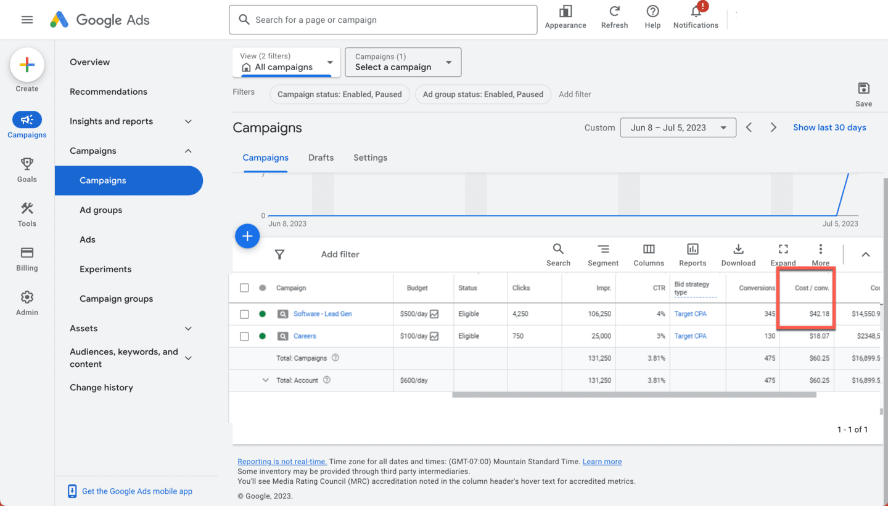

  - ### 最佳做法
    如要設定目標單次轉換出價，請參考以下最佳做法：
    - 分析過去 30 天的成效時，將轉換延遲列入考量。
    - 為維持相近的轉換量，一開始應將目標單次轉換出價設定成跟目前單次轉換出價差不多。
    - 查看 `Google Ads` 系統根據過往轉換資料提供的目標單次轉換出價建議。
    - 如果要改採新的轉換動作，請務必參考相關轉換動作的平均單次轉換出價，以便更精準地設定目標。

  - ### 觸及重要目標對象
    使用者搜尋產品和服務的方式不斷演變，如果想要觸及更多使用者，不妨善用多項 `Google Ads` 解決方案。

  - ### 追求高涵蓋率
    行銷人應優先擴大涵蓋範圍，以最適切的訊息，將所有相關查詢一網打盡。想知道該採取哪些行動來調整廣告活動嗎？請見以下說明。

    - #### 新增關鍵字
      你可以持續監控廣告活動的關鍵字清單，以及新增關鍵字。
      - 在「`最佳化建議`」頁面中找出極具潛力的新關鍵字。
      - 利用關鍵字規劃工具發想新的關鍵字，並預估新關鍵字帶來的效益。
      - 使用搜尋字詞報表找出能帶來較多商機的新關鍵字，並瞭解可能需要排除的流量。

    - #### 新增較廣泛的比對類型
      如果你原本就已在廣告活動中採用自動出價策略 (如目標單次轉換出價)，
      請參考這個最佳做法：將 `廣泛比對關鍵字` 與 `智慧出價策略` 搭配使用，以爭取所有預期帶來成效的相關流量。

      廣泛比對字詞搭配自動出價可提升成效，因為這類字詞能提高流量，並為出價策略提供更多資料，讓系統學習如何設定合適的出價。
      請先參閱「`最佳化建議`」頁面，新增關鍵字的廣泛比對版本。

  - ### 廣告素材最佳化
    透過回應式搜尋廣告 (RSA)，Google 能夠測試不同的廣告標題和說明組合，再利用機器學習分類相關素材資源。

    最佳化搜尋廣告訊息時，請在每則廣告中為潛在顧客加入實用資訊。以下列舉幾個廣告訊息自訂選項。

    - #### 廣告素材資源
      `廣告素材資源` 有助於提升廣告成效。在廣告中加入廣告素材資源，可吸引更多待開發客戶，或引導使用者前往網站的特定位置或頁面。

    - #### 廣告自訂參數
      `廣告自訂參數` 能讓你在廣告內容中加入即時資訊，如 `位置資訊` 或 `倒數計時`。
      如要大規模製作動態廣告及放送高度相關的廣告素材，建議使用廣告自訂參數。

    - #### 關鍵字插入
      你可以利用 `關鍵字插入` 功能，採用曾觸發廣告顯示的關鍵字。
      舉例來說，如果使用者搜尋「客戶關係管理軟體」，廣告的標題中可能就會出現「客戶關係管理軟體」一詞。

  - ### 採用最佳設定，全力達成目標
    如果想達成行銷目標，可以監控和調整自動出價策略。請參考以下幾項最佳化準則。

    - #### 使用出價策略報表
      運用此報表分析主要指標在特定期間內的成效，如轉換量或實際單次轉換出價。
      這個報表也會顯示出價策略最常針對哪些信號最佳化，還會提供目標或預算模擬資料。

    - #### 將轉換延遲納入考量
      務必清楚瞭解廣告活動的平均轉換時間差，也就是從點擊到完成轉換所需的平均時間。
      透過這些資料，你就能精準計算轉換成效。轉換延遲資料位於出價策略報表中，而且也可計入離線轉換。

    - #### 模擬廣告活動成效
      使用智慧出價模擬工具，可瞭解不同的目標或預算對廣告成效的可能影響。
      這項工具會分析競價資料，然後估算廣告成效在不同的目標或預算下會如何變化。

    - #### 避免限制預算
      預算有限的廣告活動可能難以在指定目標預算內，達成盡量爭取轉換量或轉換價值的目標。
      為「`目標單次轉換出價`」廣告活動設定每日預算時，金額最好能比一天正常支出的金額高出 20% 至 30%，這樣就能爭取更多轉換量並維持成效，同時保有成長空間。
      如果設有預算目標，不妨採用「`盡量爭取轉換出價`」或「`盡量提高轉換價值`」策略，以便在一定的每日預算範圍內達到最佳成效。
      你可以運用成效規劃工具，找出符合廣告活動目標的合適預算，也可以採用共用預算和組合出價策略，讓系統自動管理目標類似的廣告活動。

  - ### 根據最佳化分數擬定策略
    「最佳化建議」頁面會顯示最佳化分數，並根據你的行銷目標提供帳戶專屬建議。
    最佳化分數代表帳戶的預期成效，同時也能讓你知道有多少改善空間。
    產生最佳化分數時，也會一併提供建議並推薦適合你業務的產品解決方案，
    重點包括評估、預算、智慧出價、廣告素材，以及關鍵字、動態搜尋廣告和目標對象等觸及方法。

    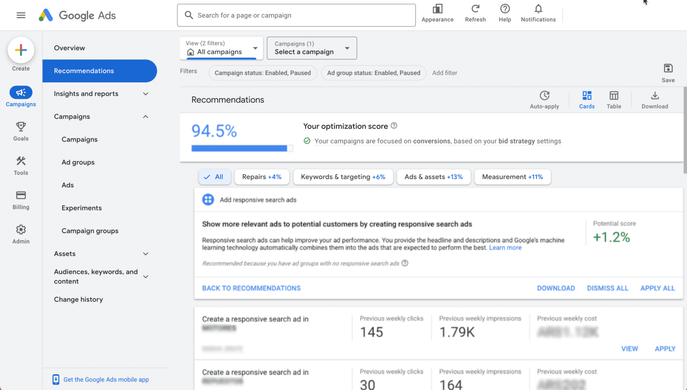

  - ### 小高該怎麼辦呢？
    小高知道如果要將單次轉換出價維持在客戶指定的範圍內，就必須考慮廣告活動最佳化。
    有了帳戶最佳化分數專區顯示的建議，他不僅能達成這個目標，還能發掘新的機會來吸引更多待開發客戶。

  - ### 學以致用
    如果客戶的業務重心在於提高線上銷售量，但希望採用符合成本效益的 `單次轉換出價`，以下哪三個最佳化策略有助於達成這個行銷目標？
    - A. 建立廣告活動時應用「盡量爭取點擊出價」策略
    - B. 建立廣告活動時應用「目標單次轉換出價」策略
    - C. 觸及先前未完成轉換的網站訪客
    - D. 使用智慧出價模擬工具，評估特定預算和單次轉換出價對於成效提升有何影響

    :::details 解答
    B. C. D.
    :::

  - ### 重點整理
    - 如要全力提升搜尋廣告活動成效，請根據目標調整最佳化策略、運用自動化功能來盡力提升成效，並且持續修正創意策略。
    - 利用出價策略報表和最佳化分數找出應調整之處，以提升廣告活動成效。

  - ### 資源
    如要進一步瞭解這個主題，請選取下列連結。

    - [最佳化分數個案研究 | PDF ↗](http://services.google.com/fh/files/blogs/islamic-relief-recommendations-optimization-score-case-study-2019.pdf)
    - [共用預算 | 說明中心 ↗](https://support.google.com/google-ads/answer/2517512)
    - [最佳化建議 | 說明中心 ↗](https://support.google.com/google-ads/answer/3416396)
    - [使用關鍵字規劃工具 | 說明中心 ↗](https://support.google.com/google-ads/answer/7337243)
    - [關於搜尋字詞報表 | 說明中心 ↗](https://support.google.com/google-ads/answer/2472708)
    - [Google Ads 最佳做法 | 說明中心 ↗](https://support.google.com/google-ads/answer/6154846)

## 5. 透過以價值為準出價策略提升消費者價值
  以價值為準出價策略有助於創造業務價值。
  
  舉例來說，如果將出價策略從 `目標單次轉換出價`，改為 `目標廣告投資報酬率`，便能在廣告投資報酬率相近的情況下，提升 14% 的轉換價值。
  能否成功轉換策略取決於多種因素，包括你目前採用的 `智慧出價設定`。
  即使成功轉換，也需要評估策略是否發揮效用，並進行必要調整。

  完成本單元後，你將能說明全力提高價值的重要性，並瞭解如何建立智慧出價策略並進行最佳化調整，盡量提高轉換價值。

  - ### 何謂消費者價值
    「`以價值為準出價`」策略可幫助你優先鎖定最重要的競價，為業務盡可能爭取最多轉換價值。
    「`消費者價值`」是指消費者為商家帶來的金錢價值或業務價值，且能透過多種指標衡量，
    包括 `購物車內商品數量`、`平均訂單價值`、`待開發顧客價值` 和 `生命週期價值`。

    在廣告策略中加入以價值為準的策略，有助於降低消費者/待開發顧客開發成本，還能大幅提高帳戶的投資報酬率 (金錢價值)。
    以價值為準出價能讓你鎖定最重要的消費者，並為貴商家創造最高收益。

    商家可透過 `Google Ads` 解決方案匯入第一方資料，指明各種轉換的價值。以價值為準出價策略可運用傳送至 `Google Ads` 的信號，
    在預算範圍和廣告投資報酬率目標限制內，找出有可能產生最多轉換價值的競價並進行出價。
    我們的評估工具和 AI 會搭配運作，將流量帶往行銷人獲利潛力最高的類別和管道。

    以價值為準出價策略包括「`目標廣告投資報酬率`」和「`盡量提高轉換價值`」。
    這些策略能幫助你掌握收益、利潤或生命週期價值等重要業務目標，並透過最佳化調整達到這些目標。

    如果各個轉換和消費者為商家帶來的價值不盡相同，行銷策略應反映這些差異。

  - ### 以價值為準出價應用範例
    以價值為準出價在不同的情境中會以什麼方式運作？
    每個商家都有不同的業務目標，他們也需要根據這些目標制定以價值為準出價策略。

    以價值為準出價能讓你運用手上的業務資料來靈活調整策略，進而提高轉換價值。
    比方說，如果你知道消費者在購買電腦和行動裝置時，會分別帶來不同的生命週期價值，就應調整系統回報的價值，
    並在同一個廣告活動中指定這兩種裝置，讓智慧出價策略以不同的出價來達成廣告投資報酬率目標。
    如果你無法等待約 2 個轉換週期再評估成效，或許可考慮設定週期較短的轉換動作，或改採其他策略。

    我們來看看不同商家如何運用以價值為準出價策略。

    - #### 線上零售商或想要產生待開發客戶的商家
      - 請盡可能對消費金額較高的使用者提高出價，而非一味衝高購買量。
      - 根據購物車內商品數量或預估價值進行出價，是有效區隔這類消費者的第一步。
      - 以價值為準出價會依廣告客戶的預算範圍或廣告投資報酬率目標，盡可能讓線上銷售或待開發客戶帶來最多價值。
      - 業務形態較複雜的商家也可以根據利潤、利潤率或消費者生命週期價值進行出價。

    - #### 有明顯淡旺季的商家
      - `智慧出價` 是可因應動盪時期的實用策略。這種出價模式會考量搜尋趨勢和歷來需求，在需求頻繁變動或瞬間變化時靈活調整出價。
      - 廣告主也可以根據業務目標的變動，調整智慧出價的指定目標和預算等項目。
      - 如果廣告主事先就預料到會有短期的轉換率驟升現象 (如即將舉辦快閃促銷)，可透過季節性調整工具改變智慧出價的運作模式。

    - #### 提供訂閱服務的商家
      - 如果你的廣告客戶只會追蹤單一轉換事件 (例如使用者訂閱方案)，則可思考每個消費者帶來的業務價值有何差異。
      - 比方說，廣告客戶可透過消費者選擇的訂閱方案或其他自訂變數區分消費者。廣告客戶可以為不同的轉換指派價值，並透過以價值為準出價策略進行最佳化。

  - ### 請先制定完善的評估策略
    制定以價值為準出價策略的第一步，是確認你是否已建立完善的線上轉換評估方法。
    如要追蹤轉換動作，則必須先建立合適的評估方法。
    以上就定位後，才能設定歸因並進行智慧出價最佳化。
    我們強烈建議你採用全域網站代碼和強化轉換，以在無法使用 `Cookie` 的情況下盡可能彌補資料缺口。

    以 `Google Ads` 轉換來說，你可以根據自家業務目標，採用下列至少一種選項：

    - #### 線上銷售
      如果你使用交易專屬價值評估線上銷售，且已導入 `Google` 代碼，你將能[追蹤交易專屬轉換價值](https://support.google.com/google-ads/answer/6095947)。你也可以使用[代碼管理工具部署轉換標記來追蹤價值](https://support.google.com/tagmanager/answer/6105160)。

      如果你使用 `Google Analytics (分析)` 評估網站或應用程式的轉換價值，可以[將轉換匯入 Google Ads 轉換追蹤](https://support.google.com/analytics/answer/10632359)。

    - #### 待開發顧客產生
      如要評估待開發客戶廣告活動中，有效或已完成轉換的客戶所帶來的價值，建議導入[待開發客戶強化轉換](https://support.google.com/google-ads/answer/11021502)。

    - #### 離線銷售
      如要使用離線銷售評估線上廣告支出的成效，請導入 `商店銷售評估功能`。

    - #### 其他離線轉換
      如果轉換價值只能在離線時或客戶關係管理 (CRM) 系統中使用，
      除了設定離線轉換匯入之外，你也可以將廣告點擊帶來的離線轉換匯入 `Google Ads`。

  - ### 第三方追蹤與隱私權相關提示
    - 你是否仰賴其他平台提供轉換追蹤資料？如果是的話，不妨考慮在 `Google Ads` 中追蹤轉換，以便透過這個可靠來源的資料進行最佳化。
    - 改善價值資料的同時，也應建立以隱私權為重的評估基礎，這麼做可確保業務目標和最佳化策略長期適用，且能優先保護使用者的隱私權。

  - ### 如何在改採以價值為準出價策略後分析成效
    成功轉換至以價值為準出價策略後，接著要評估成效。

    部分行銷人或代理商可能會監控多項指標，但我們建議貴公司內部應先定義明確的成效指標，
    並訂定與實質業務目標密切相關的 KPI，而不是單純評估單次點擊出價、轉換量、單次轉換出價等上游指標。

    - #### 採用「盡量提高轉換價值」策略
      「盡量提高轉換價值」的主要指標：`總轉換價值`
      - 成效定義：在廣告活動預算內提高總轉換價值。
      - 支出和轉換價值金額取決於廣告活動預算。這項策略將使用 `每日預算`。如要提高轉換價值金額，請增加 `每日預算`。

    - #### 採用「目標廣告投資報酬率」策略
      「目標廣告投資報酬率」的主要指標：`總轉換價值和平均廣告投資報酬率 (轉換價值/費用)`
      - 成效定義：提高總轉換價值，同時達到設定的目標廣告投資報酬率價值。
      - 支出和轉換價值金額取決於你設定的廣告投資報酬率目標。如果「轉換價值」欄有歷來的轉換價值資料，可採用 `Google Ads` 建議的廣告投資報酬率。如要提高轉換價值金額，請調降廣告投資報酬率目標。
      - 最好不要限制預算，但如果預算不夠充裕，請調整預算，或改採 `盡量提高轉換價值策略`。

  - ### 耐心成就一切
    評估成效時，請記住下列要點。
    - #### 適應期
      - 前二至三個轉換週期是適應期，因此請將這段時間的資料從評估範圍中排除。
      - 如果你剛在廣告活動中匯入一項新的轉換價值，請務必過一段時間後再切換出價策略。請參考上方工作流程中的時程，瞭解完成轉換大致需要多久時間。
      > 注意：將轉換動作設為「主要」後，無論你將該動作納入帳戶層級預設動作或統一的目標，出價策略都會對該動作出價。

    - #### 轉換延遲
      - 評估目標廣告投資報酬率和盡量提高轉換價值的成效時，需將轉換延遲納入考量。轉換延遲是指使用者點選廣告到實際在網站上完成轉換的時間差。如果你需自行上傳離線轉換資料，則轉換延遲時間除了包含使用者完成轉換的時間，還要加上將轉換資料上傳到 `Google Ads` 的時間。
      - 請使用出價策略報表等工具找出轉換延遲時間，並在分析成效時排除這段時間。如果你剛匯入有價值的新轉換目標，則需要將新目標納入「轉換」欄，讓該目標轉為可出價的狀態，出價策略才會開始學習。將目標設為可出價後，請至少等待四週再切換出價策略。如果資料量較少，等候時間可能會拉長一些。

    - #### 透過實驗進行測試
      許多團隊會合作進行廣告活動實驗，來檢驗改用以價值為準出價策略的效果。請使用 `A/B` 版本測試，評估這項新策略對關鍵業務指標的影響度。

  - ### 提示
    廣告活動獲得的轉換量至關重要。為了準確評估成效，請選擇較長的評估期間 (累積至少 50 次轉換)，例如一個月或更久。

  - ### 調整目標和預算來提升成效
    設定完廣告活動且評估成效後，現在你可以進一步將目標和預算調整到最佳狀態。

    如要提高出價成效並讓支出發揮最大效益，調整 `目標` 和 `預算` 是可行的主要做法，前者適用於 `目標廣告投資報酬率策略`，後者則適用於 `盡量提高轉換價值策略`。

    - #### 模擬工具
      `模擬工具` 可預測預算和目標變化對關鍵指標的影響。

    - #### 成效規劃工具
      `成效規劃工具` 可模擬不同目標和預算對廣告活動成效的影響，最多可預測 18 個月的走勢

      提示：使用成效規劃工具時，請根據貴公司的獲利能力設定適當預算和廣告投資報酬率目標。高目標廣告投資報酬率不一定能帶來更多利潤。

    - #### 最佳化分數
      參考最佳化分數建議，快速掌握成長契機。

    - #### 組合出價及共用預算
      使用組合出價及共用預算，為成效目標相似的廣告活動群組分配出價和支出。

  - ### 學以致用
    某零售商希望明年的廣告活動帶來更多收益。為何應建議他使用以價值為準出價？
    - A. 消費者大同小異，因此以價值為準的做法可以幫助他提升銷量和業績。
    - B. 以價值為準出價能讓他專注達成最重要的業務目標，也就是提升網站流量。
    - C. 以價值為準出價會根據指定的預算和目標廣告投資報酬率，利用 AI 技術盡量提高價值。
    - D. 以價值為準的策略可讓他同時為銷量和價值進行最佳化調整。

    :::details 解答
    C.
    :::

  - ### 重點整理
    - 將重點放在提升價值的策略上，不僅可開發更多顧客，還能進一步促成業務價值最高的銷售。
    - 如要建立以價值為準出價策略，需要正確評估轉換並指派銷售價值。
    - 採用以價值為準出價策略時，你可以根據目標投資報酬率和預算目標，選用「`盡量提高轉換價值`」或「`目標廣告投資報酬率`」策略。
    - 轉換至以價值為準出價策略的歷程，會因每位行銷人的目標及當前策略而有不同。
    - 改採目標廣告投資報酬率或盡量提高轉換價值後，請分析成效並將目標和預算調整至最佳狀態，以提高成效及獲得最佳成果。

  - ### 資源
    如要進一步瞭解這個主題，請選取下列連結。
    - [挑選合適的出價策略 | 說明中心 ↗](https://support.google.com/google-ads/answer/6167148)
    - [建立季節性調整 | 說明中心 ↗](https://support.google.com/google-ads/answer/9352512)
    - [關於目標廣告投資報酬率出價 | 說明中心 ↗](https://support.google.com/google-ads/answer/6268637?ref_topic=6294205)
    - [在搜尋廣告活動中導入以價值為準出價的最佳做法 | YouTube ↗](https://www.youtube.com/watch?v=d5QiAUygCoo)
    - [「建立良好基礎，發揮 AI 力量」檢查清單 | Google Ads 說明中心 ↗](https://support.google.com/google-ads/answer/13580022#zippy=%2Cget-ready-with-the-right-foundation%2Ctake-action-to-maximize-results-with-ai-powered-campaigns%2Cshifts-mindsets-to-set-your-org-up-for-success%2Cshift-mindsets-to-set-your-org-up-for-success)
